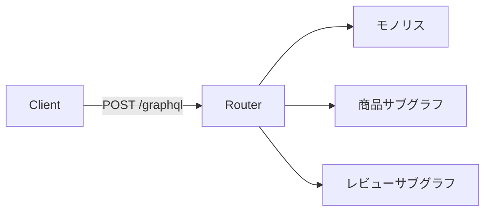
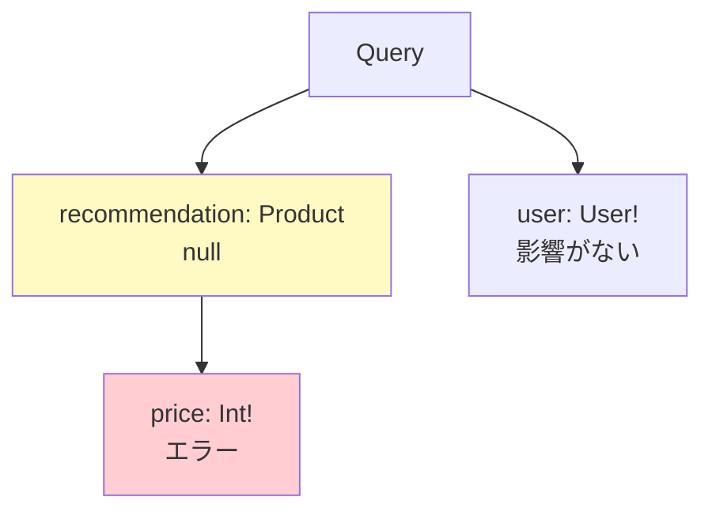
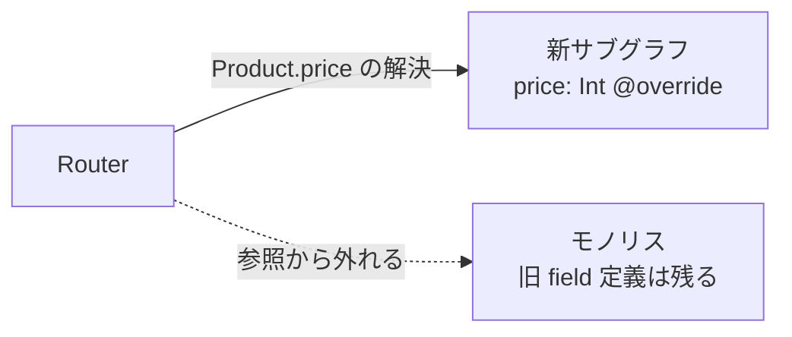
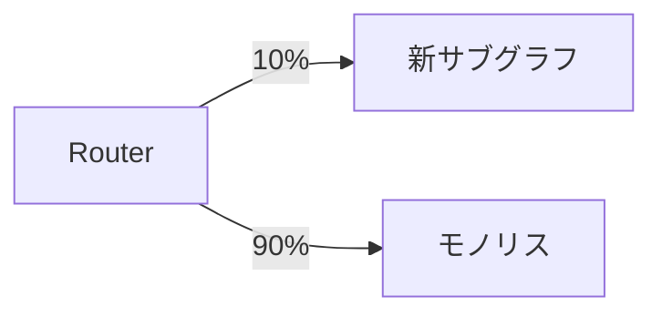
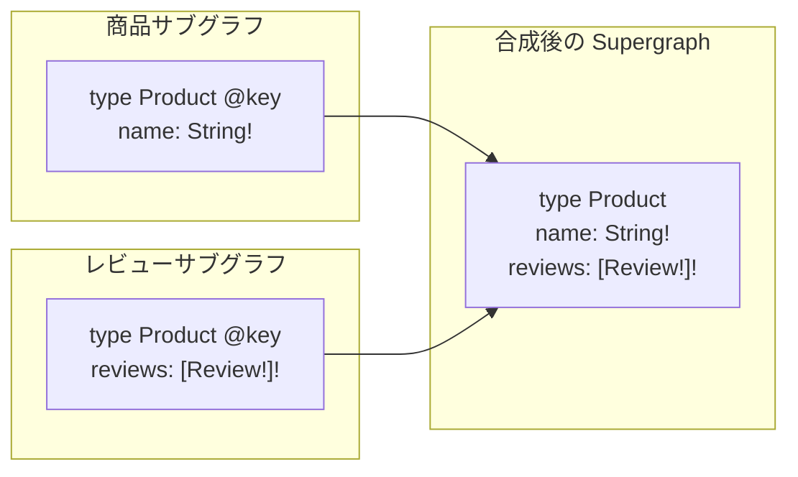

# モノリスシステムが GraphQL / GraphQL Federation を利用することによる恩恵について

GraphQL / GraphQL Federation を活用することで得られるメリットについて、組織・技術の観点からまとめてみた。

実際に触っていない部分もあるので、内容に不正確な部分があるかもしれないけどご容赦🥺

## クライアントを移行の影響から隔離できる

### クライアント側の移行コストを抑えることができる

#graphql #federation

モノリスの分解でクライアントが被る本来の痛みとして、サービスを1つ切り出すたびに API の形が変わり得ることが挙げられる。

マイクロサービスチームが発足し、すでに GraphQL を叩いて取得しているデータがサブグラフに切り出されたとしても、クライアントサイドでは特になにも変える必要はない。

クライアントは `/graphql` という単一のエンドポイントを叩く以外の作業は不要であるため、一度 GraphQL に依存してしまえば、これ以降の API Call の形式変更は不要となる。

GraphQL Federation の Routing 基盤さえ整えてしまえば、新しく生まれたマイクロサービスチームが自身のサービスに関する GraphQL Schema を宣言するだけで Router に登録されるので、以降はクライアントチーム・マイクロサービスチーム間で Schema を調整するだけで済む。

### リリース障害を部分的なものに抑えることができる

#graphql

クライアントのコード次第ではあるが、Schema の nullability を活用することで、障害が発生して一部データが欠落したとしても、被害を nullable field に閉じ込め、クライアントへの影響を最小限にとどめられる可能性をもたらす。

GraphQL の実行セマンティクスでは、non-null field で発生したエラーは最も近い nullable な祖先まで伝播してしまう。

逆にいうと適切に nullable にしておくことで、障害範囲を小さくとどめることができる。

切り出し対象の field を nullable に設計してあれば、切り出し直後の新サービスが不安定でも、その field が null になるだけで、モノリス由来の残りのレスポンスは返り続ける。

## 移行・譲渡のための仕組みが充実している

### field の解決譲渡を新チームの一存で完了できる

#federation

モノリス GraphQL Schema からの分割が非常に容易である。

現時点でモノリス GraphQL Schema があったとしても、適切なマイクロサービスチームが生まれた際に @override directive を書くだけで、旧 field は Router から参照されなくなり、新チームの Resolver に処理が移譲される。
これはモノリス側との協調デプロイは不要で、合成が通る限り、この移譲は新チームの一存で完了する。

マイクロサービスチームを建てるまでの間にモノリス側で GraphQL Schema を育てておけば、チーム発足時にこのディレクティブを書くだけで解決の移譲が済む。

また、モノリス側の旧 field 定義は Router から参照されなくなるだけで残っているため、モノリスチームは field 単位の利用状況を確認しながら、好きなタイミングで安全に削除できる (これも協調デプロイ不要)。

### 腐敗防止層を設けることができる

#graphql #federation

クライアントとの契約が Schema に固定されているということは、裏側の実装をどう入れ替えるかが実装側の自由になるということでもある。

Schema を現行実装の写経ではなく切り出し後の目標像として設計してあれば、GraphQL 層は腐敗防止層として機能し、クライアントに知られないまま新システムへの移行が可能になる。

### field 単位のカナリアリリースができる

#graphql #federation

Router の機能である Progressive Override を活用することで、field 単位で Routing を譲渡することが可能である。

譲渡元・譲渡先のトラフィック割合を決定できるため、GraphQL Field 単位という細かな単位で段階的にトラフィックを移行できる。

ロールバックも割合を戻すだけで済み、クライアントの関与も再デプロイも不要。

## チーム間の調整を Schema 上の宣言に置き換えられる

### Schema の合意だけで並行開発を始められる

#graphql #federation

新機能開発をする際は、クライアントチームとマイクロサービスチームの間で GraphQL Schema を合意するだけで、開発を分散して進めることができる。

Schema から自動生成されたクライアントコード・サーバーコードに従って各々が実装に入ることができるので、双方の実装を待つことによるブロック時間を最小限に抑えることができる。

合意した Schema からモックサーバーを立てれば、サーバー実装の完了を待たずにクライアント実装と結合確認を進めることもできる。

これにより、Schema の合意と公開をサブグラフ単位で、中央チームの調整なしに進められる。

### 他チームのエンティティに自チームだけの作業で field を追加できる

#federation

例えば商品マイクロサービスチームが管理する Product に、レビューマイクロサービスチームが管理する Review を Product 配下に生やしたいとき、商品マイクロサービスチームの作業は不要で、レビューマイクロサービスチームのみの作業で完結させることができる。

これによって各マイクロサービスチームの進化を、他チームの作業状況などの外部因子に左右されずに進めることができる。

また、この機能によって新機能の実装先がデフォルトで新サブグラフ側になるため、モノリス GraphQL Schema の肥大化そのものを止めることができる。

絞め殺しイチジクパターンっていうらしい。
