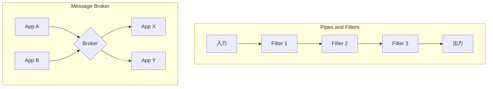

# Architectural Routers

## 概要
システム全体のメッセージングアーキテクチャを定義するパターン群。

## パターン比較表

| パターン | 構造 | 結合度 | スケーラビリティ | 用途 |
|---------|-----|-------|----------------|------|
| [[pipes_and_filters\|Pipes and Filters]] | 線形チェーン | 低（隣接フィルタのみ） | 高 | 処理パイプライン |
| [[message_broker\|Message Broker]] | ハブ・アンド・スポーク | 低（ブローカー経由） | 中（階層化で対応） | 異種システム統合 |

## 構造の違い

## パターン選択ガイド

| 要件 | 推奨パターン |
|-----|------------|
| 段階的な処理変換 | Pipes and Filters |
| 異種システム間のルーティング | Message Broker |
| 処理の並列化・スケールアウト | Pipes and Filters |
| データフォーマット変換の一元化 | Message Broker |
| 処理順序の柔軟な変更 | Pipes and Filters |

## 関連パターン

- [[index|Message Routing]] - 親カテゴリ
- [[simple-routers/index|Simple Routers]] - ルーティングの基本パターン
- [[composed-routers/index|Composed Routers]] - 複合パターン
