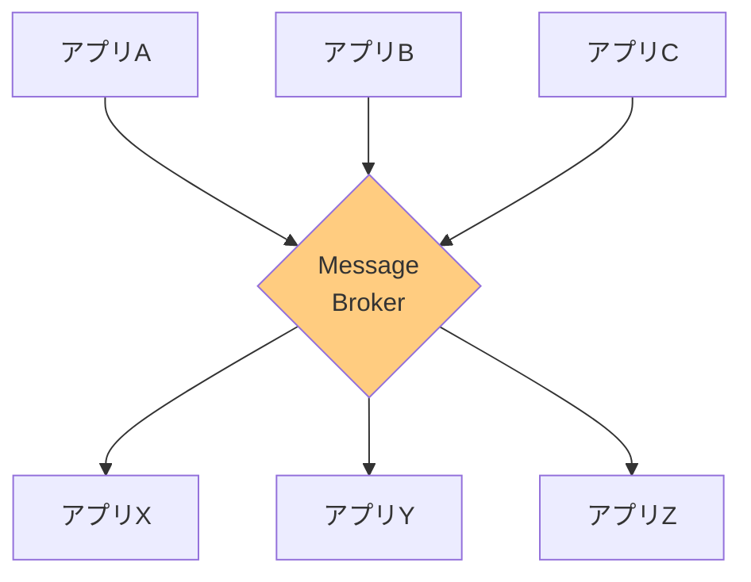
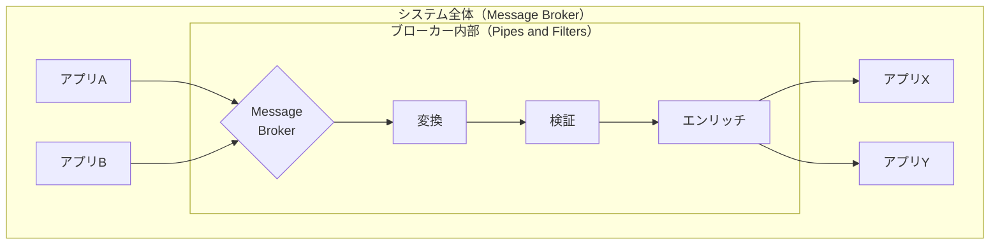

# Architectural Routers

## このカテゴリについて

Architectural Routersは、**システム全体のメッセージングアーキテクチャを定義する**パターン群です。

[[programming/reactive_messaging_pattern/simple-routers/index|Simple Routers]]や[[programming/reactive_messaging_pattern/composed-routers/index|Composed Routers]]が「個々のメッセージをどう処理するか」を扱うのに対し、Architectural Routersは「システム全体をどのような構造で設計するか」という、より大きな視点での設計方針を示します。

## なぜArchitectural Routersが必要なのか

メッセージングシステムを構築する前に、「システム全体をどのような形で組み立てるか」を決める必要があります。この基本的な構造が決まっていないと、個々のルーティングパターンを適用しても、全体として整合性のあるシステムにはなりません。

例えるなら、家を建てる前に「一戸建てにするか、マンションにするか」を決めるようなものです。この基本構造が決まって初めて、各部屋のレイアウトを考えることができます。

## パターン一覧

| パターン | 何をするか | 使う場面 |
|---------|-----------|---------|
| [[pipes_and_filters\|Pipes and Filters]] | 処理をパイプ（チャネル）とフィルター（処理ステップ）に分けて、柔軟に組み合わせる | データ変換パイプライン、段階的なメッセージ処理 |
| [[message_broker\|Message Broker]] | 中央にブローカーを置いて、全てのメッセージを仲介する | 異種システム間の統合、エンタープライズ統合 |

## 2つのアーキテクチャスタイル

### Pipes and Filters（パイプとフィルター）

**考え方：** 処理を「フィルター」という独立したステップに分け、それらを「パイプ」（チャネル）で接続します。

**身近な例：** 工場の組み立てライン

自動車工場では、車が組み立てラインを流れながら、各ステーションで部品が取り付けられていきます。
- ステーション1：エンジンを取り付け
- ステーション2：ドアを取り付け
- ステーション3：塗装

各ステーションは自分の仕事だけを行い、前後のステーションのことを知る必要がありません。

**特徴：**
- 各フィルターは独立しており、再利用しやすい
- フィルターの追加・削除・入れ替えが容易
- フィルターを並列化してスケールアウトしやすい
- フィルター同士は隣接するフィルターとしか通信しない

### Message Broker（メッセージブローカー）

**考え方：** 中央に「ブローカー」を置き、全てのメッセージがブローカーを経由して送受信されます。

**身近な例：** 空港のハブ

航空会社の「ハブ・アンド・スポーク」モデルでは、各地からの便が中央のハブ空港に集まり、そこから各地へ乗り継ぎます。
- 福岡 → 羽田（ハブ） → 札幌
- 大阪 → 羽田（ハブ） → 仙台

各空港は羽田への接続だけを考えればよく、他の全ての空港との直行便を持つ必要がありません。

**特徴：**
- 送信者と受信者が互いを知らなくて良い（疎結合）
- メッセージフローを中央で管理・監視できる
- データフォーマットの変換を一箇所で行える
- ただし、ブローカーがボトルネックや障害点になる可能性がある

## パターンの比較

以下の表は、2つのアーキテクチャスタイルを様々な観点から比較したものです。どちらが優れているというわけではなく、システムの要件に応じて適切なパターンを選択することが重要です。

### 構造と接続方式

| 観点 | Pipes and Filters | Message Broker |
|-----|-------------------|----------------|
| **全体構造** | **線形のチェーン構造**：メッセージが一直線に流れていくイメージ。工場の組み立てラインのように、各処理ステップを順番に通過する | **ハブ・アンド・スポーク構造**：中央にブローカーがあり、各システムがブローカーに接続する。空港のハブのように、全ての通信が中央を経由する |
| **接続方式** | **ポイント・ツー・ポイント**：各フィルターは「次のフィルター」だけに接続。隣り合うフィルター同士だけが直接やり取りする | **集中型**：全てのシステムがブローカーに接続。システム同士は直接やり取りせず、必ずブローカーを経由する |
| **通信の流れ** | 単方向（入力→処理→出力の一方通行） | 双方向（送信と受信が独立、任意のシステム間で通信可能） |

### 結合度と依存関係

| 観点 | Pipes and Filters | Message Broker |
|-----|-------------------|----------------|
| **結合度** | **低い（隣接フィルターのみ）**：各フィルターは「前から何が来るか」「次に何を渡すか」だけを知っていればよい。パイプラインの全体像を知る必要がない | **非常に低い（ブローカー経由）**：各システムはブローカーの場所だけを知っていればよい。他のシステムの存在すら知らなくて良い |
| **依存関係** | 隣接するフィルター間でメッセージ形式の合意が必要 | 全てのシステムがブローカーとの通信方法だけを知っていれば良い。ブローカーがデータ形式の変換も担当できる |
| **変更の影響範囲** | あるフィルターを変更しても、隣接するフィルターにのみ影響 | あるシステムを変更しても、他のシステムには影響しない（ブローカーの設定変更のみ） |

### スケーラビリティと可用性

| 観点 | Pipes and Filters | Message Broker |
|-----|-------------------|----------------|
| **スケーラビリティ** | **高い（フィルターごとにスケール可能）**：処理が遅いフィルターだけを増やせる。例えば「暗号化解除」が遅ければ、そのフィルターのインスタンスだけを3倍に増やすことができる | **中程度（階層化で対応）**：ブローカー自体がボトルネックになりやすい。複数のブローカーを階層化（ローカル→中央）することで対応する |
| **単一障害点** | **分散**：1つのフィルターが止まっても、他のフィルターは動き続ける（ただし全体の処理は止まる） | **集中**：ブローカーが止まると全ての通信が止まる。高可用性構成（冗長化）が必須 |
| **負荷分散** | 各フィルターを並列化して負荷分散しやすい | ブローカーの負荷分散は複雑（状態管理が必要な場合が多い） |

### 用途と適用場面

| 観点 | Pipes and Filters | Message Broker |
|-----|-------------------|----------------|
| **主な用途** | **データ処理パイプライン**：メッセージに対して複数の処理を順番に適用する場面。ETL処理、ログの加工、画像処理など | **異種システム間の統合**：異なる技術で作られた複数のシステムを接続する場面。企業内のシステム統合、マイクロサービス間の通信など |
| **適している場面** | ・処理の順序が明確に決まっている ・各処理ステップを独立して開発・テストしたい ・処理の組み合わせを柔軟に変更したい | ・多数の異なるシステムを接続したい ・システム間のデータ形式が異なる ・メッセージの流れを中央で監視・制御したい |
| **具体例** | ・注文メッセージの検証→変換→ルーティング ・ログの収集→フィルタリング→集計 ・画像のリサイズ→圧縮→保存 | ・ECサイトの注文→在庫→配送→請求システム連携 ・CRMとERPシステムの統合 ・マイクロサービス間のイベント配信 |

## パターンの選び方

| 要件 | 推奨パターン |
|-----|------------|
| データを段階的に変換・処理したい | Pipes and Filters |
| 異なるシステム間でメッセージをやり取りしたい | Message Broker |
| 処理を並列化してスケールアウトしたい | Pipes and Filters |
| データフォーマットの変換を一元化したい | Message Broker |
| 処理の順番を柔軟に変更したい | Pipes and Filters |
| システム全体のメッセージフローを監視したい | Message Broker |

### 選択のポイント

**Pipes and Filters を選ぶ場合**
- メッセージに対して複数の処理を順番に適用したい
- 各処理ステップを独立して開発・テスト・デプロイしたい
- 処理の組み合わせを柔軟に変更したい

**Message Broker を選ぶ場合**
- 多数の異なるシステムを接続したい
- 送信者と受信者を完全に分離したい
- メッセージフローを中央で管理・監視したい

## 組み合わせて使う

実際のシステムでは、Pipes and FiltersとMessage Brokerを組み合わせて使うことが多いです。

例えば、Message Brokerの中でPipes and Filtersを使ってメッセージを変換する、といった構成が考えられます。

## 次に読むべき内容

1. [[pipes_and_filters|Pipes and Filters]] - Message Routerが動作する基本的なアーキテクチャ
2. [[message_broker|Message Broker]] - エンタープライズ統合の中心的なパターン

## 関連するカテゴリ

- [[programming/reactive_messaging_pattern/index|Message Routing]] - 親カテゴリ
- [[programming/reactive_messaging_pattern/simple-routers/index|Simple Routers]] - Pipes and Filtersの中で使われるルーティングパターン
- [[programming/reactive_messaging_pattern/composed-routers/index|Composed Routers]] - 複合パターン
