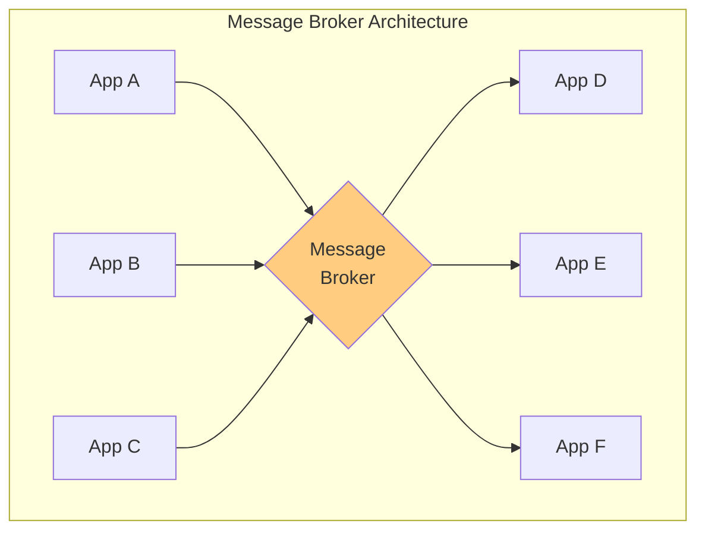
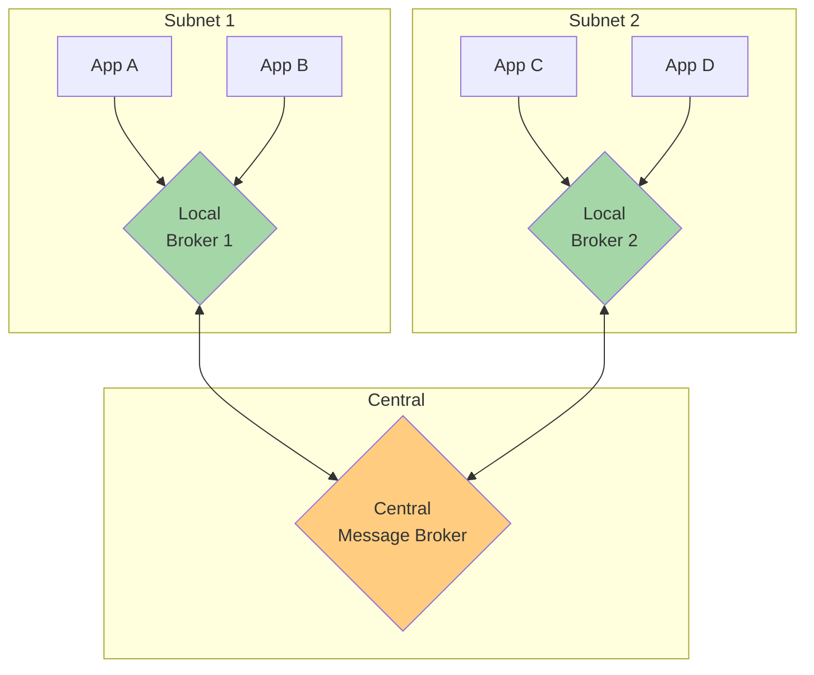

# Message Broker

## 1. 3行要約 (Feynman Technique)
> **目的:** 専門用語を避け、直感的なメタファーを用いて「何をするものか」を定義する。
- 「郵便局の中央仕分けセンター」のような役割。全ての手紙が集まり、宛先を判定して配送
- メッセージの送信元と宛先を分離しながら、メッセージフローを集中管理
- 核心的価値：**異種システム間のメッセージルーティングの一元化**

## 2. 解決する課題 (Context & Problem)
> **目的:** 「なぜこれが必要なのか？」という文脈（Pain Point）を明確にする。

- **Before:**
  - 複数のアプリケーション間でメッセージをルーティングする必要がある
  - 各アプリケーションが他の全てのアプリケーションを知る必要がある
  - 異なるデータフォーマット間の変換が必要

- **Trigger:**
  - メッセージの送信元と宛先を分離したい
  - ルーティングロジックを一元管理したい
  - 異種アプリケーション間の統合を実現したい

## 3. ソリューションと構造 (Structure & Visual)
> **目的:** Dual Coding（文字と図）により記憶定着を図る。

### 仕組み
中央のMessage Brokerが：
1. 複数の送信元からメッセージを受信
2. 適切な宛先を判定
3. 必要に応じてメッセージを変換
4. 宛先にルーティング

### ハブ・アンド・スポーク構造



### 階層構造（サブネット）



## 4. トレードオフと制約 (Critical Thinking)

### Pros (利点):
- **疎結合**: 送信元と宛先が互いを知らなくて良い
- **一元管理**: ルーティングルールを中央で管理
- **変換**: 異なるデータフォーマット間の変換を一箇所で実施
- **監視**: メッセージフローの可視化と監査

### Cons (欠点・副作用):
- **ボトルネック**: 全メッセージが中央を通過
- **単一障害点**: ブローカー障害時に全システムが影響
- **複雑性**: 変換器の数がN²に増加する可能性
- **レイテンシ**: 間接経路によるオーバーヘッド

### スケーリング対策

| 対策 | 説明 |
|-----|------|
| **ステートレス設計** | 複数インスタンスの並行配置が可能 |
| **機能分割** | 複数のBrokerを機能ごとに分割 |
| **階層化** | ローカルBrokerとセントラルBrokerの組み合わせ |

### Message Busとの比較

| 観点 | Message Broker | Message Bus |
|-----|---------------|-------------|
| 構造 | ハブ・アンド・スポーク | 共有チャネル |
| 階層化 | 可能 | 困難 |
| 制御 | 集中 | 分散 |
| スケール | 階層化で対応 | 水平スケール |

### Anti-Pattern:
- 全てのメッセージングにMessage Brokerを使用（過剰設計）
- スケーリングを考慮しない単一Broker設計
- 変換ロジックの肥大化

## 5. 実装イメージ (Implementation)

### アーキテクチャ例

```
┌────────────────────────────────────────────────────────┐
│                    Message Broker                       │
├────────────────────────────────────────────────────────┤
│                                                         │
│  ┌─────────────┐  ┌─────────────┐  ┌─────────────┐    │
│  │  Receiver   │  │  Receiver   │  │  Receiver   │    │
│  │  (App A)    │  │  (App B)    │  │  (App C)    │    │
│  └──────┬──────┘  └──────┬──────┘  └──────┬──────┘    │
│         │                │                │            │
│         v                v                v            │
│  ┌─────────────────────────────────────────────────┐  │
│  │              Message Transformer                 │  │
│  │         (Canonical Data Model変換)               │  │
│  └──────────────────────┬──────────────────────────┘  │
│                          │                             │
│                          v                             │
│  ┌─────────────────────────────────────────────────┐  │
│  │            Content-Based Router                  │  │
│  │           (ルーティングルール適用)                │  │
│  └─────────┬─────────────┬─────────────┬───────────┘  │
│            │             │             │              │
│            v             v             v              │
│  ┌─────────────┐  ┌─────────────┐  ┌─────────────┐   │
│  │  Sender     │  │  Sender     │  │  Sender     │   │
│  │  (App X)    │  │  (App Y)    │  │  (App Z)    │   │
│  └─────────────┘  └─────────────┘  └─────────────┘   │
│                                                        │
└────────────────────────────────────────────────────────┘
```

### Akka Typed Actor (Scala)

```scala
import akka.actor.typed.{ActorRef, Behavior}
import akka.actor.typed.scaladsl.Behaviors

// ドメインモデル（各アプリケーション固有のフォーマット）
sealed trait AppMessage
case class AppAMessage(orderId: String, customerName: String, amount: Double) extends AppMessage
case class AppBMessage(invoiceNo: String, vendor: String, total: Double) extends AppMessage
case class AppCMessage(data: String) extends AppMessage

// Canonical Data Model（共通フォーマット）
sealed trait CanonicalMessage {
  def messageType: String
  def correlationId: String
}

case class CanonicalOrder(
  correlationId: String,
  orderId: String,
  customer: String,
  amount: Double
) extends CanonicalMessage {
  val messageType = "ORDER"
}

case class CanonicalInvoice(
  correlationId: String,
  invoiceId: String,
  vendor: String,
  total: Double
) extends CanonicalMessage {
  val messageType = "INVOICE"
}

case class CanonicalGeneric(
  correlationId: String,
  payload: String
) extends CanonicalMessage {
  val messageType = "GENERIC"
}

// Message Broker
object MessageBroker {
  sealed trait Command
  case class Route(message: AppMessage) extends Command
  case class RegisterDestination(
    messageType: String,
    destination: ActorRef[CanonicalMessage]
  ) extends Command

  def apply(): Behavior[Command] =
    broker(Map.empty)

  private def broker(
    destinations: Map[String, ActorRef[CanonicalMessage]]
  ): Behavior[Command] =
    Behaviors.receive { (context, command) =>
      command match {
        // 宛先の登録
        case RegisterDestination(messageType, destination) =>
          context.log.info(s"Registered destination for $messageType")
          broker(destinations + (messageType -> destination))

        // メッセージのルーティング
        case Route(message) =>
          context.log.info(s"Routing message: $message")

          // 1. Canonical Data Modelに変換
          val canonical = transformToCanonical(message)
          context.log.info(s"Transformed to: ${canonical.messageType}")

          // 2. Content-Based Routing
          destinations.get(canonical.messageType) match {
            case Some(destination) =>
              context.log.info(s"Routing ${canonical.messageType} to destination")
              destination ! canonical

            case None =>
              // デフォルトハンドラへ
              destinations.get("DEFAULT").foreach { defaultDest =>
                context.log.info(s"Routing to default handler")
                defaultDest ! canonical
              }
          }

          Behaviors.same
      }
    }

  // Canonical Data Modelへの変換
  private def transformToCanonical(message: AppMessage): CanonicalMessage = {
    message match {
      case AppAMessage(orderId, customerName, amount) =>
        CanonicalOrder(
          correlationId = java.util.UUID.randomUUID().toString,
          orderId = orderId,
          customer = customerName,
          amount = amount
        )

      case AppBMessage(invoiceNo, vendor, total) =>
        CanonicalInvoice(
          correlationId = java.util.UUID.randomUUID().toString,
          invoiceId = invoiceNo,
          vendor = vendor,
          total = total
        )

      case AppCMessage(data) =>
        CanonicalGeneric(
          correlationId = java.util.UUID.randomUUID().toString,
          payload = data
        )
    }
  }
}

// 宛先アプリケーション（Canonical → アプリ固有フォーマットに変換）
object OrderProcessor {
  case class AppXOrder(id: String, customerInfo: String, totalAmount: Double)

  def apply(): Behavior[CanonicalMessage] =
    Behaviors.receive { (context, message) =>
      message match {
        case order: CanonicalOrder =>
          // App X固有のフォーマットに変換
          val appXOrder = AppXOrder(
            id = order.orderId,
            customerInfo = s"Customer: ${order.customer}",
            totalAmount = order.amount
          )
          context.log.info(s"OrderProcessor received: $appXOrder")
          // App Xへ送信（実際はキューやHTTPなど）

        case other =>
          context.log.warn(s"Unexpected message type: ${other.messageType}")
      }
      Behaviors.same
    }
}

object InvoiceProcessor {
  case class AppYInvoice(number: String, vendorName: String, amount: Double)

  def apply(): Behavior[CanonicalMessage] =
    Behaviors.receive { (context, message) =>
      message match {
        case invoice: CanonicalInvoice =>
          // App Y固有のフォーマットに変換
          val appYInvoice = AppYInvoice(
            number = invoice.invoiceId,
            vendorName = invoice.vendor,
            amount = invoice.total
          )
          context.log.info(s"InvoiceProcessor received: $appYInvoice")
          // App Yへ送信

        case other =>
          context.log.warn(s"Unexpected message type: ${other.messageType}")
      }
      Behaviors.same
    }
}

object DefaultProcessor {
  def apply(): Behavior[CanonicalMessage] =
    Behaviors.receive { (context, message) =>
      context.log.info(s"DefaultProcessor received: ${message.messageType}")
      Behaviors.same
    }
}

// 階層化されたMessage Broker（サブネット構成）
object LocalBroker {
  sealed trait Command
  case class Route(message: AppMessage) extends Command

  def apply(
    centralBroker: ActorRef[MessageBroker.Command],
    localProcessors: Map[String, ActorRef[CanonicalMessage]]
  ): Behavior[Command] =
    Behaviors.receive { (context, command) =>
      command match {
        case Route(message) =>
          // ローカルで処理可能か判定
          val canonical = transformLocal(message)
          localProcessors.get(canonical.messageType) match {
            case Some(processor) =>
              context.log.info(s"Processing locally: ${canonical.messageType}")
              processor ! canonical

            case None =>
              // セントラルブローカーへ転送
              context.log.info(s"Forwarding to central: ${canonical.messageType}")
              centralBroker ! MessageBroker.Route(message)
          }
          Behaviors.same
      }
    }

  private def transformLocal(message: AppMessage): CanonicalMessage = {
    // 簡易変換（実際はMessageBrokerと同様の変換ロジック）
    message match {
      case AppAMessage(orderId, _, _) =>
        CanonicalOrder(orderId, orderId, "", 0)
      case AppBMessage(invoiceNo, _, _) =>
        CanonicalInvoice(invoiceNo, invoiceNo, "", 0)
      case AppCMessage(data) =>
        CanonicalGeneric(data, data)
    }
  }
}

// 使用例
object MessageBrokerExample {
  def apply(): Behavior[Nothing] =
    Behaviors.setup[Nothing] { context =>
      // 宛先プロセッサを作成
      val orderProcessor = context.spawn(OrderProcessor(), "orderProcessor")
      val invoiceProcessor = context.spawn(InvoiceProcessor(), "invoiceProcessor")
      val defaultProcessor = context.spawn(DefaultProcessor(), "defaultProcessor")

      // Message Brokerを作成
      val broker = context.spawn(MessageBroker(), "broker")

      // 宛先を登録
      broker ! MessageBroker.RegisterDestination("ORDER", orderProcessor)
      broker ! MessageBroker.RegisterDestination("INVOICE", invoiceProcessor)
      broker ! MessageBroker.RegisterDestination("DEFAULT", defaultProcessor)

      // 各アプリケーションからのメッセージをシミュレート
      broker ! MessageBroker.Route(
        AppAMessage("ORD-001", "John Doe", 1500.0)
      )
      broker ! MessageBroker.Route(
        AppBMessage("INV-001", "Acme Corp", 2500.0)
      )
      broker ! MessageBroker.Route(
        AppCMessage("Generic data payload")
      )

      Behaviors.empty
    }
}
```

## 6. リンクと関係性 (Network Knowledge)

### 構成パターン:
- [[content_based_router|Content-Based Router]] - メッセージのルーティング
- [[message_translator|Message Translator]] - データフォーマット変換
- [[canonical_data_model|Canonical Data Model]] - 共通データモデル
- [[channel_adapter|Channel Adapter]] - アプリケーション接続

### 関連パターン:
- [[message_bus|Message Bus]] (比較: 共有チャネル方式)
- [[process_manager|Process Manager]] (組み合わせ: フロー制御)
- [[pipes_and_filters|Pipes and Filters]] (基盤: 処理パイプライン)

### 次のステップ:
- [[message_translator|Message Translator]] - メッセージ変換の詳細
- [[process_manager|Process Manager]] - 複雑なフロー制御が必要な場合
