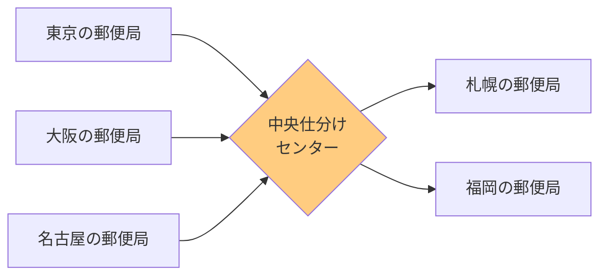
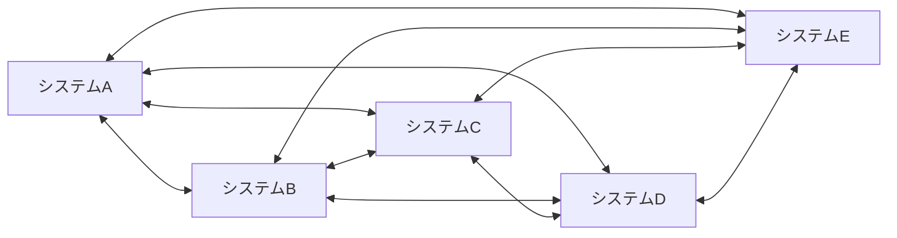
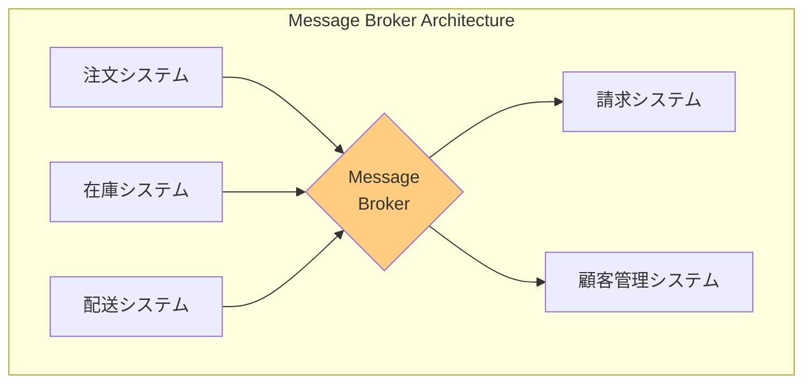
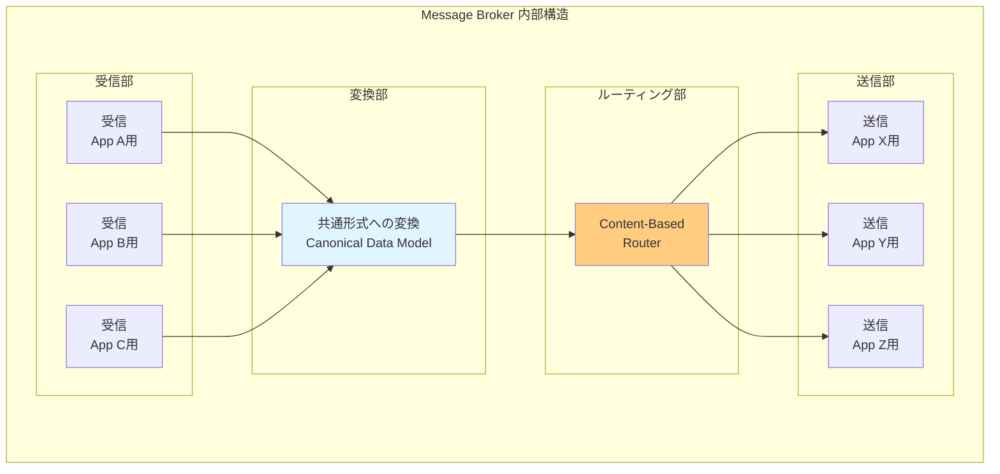
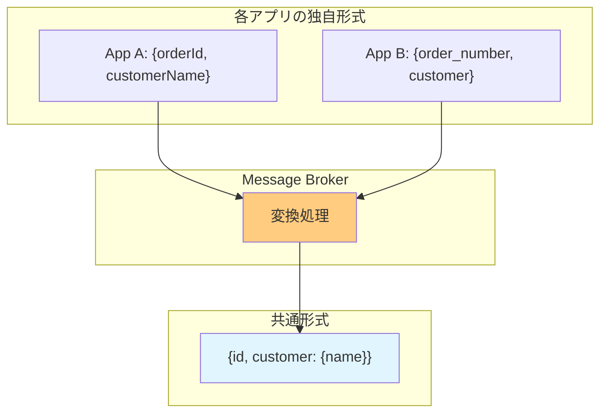
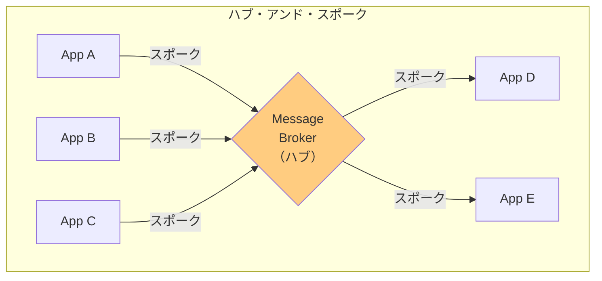
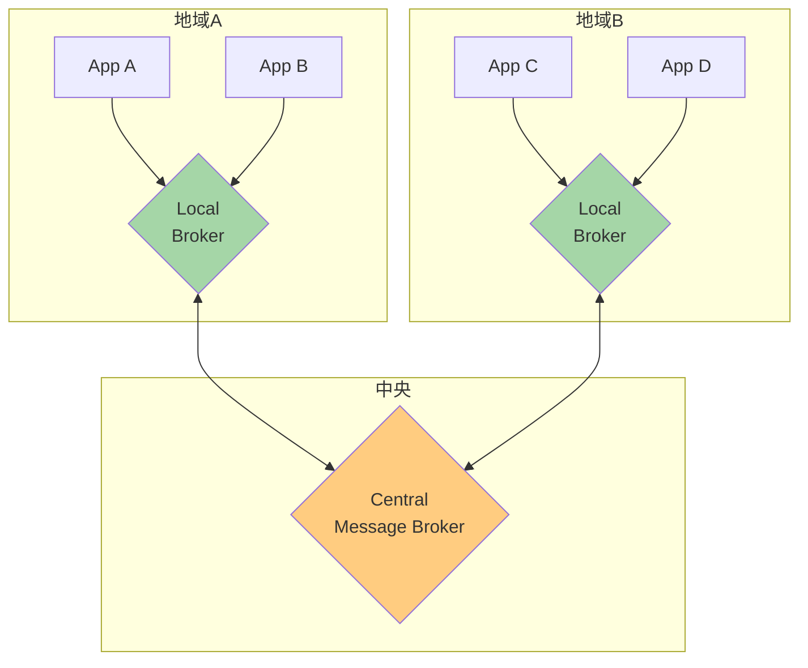

# Message Broker

## このパターンは何をするのか

Message Brokerは、**異なるアプリケーション間のメッセージのやり取りを一元管理する「中央の仲介者」**を設けるアーキテクチャパターンです。郵便局の中央仕分けセンターのように、全てのメッセージが中央を経由して適切な宛先に届けられます。

### 身近な例で考える

郵便局の仕分けセンターを想像してください。

日本全国から届いた郵便物が、地域の郵便局から中央の仕分けセンターに集まります。仕分けセンターでは、宛先を見て郵便物を適切な地域に振り分け、最終的に届け先の郵便局に届けます。



重要なポイントは、**各郵便局は互いのことを知らなくていい**ということです。東京の郵便局は「札幌の郵便局がどこにあるか」を知る必要がなく、「中央仕分けセンターに送れば届けてくれる」ことだけ知っていれば十分です。

Message Brokerも同じです。各アプリケーションは「どのアプリケーションにメッセージを送りたいか」を気にする必要がなく、「Message Brokerに送れば適切な宛先に届けてくれる」ことだけ知っていれば十分です。

## なぜMessage Brokerが必要なのか

### 問題の背景

企業システムでは、**複数のアプリケーションがメッセージをやり取りする**ことがよくあります。

例えば、ECサイトを運営している会社を考えてみましょう。

- 注文システム
- 在庫管理システム
- 配送システム
- 請求システム
- 顧客管理システム

これらのシステムは、互いにデータをやり取りする必要があります。

### Message Brokerがない場合の問題

**問題1: 全てのシステムが互いを知る必要がある**

各システムが直接やり取りする場合、全てのシステムが他の全てのシステムの場所（IPアドレス、ポートなど）を知る必要があります。



5つのシステムで10個の接続が必要になります。

システムが増えるほど、接続の数は急激に増えます（N×(N-1)/2個）。

**問題2: データ形式が異なる**

各システムは、それぞれ独自のデータ形式を使っていることが多いです。注文システムの「顧客ID」と、顧客管理システムの「カスタマーナンバー」が異なる形式かもしれません。

直接やり取りする場合、「送信側のフォーマット→受信側のフォーマット」への変換が必要になります。5つのシステム間で変換すると、最大20種類の変換が必要になります。

**問題3: 変更が難しい**

新しいシステムを追加したり、既存のシステムを変更したりするたびに、関連する全てのシステムに影響が出ます。

### Message Brokerを使うと

Message Brokerを使うと、全てのシステムは「Message Brokerとだけ」やり取りすれば済みます。



各システムは、Message Brokerの場所だけを知っていれば十分です。データ形式の変換もMessage Brokerが行うので、各システムは自分の形式だけを使えます。

## Message Brokerの仕組み

### 基本的な構造

Message Brokerは以下の要素で構成されます。

**受信部（Receiver）**

各アプリケーションからのメッセージを受け取る入口です。アプリケーションごとに異なるプロトコル（HTTP、キュー、ファイルなど）に対応できます。

**変換部（Transformer）**

受け取ったメッセージを「共通形式（Canonical Data Model）」に変換します。これにより、異なる形式のメッセージを統一的に扱えます。

**ルーティング部（Router）**

メッセージの内容に基づいて、適切な宛先を決定します。Content-Based Routerを使うことが多いです。

**送信部（Sender）**

変換されたメッセージを宛先アプリケーションに送信します。宛先アプリケーションに合わせた形式に再変換することもあります。



### Canonical Data Model（共通データ形式）

Message Brokerの重要な概念が「Canonical Data Model」です。

各アプリケーションは独自のデータ形式を使っていますが、Message Broker内部では全てのメッセージを「共通の形式」に変換します。



これにより、N個のアプリケーション間の変換は「N × 2」で済みます（各アプリ→共通 + 共通→各アプリ）。直接変換だと「N × (N-1)」必要なので、大幅に削減できます。

### ハブ・アンド・スポーク構造

Message Brokerの典型的な構造は「ハブ・アンド・スポーク」と呼ばれます。

車輪の中心（ハブ）がMessage Broker、車輪のスポーク（輻）が各アプリケーションとの接続です。



## Message Brokerのメリットとデメリット

### メリット

**疎結合（ルーズカップリング）**

各アプリケーションは他のアプリケーションの存在を知る必要がありません。「Message Brokerに送れば届く」ことだけ知っていれば十分です。

**ルーティングの一元管理**

「どのメッセージをどこに送るか」というルールを、Message Brokerで一元管理できます。ルールの変更がMessage Brokerだけで済みます。

**データ形式の変換**

異なるデータ形式を使うアプリケーション間でも、Message Brokerが変換を行うので、各アプリケーションは自分の形式だけを使えます。

**監視と監査**

全てのメッセージがMessage Brokerを通過するので、メッセージの流れを監視したり、ログを残したりしやすくなります。

### デメリット

**ボトルネックになりやすい**

全てのメッセージが中央のMessage Brokerを通過するので、Message Brokerの処理能力がシステム全体のボトルネックになる可能性があります。

**単一障害点**

Message Brokerが停止すると、システム全体のメッセージングが止まります。高可用性の設計が必要です。

**レイテンシの増加**

メッセージが直接送られる場合と比べて、Message Brokerを経由する分だけ遅延が増えます。

### スケーリング対策

Message Brokerがボトルネックにならないよう、いくつかの対策があります。

**ステートレス設計**

Message Brokerを「状態を持たない」設計にすると、複数のインスタンスを並べて負荷分散できます。

**階層化（ローカルブローカー + セントラルブローカー）**

大規模なシステムでは、「ローカルのMessage Broker」と「中央のMessage Broker」を階層化します。



ローカルブローカーで処理できるメッセージはローカルで処理し、他の地域宛のメッセージだけを中央に転送します。郵便局の仕分けで、同じ市内宛の郵便は中央を経由せずに直接配達するのと同じです。

### Message Busとの違い

Message BrokerとよくMessage Busと呼ばれるものがあります。

| 観点 | Message Broker | Message Bus |
|-----|---------------|-------------|
| 構造 | ハブ・アンド・スポーク（中央集権） | 共有チャネル（分散） |
| ルーティング | 中央で決定 | 各アプリケーションが購読 |
| 変換 | 中央で実施 | 各アプリケーションで実施 |
| スケール | 階層化で対応 | 水平スケール |

**Message Broker**: 全てのメッセージが中央を通過し、ルーティングと変換を行う

**Message Bus**: 共有チャネルにメッセージを流し、必要なアプリケーションが購読する（Publish-Subscribe）

### やってはいけないこと

**全てのメッセージングにMessage Brokerを使う**

シンプルな1対1の通信には過剰設計です。Message Brokerは「複数のアプリケーション間の複雑なルーティング」に適しています。

**スケーリングを考えない単一構成**

Message Brokerは全メッセージが通過するので、最初からスケーリングを考慮した設計が必要です。

**変換ロジックを複雑にしすぎる**

Message Broker内の変換ロジックが肥大化すると、保守が困難になります。複雑な変換が必要な場合は、専用の変換サービスを分離することを検討しましょう。

## 実装例

### Akka Typed Actor (Scala)

以下は、注文システム、請求システム、顧客管理システム間のメッセージをルーティングするMessage Brokerの実装例です。

```scala
import akka.actor.typed.{ActorRef, Behavior}
import akka.actor.typed.scaladsl.Behaviors

// 各アプリケーション固有のメッセージ形式
sealed trait AppMessage

// 注文システムからのメッセージ
case class OrderSystemMessage(
  orderId: String,
  customerName: String,
  amount: Double
) extends AppMessage

// 請求システムからのメッセージ
case class BillingSystemMessage(
  invoiceNo: String,
  vendor: String,
  total: Double
) extends AppMessage

// 汎用メッセージ
case class GenericMessage(data: String) extends AppMessage

// Canonical Data Model（共通形式）
// 全てのメッセージをこの形式に変換してから処理する
sealed trait CanonicalMessage {
  def messageType: String
  def correlationId: String
}

// 注文の共通形式
case class CanonicalOrder(
  correlationId: String,
  orderId: String,
  customer: String,
  amount: Double
) extends CanonicalMessage {
  val messageType = "ORDER"
}

// 請求の共通形式
case class CanonicalInvoice(
  correlationId: String,
  invoiceId: String,
  vendor: String,
  total: Double
) extends CanonicalMessage {
  val messageType = "INVOICE"
}

// 汎用の共通形式
case class CanonicalGeneric(
  correlationId: String,
  payload: String
) extends CanonicalMessage {
  val messageType = "GENERIC"
}

// Message Broker本体
object MessageBroker {
  // Message Brokerへのコマンド
  sealed trait Command
  // メッセージをルーティングする
  case class Route(message: AppMessage) extends Command
  // 宛先を登録する
  case class RegisterDestination(
    messageType: String,
    destination: ActorRef[CanonicalMessage]
  ) extends Command

  def apply(): Behavior[Command] =
    broker(Map.empty)

  private def broker(
    destinations: Map[String, ActorRef[CanonicalMessage]]
  ): Behavior[Command] =
    Behaviors.receive { (context, command) =>
      command match {
        // 宛先の登録
        case RegisterDestination(messageType, destination) =>
          context.log.info(s"宛先を登録: $messageType")
          broker(destinations + (messageType -> destination))

        // メッセージのルーティング
        case Route(message) =>
          context.log.info(s"メッセージを受信: $message")

          // 1. Canonical Data Model（共通形式）に変換
          val canonical = transformToCanonical(message)
          context.log.info(s"共通形式に変換: ${canonical.messageType}")

          // 2. メッセージタイプに基づいてルーティング
          destinations.get(canonical.messageType) match {
            case Some(destination) =>
              context.log.info(s"${canonical.messageType} を宛先に送信")
              destination ! canonical

            case None =>
              // 該当する宛先がない場合はデフォルトハンドラへ
              destinations.get("DEFAULT").foreach { defaultDest =>
                context.log.info(s"デフォルトハンドラに送信")
                defaultDest ! canonical
              }
          }

          Behaviors.same
      }
    }

  // アプリ固有の形式 → 共通形式への変換
  private def transformToCanonical(message: AppMessage): CanonicalMessage = {
    val correlationId = java.util.UUID.randomUUID().toString

    message match {
      case OrderSystemMessage(orderId, customerName, amount) =>
        // 注文システムの形式 → 共通の注文形式
        CanonicalOrder(
          correlationId = correlationId,
          orderId = orderId,
          customer = customerName,
          amount = amount
        )

      case BillingSystemMessage(invoiceNo, vendor, total) =>
        // 請求システムの形式 → 共通の請求形式
        CanonicalInvoice(
          correlationId = correlationId,
          invoiceId = invoiceNo,
          vendor = vendor,
          total = total
        )

      case GenericMessage(data) =>
        // 汎用メッセージ → 共通の汎用形式
        CanonicalGeneric(
          correlationId = correlationId,
          payload = data
        )
    }
  }
}

// 注文処理サービス（宛先アプリケーション）
object OrderProcessor {
  // このサービス固有の注文形式
  case class InternalOrder(id: String, customerInfo: String, totalAmount: Double)

  def apply(): Behavior[CanonicalMessage] =
    Behaviors.receive { (context, message) =>
      message match {
        case order: CanonicalOrder =>
          // 共通形式 → このサービス固有の形式に変換
          val internalOrder = InternalOrder(
            id = order.orderId,
            customerInfo = s"顧客: ${order.customer}",
            totalAmount = order.amount
          )
          println(s"=== 注文処理 ===")
          println(s"  注文ID: ${internalOrder.id}")
          println(s"  顧客: ${internalOrder.customerInfo}")
          println(s"  金額: ${internalOrder.totalAmount}円")

        case other =>
          context.log.warn(s"予期しないメッセージ: ${other.messageType}")
      }
      Behaviors.same
    }
}

// 請求処理サービス（宛先アプリケーション）
object InvoiceProcessor {
  // このサービス固有の請求形式
  case class InternalInvoice(number: String, vendorName: String, amount: Double)

  def apply(): Behavior[CanonicalMessage] =
    Behaviors.receive { (context, message) =>
      message match {
        case invoice: CanonicalInvoice =>
          // 共通形式 → このサービス固有の形式に変換
          val internalInvoice = InternalInvoice(
            number = invoice.invoiceId,
            vendorName = invoice.vendor,
            amount = invoice.total
          )
          println(s"=== 請求処理 ===")
          println(s"  請求番号: ${internalInvoice.number}")
          println(s"  取引先: ${internalInvoice.vendorName}")
          println(s"  金額: ${internalInvoice.amount}円")

        case other =>
          context.log.warn(s"予期しないメッセージ: ${other.messageType}")
      }
      Behaviors.same
    }
}

// デフォルトハンドラ（該当する宛先がない場合）
object DefaultProcessor {
  def apply(): Behavior[CanonicalMessage] =
    Behaviors.receive { (context, message) =>
      println(s"=== デフォルト処理 ===")
      println(s"  メッセージタイプ: ${message.messageType}")
      println(s"  相関ID: ${message.correlationId}")
      Behaviors.same
    }
}

// 使用例
object MessageBrokerExample {
  def setup(): Behavior[Nothing] =
    Behaviors.setup[Nothing] { context =>
      // 宛先プロセッサを作成
      val orderProcessor = context.spawn(OrderProcessor(), "orderProcessor")
      val invoiceProcessor = context.spawn(InvoiceProcessor(), "invoiceProcessor")
      val defaultProcessor = context.spawn(DefaultProcessor(), "defaultProcessor")

      // Message Brokerを作成
      val broker = context.spawn(MessageBroker(), "broker")

      // 宛先を登録
      // "ORDER" タイプのメッセージ → 注文処理サービスへ
      broker ! MessageBroker.RegisterDestination("ORDER", orderProcessor)
      // "INVOICE" タイプのメッセージ → 請求処理サービスへ
      broker ! MessageBroker.RegisterDestination("INVOICE", invoiceProcessor)
      // その他のメッセージ → デフォルトハンドラへ
      broker ! MessageBroker.RegisterDestination("DEFAULT", defaultProcessor)

      // 各アプリケーションからのメッセージをシミュレート

      // 注文システムからのメッセージ
      broker ! MessageBroker.Route(
        OrderSystemMessage("ORD-001", "田中太郎", 15000.0)
      )
      // 出力:
      // === 注文処理 ===
      //   注文ID: ORD-001
      //   顧客: 顧客: 田中太郎
      //   金額: 15000.0円

      // 請求システムからのメッセージ
      broker ! MessageBroker.Route(
        BillingSystemMessage("INV-001", "株式会社ABC", 25000.0)
      )
      // 出力:
      // === 請求処理 ===
      //   請求番号: INV-001
      //   取引先: 株式会社ABC
      //   金額: 25000.0円

      // 汎用メッセージ（該当する宛先がないのでデフォルトへ）
      broker ! MessageBroker.Route(
        GenericMessage("汎用データペイロード")
      )
      // 出力:
      // === デフォルト処理 ===
      //   メッセージタイプ: GENERIC
      //   相関ID: (UUID)

      Behaviors.empty
    }
}
```

### コードのポイント

**Canonical Data Model（共通形式）**

`CanonicalOrder`、`CanonicalInvoice`、`CanonicalGeneric` が共通形式です。各アプリケーション固有の形式（`OrderSystemMessage`など）をこの共通形式に変換することで、変換ロジックを削減しています。

**宛先の動的登録**

`RegisterDestination` コマンドで、メッセージタイプと宛先の対応を動的に登録できます。新しい宛先を追加しても、Message Brokerのコードを変更する必要がありません。

**Content-Based Routing**

メッセージの内容（`messageType`）に基づいて、適切な宛先にルーティングしています。これは[[content_based_router|Content-Based Router]]パターンの適用です。

## 関連するパターン

| パターン | 関係 |
|---------|------|
| [[content_based_router\|Content-Based Router]] | Message Broker内でのルーティングに使用 |
| [[message_translator\|Message Translator]] | データ形式の変換に使用 |
| [[pipes_and_filters\|Pipes and Filters]] | Message Broker内の処理パイプラインの基盤 |
| [[process_manager\|Process Manager]] | より複雑なフロー制御が必要な場合に組み合わせ |

## 次に読むべき内容

- [[pipes_and_filters|Pipes and Filters]] - Message Broker内の処理パイプライン
- [[process_manager|Process Manager]] - 複雑なフロー制御が必要な場合

## 参考資料

- [Enterprise Integration Patterns - Message Broker](https://www.enterpriseintegrationpatterns.com/patterns/messaging/MessageBroker.html)
