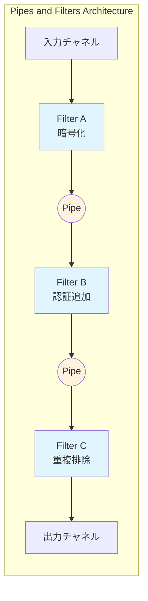
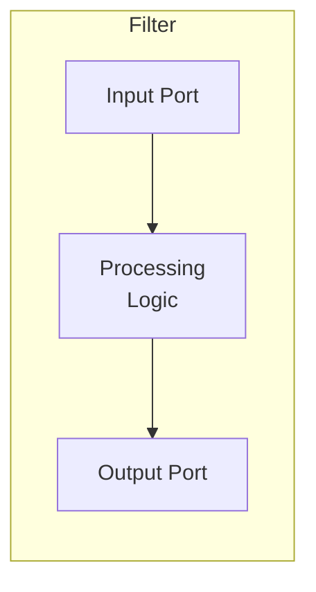

# Pipes and Filters

## 1. 3行要約 (Feynman Technique)
> **目的:** 専門用語を避け、直感的なメタファーを用いて「何をするものか」を定義する。
- 「工場の組み立てライン」のような構造。各工程（フィルター）が特定の作業を行い、ベルトコンベア（パイプ）で次の工程に渡す
- 各フィルターは独立しており、入力を受け取り→処理し→出力する、というシンプルなインターフェースを持つ
- 核心的価値：**処理の分離と再構成可能性**

## 2. 解決する課題 (Context & Problem)
> **目的:** 「なぜこれが必要なのか？」という文脈（Pain Point）を明確にする。

- **Before:**
  - 複雑な処理が単一のモノリシックコンポーネントに詰め込まれている
  - 処理ステップの追加・削除・並べ替えが困難
  - 個々の処理ステップの再利用ができない
  - 例：新規注文到着時に「暗号化→認証情報追加→重複排除」など複数処理が必要だが、これらが密結合

- **Trigger:**
  - メッセージに対して複雑な処理を実行しながら、各コンポーネントの独立性と柔軟性を保ちたい
  - 処理ステップを柔軟に組み替えたい
  - 各処理ステップを独立してテスト・デプロイしたい

## 3. ソリューションと構造 (Structure & Visual)
> **目的:** Dual Coding（文字と図）により記憶定着を図る。

### 仕組み
大きな処理タスクを「フィルター」（処理ステップ）と「パイプ」（接続チャネル）を使用して、より小さな独立した処理ステップに分割する。

- 各フィルターはシンプルなインターフェースを持つ
- 入力パイプからメッセージを受け取り、処理後、出力パイプへ送信
- 同一インターフェースを使用することで構成の再編成が容易
- 接続ポイントは「port」と呼ばれる

### 構造図



### フィルターの構造



## 4. トレードオフと制約 (Critical Thinking)

### Pros (利点):
- **独立性**: 各フィルターは独立してテスト・デプロイ可能
- **再利用性**: フィルターを他のパイプラインで再利用可能
- **柔軟性**: フィルターの追加・削除・並べ替えが容易
- **スケーラビリティ**: 個々のフィルターを独立してスケール可能
- **理解しやすさ**: 各ステップの責務が明確

### Cons (欠点・副作用):
- **レイテンシ**: 各パイプでのメッセージ転送オーバーヘッド
- **データ変換コスト**: フィルター間でのデータ形式変換が必要な場合
- **エラーハンドリング**: パイプライン途中での失敗時の復旧が複雑
- **トランザクション**: 複数フィルターにまたがるトランザクション管理が困難
- **デバッグ**: メッセージの流れを追跡するのが難しい場合がある

### Anti-Pattern:
- 単純な処理に過剰なフィルター分割（オーバーヘッドが利点を上回る）
- フィルター間の暗黙的な依存関係（順序依存など）を持たせる
- 共有状態を持つフィルター（独立性が損なわれる）

## 5. 実装イメージ (Implementation)

### Akka Typed Actor (Scala)

```scala
import akka.actor.typed.{ActorRef, Behavior}
import akka.actor.typed.scaladsl.Behaviors

// メッセージ定義
sealed trait OrderMessage
case class ProcessOrder(order: Order, replyTo: ActorRef[OrderMessage]) extends OrderMessage
case class EncryptedOrder(order: Order, replyTo: ActorRef[OrderMessage]) extends OrderMessage
case class AuthenticatedOrder(order: Order, replyTo: ActorRef[OrderMessage]) extends OrderMessage
case class DeduplicatedOrder(order: Order) extends OrderMessage

// Filter 1: 暗号化フィルター
object EncryptorFilter {
  def apply(nextFilter: ActorRef[OrderMessage]): Behavior[OrderMessage] =
    Behaviors.receive { (context, message) =>
      message match {
        case ProcessOrder(order, replyTo) =>
          val encrypted = order.copy(data = encrypt(order.data))
          context.log.info(s"Encrypted order: ${order.id}")
          nextFilter ! EncryptedOrder(encrypted, replyTo)
          Behaviors.same
      }
    }

  private def encrypt(data: String): String = s"encrypted($data)"
}

// Filter 2: 認証情報追加フィルター
object AuthenticatorFilter {
  def apply(nextFilter: ActorRef[OrderMessage]): Behavior[OrderMessage] =
    Behaviors.receive { (context, message) =>
      message match {
        case EncryptedOrder(order, replyTo) =>
          val authenticated = order.copy(credentials = Some(Credentials("token")))
          context.log.info(s"Added credentials: ${order.id}")
          nextFilter ! AuthenticatedOrder(authenticated, replyTo)
          Behaviors.same
      }
    }
}

// Filter 3: 重複排除フィルター
object DeduplicatorFilter {
  def apply(output: ActorRef[OrderMessage]): Behavior[OrderMessage] =
    Behaviors.setup { context =>
      var processedIds = Set.empty[String]

      Behaviors.receiveMessage {
        case AuthenticatedOrder(order, replyTo) =>
          if (!processedIds.contains(order.id)) {
            processedIds += order.id
            context.log.info(s"Deduplicated order: ${order.id}")
            output ! DeduplicatedOrder(order)
          } else {
            context.log.info(s"Duplicate order ignored: ${order.id}")
          }
          Behaviors.same
      }
    }
}

// パイプライン構築
object OrderPipeline {
  def apply(output: ActorRef[OrderMessage]): Behavior[OrderMessage] =
    Behaviors.setup { context =>
      // フィルターチェーンを逆順に構築（出力側から）
      val deduplicator = context.spawn(DeduplicatorFilter(output), "deduplicator")
      val authenticator = context.spawn(AuthenticatorFilter(deduplicator), "authenticator")
      val encryptor = context.spawn(EncryptorFilter(authenticator), "encryptor")

      // 入力を最初のフィルターに転送
      Behaviors.receiveMessage { message =>
        encryptor ! message
        Behaviors.same
      }
    }
}
```

## 6. リンクと関係性 (Network Knowledge)

### 関連パターン:
- [[message_router|Message Router]] (比較: Pipes and Filtersは線形パイプライン、Message Routerは条件分岐)
- [[message_channel|Message Channel]] - パイプの実装
- [[message_filter|Message Filter]] - 特殊なフィルター（不要メッセージの除去）

### 構成要素:
- [[message|Message]] - パイプを流れるデータ
- [[message_endpoint|Message Endpoint]] - フィルターの入出力ポート

### 次のステップ:
- [[message_router|Message Router]] - 条件に基づく分岐の追加
- [[content_based_router|Content-Based Router]] - メッセージ内容による振り分け
