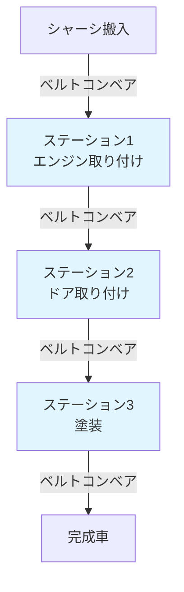
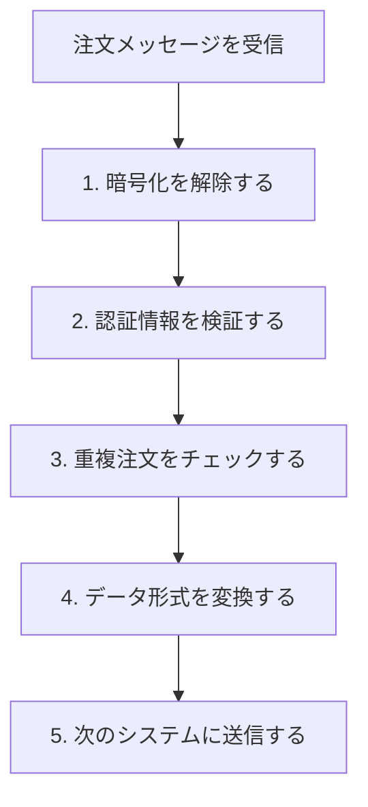
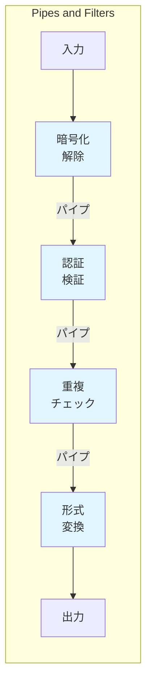
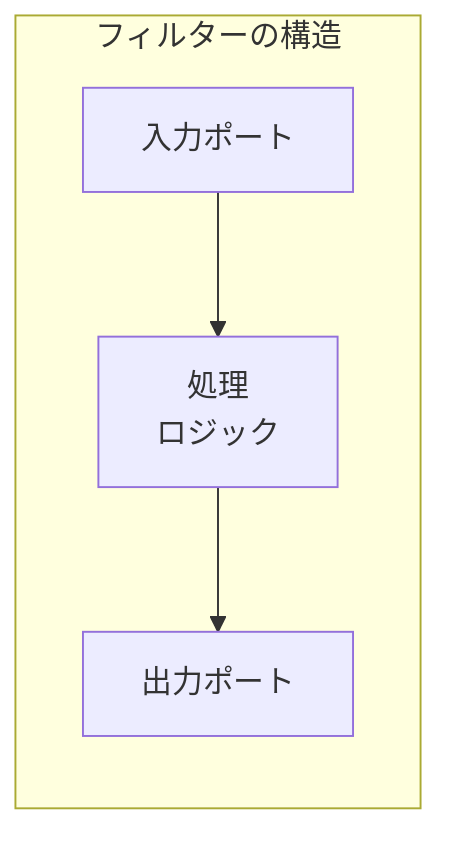
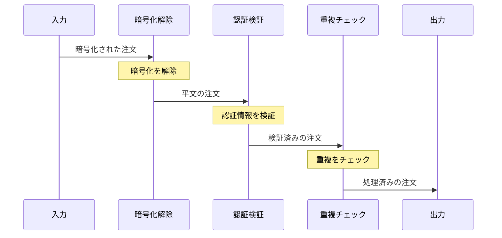

# Pipes and Filters

## このパターンは何をするのか

Pipes and Filtersは、**処理を独立した小さなステップ（フィルター）に分けて、それらをパイプ（チャネル）で接続する**アーキテクチャパターンです。工場の組み立てラインのように、メッセージが各処理ステップを順番に通過していきます。

### 身近な例で考える

自動車工場の組み立てラインを想像してください。

自動車が組み立てラインを流れながら、各工程（ステーション）で特定の作業が行われます。



各ステーションは自分の作業だけを行い、前後のステーションのことを知る必要がありません。また、必要に応じてステーションを追加したり、順番を入れ替えたりできます。

Pipes and Filtersも同じです。各フィルター（処理ステップ）は「入力を受け取り→処理し→出力する」というシンプルな役割だけを持ち、パイプ（チャネル）で接続されています。

## なぜPipes and Filtersが必要なのか

### 問題の背景

メッセージングシステムでは、**1つのメッセージに対して複数の処理を順番に行う**ことがよくあります。

例えば、注文メッセージを処理する場合、以下のような処理が必要かもしれません。



### Pipes and Filtersがない場合の問題

**問題1: 処理が1つの大きなコンポーネントに詰め込まれる**

全ての処理を1つのコンポーネントで行うと、コードが複雑になり、テストや保守が難しくなります。

**問題2: 処理の追加・変更が難しい**

「認証方式を変更したい」「新しい検証ステップを追加したい」といった変更が、システム全体に影響を与えます。

**問題3: 処理の再利用ができない**

「暗号化解除」の処理を他のシステムでも使いたくても、大きなコンポーネントの一部として埋め込まれているため、取り出して再利用できません。

### Pipes and Filtersを使うと

Pipes and Filtersを使うと、各処理を独立したフィルターとして実装し、柔軟に組み合わせられます。



## Pipes and Filtersの仕組み

### 基本的な構造

Pipes and Filtersは2つの要素で構成されます。

**フィルター（Filter）**

1つの処理ステップを表すコンポーネントです。フィルターは以下のシンプルなインターフェースを持ちます。

1. 入力パイプからメッセージを受け取る
2. メッセージを処理する
3. 結果を出力パイプに送信する

**パイプ（Pipe）**

フィルター同士を接続するチャネルです。あるフィルターの出力を、次のフィルターの入力に渡します。



### 処理の流れ



### フィルターの独立性

Pipes and Filtersの重要な特徴は、**各フィルターが独立している**ことです。

フィルターは「前のフィルターが何をしているか」「次のフィルターが何をしているか」を知る必要がありません。知っているのは「どのパイプから入力が来るか」「どのパイプに出力するか」だけです。

この独立性によって、以下のことが可能になります。

- フィルターを追加・削除・並べ替えできる
- フィルターを他のパイプラインで再利用できる
- フィルターを個別にテストできる
- フィルターを個別にスケールできる

## Pipes and Filtersのメリットとデメリット

### メリット

**処理の分離と再利用**

各フィルターは独立しているため、他のパイプラインで再利用できます。「暗号化解除」のフィルターは、注文処理でも、顧客情報処理でも使えます。

**柔軟な構成変更**

フィルターの追加・削除・並べ替えが容易です。「新しい検証ステップを追加したい」場合、新しいフィルターを作成してパイプラインに挿入するだけです。

**独立したテストとデプロイ**

各フィルターを個別にテスト・デプロイできます。1つのフィルターを変更しても、他のフィルターに影響しません。

**スケーラビリティ**

処理のボトルネックになっているフィルターだけをスケールアウトできます。例えば、「形式変換」が遅い場合、そのフィルターのインスタンスだけを増やせます。

### デメリット

**オーバーヘッド**

各パイプでのメッセージ転送にオーバーヘッドがかかります。フィルターを細かく分けすぎると、このオーバーヘッドが利点を上回ることがあります。

**エラー処理の複雑さ**

パイプラインの途中でエラーが発生した場合、「どこで失敗したか」「どう復旧するか」の処理が複雑になります。

**トランザクション管理の困難さ**

複数のフィルターにまたがるトランザクションを管理するのは困難です。

**デバッグの難しさ**

メッセージがどのフィルターを通過したか、各フィルターでどう変換されたかを追跡するのが難しくなります。

### やってはいけないこと

**単純な処理を過剰に分割する**

2〜3行のコードで済む処理を別のフィルターにする必要はありません。オーバーヘッドが利点を上回ります。

**フィルター間に暗黙の依存関係を持たせる**

「フィルターBはフィルターAの後にしか動作しない」といった暗黙の依存関係を作ると、独立性が損なわれます。

**フィルター間で状態を共有する**

フィルター間でデータベースやファイルを介して状態を共有すると、独立性が損なわれ、テストが難しくなります。

## 実装例

### Akka Typed Actor (Scala)

以下は、注文処理のパイプラインを実装した例です。

```scala
import akka.actor.typed.{ActorRef, Behavior}
import akka.actor.typed.scaladsl.Behaviors

// 注文データ
case class Order(
  id: String,
  data: String,
  encrypted: Boolean = true,
  authenticated: Boolean = false
)

// パイプラインを流れるメッセージ
sealed trait PipelineMessage
case class ProcessOrder(order: Order) extends PipelineMessage
case class DecryptedOrder(order: Order) extends PipelineMessage
case class AuthenticatedOrder(order: Order) extends PipelineMessage
case class ValidatedOrder(order: Order) extends PipelineMessage

// フィルター1: 暗号化解除
object DecryptFilter {
  def apply(nextFilter: ActorRef[PipelineMessage]): Behavior[PipelineMessage] =
    Behaviors.receive { (context, message) =>
      message match {
        case ProcessOrder(order) =>
          // 暗号化を解除
          val decrypted = order.copy(
            data = decrypt(order.data),
            encrypted = false
          )
          context.log.info(s"暗号化解除: ${order.id}")
          // 次のフィルターへ
          nextFilter ! DecryptedOrder(decrypted)
          Behaviors.same
        case _ =>
          Behaviors.same
      }
    }

  private def decrypt(data: String): String =
    s"decrypted($data)"
}

// フィルター2: 認証検証
object AuthFilter {
  def apply(nextFilter: ActorRef[PipelineMessage]): Behavior[PipelineMessage] =
    Behaviors.receive { (context, message) =>
      message match {
        case DecryptedOrder(order) =>
          // 認証を検証
          val authenticated = order.copy(authenticated = true)
          context.log.info(s"認証検証: ${order.id}")
          // 次のフィルターへ
          nextFilter ! AuthenticatedOrder(authenticated)
          Behaviors.same
        case _ =>
          Behaviors.same
      }
    }
}

// フィルター3: 重複チェック
object DeduplicateFilter {
  def apply(output: ActorRef[PipelineMessage]): Behavior[PipelineMessage] =
    Behaviors.setup { context =>
      // 処理済みのIDを保持（ステートフル）
      var processedIds = Set.empty[String]

      Behaviors.receiveMessage {
        case AuthenticatedOrder(order) =>
          if (!processedIds.contains(order.id)) {
            processedIds += order.id
            context.log.info(s"重複チェックOK: ${order.id}")
            output ! ValidatedOrder(order)
          } else {
            context.log.info(s"重複検出（スキップ）: ${order.id}")
          }
          Behaviors.same
        case _ =>
          Behaviors.same
      }
    }
}

// パイプラインの構築
object OrderPipeline {
  def apply(output: ActorRef[PipelineMessage]): Behavior[PipelineMessage] =
    Behaviors.setup { context =>
      // フィルターチェーンを構築（出力側から逆順に）
      val deduplicator = context.spawn(DeduplicateFilter(output), "deduplicator")
      val authenticator = context.spawn(AuthFilter(deduplicator), "authenticator")
      val decryptor = context.spawn(DecryptFilter(authenticator), "decryptor")

      // 入力を最初のフィルターに転送
      Behaviors.receiveMessage { message =>
        decryptor ! message
        Behaviors.same
      }
    }
}

// 使用例
object PipesAndFiltersExample {
  def setup(): Behavior[Nothing] =
    Behaviors.setup[Nothing] { context =>
      // 最終的な出力先
      val outputHandler = context.spawn(
        Behaviors.receiveMessage[PipelineMessage] {
          case ValidatedOrder(order) =>
            println(s"=== 処理完了: ${order.id} ===")
            println(s"  データ: ${order.data}")
            println(s"  暗号化: ${order.encrypted}")
            println(s"  認証済: ${order.authenticated}")
            Behaviors.same
          case _ =>
            Behaviors.same
        },
        "outputHandler"
      )

      // パイプラインを構築
      val pipeline = context.spawn(OrderPipeline(outputHandler), "pipeline")

      // 注文を送信
      pipeline ! ProcessOrder(Order("ORDER-001", "商品A x 2"))
      pipeline ! ProcessOrder(Order("ORDER-002", "商品B x 1"))
      pipeline ! ProcessOrder(Order("ORDER-001", "商品A x 2"))  // 重複

      // 結果:
      // 暗号化解除: ORDER-001
      // 認証検証: ORDER-001
      // 重複チェックOK: ORDER-001
      // === 処理完了: ORDER-001 ===
      //
      // 暗号化解除: ORDER-002
      // 認証検証: ORDER-002
      // 重複チェックOK: ORDER-002
      // === 処理完了: ORDER-002 ===
      //
      // 暗号化解除: ORDER-001
      // 認証検証: ORDER-001
      // 重複検出（スキップ）: ORDER-001  ← 重複なのでスキップ

      Behaviors.empty
    }
}
```

### コードのポイント

**フィルターの独立性**

各フィルター（`DecryptFilter`、`AuthFilter`、`DeduplicateFilter`）は独立したアクターとして実装されています。それぞれが「次のフィルターへの参照」だけを持っています。

**パイプラインの構築**

`OrderPipeline` で、出力側から逆順にフィルターを構築しています。最後のフィルター（`deduplicator`）から作成し、その参照を次のフィルター（`authenticator`）に渡し...という形で接続しています。

**ステートフルなフィルター**

`DeduplicateFilter` は「処理済みのID」という状態を持っていますが、この状態は他のフィルターには影響しません。フィルター内に閉じた状態です。

## 関連するパターン

| パターン | 関係 |
|---------|------|
| [[message_router\|Message Router]] | パイプライン内で条件分岐が必要な場合に使用 |
| [[message_filter\|Message Filter]] | 特殊なフィルター（条件に合わないメッセージを除去） |
| [[content_based_router\|Content-Based Router]] | メッセージ内容に基づいて分岐させる場合 |
| [[message_broker\|Message Broker]] | より大規模なシステム統合のアーキテクチャ |

## 次に読むべき内容

- [[message_broker|Message Broker]] - より大規模なシステム統合のアーキテクチャ
- [[message_router|Message Router]] - パイプライン内での条件分岐

## 参考資料

- [Enterprise Integration Patterns - Pipes and Filters](https://www.enterpriseintegrationpatterns.com/patterns/messaging/PipesAndFilters.html)
