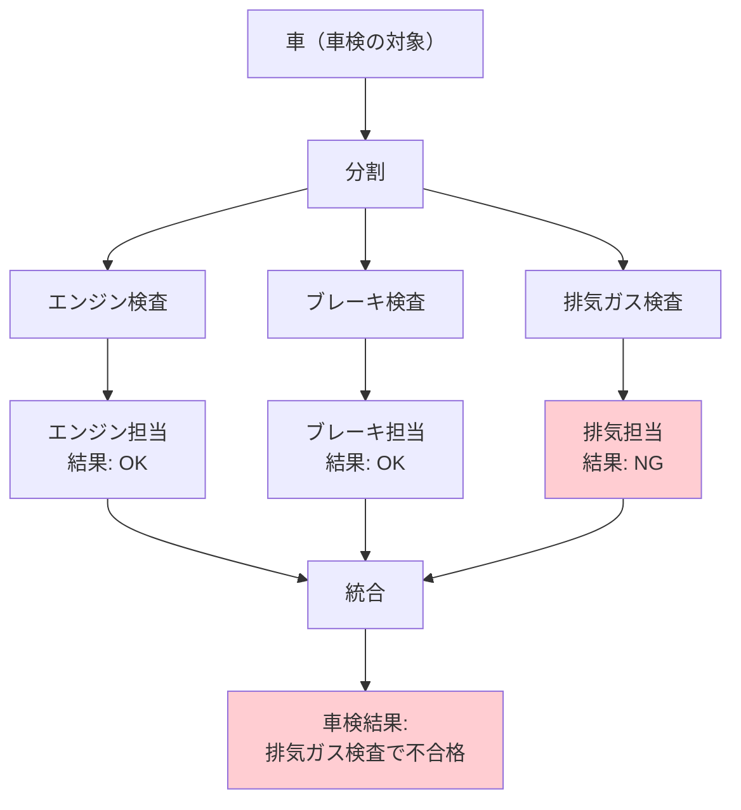
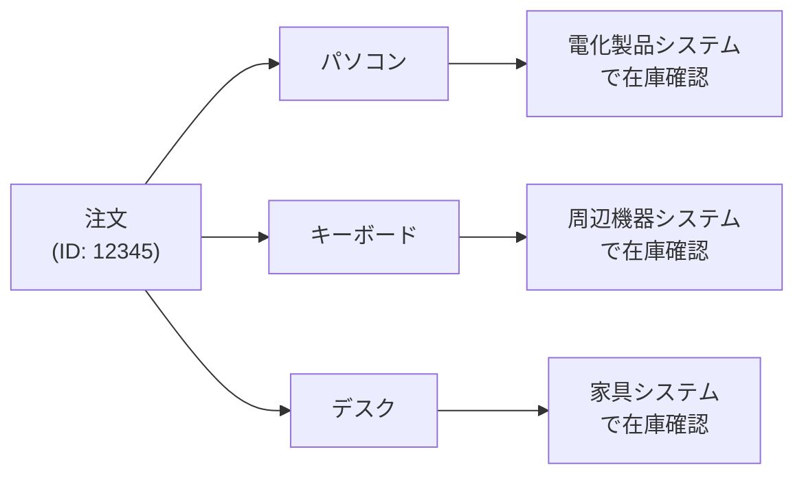
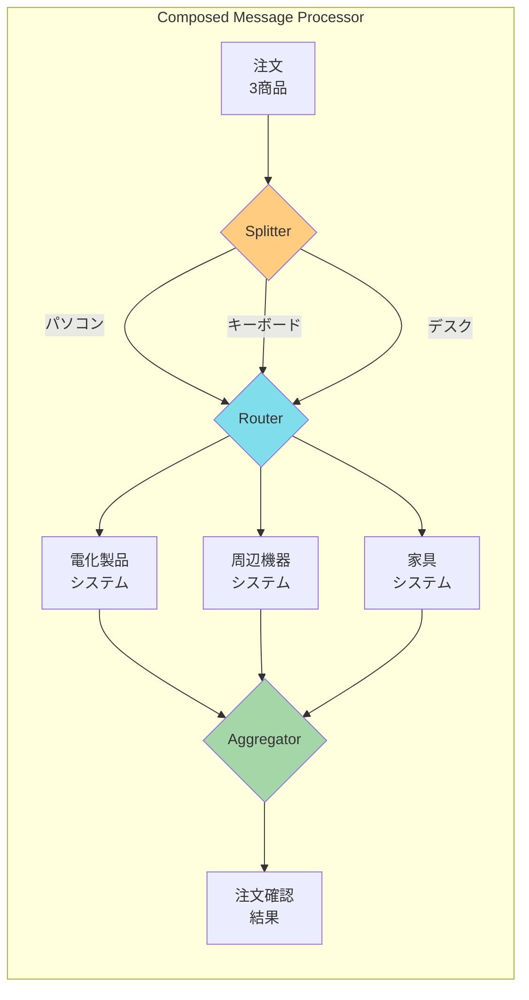
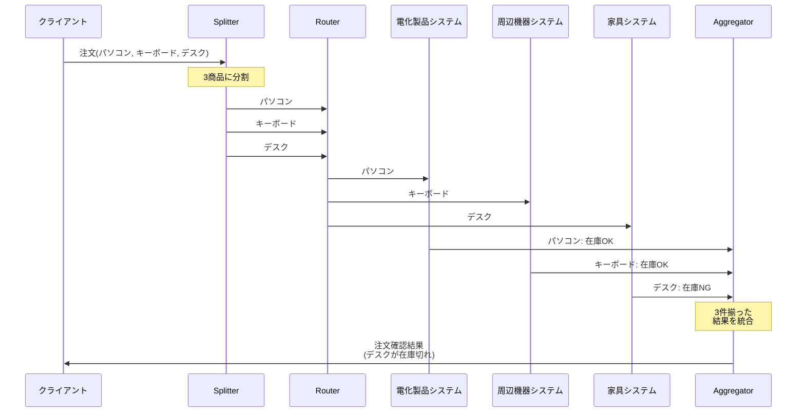

# Composed Message Processor

## このパターンは何をするのか

Composed Message Processorは、**複数の要素を含むメッセージを分割して、それぞれ処理し、結果を1つにまとめる**パターンです。[[splitter|Splitter]]、[[content_based_router|Content-Based Router]]、[[aggregator|Aggregator]]を組み合わせた複合パターンです。

### 身近な例で考える

車の車検を想像してください。

車検では、1台の車をいくつかの検査項目に「分割」して、それぞれの専門部署で検査します。エンジンはエンジン担当、ブレーキはブレーキ担当、排気ガスは排気ガス担当...といった具合です。全ての検査が終わったら、結果を1つの「車検証」にまとめます。



Composed Message Processorも同じです。1つの注文を商品ごとに分割し、それぞれの在庫システムで確認し、結果を1つの「注文確認結果」にまとめます。

## なぜComposed Message Processorが必要なのか

### 問題の背景

実際のビジネスでは、**1つのメッセージに複数の要素が含まれていて、各要素を別々のシステムで処理する必要がある**場面がよくあります。

例えば、ECサイトの注文処理を考えてみましょう。



各商品は異なるシステムで在庫を管理しているため、それぞれのシステムに問い合わせる必要があります。そして、全ての確認が終わったら、注文全体として「在庫OK」か「在庫NG」かを判断します。

### Composed Message Processorがない場合の問題

**問題1: 注文全体を1つのシステムで処理できない**

各商品の在庫は異なるシステムで管理されています。注文全体をそのまま送っても、どのシステムも処理できません。

**問題2: 結果をまとめるのが複雑**

各システムからの応答を「どの注文に対するものか」「全ての応答が揃ったか」を管理するロジックが複雑になります。

**問題3: 一部の処理が失敗した場合の対処が難しい**

3つの在庫確認のうち、1つだけ失敗した場合、どう扱うべきかの判断が必要です。

### Composed Message Processorを使うと

Composed Message Processorを使うと、この一連の流れを1つのパターンとして扱えます。



## Composed Message Processorの仕組み

### 基本的な動作

Composed Message Processorは3つのステップで動作します。

**ステップ1: 分割（Splitter）**

複合メッセージを個々の要素に分割します。例えば、3商品を含む注文を3つの商品メッセージに分割します。

**ステップ2: ルーティングと処理（Router + Processor）**

分割された各メッセージを、適切な処理先にルーティングして処理します。

**ステップ3: 統合（Aggregator）**

全ての処理結果を1つのメッセージに統合します。

### 処理の流れ



### Scatter-Gatherとの違い

Composed Message ProcessorとScatter-Gatherは似ていますが、目的が異なります。

| 観点 | Composed Message Processor | Scatter-Gather |
|-----|---------------------------|----------------|
| 入力 | 複数の要素を含む1つのメッセージ | 1つのリクエスト |
| 送信先 | 各要素を**異なる**処理先に送る | **同じ**リクエストを複数の処理先に送る |
| 目的 | 各要素を適切なシステムで処理 | 複数のソースから最良の結果を選ぶ |

**Composed Message Processor**: 「この注文の各商品を、それぞれの担当システムで在庫確認する」

**Scatter-Gather**: 「この商品の見積もりを、複数の業者に同時に依頼して、最安値を選ぶ」

## Composed Message Processorのメリットとデメリット

### メリット

**複雑な処理を1つのパターンとして扱える**

分割→ルーティング→処理→統合という一連の流れを、1つの抽象化されたパターンとして扱えます。

**並列処理が可能**

分割された各要素は独立して処理できるため、並列処理によって全体の処理時間を短縮できます。

**各処理ステップを独立して変更できる**

Splitter、Router、各Processor、Aggregatorはそれぞれ独立しているため、1つを変更しても他に影響しません。

### デメリット

**実装が複雑になる**

複数のパターンを組み合わせるため、実装とデバッグが複雑になります。

**状態管理が必要**

Aggregatorで「どの注文に対する結果か」「全ての結果が揃ったか」を追跡する必要があります。

**一部の要素が失敗した場合の処理が必要**

3商品のうち1商品の在庫確認が失敗した場合、注文全体をどう扱うかを決める必要があります。

### やってはいけないこと

**Aggregatorの終了条件を設定しない**

全ての結果が揃ったかを判断する条件がないと、いつまでも待ち続けることになります。必ず「N件揃ったら完了」または「タイムアウト」の条件を設定しましょう。

**各要素の処理エラーを無視する**

一部の要素が失敗した場合にどうするかを決めておかないと、システムが不整合な状態になります。

**単純な処理に対して使う**

分割や統合が必要ない単純な処理には、このパターンは過剰です。

## 実装例

### Akka Typed Actor (Scala)

以下は、注文を商品ごとに分割し、各在庫システムで確認し、結果を統合するComposed Message Processorの実装例です。

```scala
import akka.actor.typed.{ActorRef, Behavior}
import akka.actor.typed.scaladsl.{Behaviors, TimerScheduler}
import scala.concurrent.duration._

// 注文（複数の商品を含む）
case class Order(orderId: String, items: Seq[OrderItem])
case class OrderItem(itemId: String, itemType: String, quantity: Int)

// 各商品の確認結果
case class ItemValidationResult(
  itemId: String,
  isValid: Boolean,      // 在庫があるか
  message: String        // 詳細メッセージ
)

// 注文全体の確認結果
case class OrderValidationResult(
  orderId: String,
  results: Seq[ItemValidationResult]
) {
  val isValid: Boolean = results.forall(_.isValid)
}

// Composed Message Processorの実装
object ComposedMessageProcessor {
  sealed trait Command
  case class ProcessOrder(
    order: Order,
    replyTo: ActorRef[OrderValidationResult]
  ) extends Command
  private case class ItemProcessed(
    orderId: String,
    result: ItemValidationResult,
    replyTo: ActorRef[OrderValidationResult]
  ) extends Command
  private case class AggregationTimeout(orderId: String) extends Command

  // 集約中の状態
  case class AggregationState(
    expectedCount: Int,                     // 期待する結果の数
    results: Vector[ItemValidationResult],  // 受信済みの結果
    replyTo: ActorRef[OrderValidationResult]
  )

  def apply(
    electronicProcessor: ActorRef[ProcessItem],  // 電化製品用
    peripheralProcessor: ActorRef[ProcessItem],  // 周辺機器用
    furnitureProcessor: ActorRef[ProcessItem]    // 家具用
  ): Behavior[Command] =
    Behaviors.withTimers { timers =>
      processor(
        Map.empty,
        electronicProcessor, peripheralProcessor, furnitureProcessor,
        timers
      )
    }

  private def processor(
    aggregations: Map[String, AggregationState],
    electronicProcessor: ActorRef[ProcessItem],
    peripheralProcessor: ActorRef[ProcessItem],
    furnitureProcessor: ActorRef[ProcessItem],
    timers: TimerScheduler[Command]
  ): Behavior[Command] =
    Behaviors.receive { (context, command) =>
      command match {
        // ステップ1: Splitter - 注文を商品ごとに分割
        case ProcessOrder(order, replyTo) =>
          context.log.info(
            s"注文 ${order.orderId} を処理開始（${order.items.size}商品）"
          )

          // タイムアウトを設定
          timers.startSingleTimer(
            order.orderId,
            AggregationTimeout(order.orderId),
            5.seconds
          )

          // 集約状態を初期化
          val state = AggregationState(order.items.size, Vector.empty, replyTo)

          // ステップ2: Router - 各商品を適切なシステムにルーティング
          order.items.foreach { item =>
            val responseAdapter = context.messageAdapter[ItemValidationResult] {
              result => ItemProcessed(order.orderId, result, replyTo)
            }

            // 商品タイプに応じて送信先を決定
            val targetProcessor = item.itemType match {
              case "electronic" => electronicProcessor
              case "peripheral" => peripheralProcessor
              case "furniture"  => furnitureProcessor
              case _            => electronicProcessor  // デフォルト
            }

            context.log.info(
              s"  ${item.itemId}（${item.itemType}）を在庫確認へ"
            )
            targetProcessor ! ProcessItem(item, responseAdapter)
          }

          processor(
            aggregations + (order.orderId -> state),
            electronicProcessor, peripheralProcessor, furnitureProcessor,
            timers
          )

        // ステップ3: Aggregator - 処理結果を収集
        case ItemProcessed(orderId, result, replyTo) =>
          aggregations.get(orderId) match {
            case Some(state) =>
              val newResults = state.results :+ result
              context.log.info(
                s"結果収集: ${newResults.size}/${state.expectedCount} " +
                s"(${result.itemId}: ${if (result.isValid) "OK" else "NG"})"
              )

              // 全て揃ったら結果を統合して返す
              if (newResults.size >= state.expectedCount) {
                timers.cancel(orderId)
                val finalResult = OrderValidationResult(orderId, newResults)
                context.log.info(
                  s"注文 $orderId の確認完了: ${if (finalResult.isValid) "全商品OK" else "一部NG"}"
                )
                replyTo ! finalResult
                processor(
                  aggregations - orderId,
                  electronicProcessor, peripheralProcessor, furnitureProcessor,
                  timers
                )
              } else {
                val newState = state.copy(results = newResults)
                processor(
                  aggregations + (orderId -> newState),
                  electronicProcessor, peripheralProcessor, furnitureProcessor,
                  timers
                )
              }

            case None =>
              context.log.warn(s"不明な注文: $orderId")
              Behaviors.same
          }

        // タイムアウト: 受信済みの結果で判断
        case AggregationTimeout(orderId) =>
          aggregations.get(orderId).foreach { state =>
            context.log.warn(
              s"タイムアウト: $orderId (${state.results.size}/${state.expectedCount}件受信)"
            )
            state.replyTo ! OrderValidationResult(orderId, state.results)
          }
          processor(
            aggregations - orderId,
            electronicProcessor, peripheralProcessor, furnitureProcessor,
            timers
          )
      }
    }
}

// 商品処理用のメッセージ
case class ProcessItem(item: OrderItem, replyTo: ActorRef[ItemValidationResult])

// 電化製品在庫システム
object ElectronicInventory {
  def apply(): Behavior[ProcessItem] =
    Behaviors.receive { (context, msg) =>
      context.log.info(s"電化製品システム: ${msg.item.itemId} の在庫確認")
      val result = ItemValidationResult(
        msg.item.itemId,
        isValid = true,
        message = "電化製品倉庫に在庫あり"
      )
      msg.replyTo ! result
      Behaviors.same
    }
}

// 周辺機器在庫システム
object PeripheralInventory {
  def apply(): Behavior[ProcessItem] =
    Behaviors.receive { (context, msg) =>
      context.log.info(s"周辺機器システム: ${msg.item.itemId} の在庫確認")
      val result = ItemValidationResult(
        msg.item.itemId,
        isValid = true,
        message = "周辺機器倉庫に在庫あり"
      )
      msg.replyTo ! result
      Behaviors.same
    }
}

// 家具在庫システム
object FurnitureInventory {
  def apply(): Behavior[ProcessItem] =
    Behaviors.receive { (context, msg) =>
      context.log.info(s"家具システム: ${msg.item.itemId} の在庫確認")
      // 家具は在庫切れとする
      val result = ItemValidationResult(
        msg.item.itemId,
        isValid = false,
        message = "家具倉庫に在庫なし"
      )
      msg.replyTo ! result
      Behaviors.same
    }
}

// 使用例
object ComposedMessageProcessorExample {
  def setup(): Behavior[Nothing] =
    Behaviors.setup[Nothing] { context =>
      // 各在庫システムを作成
      val electronic = context.spawn(ElectronicInventory(), "electronic")
      val peripheral = context.spawn(PeripheralInventory(), "peripheral")
      val furniture = context.spawn(FurnitureInventory(), "furniture")

      // Composed Message Processorを作成
      val cmp = context.spawn(
        ComposedMessageProcessor(electronic, peripheral, furniture),
        "composedMessageProcessor"
      )

      // 結果を受け取る
      val resultHandler = context.spawn(
        Behaviors.receiveMessage[OrderValidationResult] { result =>
          println(s"=== 注文 ${result.orderId} の確認結果 ===")
          println(s"全体: ${if (result.isValid) "OK" else "NG"}")
          result.results.foreach { r =>
            println(s"  ${r.itemId}: ${if (r.isValid) "OK" else "NG"} - ${r.message}")
          }
          Behaviors.same
        },
        "resultHandler"
      )

      // 注文を送信
      cmp ! ComposedMessageProcessor.ProcessOrder(
        Order("ORDER-001", Seq(
          OrderItem("PC-001", "electronic", 1),
          OrderItem("KB-001", "peripheral", 1),
          OrderItem("DESK-001", "furniture", 1)
        )),
        resultHandler
      )

      // 結果:
      // === 注文 ORDER-001 の確認結果 ===
      // 全体: NG
      //   PC-001: OK - 電化製品倉庫に在庫あり
      //   KB-001: OK - 周辺機器倉庫に在庫あり
      //   DESK-001: NG - 家具倉庫に在庫なし

      Behaviors.empty
    }
}
```

### コードのポイント

**Splitter（分割）**

`order.items.foreach` で、注文を商品ごとに分割しています。

**Router（ルーティング）**

`item.itemType match` で、商品タイプに応じて適切な在庫システムを選択しています。

**Aggregator（統合）**

`ItemProcessed` で結果を1件ずつ収集し、全て揃ったら `OrderValidationResult` にまとめて返しています。

**Correlation ID**

`orderId` を使って、「どの注文に対する結果か」を追跡しています。

## 関連するパターン

| パターン | 関係 |
|---------|------|
| [[splitter\|Splitter]] | 最初のステップ（メッセージの分割） |
| [[content_based_router\|Content-Based Router]] | 2番目のステップ（適切な処理先へルーティング） |
| [[aggregator\|Aggregator]] | 最後のステップ（結果の統合） |
| [[scatter_gather\|Scatter-Gather]] | 類似パターン（同じリクエストを複数に送る） |
| [[resequencer\|Resequencer]] | 順序の復元が必要な場合に使用 |

## 次に読むべき内容

- [[scatter_gather|Scatter-Gather]] - 複数の相手に同じリクエストを送る場合
- [[routing_slip|Routing Slip]] - 処理経路を動的に決める場合

## 参考資料

- [Enterprise Integration Patterns - Composed Message Processor](https://www.enterpriseintegrationpatterns.com/patterns/messaging/DistributionAggregate.html)
