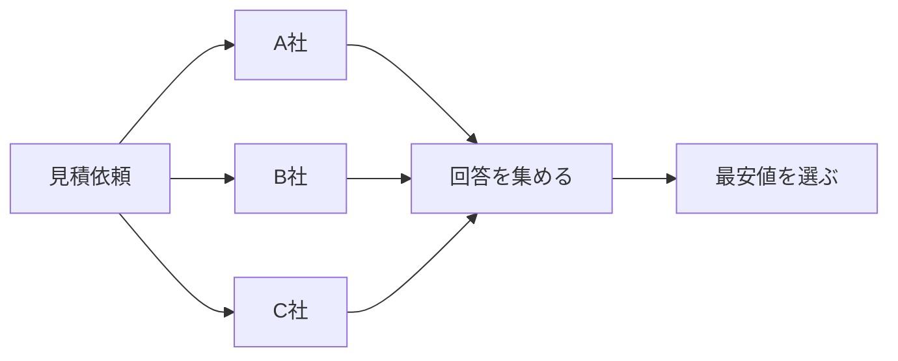
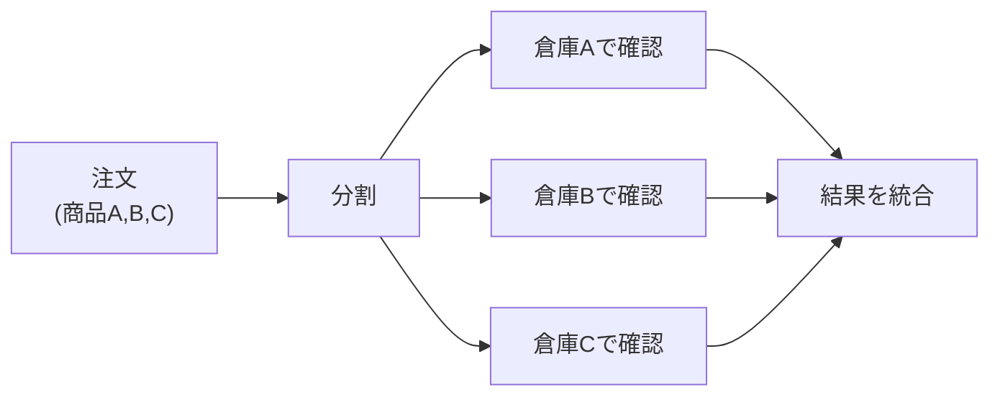
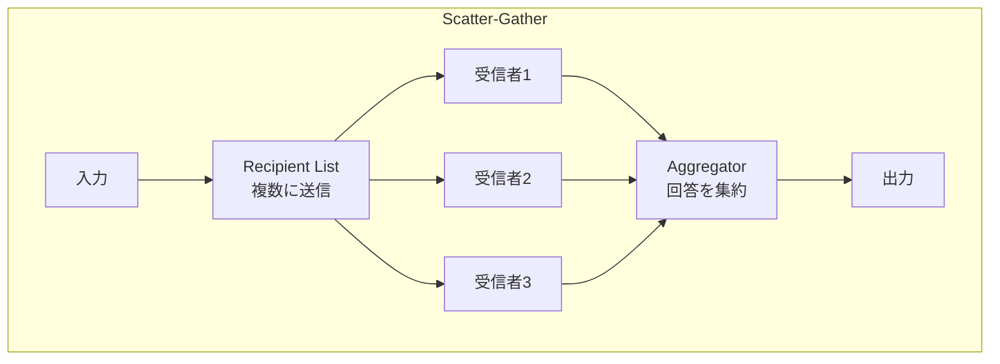
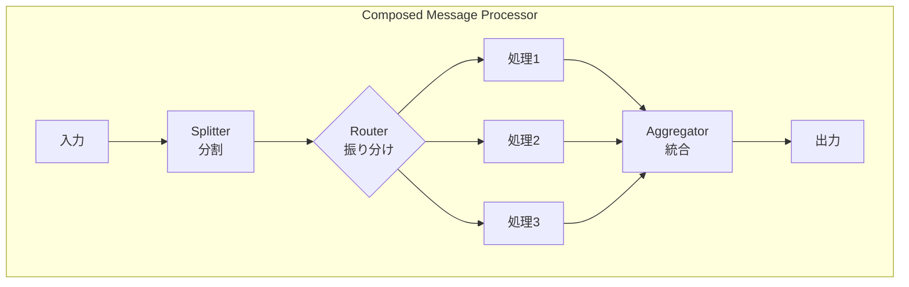
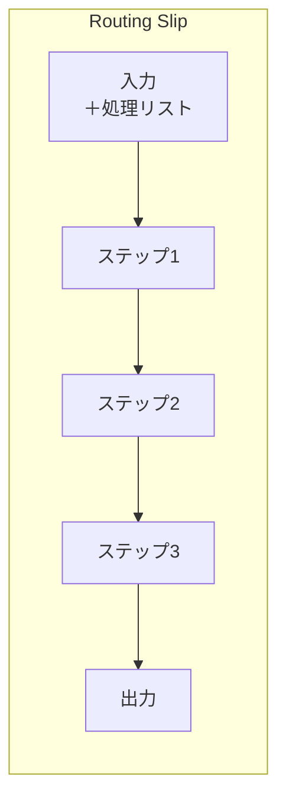
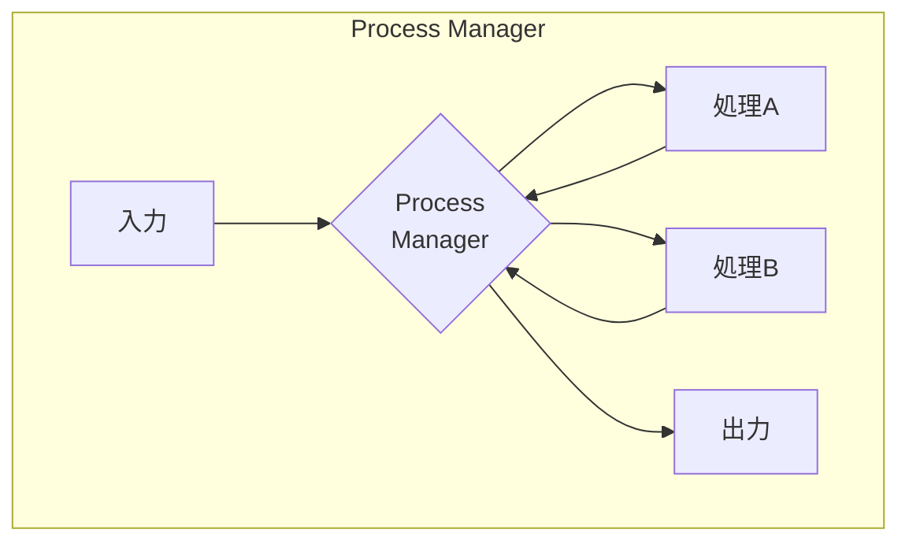
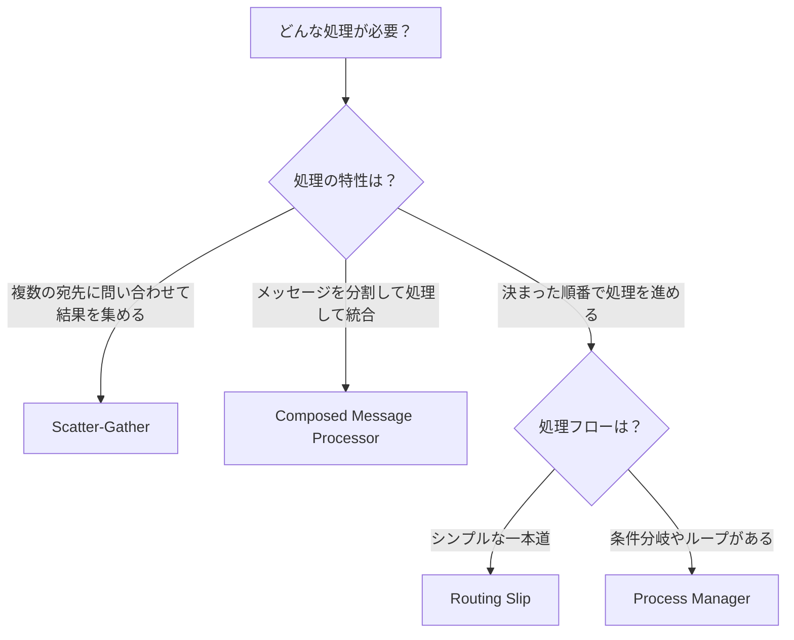
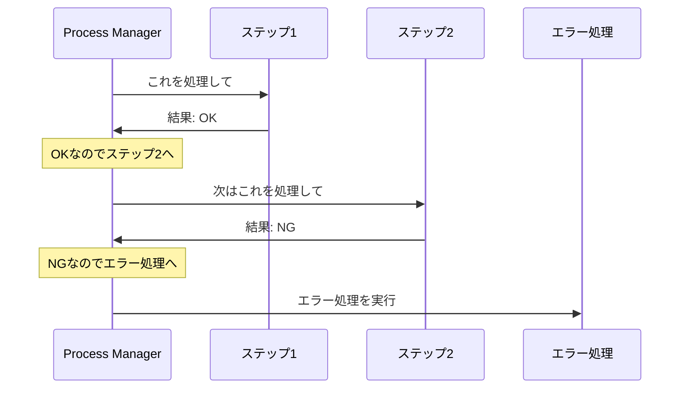

# Composed Routers

## このカテゴリについて

Composed Routersは、[[programming/reactive_messaging_pattern/simple-routers/index|Simple Routers]]を組み合わせて、より複雑なメッセージフローを実現するパターン群です。

Simple Routersが「1つのメッセージをどう扱うか」という単純な問題を解決するのに対し、Composed Routersは「複数のステップにまたがる処理をどう組み立てるか」という、より大きな問題を解決します。

## なぜComposed Routersが必要なのか

実際のビジネスでは、単純なルーティングだけでは解決できない複雑な処理が必要になります。

### 例1: 複数業者への見積依頼

旅行会社が複数の航空会社に同時に見積もりを依頼し、回答が揃ったら最安値を選びたい場合：

これには「複数に送る」（Recipient List）と「結果を集める」（Aggregator）を組み合わせる必要があります。これが[[scatter_gather|Scatter-Gather]]パターンです。

### 例2: 注文の分割処理

1つの注文に複数の商品が含まれていて、商品ごとに別々の倉庫で在庫確認が必要な場合：

これには「分割」（Splitter）、「振り分け」（Router）、「集約」（Aggregator）を組み合わせる必要があります。これが[[composed_message_processor|Composed Message Processor]]パターンです。

## パターン一覧

以下では、各Composed Routerパターンを詳しく説明します。これらのパターンは、Simple Routersを組み合わせて作られています。

### Scatter-Gather（スキャッター・ギャザー）

**何をするか：** 同じリクエストを複数のシステムに同時に送り（Scatter：散布）、返ってきた回答を収集して1つにまとめます（Gather：収集）。

**構成要素：** Recipient List（複数に送信） + Aggregator（回答を集約）

**身近な例：** 引越し業者を探すとき、複数の業者に同時に見積もりを依頼し、全ての回答が揃ったら比較して最安値を選ぶイメージ。

**使う場面：**
- 複数の業者に見積もりを依頼して、最安値を選びたいとき
- 複数のデータベースに検索クエリを投げて、結果を統合したいとき
- 複数のサービスから情報を集めて、1つのダッシュボードに表示したいとき
- 複数の外部APIに同時にリクエストを送って、応答時間を短縮したいとき

**設計上の考慮点：**
- 全ての回答を待つか、最初のN件で打ち切るか
- タイムアウトをどう設定するか
- 一部のシステムが応答しなかった場合の対処

**詳細：** [[scatter_gather|Scatter-Gather]]

---

### Composed Message Processor（コンポーズドメッセージプロセッサー）

**何をするか：** 1つのメッセージを複数の部分に分割し、各部分をそれぞれ適切なシステムで処理してから、結果を再び1つに統合します。

**構成要素：** Splitter（分割） + Router（振り分け） + Aggregator（統合）

**身近な例：** 複数の商品が入った注文を、商品ごとに分けて、電化製品は電化製品倉庫で、家具は家具倉庫で在庫確認し、全ての結果が揃ったら「在庫OK」「在庫NG」を返すイメージ。

**使う場面：**
- 複数の商品を含む注文を、商品カテゴリごとに異なるシステムで処理したいとき
- 複合的なデータ（例：請求書の明細行）を、項目ごとに検証したいとき
- 1つのリクエストに含まれる複数の処理を、並列に実行して結果を統合したいとき

**Scatter-Gatherとの違い：**
- Scatter-Gatherは「同じリクエストを複数に送る」
- Composed Message Processorは「メッセージを分割して、各部分を別々に処理する」

**詳細：** [[composed_message_processor|Composed Message Processor]]

---

### Routing Slip（ルーティングスリップ）

**何をするか：** メッセージに「次に処理すべきステップのリスト（スリップ）」を添付します。各処理ステップは、処理が終わったらリストの次のステップにメッセージを転送します。

**構成要素：** メッセージにルーティング情報を添付 + 各ステップでの転送処理

**身近な例：** 荷物に「〇〇倉庫→△△検品所→□□出荷場」という伝票を貼り付けて、各場所で処理後に次の場所に転送するイメージ。または、稟議書に「課長→部長→経理」という回覧順序を書いて、各人が承認後に次の人に回すイメージ。

**使う場面：**
- 承認フロー（課長→部長→役員）を実装したいとき
- データの段階的な変換・検証を行いたいとき
- 処理の順序がメッセージごとに異なる可能性があるとき

**特徴：**
- **分散制御**：中央のコントローラーがいない。各ステップが自律的に次のステップを決める
- **シンプル**：条件分岐やループがない、一本道のフローに適している
- **柔軟性**：メッセージごとに処理ステップを変えられる

**詳細：** [[routing_slip|Routing Slip]]

---

### Process Manager（プロセスマネージャー）

**何をするか：** 中央に「Process Manager」を配置し、複雑なワークフロー全体を統括します。各処理ステップの結果に基づいて、次に何をすべきかを動的に決定します。

**構成要素：** 中央のマネージャー + 各処理ステップへの指示・結果収集

**身近な例：** プロジェクトマネージャーが、各チームに作業を指示し、結果を見て次の作業を決め、問題があれば対処方法を判断するイメージ。

**使う場面：**
- 条件分岐が複雑なビジネスプロセス（例：信用審査で問題があれば人手確認に回す）
- 処理を並列に実行して、全ての結果を待ってから次を決めたいとき
- エラー発生時のリトライや代替処理が必要なとき
- 長期間にわたるワークフロー（数日〜数週間かかる承認プロセスなど）

**特徴：**
- **集中制御**：Process Managerがフロー全体を把握・制御する
- **複雑なフローに対応**：条件分岐、ループ、並列処理、例外処理が可能
- **状態管理**：Process Managerがワークフローの現在の状態を管理する

**Routing Slipとの違い：**
- Routing Slipは「分散制御」、Process Managerは「集中制御」
- Routing Slipは「一本道」、Process Managerは「条件分岐・ループあり」

**詳細：** [[process_manager|Process Manager]]

## パターンの構造

それぞれのパターンがどのようにSimple Routersを組み合わせているかを図で示します。

## パターンの選び方

どのパターンを使うか迷ったときは、以下のフローチャートを参考にしてください。

### 選択のポイント

**Scatter-Gather を選ぶ場合**
- 同じリクエストを複数のシステムに送って、回答を比較・統合したい
- 例：最安値の検索、複数DBの検索結果の統合

**Composed Message Processor を選ぶ場合**
- 1つのメッセージに含まれる複数の要素を、それぞれ別の方法で処理したい
- 例：複数商品の注文を商品ごとに処理、複合データの項目別検証

**Routing Slip を選ぶ場合**
- 処理ステップが決まっていて、順番に実行すればよい
- 条件分岐やループは不要
- 例：承認フロー（課長→部長→経理）、データの段階的変換

**Process Manager を選ぶ場合**
- 処理の途中で条件分岐が必要
- 処理を並列に実行したい
- ループや再試行が必要
- 例：複雑な業務プロセス、長期間にわたるワークフロー

## Routing Slip と Process Manager の違い

この2つは「ワークフローを制御する」という点で似ていますが、制御の方法が大きく異なります。

### Routing Slip（分散制御）

メッセージ自身に「次に行くべき場所のリスト」が添付されています。各処理ステップは、処理が終わったらリストの次の場所にメッセージを送ります。

**特徴：**
- シンプルで実装しやすい
- 中央のコントローラーがいないので障害点が分散する
- ただし、条件分岐やループができない

### Process Manager（集中制御）

中央にProcess Managerがいて、全ての処理を監督します。各処理ステップは、処理が終わったらProcess Managerに結果を返し、Process Managerが次に何をするか決めます。

**特徴：**
- 複雑なフローを表現できる（条件分岐、ループ、並列処理）
- 中央で状態を管理するので、フロー全体の把握がしやすい
- ただし、実装が複雑になり、Process Managerが障害点になる

| 観点 | Routing Slip | Process Manager |
|-----|-------------|-----------------|
| **制御方式** | **分散制御**：メッセージ自身に「次に行く場所のリスト」が添付されており、各処理ステップは処理後にリストを見て次の場所にメッセージを送る。中央の管理者はいない | **集中制御**：中央にProcess Managerがいて、全ての処理ステップを監督する。各ステップは処理結果をProcess Managerに報告し、Process Managerが次の指示を出す |
| **条件分岐** | **できない**：処理ステップは固定リストの順番通りに実行される。「結果がOKならA、NGならB」といった分岐はできない | **できる**：Process Managerが各ステップの結果を見て、次に何をすべきかを動的に決定できる |
| **ループ（繰り返し）** | **できない**：リストの最初に戻って再実行することはできない | **できる**：条件が満たされるまで同じステップを繰り返したり、エラー時にリトライしたりできる |
| **並列処理** | **できない**：処理は必ず順番に実行される | **できる**：複数の処理を同時に開始し、全ての結果を待ってから次に進むことができる |
| **複雑性（実装コスト）** | **低い**：シンプルな構造で、実装・理解が容易 | **高い**：状態管理やフロー制御のロジックが複雑になりやすい |
| **障害耐性** | **高い**：中央の管理者がいないので、単一障害点がない | **要注意**：Process Managerが障害点になる可能性がある。高可用性設計が必要 |
| **適用場面** | ・処理順序が決まっている単純なフロー ・承認フロー（課長→部長→役員） ・データの段階的変換 | ・条件分岐がある複雑なビジネスプロセス ・長期間のワークフロー ・エラー処理や補償トランザクションが必要な場合 |
| **具体例** | ・稟議書の回覧 ・メールの段階的フィルタリング ・画像の変換パイプライン | ・ローン審査プロセス ・注文から配送までの全体フロー ・旅行予約（航空券+ホテル+レンタカー）|

## 次に読むべき内容

1. [[scatter_gather|Scatter-Gather]] - 複数への問い合わせと結果集約
2. [[composed_message_processor|Composed Message Processor]] - 分割・処理・統合
3. [[routing_slip|Routing Slip]] - シンプルなワークフロー
4. [[process_manager|Process Manager]] - 複雑なワークフロー

## 関連するカテゴリ

- [[programming/reactive_messaging_pattern/index|Message Routing]] - 親カテゴリ
- [[programming/reactive_messaging_pattern/simple-routers/index|Simple Routers]] - Composed Routersの構成要素
- [[programming/reactive_messaging_pattern/architectural-routers/index|Architectural Routers]] - システム全体の設計パターン
