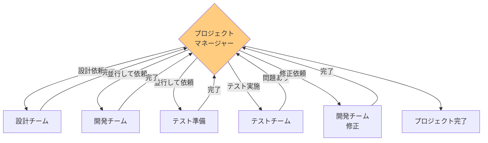
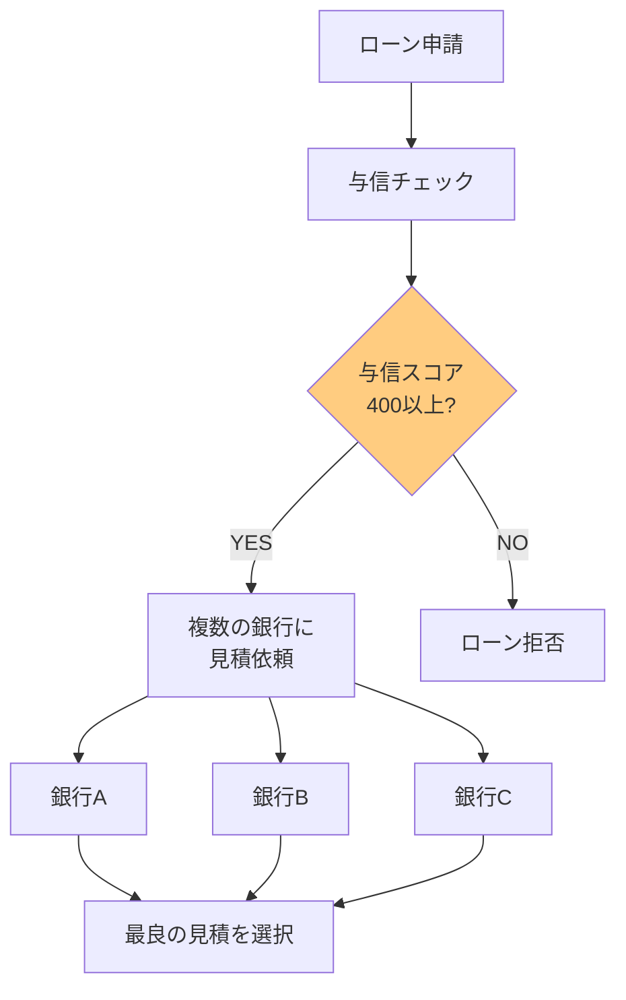
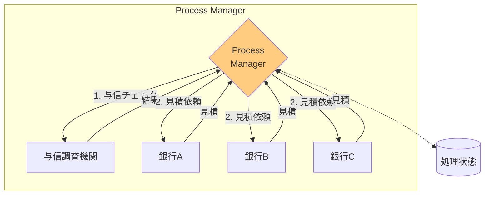
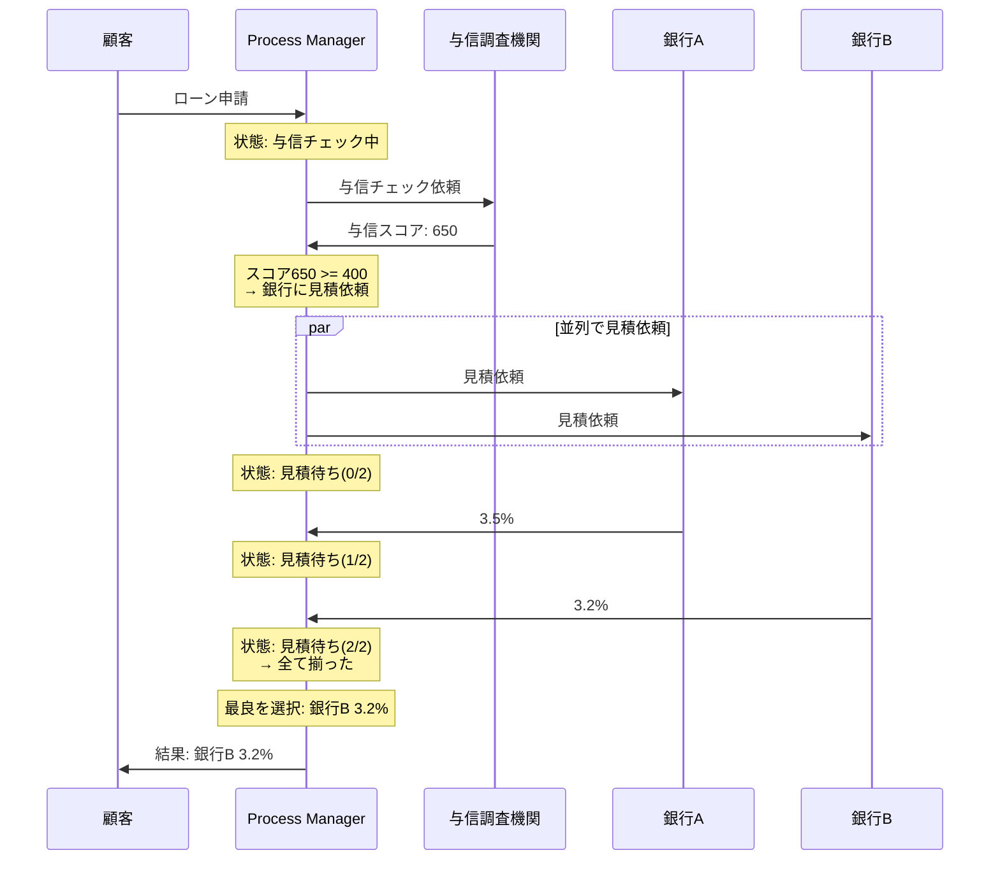

# Process Manager

## このパターンは何をするのか

Process Managerは、**複雑な処理フローを中央で管理する**パターンです。処理の状態を保持し、中間結果に基づいて「次に何をするか」を動的に決定します。条件分岐やループ、並列処理など、柔軟な制御が必要な場合に使います。

### 身近な例で考える

プロジェクトマネージャーを想像してください。

プロジェクトマネージャーは、プロジェクト全体の進捗を把握し、各メンバーにタスクを割り当てます。あるタスクが完了したら、その結果を見て「次は誰に何を頼むか」を判断します。



Process Managerも同じです。中央で処理の状態を管理し、各処理の結果に応じて「次に何をするか」を判断して、メッセージを送ります。

## なぜProcess Managerが必要なのか

### 問題の背景

実際のビジネスプロセスでは、**処理の流れが単純な一本道ではない**ことがよくあります。

銀行のローン審査を例に考えてみましょう。



この処理には以下の特徴があります。

- **条件分岐**: 与信スコアによって次のステップが変わる
- **並列処理**: 複数の銀行に同時に見積依頼する
- **集約**: 複数の見積から最良を選ぶ

### [[routing_slip|Routing Slip]]では対応できない理由

Routing Slipは「事前に決まった順番で処理する」パターンです。以下のような場合には対応できません。

**条件分岐ができない**

「与信スコアが400以上ならA、そうでなければB」という判断ができません。

**中間結果に基づく判断ができない**

各ステップの結果を見て「次に何をするか」を決めることができません。

**並列処理ができない**

複数の処理を同時に実行して、結果を待つことができません。

### Process Managerを使うと

Process Managerを使うと、複雑な処理フローを柔軟に制御できます。



## Process Managerの仕組み

### 基本的な動作

Process Managerは「ハブ・アンド・スポーク」型の構造を持ちます。全てのメッセージが中央（ハブ）を経由し、中央から各処理先（スポーク）にメッセージが送られます。

Process Managerは以下の役割を果たします。

1. **処理状態の保持**: 「今どこまで進んでいるか」「どんな結果が返ってきたか」を記録
2. **次のステップの決定**: 現在の状態と中間結果に基づいて、次に何をするかを判断
3. **メッセージのルーティング**: 次の処理先にメッセージを送信

### 処理の流れ（ローン審査の例）



### Routing Slipとの違い

| 観点 | Routing Slip | Process Manager |
|-----|-------------|-----------------|
| 制御方式 | 分散（各ステップが次を決める） | 集中（中央で全体を管理） |
| 条件分岐 | できない | できる |
| ループ | できない | できる |
| 並列処理 | できない | できる |
| 状態管理 | なし | あり |
| 適用場面 | 単純な線形フロー | 複雑なフロー |

**Routing Slipを選ぶ場合**: 処理が順番に進むだけで、分岐やループが不要な場合

**Process Managerを選ぶ場合**: 条件分岐、ループ、並列処理など、柔軟な制御が必要な場合

## Process Managerのメリットとデメリット

### メリット

**条件分岐、ループ、並列処理ができる**

「もしAならBに行く」「条件を満たすまで繰り返す」「複数の処理を同時に実行する」といった複雑な制御ができます。

**処理状態を一元管理できる**

「今どこまで進んでいるか」「どんな結果が返ってきたか」を中央で把握できるため、デバッグや監視が容易です。

**エラー処理を統一的に行える**

各処理ステップでエラーが発生しても、中央で統一的に処理できます。

### デメリット

**中央がボトルネックになる可能性**

全てのメッセージが中央を経由するため、中央の処理能力がシステム全体のボトルネックになる可能性があります。

**実装が複雑になる**

状態管理、条件分岐、並列処理の結果集約など、実装が複雑になりがちです。

**シンプルなフローには過剰**

単純な線形フローには、Routing Slipの方が適切です。

### やってはいけないこと

**全てのフローにProcess Managerを使う**

単純なフローにはRouting Slipの方がシンプルで適切です。Process Managerは複雑な制御が必要な場合にのみ使いましょう。

**状態の永続化を考慮しない**

Process Managerがクラッシュすると、保持していた処理状態が失われます。重要な処理の場合は、状態の永続化を検討しましょう。

**タイムアウトを設定しない**

応答しない処理先があると、プロセス全体が停止します。必ずタイムアウトを設定しましょう。

## 実装例

### Akka Typed Actor (Scala)

以下は、ローン審査を処理するProcess Managerの実装例です。

```scala
import akka.actor.typed.{ActorRef, Behavior}
import akka.actor.typed.scaladsl.{Behaviors, TimerScheduler}
import scala.concurrent.duration._

// ローン申請
case class LoanRequest(
  loanId: String,
  amount: Double,      // 借入額
  termMonths: Int,     // 返済期間（月）
  ssn: String          // 社会保障番号
)

// 与信スコア
case class CreditScore(ssn: String, score: Int)

// 銀行からの見積
case class LoanQuote(
  bankId: String,
  loanId: String,
  rate: Double  // 金利
)

// 最良の見積結果
case class BestLoanQuote(
  loanId: String,
  bankId: String,
  rate: Double
)

// ローン拒否
case class LoanDenied(loanId: String, reason: String)

// 処理状態
sealed trait ProcessState
case object WaitingForCredit extends ProcessState
case class WaitingForQuotes(
  creditScore: Int,
  expectedCount: Int,
  receivedQuotes: Vector[LoanQuote]
) extends ProcessState

// Process Manager（ローンブローカー）
object LoanBrokerProcessManager {
  sealed trait Command
  case class StartLoanProcess(
    request: LoanRequest,
    replyTo: ActorRef[Either[LoanDenied, BestLoanQuote]]
  ) extends Command
  private case class CreditChecked(
    loanId: String,
    score: CreditScore,
    replyTo: ActorRef[Either[LoanDenied, BestLoanQuote]]
  ) extends Command
  private case class QuoteReceived(
    quote: LoanQuote,
    replyTo: ActorRef[Either[LoanDenied, BestLoanQuote]]
  ) extends Command
  private case class ProcessTimeout(loanId: String) extends Command

  // プロセスの状態を管理
  case class ProcessContext(
    request: LoanRequest,
    state: ProcessState,
    replyTo: ActorRef[Either[LoanDenied, BestLoanQuote]]
  )

  def apply(
    creditBureau: ActorRef[CreditBureau.CheckCredit],
    banks: Seq[ActorRef[Bank.RequestQuote]]
  ): Behavior[Command] =
    Behaviors.withTimers { timers =>
      processManager(Map.empty, creditBureau, banks, timers)
    }

  private def processManager(
    processes: Map[String, ProcessContext],
    creditBureau: ActorRef[CreditBureau.CheckCredit],
    banks: Seq[ActorRef[Bank.RequestQuote]],
    timers: TimerScheduler[Command]
  ): Behavior[Command] =
    Behaviors.receive { (context, command) =>
      command match {
        // ステップ1: プロセス開始 → 与信チェック
        case StartLoanProcess(request, replyTo) =>
          context.log.info(s"ローン審査開始: ${request.loanId}")

          // タイムアウト設定
          timers.startSingleTimer(
            request.loanId,
            ProcessTimeout(request.loanId),
            10.seconds
          )

          // 与信チェックを依頼
          val creditAdapter = context.messageAdapter[CreditScore] { score =>
            CreditChecked(request.loanId, score, replyTo)
          }
          creditBureau ! CreditBureau.CheckCredit(request.ssn, creditAdapter)

          // プロセス状態を保存
          val processContext = ProcessContext(request, WaitingForCredit, replyTo)
          processManager(
            processes + (request.loanId -> processContext),
            creditBureau, banks, timers
          )

        // ステップ2: 与信チェック結果 → 条件分岐
        case CreditChecked(loanId, score, replyTo) =>
          processes.get(loanId) match {
            case Some(processContext) =>
              context.log.info(s"与信スコア: ${score.score}")

              // 【条件分岐】スコアが400以上か？
              if (score.score >= 400) {
                context.log.info("与信OK → 銀行に見積依頼")

                val quoteAdapter = context.messageAdapter[LoanQuote] { quote =>
                  QuoteReceived(quote, replyTo)
                }

                // 【並列処理】複数の銀行に同時に見積依頼
                banks.foreach { bank =>
                  bank ! Bank.RequestQuote(
                    loanId,
                    processContext.request.amount,
                    processContext.request.termMonths,
                    score.score,
                    quoteAdapter
                  )
                }

                // 状態を更新
                val newState = WaitingForQuotes(score.score, banks.size, Vector.empty)
                val newContext = processContext.copy(state = newState)
                processManager(
                  processes + (loanId -> newContext),
                  creditBureau, banks, timers
                )
              } else {
                // 与信NG → ローン拒否
                context.log.warn(s"与信NG: スコア ${score.score} < 400")
                timers.cancel(loanId)
                replyTo ! Left(LoanDenied(loanId, s"与信スコア ${score.score} が基準以下"))
                processManager(processes - loanId, creditBureau, banks, timers)
              }

            case None =>
              context.log.warn(s"不明なプロセス: $loanId")
              Behaviors.same
          }

        // ステップ3: 銀行からの見積を収集
        case QuoteReceived(quote, replyTo) =>
          processes.get(quote.loanId) match {
            case Some(processContext) =>
              processContext.state match {
                case WaitingForQuotes(creditScore, expected, received) =>
                  val newQuotes = received :+ quote
                  context.log.info(
                    s"見積受信: ${quote.bankId} ${quote.rate}% " +
                    s"(${newQuotes.size}/$expected)"
                  )

                  // 全ての見積が揃ったか？
                  if (newQuotes.size >= expected) {
                    timers.cancel(quote.loanId)
                    // 最良の見積を選択
                    val bestQuote = newQuotes.minBy(_.rate)
                    context.log.info(
                      s"最良見積: ${bestQuote.bankId} ${bestQuote.rate}%"
                    )
                    replyTo ! Right(BestLoanQuote(
                      quote.loanId, bestQuote.bankId, bestQuote.rate
                    ))
                    processManager(processes - quote.loanId, creditBureau, banks, timers)
                  } else {
                    // まだ待機
                    val newState = WaitingForQuotes(creditScore, expected, newQuotes)
                    val newContext = processContext.copy(state = newState)
                    processManager(
                      processes + (quote.loanId -> newContext),
                      creditBureau, banks, timers
                    )
                  }

                case _ =>
                  context.log.warn(s"予期しない状態: ${quote.loanId}")
                  Behaviors.same
              }

            case None =>
              context.log.warn(s"不明なプロセス: ${quote.loanId}")
              Behaviors.same
          }

        // タイムアウト処理
        case ProcessTimeout(loanId) =>
          processes.get(loanId).foreach { processContext =>
            context.log.warn(s"タイムアウト: $loanId")
            processContext.state match {
              case WaitingForQuotes(_, _, received) if received.nonEmpty =>
                // 受信済みの見積から最良を選択
                val bestQuote = received.minBy(_.rate)
                processContext.replyTo ! Right(BestLoanQuote(
                  loanId, bestQuote.bankId, bestQuote.rate
                ))
              case _ =>
                processContext.replyTo ! Left(LoanDenied(loanId, "タイムアウト"))
            }
          }
          processManager(processes - loanId, creditBureau, banks, timers)
      }
    }
}

// 与信調査機関
object CreditBureau {
  case class CheckCredit(ssn: String, replyTo: ActorRef[CreditScore])

  def apply(): Behavior[CheckCredit] =
    Behaviors.receive { (context, msg) =>
      context.log.info(s"与信チェック: ${msg.ssn}")
      // 実際はDBや外部API呼び出し
      val score = 650
      msg.replyTo ! CreditScore(msg.ssn, score)
      Behaviors.same
    }
}

// 銀行
object Bank {
  case class RequestQuote(
    loanId: String,
    amount: Double,
    termMonths: Int,
    creditScore: Int,
    replyTo: ActorRef[LoanQuote]
  )

  def apply(bankId: String, baseRate: Double): Behavior[RequestQuote] =
    Behaviors.receive { (context, msg) =>
      // 与信スコアに基づいて金利を計算
      val rate = baseRate + (800 - msg.creditScore) * 0.01
      context.log.info(s"$bankId: 金利 $rate%")
      msg.replyTo ! LoanQuote(bankId, msg.loanId, rate)
      Behaviors.same
    }
}

// 使用例
object ProcessManagerExample {
  def setup(): Behavior[Nothing] =
    Behaviors.setup[Nothing] { context =>
      // 与信調査機関を作成
      val creditBureau = context.spawn(CreditBureau(), "creditBureau")

      // 銀行を作成
      val banks = Seq(
        context.spawn(Bank("みずほ銀行", 3.0), "bank1"),
        context.spawn(Bank("三井住友銀行", 2.8), "bank2"),
        context.spawn(Bank("三菱UFJ銀行", 3.2), "bank3")
      )

      // Process Managerを作成
      val loanBroker = context.spawn(
        LoanBrokerProcessManager(creditBureau, banks),
        "loanBroker"
      )

      // 結果を受け取る
      val resultHandler = context.spawn(
        Behaviors.receiveMessage[Either[LoanDenied, BestLoanQuote]] {
          case Right(quote) =>
            println(s"=== ローン審査結果 ===")
            println(s"最良の金利: ${quote.bankId} ${quote.rate}%")
            Behaviors.same
          case Left(denied) =>
            println(s"=== ローン審査結果 ===")
            println(s"拒否: ${denied.reason}")
            Behaviors.same
        },
        "resultHandler"
      )

      // ローン申請を送信
      loanBroker ! LoanBrokerProcessManager.StartLoanProcess(
        LoanRequest("LOAN-001", 10000000, 360, "123-45-6789"),
        resultHandler
      )

      // 結果（与信スコア650の場合）:
      // 与信OK → 銀行に見積依頼
      // みずほ銀行: 金利 4.5%
      // 三井住友銀行: 金利 4.3%
      // 三菱UFJ銀行: 金利 4.7%
      // === ローン審査結果 ===
      // 最良の金利: 三井住友銀行 4.3%

      Behaviors.empty
    }
}
```

### コードのポイント

**処理状態の管理**

`ProcessState` で処理の状態を表現し、`ProcessContext` で各プロセスの状態を管理しています。

**条件分岐**

`if (score.score >= 400)` で、与信スコアに基づいて次のステップを分岐しています。

**並列処理と集約**

`banks.foreach` で複数の銀行に同時に見積依頼し、`WaitingForQuotes` で結果を集約しています。

**タイムアウト処理**

`ProcessTimeout` で、一定時間内に全ての見積が届かなかった場合でも、受信済みの見積で結果を返しています。

## 関連するパターン

| パターン | 関係 |
|---------|------|
| [[routing_slip\|Routing Slip]] | シンプルな線形フローの場合はこちらを使う |
| [[aggregator\|Aggregator]] | 並列処理の結果を集約するのに使用 |
| [[scatter_gather\|Scatter-Gather]] | 並列で見積依頼する部分で使用 |
| [[message_broker\|Message Broker]] | 類似パターン（集中制御のアーキテクチャ） |

## 次に読むべき内容

- [[routing_slip|Routing Slip]] - シンプルな線形フローの場合
- [[message_broker|Message Broker]] - アーキテクチャレベルの集中制御

## 参考資料

- [Enterprise Integration Patterns - Process Manager](https://www.enterpriseintegrationpatterns.com/patterns/messaging/ProcessManager.html)
