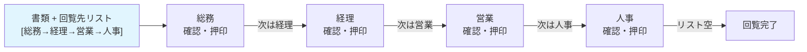
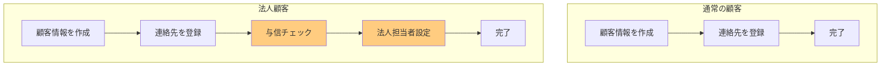
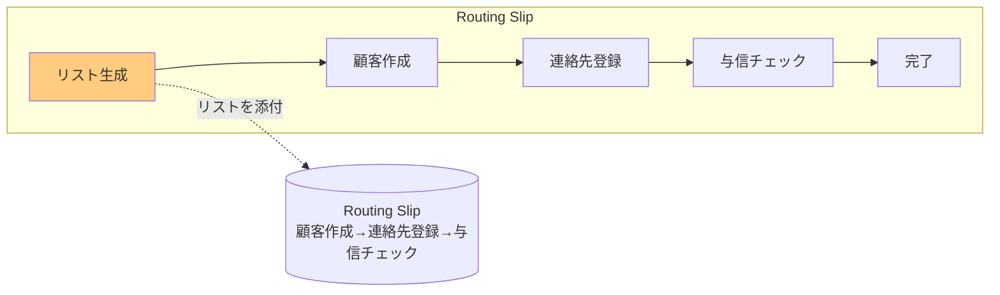
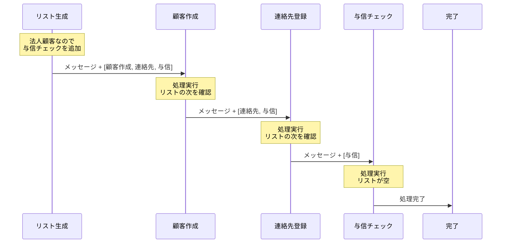
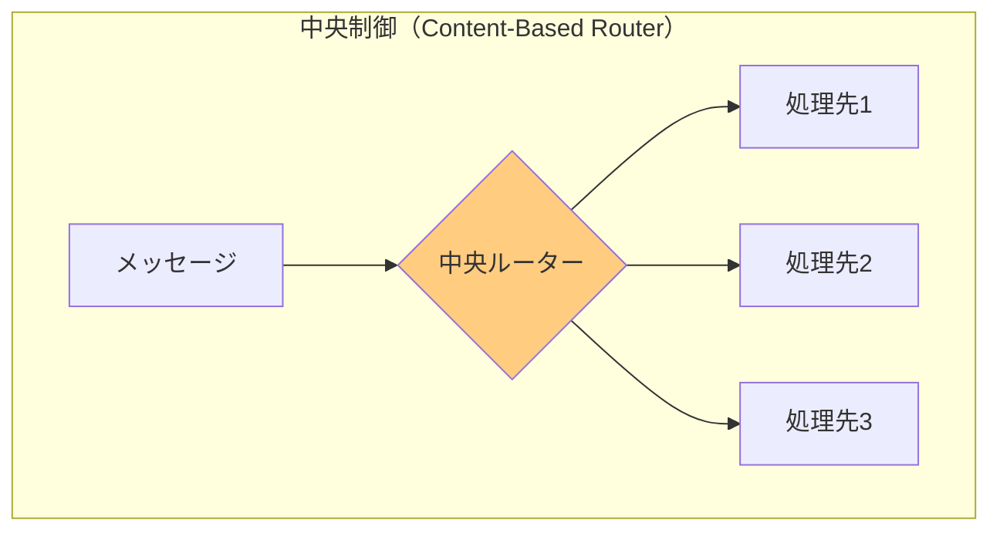
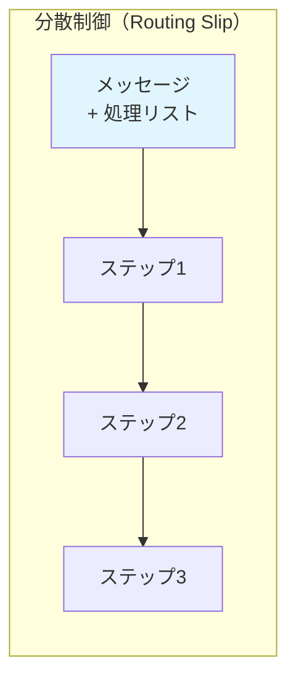

# Routing Slip

## このパターンは何をするのか

Routing Slipは、**メッセージに「次に行く場所のリスト」を添付して、順番に処理していく**パターンです。日本語で言う「回覧板」のような仕組みです。

### 身近な例で考える

会社の回覧板を想像してください。

重要な書類が届いたとき、「総務→経理→営業→人事」の順番で回覧する必要があるとします。書類に「回覧先リスト」を添付しておくと、各部署は自分の処理が終わったら、リストを見て次の部署に書類を渡します。



Routing Slipも同じです。メッセージに「処理ステップのリスト」を添付して送ります。各処理ステップは自分の処理が終わったら、リストを見て次のステップにメッセージを渡します。

## なぜRouting Slipが必要なのか

### 問題の背景

メッセージングシステムでは、**メッセージの処理手順が事前に決まっていないことがあります**。処理手順がメッセージの内容によって変わる場合、固定的なルーティングでは対応できません。

例えば、顧客登録の処理を考えてみましょう。



顧客の種類によって、処理ステップが異なります。

### Routing Slipがない場合の問題

**問題1: 処理ステップがハードコードされる**

[[content_based_router|Content-Based Router]]で固定のルートを設定すると、新しい処理パターンを追加するたびにルーターを変更する必要があります。

**問題2: 中央のルーターがボトルネックになる**

全てのルーティング判断を1つの中央ルーターで行うと、そのルーターがシステム全体のボトルネックになります。

**問題3: 処理パターンの追加が難しい**

新しい顧客タイプ（VIP顧客、海外顧客など）を追加するたびに、ルーティングロジックを変更する必要があります。

### Routing Slipを使うと

Routing Slipを使うと、メッセージ自身が「どこを経由するか」を持っているので、中央のルーターは不要になります。



## Routing Slipの仕組み

### 基本的な動作

Routing Slipは以下のように動作します。

1. **リスト生成**: メッセージの内容に基づいて、処理ステップのリストを生成し、メッセージに添付する
2. **各ステップの処理**: 各ステップは自分の処理を実行し、リストの次のステップにメッセージを転送する
3. **完了**: リストが空になったら、処理完了

### 処理の流れ



### 分散制御の特徴

Routing Slipの重要な特徴は、**中央のルーターが不要**という点です。

各処理ステップは「次にどこに送るか」をメッセージ自身から読み取ります。そのため、中央で全てのルーティングを管理する必要がありません。





## Routing Slipのメリットとデメリット

### メリット

**処理経路を動的に決められる**

メッセージの内容に応じて、処理ステップのリストを動的に生成できます。新しい処理パターンを追加しても、リスト生成ロジックを変更するだけで済みます。

**中央のルーターが不要**

各処理ステップが自律的に次のステップを決めるため、中央のボトルネックがありません。

**処理ステップの追加・削除が容易**

新しいステップを追加しても、そのステップを受け取るためのルーティング変更は不要です。リスト生成時にそのステップを含めるかどうかを決めるだけです。

### デメリット

**条件分岐ができない**

Routing Slipは「リストの順番通りに処理する」だけなので、「もしAならBに行く、そうでなければCに行く」といった条件分岐はできません。

**ループができない**

「条件を満たすまで繰り返す」といったループ処理もできません。

**エラー回復が難しい**

途中のステップで失敗した場合、「どこまで進んだか」「どこからやり直すか」を判断するのが難しくなります。

### Process Managerとの違い

Routing Slipより柔軟な制御が必要な場合は、[[process_manager|Process Manager]]を使います。

| 観点 | Routing Slip | Process Manager |
|-----|-------------|-----------------|
| 処理の流れ | 線形（順番に進む） | 非線形（分岐・ループ可能） |
| 条件分岐 | できない | できる |
| ループ | できない | できる |
| 制御方式 | 分散（各ステップが次を決める） | 集中（中央で全体を管理） |
| 複雑性 | シンプル | 複雑 |

**Routing Slipを選ぶ場合**: 処理が順番に進むだけで、分岐やループが不要な場合

**Process Managerを選ぶ場合**: 「承認されたら次へ、却下されたらやり直し」のような条件分岐が必要な場合

### やってはいけないこと

**条件分岐が必要なのにRouting Slipを使う**

「もしAならBに行く」といった処理が必要な場合は、Process Managerを使いましょう。

**エラー処理を考慮しない**

途中のステップで失敗した場合にどうするか（中止する、やり直す、スキップする）を決めておく必要があります。

**リスト生成ロジックを複雑にしすぎる**

リスト生成が複雑になりすぎたら、Process Managerを検討しましょう。

## 実装例

### Akka Typed Actor (Scala)

以下は、顧客登録を処理するRouting Slipの実装例です。

```scala
import akka.actor.typed.{ActorRef, Behavior}
import akka.actor.typed.scaladsl.Behaviors

// 顧客登録情報
case class CustomerRegistration(
  customerId: String,
  name: String,
  email: String,
  customerType: String  // "individual" または "corporate"
)

// 処理状態（各ステップで更新される）
case class ProcessingState(
  registration: CustomerRegistration,
  customerCreated: Boolean = false,
  contactSetup: Boolean = false,
  creditChecked: Boolean = false
)

// Routing Slip付きメッセージ
case class RoutingSlipMessage(
  payload: ProcessingState,
  routingSlip: List[ActorRef[RoutingSlipMessage]],  // 残りのステップ
  completionHandler: ActorRef[ProcessingState]      // 完了時の通知先
)

// Routing Slip生成器
object RoutingSlipGenerator {
  sealed trait Command
  case class RegisterCustomer(
    registration: CustomerRegistration,
    replyTo: ActorRef[ProcessingState]
  ) extends Command

  def apply(
    createCustomerStep: ActorRef[RoutingSlipMessage],
    setupContactStep: ActorRef[RoutingSlipMessage],
    checkCreditStep: ActorRef[RoutingSlipMessage]
  ): Behavior[Command] =
    Behaviors.receive { (context, command) =>
      command match {
        case RegisterCustomer(registration, replyTo) =>
          context.log.info(s"顧客 ${registration.customerId} のRouting Slipを生成")

          // 顧客タイプに応じて処理ステップを決定
          val routingSlip = registration.customerType match {
            case "corporate" =>
              // 法人顧客: 与信チェックを追加
              List(createCustomerStep, setupContactStep, checkCreditStep)
            case _ =>
              // 個人顧客: 基本ステップのみ
              List(createCustomerStep, setupContactStep)
          }

          context.log.info(s"処理ステップ: ${routingSlip.size} 件")

          val initialState = ProcessingState(registration)
          val message = RoutingSlipMessage(
            payload = initialState,
            routingSlip = routingSlip.tail,  // 最初のステップを除く
            completionHandler = replyTo
          )

          // 最初のステップに送信
          routingSlip.head ! message

          Behaviors.same
      }
    }
}

// 処理ステップの共通実装
object ProcessStep {
  def apply(
    name: String,
    process: ProcessingState => ProcessingState
  ): Behavior[RoutingSlipMessage] =
    Behaviors.receive { (context, message) =>
      context.log.info(s"$name: 処理開始")

      // 1. 自分の処理を実行
      val processedPayload = process(message.payload)

      // 2. 次のステップを確認
      message.routingSlip match {
        case nextStep :: remainingSlip =>
          // 次のステップへ転送
          context.log.info(s"$name: 次のステップへ転送")
          nextStep ! RoutingSlipMessage(
            payload = processedPayload,
            routingSlip = remainingSlip,
            completionHandler = message.completionHandler
          )

        case Nil =>
          // リストが空 → 処理完了
          context.log.info(s"$name: 最終ステップ完了")
          message.completionHandler ! processedPayload
      }

      Behaviors.same
    }
}

// 顧客作成ステップ
object CreateCustomerStep {
  def apply(): Behavior[RoutingSlipMessage] =
    ProcessStep("顧客作成", state => {
      println(s"  → 顧客を作成: ${state.registration.name}")
      state.copy(customerCreated = true)
    })
}

// 連絡先登録ステップ
object SetupContactStep {
  def apply(): Behavior[RoutingSlipMessage] =
    ProcessStep("連絡先登録", state => {
      println(s"  → 連絡先を登録: ${state.registration.email}")
      state.copy(contactSetup = true)
    })
}

// 与信チェックステップ（法人顧客のみ）
object CheckCreditStep {
  def apply(): Behavior[RoutingSlipMessage] =
    ProcessStep("与信チェック", state => {
      println(s"  → 与信をチェック: ${state.registration.customerId}")
      state.copy(creditChecked = true)
    })
}

// 使用例
object RoutingSlipExample {
  def setup(): Behavior[Nothing] =
    Behaviors.setup[Nothing] { context =>
      // 各処理ステップを作成
      val createCustomer = context.spawn(CreateCustomerStep(), "createCustomer")
      val setupContact = context.spawn(SetupContactStep(), "setupContact")
      val checkCredit = context.spawn(CheckCreditStep(), "checkCredit")

      // Routing Slip生成器を作成
      val generator = context.spawn(
        RoutingSlipGenerator(createCustomer, setupContact, checkCredit),
        "generator"
      )

      // 完了通知を受け取る
      val completionHandler = context.spawn(
        Behaviors.receiveMessage[ProcessingState] { state =>
          println(s"=== 登録完了: ${state.registration.customerId} ===")
          println(s"  顧客作成: ${state.customerCreated}")
          println(s"  連絡先登録: ${state.contactSetup}")
          println(s"  与信チェック: ${state.creditChecked}")
          Behaviors.same
        },
        "completionHandler"
      )

      // 個人顧客を登録（与信チェックなし）
      generator ! RoutingSlipGenerator.RegisterCustomer(
        CustomerRegistration("CUST-001", "田中太郎", "tanaka@example.com", "individual"),
        completionHandler
      )
      // 出力:
      // 処理ステップ: 2 件
      // → 顧客を作成: 田中太郎
      // → 連絡先を登録: tanaka@example.com
      // === 登録完了: CUST-001 ===
      //   与信チェック: false

      // 法人顧客を登録（与信チェックあり）
      generator ! RoutingSlipGenerator.RegisterCustomer(
        CustomerRegistration("CUST-002", "株式会社ABC", "contact@abc.co.jp", "corporate"),
        completionHandler
      )
      // 出力:
      // 処理ステップ: 3 件
      // → 顧客を作成: 株式会社ABC
      // → 連絡先を登録: contact@abc.co.jp
      // → 与信をチェック: CUST-002
      // === 登録完了: CUST-002 ===
      //   与信チェック: true

      Behaviors.empty
    }
}
```

### コードのポイント

**Routing Slipの動的生成**

`RoutingSlipGenerator` で、顧客タイプに応じて処理ステップのリストを生成しています。個人顧客は2ステップ、法人顧客は3ステップになります。

**各ステップの自律的な転送**

`ProcessStep` で、各ステップは自分の処理を実行した後、`routingSlip` を見て次のステップに転送しています。リストが空になったら、`completionHandler` に完了を通知します。

**処理状態の引き継ぎ**

`ProcessingState` を使って、各ステップの処理結果を引き継いでいます。最終的に、全てのフラグが設定された状態が完了通知として返されます。

## 関連するパターン

| パターン | 関係 |
|---------|------|
| [[process_manager\|Process Manager]] | より柔軟な制御が必要な場合（条件分岐、ループ） |
| [[pipes_and_filters\|Pipes and Filters]] | 基盤となるアーキテクチャスタイル |
| [[content_based_router\|Content-Based Router]] | 静的なルーティング（Routing Slipは動的） |

## 次に読むべき内容

- [[process_manager|Process Manager]] - 条件分岐やループが必要な場合
- [[pipes_and_filters|Pipes and Filters]] - フィルタチェーンの基本概念

## 参考資料

- [Enterprise Integration Patterns - Routing Slip](https://www.enterpriseintegrationpatterns.com/patterns/messaging/RoutingTable.html)
