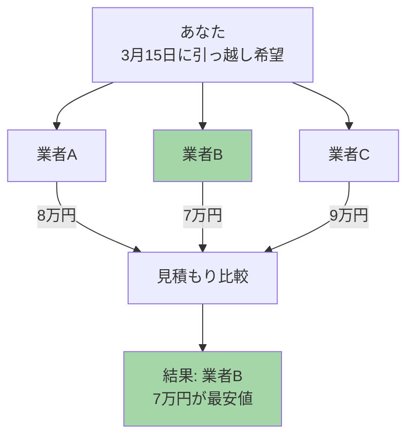
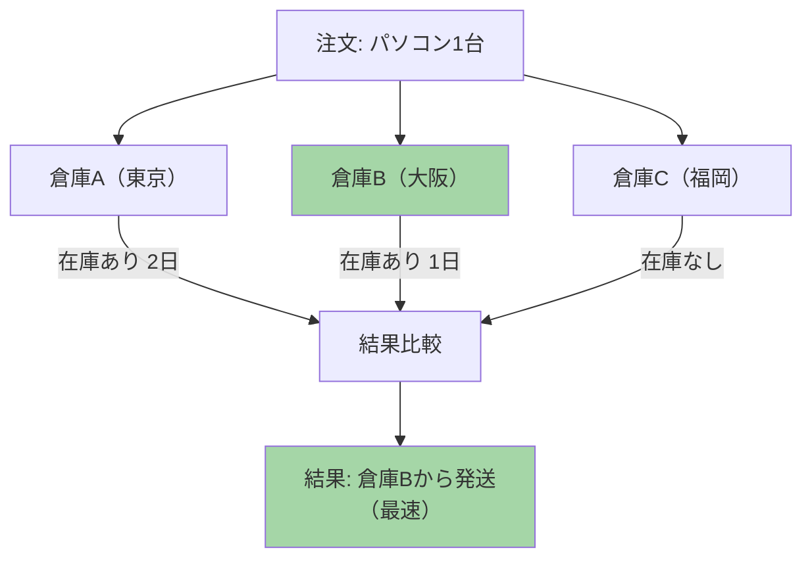
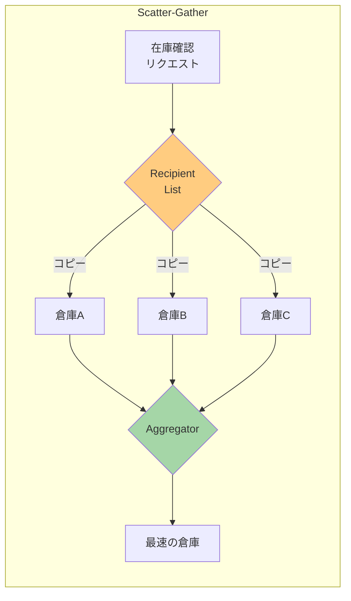
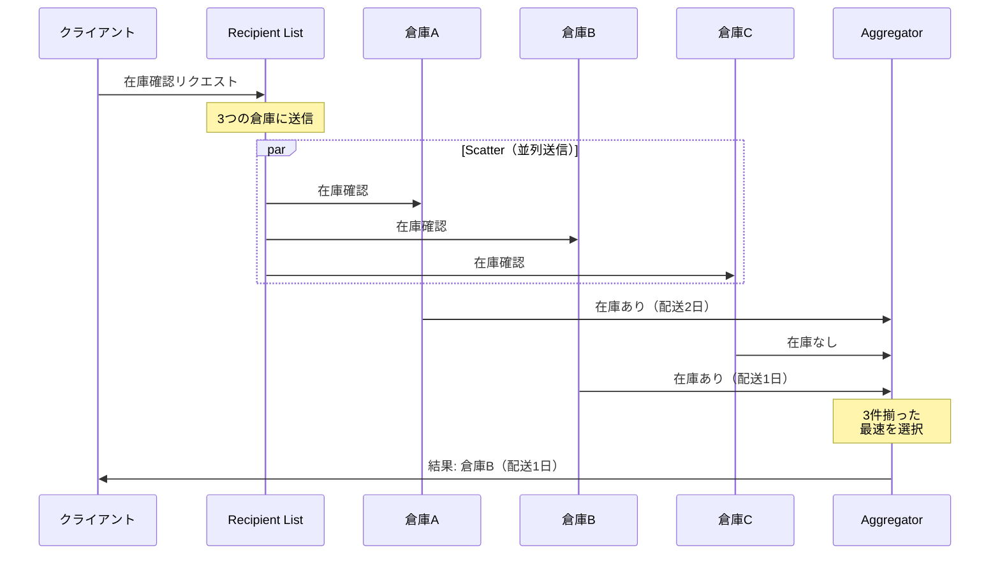

# Scatter-Gather

## このパターンは何をするのか

Scatter-Gatherは、**複数の相手に同じリクエストを送り、返ってきた応答を集めて最良の結果を選ぶ**パターンです。「問い合わせを散らばらせて（Scatter）、結果を集める（Gather）」という意味です。

### 身近な例で考える

引っ越し業者の「相見積もり」を想像してください。

引っ越しするとき、1社だけに見積もりを頼むのではなく、複数の業者に同時に見積もりを依頼しますよね。各業者から見積もりが届いたら、それらを比較して最も安い（または最も条件の良い）業者を選びます。



Scatter-Gatherも同じです。[[recipient_list|Recipient List]]で複数の受信者にメッセージを送り、[[aggregator|Aggregator]]で応答を集めて、最良の結果を選びます。

## なぜScatter-Gatherが必要なのか

### 問題の背景

ビジネスでは、**複数のソースから情報を集めて、最適な選択をしたい**場面がよくあります。

例えば、ECサイトで商品を注文するとき、複数の倉庫に在庫確認をして、最も早く届けられる倉庫から発送したいとします。



### Scatter-Gatherがない場合の問題

**問題1: 1つずつ問い合わせると時間がかかる**

倉庫Aに問い合わせ→応答を待つ→倉庫Bに問い合わせ→応答を待つ...と順番にやると、全体の処理時間が長くなります。

**問題2: 応答の収集と比較が複雑になる**

複数の問い合わせを並列で行うと、「全ての応答が揃ったか」「どれが最良か」を判断するロジックが複雑になります。

**問題3: 応答しない相手への対処が必要**

倉庫Cがシステム障害で応答しない場合、永遠に待ち続けるわけにはいきません。タイムアウト処理が必要です。

### Scatter-Gatherを使うと

Scatter-Gatherを使うと、複数への問い合わせと応答の収集を1つのパターンとして扱えます。



## Scatter-Gatherの仕組み

### 基本的な動作

Scatter-Gatherは2つのフェーズで動作します。

**フェーズ1: Scatter（分散）**

[[recipient_list|Recipient List]]を使って、同じリクエストを複数の受信者に送信します。

**フェーズ2: Gather（収集）**

[[aggregator|Aggregator]]を使って、受信者からの応答を収集し、最良の結果を選択します。

### 処理の流れ



### 2つの実装方式

Scatter-Gatherには2つの実装方式があります。

| 方式 | 仕組み | 使う場面 |
|-----|-------|---------|
| **Distribution方式** | Recipient Listで受信者を指定して送信 | 送信側が受信者を把握している場合 |
| **Auction方式** | Publish-Subscribe Channelで配信し、参加したい受信者だけが応答 | 受信者を事前に特定できない場合 |

**Distribution方式** は、「この3社に見積もりを依頼する」と送信側が決めるパターンです。

**Auction方式** は、「見積もりを出したい業者は応答してください」と公開して、参加したい業者だけが応答するパターンです。オークションに似ているので、この名前が付いています。

## Scatter-Gatherのメリットとデメリット

### メリット

**複数ソースから最適解を選べる**

複数の見積もりを比較することで、最も条件の良い選択ができます。

**並列処理で高速化**

複数の問い合わせを同時に行うので、1つずつ順番に行うより速くなります。

**柔軟な完了条件**

「全員の応答を待つ」「最初に条件を満たした応答で完了」「タイムアウト後に受信済みで判断」など、状況に応じた完了条件を設定できます。

### デメリット

**最も遅い応答に依存する**

全員の応答を待つ場合、最も遅い受信者の応答時間がボトルネックになります。

**応答しない受信者への対処が必要**

受信者の1つがダウンしている場合、永遠に待ち続けないようタイムアウト処理が必要です。

**リソース消費が増える**

複数のリクエストと応答を処理するため、1つの受信者に送る場合より多くのリソースを消費します。

### 完了条件の種類

Aggregatorがいつ「応答を集め終わった」と判断するかの戦略です。

| 戦略 | 説明 | 使う場面 |
|-----|------|---------|
| **Wait for All** | 全ての応答が届くまで待つ | 全ての情報が必要な場合 |
| **First Best** | 条件を満たす最初の応答で完了 | 「在庫あり」が1つ見つかれば十分な場合 |
| **Timeout** | 指定時間経過後に受信済みで判断 | 応答しない受信者がいても進めたい場合 |
| **Minimum** | 最低N件の応答で完了 | 「3社中2社の見積もりがあれば十分」な場合 |

### やってはいけないこと

**タイムアウトを設定しない**

応答しない受信者がいると、永遠に待ち続けることになります。必ずタイムアウトを設定しましょう。

**応答が来ない受信者を考慮しない**

タイムアウト時に「受信済みの応答だけで判断する」か「エラーとして扱う」かを決めておく必要があります。

**不要な受信者にも送信する**

関係のない受信者にまでリクエストを送ると、無駄なリソースを消費します。Recipient Listで適切にフィルタリングしましょう。

## 実装例

### Akka Typed Actor (Scala)

以下は、複数の見積エンジンに見積もりを依頼し、最安値を選択するScatter-Gatherの実装例です。

```scala
import akka.actor.typed.{ActorRef, Behavior}
import akka.actor.typed.scaladsl.{Behaviors, TimerScheduler}
import scala.concurrent.duration._

// 見積依頼
case class RequestForQuotation(
  rfqId: String,
  items: Seq[Item]
) {
  val totalPrice: Double = items.map(_.price).sum
}

case class Item(itemId: String, price: Double)

// 見積回答
case class PriceQuote(
  quoterId: String,      // どの業者からの見積か
  rfqId: String,         // どの依頼に対する見積か
  itemId: String,        // どの商品の見積か
  retailPrice: Double,   // 定価
  discountPrice: Double  // 値引き後の価格
)

// 最良の見積結果
case class BestPriceQuotation(
  rfqId: String,
  bestQuotes: Seq[PriceQuote]
)

// Scatter-Gatherの実装
object ScatterGather {
  sealed trait Command
  case class RequestQuotes(
    rfq: RequestForQuotation,
    replyTo: ActorRef[BestPriceQuotation]
  ) extends Command
  private case class QuoteReceived(quote: PriceQuote) extends Command
  private case class GatherTimeout(rfqId: String) extends Command

  // 収集中の状態を管理
  case class GatherState(
    rfq: RequestForQuotation,
    expectedQuotes: Int,                   // 期待する見積数
    receivedQuotes: Vector[PriceQuote],    // 受信済みの見積
    replyTo: ActorRef[BestPriceQuotation]  // 結果の送信先
  )

  def apply(
    quoteEngines: Seq[ActorRef[QuoteRequest]],
    timeout: FiniteDuration = 5.seconds
  ): Behavior[Command] =
    Behaviors.withTimers { timers =>
      scatterGather(Map.empty, quoteEngines, timers, timeout)
    }

  private def scatterGather(
    activeGathers: Map[String, GatherState],
    engines: Seq[ActorRef[QuoteRequest]],
    timers: TimerScheduler[Command],
    timeout: FiniteDuration
  ): Behavior[Command] =
    Behaviors.receive { (context, command) =>
      command match {
        // Scatter: 複数の見積エンジンにリクエストを配信
        case RequestQuotes(rfq, replyTo) =>
          context.log.info(
            s"見積依頼 ${rfq.rfqId} を ${engines.size} 社に送信"
          )

          // タイムアウトを設定
          timers.startSingleTimer(
            rfq.rfqId,
            GatherTimeout(rfq.rfqId),
            timeout
          )

          // 応答を受け取るためのアダプター
          val quoteAdapter = context.messageAdapter[PriceQuote](QuoteReceived)

          // 期待する見積数 = 業者数 × 商品数
          val expectedQuotes = engines.size * rfq.items.size
          val state = GatherState(rfq, expectedQuotes, Vector.empty, replyTo)

          // 全ての見積エンジンに送信（Scatter）
          engines.foreach { engine =>
            rfq.items.foreach { item =>
              engine ! QuoteRequest(
                rfq.rfqId,
                item.itemId,
                item.price,
                rfq.totalPrice,
                quoteAdapter
              )
            }
          }

          scatterGather(
            activeGathers + (rfq.rfqId -> state),
            engines, timers, timeout
          )

        // Gather: 応答を収集
        case QuoteReceived(quote) =>
          activeGathers.get(quote.rfqId) match {
            case Some(state) =>
              val newQuotes = state.receivedQuotes :+ quote
              context.log.info(
                s"見積収集: ${newQuotes.size}/${state.expectedQuotes} " +
                s"(${quote.quoterId} から ${quote.itemId})"
              )

              // 全て揃ったら最良価格を選択して返す
              if (newQuotes.size >= state.expectedQuotes) {
                timers.cancel(quote.rfqId)
                val bestQuotes = selectBestQuotes(newQuotes)
                context.log.info(s"見積収集完了: ${quote.rfqId}")
                state.replyTo ! BestPriceQuotation(quote.rfqId, bestQuotes)
                scatterGather(activeGathers - quote.rfqId, engines, timers, timeout)
              } else {
                val newState = state.copy(receivedQuotes = newQuotes)
                scatterGather(
                  activeGathers + (quote.rfqId -> newState),
                  engines, timers, timeout
                )
              }

            case None =>
              context.log.warn(s"不明な見積依頼: ${quote.rfqId}")
              Behaviors.same
          }

        // タイムアウト: 受信済みの見積で最良を選択
        case GatherTimeout(rfqId) =>
          activeGathers.get(rfqId).foreach { state =>
            context.log.warn(
              s"タイムアウト: ${rfqId} " +
              s"(${state.receivedQuotes.size}/${state.expectedQuotes} 件受信)"
            )
            val bestQuotes = selectBestQuotes(state.receivedQuotes)
            state.replyTo ! BestPriceQuotation(rfqId, bestQuotes)
          }
          scatterGather(activeGathers - rfqId, engines, timers, timeout)
      }
    }

  // 各商品について最安値を選択
  private def selectBestQuotes(quotes: Seq[PriceQuote]): Seq[PriceQuote] = {
    quotes.groupBy(_.itemId).map { case (_, itemQuotes) =>
      itemQuotes.minBy(_.discountPrice)
    }.toSeq
  }
}

// 見積リクエスト
case class QuoteRequest(
  rfqId: String,
  itemId: String,
  retailPrice: Double,
  orderTotalPrice: Double,
  replyTo: ActorRef[PriceQuote]
)

// 見積エンジン（各業者）
object QuoteEngine {
  def apply(quoterId: String, discountRate: Double): Behavior[QuoteRequest] =
    Behaviors.receive { (context, request) =>
      val discountPrice = request.retailPrice * (1 - discountRate)
      context.log.info(
        s"$quoterId: ${request.itemId} の見積 = $discountPrice 円"
      )
      request.replyTo ! PriceQuote(
        quoterId,
        request.rfqId,
        request.itemId,
        request.retailPrice,
        discountPrice
      )
      Behaviors.same
    }
}

// 使用例
object ScatterGatherExample {
  def setup(): Behavior[Nothing] =
    Behaviors.setup[Nothing] { context =>
      // 3つの見積エンジン（業者）を作成
      val engines = Seq(
        context.spawn(QuoteEngine("格安業者A", 0.10), "budgetA"),   // 10%割引
        context.spawn(QuoteEngine("標準業者B", 0.05), "standardB"), // 5%割引
        context.spawn(QuoteEngine("高級業者C", 0.03), "premiumC")   // 3%割引
      )

      // Scatter-Gatherを作成
      val scatterGather = context.spawn(
        ScatterGather(engines),
        "scatterGather"
      )

      // 結果を受け取る
      val resultHandler = context.spawn(
        Behaviors.receiveMessage[BestPriceQuotation] { result =>
          println(s"=== 見積依頼 ${result.rfqId} の結果 ===")
          result.bestQuotes.foreach { q =>
            println(s"  ${q.itemId}: ${q.discountPrice}円 (${q.quoterId})")
          }
          Behaviors.same
        },
        "resultHandler"
      )

      // 見積依頼を送信
      scatterGather ! ScatterGather.RequestQuotes(
        RequestForQuotation("RFQ-001", Seq(
          Item("パソコン", 100000),
          Item("モニター", 30000)
        )),
        resultHandler
      )

      // 結果:
      // === 見積依頼 RFQ-001 の結果 ===
      //   パソコン: 90000円 (格安業者A)  ← 10%割引が最安
      //   モニター: 27000円 (格安業者A)  ← 10%割引が最安

      Behaviors.empty
    }
}
```

### コードのポイント

**Scatterフェーズ**

`engines.foreach` で全ての見積エンジンにリクエストを送信しています。各商品について各エンジンに見積もりを依頼するので、3社×2商品=6件の見積もりを期待します。

**Gatherフェーズ**

`QuoteReceived` で見積もりを1件ずつ収集し、全て揃ったら `selectBestQuotes` で各商品の最安値を選択しています。

**タイムアウト処理**

`GatherTimeout` で、指定時間内に全ての見積もりが届かなかった場合でも、受信済みの見積もりで結果を返しています。

## 関連するパターン

| パターン | 関係 |
|---------|------|
| [[recipient_list\|Recipient List]] | Scatterフェーズで使用（複数の受信者に送信） |
| [[aggregator\|Aggregator]] | Gatherフェーズで使用（応答を収集・統合） |
| [[composed_message_processor\|Composed Message Processor]] | 類似パターン（Splitter + Router + Aggregator） |
| [[correlation_identifier\|Correlation Identifier]] | 応答を元のリクエストに関連付けるために使用 |

## 次に読むべき内容

- [[aggregator|Aggregator]] - 応答の収集と統合の詳細
- [[composed_message_processor|Composed Message Processor]] - メッセージを分割して処理し、統合するパターン

## 参考資料

- [Enterprise Integration Patterns - Scatter-Gather](https://www.enterpriseintegrationpatterns.com/patterns/messaging/BroadcastAggregate.html)
