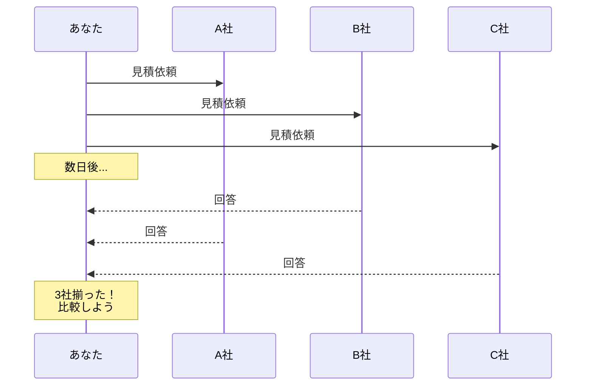
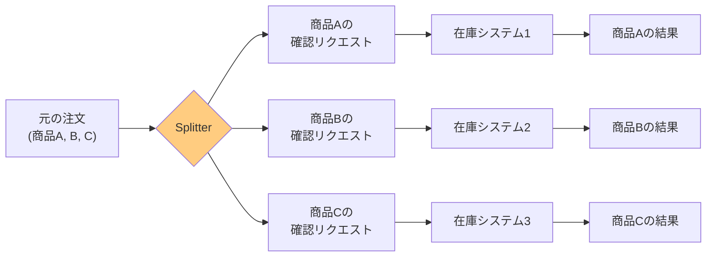
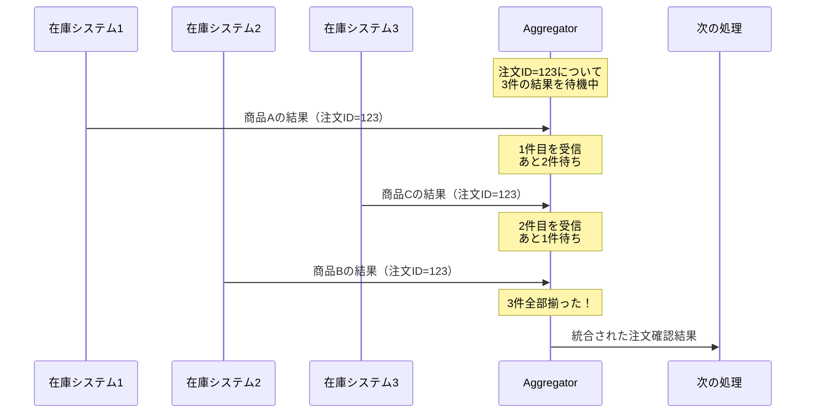
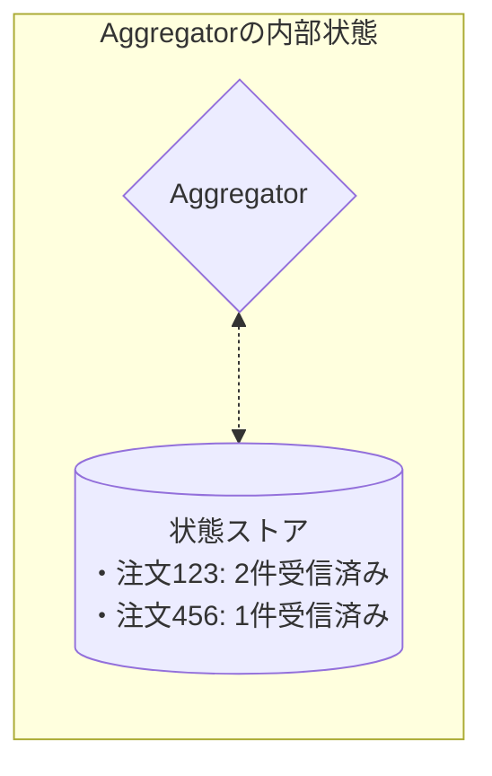

# Aggregator

## このパターンは何をするのか

Aggregatorは、**バラバラに届く複数のメッセージを集めて、1つのメッセージにまとめる**パターンです。

### 身近な例で考える

旅行の計画を立てるとき、複数の旅行代理店に見積もりを依頼することがあります。



このとき、あなたは「3社全部から回答が届いたら比較しよう」と考えます。これがAggregatorの役割です。

ソフトウェアの世界でも同じことが起きます。例えば、複数の価格見積システムに問い合わせて、全ての回答が揃ったら最安値を選ぶ、といった処理が必要になります。Aggregatorは、この「バラバラに届く回答を集めて、1つにまとめる」処理を担当します。

## なぜAggregatorが必要なのか

### 問題の背景

メッセージングシステムでは、1つのリクエストを複数のシステムに分散して処理することがよくあります。

例えば、[[splitter|Splitter]]パターンを使って注文を商品ごとに分割し、それぞれ別の在庫システムで確認する場合：



問題は、**これらの結果がバラバラに、しかも順不同で届く**ことです。

- 商品Cの結果が最初に届くかもしれない
- 商品Bの結果がなかなか届かないかもしれない
- どの結果がどの注文に関係するか、紐づける必要がある

これらの結果を集めて「注文全体の確認結果」として1つにまとめないと、次の処理に進めません。

### Aggregatorがない場合の問題

Aggregatorを使わずに自前で実装しようとすると、以下のような問題に直面します。

**問題1: どのメッセージが関連しているか判断が難しい**

「商品Aの結果」と「商品Bの結果」が同じ注文に関係することを、どうやって判断するのでしょうか？

**問題2: 全ての結果が揃ったかどうかの判断が難しい**

3つの結果を待っているとき、「3つ全部届いた」ことをどうやって判断するのでしょうか？もし1つのシステムが応答しなかったら、永遠に待ち続けるのでしょうか？

**問題3: 状態の管理が複雑**

「今、どの結果が届いていて、どの結果を待っているか」という状態を管理する必要があります。

## Aggregatorの仕組み

Aggregatorは、これらの問題を解決するために3つの要素を組み合わせて動作します。

### 設計の3要素

| 要素 | 説明 | 例 |
|-----|------|-----|
| **相関性（Correlation）** | どのメッセージが同じグループに属するかを判断する方法 | 注文ID（rfqId）が同じメッセージは同じグループ |
| **終了条件** | いつ「集まった」と判断して結果を出すか | 3件全部届いたら出す、または5秒経ったら届いた分だけで出す |
| **集約アルゴリズム** | 集まったメッセージをどうやって1つにまとめるか | 全ての見積もりから最安値を選ぶ |

### 処理の流れ



### 相関性（Correlation）について

「どのメッセージが関連しているか」を判断するために、**Correlation Identifier（相関ID）**を使います。

上の図では、全てのメッセージに「注文ID=123」という情報が含まれています。Aggregatorはこの注文IDを見て、「このメッセージは注文123に関係するものだ」と判断します。

この相関IDがないと、Aggregatorはどのメッセージを一緒にまとめれば良いか判断できません。

## 終了条件（いつ結果を出すか）

Aggregatorの最も難しい設計判断の1つが「いつ結果を出すか」です。

### なぜ終了条件が必要なのか

先ほどの旅行見積もりの例で考えてみましょう。3社に見積もりを依頼したとき：

- **理想的な場合**: 3社全員から回答が届いたら比較できる
- **問題のある場合**: C社が倒産していて回答が永遠に届かない → 永遠に待つことになる

このため、「いつ待つのをやめて、今ある結果で処理を進めるか」を決める必要があります。これが終了条件です。

### 終了条件のパターン

| 条件 | 説明 | 使う場面 |
|-----|------|---------|
| **Wait for All** | 全部届くまで待つ（3件待ちなら3件届いたら出す） | 全ての結果が必須な場合。ただし、タイムアウトも設定しておくのが安全 |
| **Timeout** | 時間が来たら届いた分だけで出す（5秒待ってダメなら諦める） | 全ての結果が揃わなくても処理を進められる場合 |
| **First Best** | 「これでOK」と思えるものが来たらすぐ出す | 最初に条件を満たす結果が来れば十分な場合（例：最初に在庫ありと返ってきた店舗を選ぶ） |
| **Timeout with Override** | 時間が来たら出すが、後からもっと良いのが来たら差し替える | 速度と品質のバランスを取りたい場合 |
| **External Event** | 外から「もう終わり」と言われたら出す | ビジネス上の区切り（例：取引日の終了）で集約を締め切る場合 |

### 実装上の注意

終了条件を設計するときは、以下の点に注意が必要です。

**タイムアウトは必ず設定する**

「全部届くまで待つ」だけでは、1つのシステムが応答しない場合に永遠に待ち続けてしまいます。必ずタイムアウトを設定して、「これ以上待っても意味がない」と判断できるようにしましょう。

**「メッセージが来ない」ことの検知は難しい**

メッセージングシステムでは、「メッセージが来ない」ことを検知するのは非常に難しいです。メッセージが遅れているのか、失われたのか、そもそも送信されなかったのか、判断できないからです。このため、タイムアウトによる終了が重要になります。

## Aggregatorの特徴と注意点

### Aggregatorは状態を持つ

他の多くのルーターパターン（Content-Based RouterやMessage Filterなど）は、メッセージを受け取ってすぐに次に渡す「ステートレス」な動作をします。

一方、Aggregatorは「今、どの結果が届いていて、どの結果を待っているか」という状態を保持する必要があります。これを**ステートフル**と呼びます。



### 状態を持つことの影響

**メモリ使用量が増える**

待機中のメッセージを保存しておく必要があるため、メモリを消費します。

**障害時の復旧が複雑**

Aggregatorがクラッシュした場合、「どのメッセージまで処理していたか」という状態を復元する必要があります。状態を永続化（データベースに保存するなど）しておかないと、データが失われます。

**スケールアウトが難しい**

複数のAggregatorインスタンスを動かす場合、同じ注文に関するメッセージが同じインスタンスに届くようにする必要があります。そうしないと、状態がバラバラになってしまいます。

### やってはいけないこと

**タイムアウトを設定しない**

応答が来ないシステムがあると、永遠に待ち続けてしまいます。

**状態の永続化を考慮しない**

システム障害時に、処理中だったデータが全て失われます。

**Correlation IDを使わない**

どのメッセージが関連しているか判断できず、正しく集約できません。

## 実装例

### Akka Typed Actor (Scala)

以下は、価格見積もりを集約するAggregatorの実装例です。

```scala
import akka.actor.typed.{ActorRef, Behavior}
import akka.actor.typed.scaladsl.{Behaviors, TimerScheduler}
import scala.concurrent.duration._

// 価格見積もりを表すデータ
case class PriceQuote(
  quoterId: String,      // 見積もりを出した業者のID
  rfqId: String,         // 見積依頼ID（これがCorrelation ID）
  itemId: String,        // 商品ID
  retailPrice: Double,   // 定価
  discountPrice: Double  // 割引価格
)

// 集約された結果を表すデータ
case class QuotationFulfillment(
  rfqId: String,
  priceQuotes: Seq[PriceQuote]
)

// Aggregatorの実装
object PriceQuoteAggregator {
  // Aggregatorが受け取るメッセージの種類
  sealed trait Command
  case class AddQuote(quote: PriceQuote) extends Command
  case class ExpectQuotes(rfqId: String, expectedCount: Int, replyTo: ActorRef[QuotationFulfillment]) extends Command
  private case class Timeout(rfqId: String) extends Command

  // 1つの集約の状態を表すデータ
  case class AggregationState(
    expectedCount: Int,                    // 期待する見積もりの数
    quotes: Vector[PriceQuote],            // 受信済みの見積もり
    replyTo: ActorRef[QuotationFulfillment] // 結果の送信先
  )

  def apply(): Behavior[Command] =
    Behaviors.withTimers { timers =>
      aggregator(Map.empty, timers)
    }

  private def aggregator(
    aggregations: Map[String, AggregationState],  // rfqId -> 状態
    timers: TimerScheduler[Command]
  ): Behavior[Command] =
    Behaviors.receive { (context, command) =>
      command match {
        // 新しい集約を開始する
        case ExpectQuotes(rfqId, expectedCount, replyTo) =>
          context.log.info(s"$rfqId について $expectedCount 件の見積もりを待機開始")

          // タイムアウトを設定（5秒後に強制終了）
          timers.startSingleTimer(rfqId, Timeout(rfqId), 5.seconds)

          val state = AggregationState(expectedCount, Vector.empty, replyTo)
          aggregator(aggregations + (rfqId -> state), timers)

        // 見積もりを追加する
        case AddQuote(quote) =>
          aggregations.get(quote.rfqId) match {
            case Some(state) =>
              val newQuotes = state.quotes :+ quote
              context.log.info(
                s"${quote.rfqId} の見積もりを受信: ${newQuotes.size}/${state.expectedCount}"
              )

              // 全て揃ったら結果を出力
              if (newQuotes.size >= state.expectedCount) {
                timers.cancel(quote.rfqId)  // タイムアウトをキャンセル
                val fulfillment = QuotationFulfillment(quote.rfqId, newQuotes)
                state.replyTo ! fulfillment
                context.log.info(s"${quote.rfqId} の集約完了")
                aggregator(aggregations - quote.rfqId, timers)
              } else {
                val newState = state.copy(quotes = newQuotes)
                aggregator(aggregations + (quote.rfqId -> newState), timers)
              }

            case None =>
              context.log.warn(s"${quote.rfqId} に対応する集約が見つかりません")
              Behaviors.same
          }

        // タイムアウト処理
        case Timeout(rfqId) =>
          aggregations.get(rfqId) match {
            case Some(state) =>
              context.log.warn(
                s"$rfqId がタイムアウト: ${state.quotes.size}/${state.expectedCount} 件で終了"
              )
              // 受信済みの見積もりだけで結果を出力
              val fulfillment = QuotationFulfillment(rfqId, state.quotes)
              state.replyTo ! fulfillment
              aggregator(aggregations - rfqId, timers)

            case None =>
              Behaviors.same
          }
      }
    }
}
```

### コードのポイント

**Correlation IDとして `rfqId` を使用**

全ての見積もりに `rfqId`（見積依頼ID）が含まれています。Aggregatorはこの値を見て、どの見積もりが同じリクエストに関係するか判断します。

**終了条件は「全部揃う」または「タイムアウト」**

`expectedCount` 件の見積もりが揃うか、5秒経過するかのいずれかで集約を終了します。

**状態を `Map` で管理**

`aggregations: Map[String, AggregationState]` で、rfqIdごとの集約状態を管理しています。

## 関連するパターン

| パターン | 関係 |
|---------|------|
| [[splitter\|Splitter]] | Aggregatorの逆の役割。Splitterで分割したメッセージを、Aggregatorで再び統合する |
| [[recipient_list\|Recipient List]] | 複数の宛先に送ったメッセージの応答を、Aggregatorで集約する |
| [[scatter_gather\|Scatter-Gather]] | Recipient List（またはPublish-Subscribe）とAggregatorを組み合わせた複合パターン |
| [[composed_message_processor\|Composed Message Processor]] | Splitter + Router + Aggregatorを組み合わせた複合パターン |
| [[correlation_identifier\|Correlation Identifier]] | Aggregatorがメッセージを関連付けるために使用する仕組み |
| [[resequencer\|Resequencer]] | メッセージを順番に並べ直すパターン。Aggregatorと同様にステートフル |

## 参考資料

- [Enterprise Integration Patterns - Aggregator](https://www.enterpriseintegrationpatterns.com/patterns/messaging/Aggregator.html)
