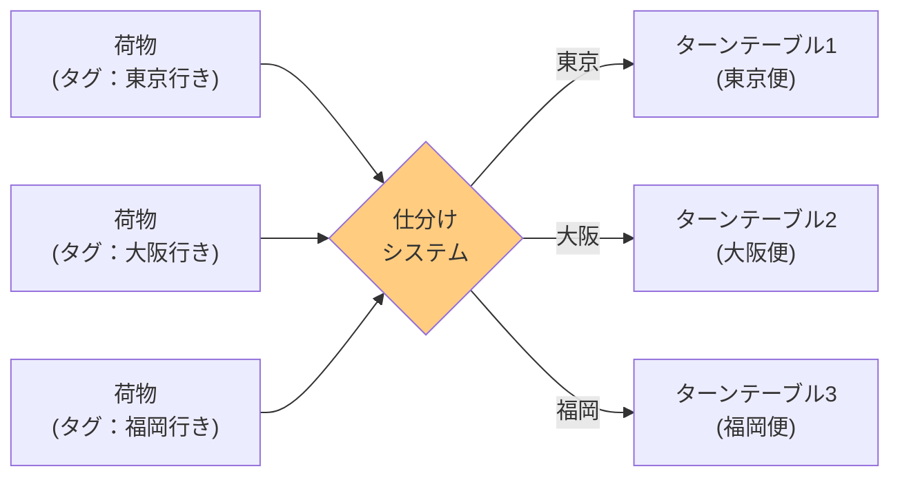
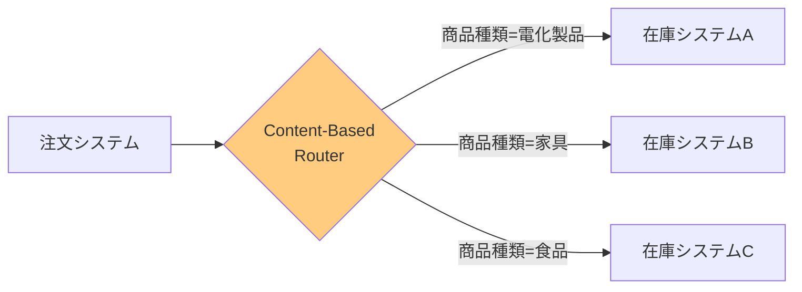
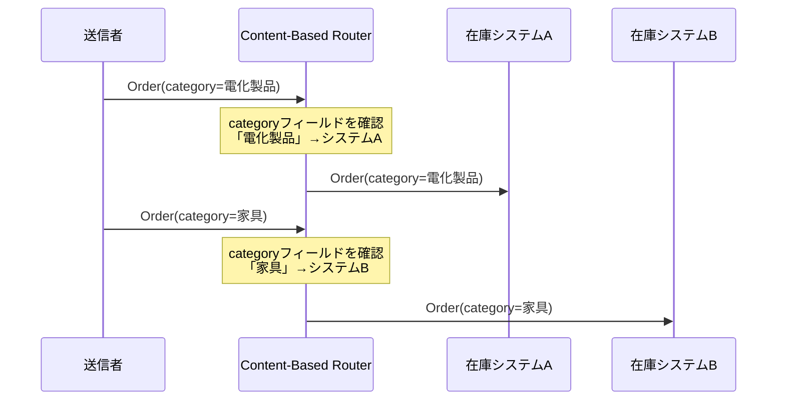

# Content-Based Router

## このパターンは何をするのか

Content-Based Routerは、**メッセージの中身（内容）を見て、宛先を決める**パターンです。メッセージルーティングの中で最も一般的な実装方法であり、実際のシステムで広く使われています。

### 身近な例で考える

空港の手荷物仕分けシステムを想像してください。

空港では、預けられた荷物にタグが付けられます。仕分けシステムは、このタグに書かれた情報（行き先、便名など）を読み取り、正しいターンテーブルに荷物を振り分けます。



Content-Based Routerも同じです。メッセージの中身（フィールドの値）を見て、「このメッセージはシステムAへ」「このメッセージはシステムBへ」と振り分けます。

## なぜContent-Based Routerが必要なのか

### 問題の背景

企業のシステムでは、**1つの論理的な機能が複数の物理的なシステムに分かれている**ことがよくあります。

例えば、ある会社の在庫管理を考えてみましょう。歴史的な経緯で、商品の種類ごとに別々の在庫システムが存在することがあります。

- 電化製品 → 在庫システムA
- 家具 → 在庫システムB
- 食品 → 在庫システムC

注文が入ったとき、その注文に含まれる商品の種類によって、どの在庫システムに問い合わせるかを決める必要があります。

### Content-Based Routerがない場合の問題

**問題1: 送信者が全ての在庫システムを知っている必要がある**

注文システムが「電化製品はシステムA」「家具はシステムB」というルールを全て知っていなければなりません。

**問題2: 在庫システムの追加・変更が難しい**

新しい商品カテゴリが増えたり、在庫システムが統合されたりするたびに、注文システムを修正する必要があります。

**問題3: 同じルーティングルールが複数の場所に散らばる**

複数のシステムが在庫システムにアクセスする場合、それぞれがルーティングルールを持つことになり、整合性を保つのが難しくなります。

### Content-Based Routerを使うと

Content-Based Routerを間に入れることで、注文システムは「どの在庫システムに送るか」を意識しなくて良くなります。



## Content-Based Routerの仕組み

### 基本的な動作

Content-Based Routerは以下のステップで動作します。

1. **メッセージを受け取る**
2. **メッセージの中身を読み取る**（例：`orderType`フィールドの値を確認）
3. **設定されたルールに基づいて宛先を決定する**
4. **適切なチャネルにメッセージを送る**

重要なのは、**メッセージの中身を見て判断する**という点です。メッセージのどのフィールドを見るか、どの値のときにどこに送るか、というルールを事前に設定しておきます。

### 処理の流れ



### ルーティング条件の種類

Content-Based Routerでは、さまざまな条件でルーティングできます。

**特定のフィールドの値を見る**

最も一般的な方法です。例：`orderType == "NORMAL"` ならシステムAへ

**フィールドの存在を確認する**

特定のフィールドがあるかないかで判断します。例：`priorityFlag`フィールドがあれば優先処理システムへ

**複数の条件を組み合わせる**

複数の条件をANDやORで組み合わせます。例：`amount > 10000 AND customerType == "法人"` なら法人担当システムへ

## Content-Based Routerのメリットとデメリット

### メリット

**送信者と受信者を分離できる**

送信者は受信者のことを知らなくて良いので、システム間の依存関係が減ります。

**メッセージの内容に基づく明確なルーティング**

「このメッセージはなぜこのシステムに送られたのか」が、メッセージの内容から明確にわかります。

**ルーティングルールを一箇所で管理できる**

「どのメッセージをどこに送るか」というルールがRouterに集約されるので、変更や確認がしやすくなります。

**新しい受信者の追加が容易**

新しいシステムを追加するときも、Routerのルールを追加するだけで済みます。

### デメリット

**Routerがメッセージの構造を知っている必要がある**

メッセージのどのフィールドを見るかをRouterが知っている必要があります。メッセージの構造が変わると、Routerも修正が必要です。

**ルールが複雑になりやすい**

条件が増えると、Router自体が複雑になり、保守が難しくなります。

**条件評価のオーバーヘッド**

複雑な条件を評価するために、処理時間がかかることがあります。

### やってはいけないこと

**Routerの中でビジネスロジックを実行しない**

Routerは「どこに送るか」を決めるだけの役割です。「注文を処理する」「在庫を減らす」といったビジネスロジックをRouterの中で実行してはいけません。

**全てのフィールドを検査しない**

ルーティングに必要なフィールドだけを見るようにしましょう。不要なフィールドまで検査すると、パフォーマンスが低下します。

**ルーティング条件を複雑にしすぎない**

条件があまりに複雑になる場合は、ルールエンジンの導入を検討しましょう。

## 保守性の重要性

Content-Based Routerは、システムの中で**頻繁に変更される可能性が高い**コンポーネントです。

新しい商品カテゴリが追加されたり、システムが統合されたり、ビジネスルールが変わったりするたびに、ルーティング条件の変更が必要になります。

そのため、**ルーティングルールを変更しやすい設計**が重要です。

- ルールを設定ファイルから読み込むようにする
- ルールを動的に変更できるようにする（→ [[dynamic_router|Dynamic Router]]）
- 複雑な条件にはルールエンジンを使う

## 実装例

### Akka Typed Actor (Scala)

以下は、注文の種類に基づいてルーティングするContent-Based Routerの実装例です。

```scala
import akka.actor.typed.{ActorRef, Behavior}
import akka.actor.typed.scaladsl.Behaviors

// 注文を表すデータ
case class Order(
  id: String,
  orderType: String,  // NORMAL, RETURN, CORPORATE など
  category: String,   // 電化製品, 家具, 食品 など
  amount: Double
)

// Content-Based Routerの実装
object OrderContentRouter {
  sealed trait Command
  case class RouteOrder(order: Order) extends Command

  def apply(
    // 在庫システムへのルーティング
    inventoryA: ActorRef[Order],  // 電化製品用
    inventoryB: ActorRef[Order],  // 家具用
    inventoryC: ActorRef[Order],  // 食品用
    // 想定外のカテゴリ用
    defaultInventory: ActorRef[Order]
  ): Behavior[Command] =
    Behaviors.receive { (context, command) =>
      command match {
        case RouteOrder(order) =>
          // メッセージの中身（category）を見てルーティング先を決定
          val destination = order.category match {
            case "電化製品" =>
              context.log.info(s"注文 ${order.id} を在庫システムA（電化製品）へ")
              inventoryA
            case "家具" =>
              context.log.info(s"注文 ${order.id} を在庫システムB（家具）へ")
              inventoryB
            case "食品" =>
              context.log.info(s"注文 ${order.id} を在庫システムC（食品）へ")
              inventoryC
            case other =>
              context.log.warn(s"未知のカテゴリ '$other'、デフォルトシステムへ")
              defaultInventory
          }

          // メッセージを変更せずにそのまま送信
          destination ! order
          Behaviors.same
      }
    }
}

// より柔軟な実装（ルールを外部から設定可能）
object FlexibleContentRouter {
  // ルーティングルールを表す型
  case class RoutingRule(
    condition: Order => Boolean,  // 条件を判定する関数
    destination: ActorRef[Order]  // 送信先
  )

  sealed trait Command
  case class RouteOrder(order: Order) extends Command

  def apply(
    rules: Seq[RoutingRule],
    defaultDestination: ActorRef[Order]
  ): Behavior[Command] =
    Behaviors.receive { (context, command) =>
      command match {
        case RouteOrder(order) =>
          // 最初に条件を満たすルールを探す
          val destination = rules
            .find(rule => rule.condition(order))
            .map(_.destination)
            .getOrElse(defaultDestination)

          destination ! order
          Behaviors.same
      }
    }
}

// 使用例
object ContentRouterExample {
  def setup(): Behavior[Nothing] =
    Behaviors.setup[Nothing] { context =>
      // 在庫システムを作成（実際はもっと複雑な処理を行う）
      val inventoryA = context.spawn(InventorySystem("電化製品"), "inventory-a")
      val inventoryB = context.spawn(InventorySystem("家具"), "inventory-b")
      val inventoryC = context.spawn(InventorySystem("食品"), "inventory-c")
      val defaultInventory = context.spawn(InventorySystem("その他"), "inventory-default")

      // Content-Based Routerを作成
      val router = context.spawn(
        OrderContentRouter(inventoryA, inventoryB, inventoryC, defaultInventory),
        "content-router"
      )

      // メッセージを送信
      router ! OrderContentRouter.RouteOrder(
        Order("001", "NORMAL", "電化製品", 50000)
      )
      router ! OrderContentRouter.RouteOrder(
        Order("002", "NORMAL", "家具", 30000)
      )

      Behaviors.empty
    }
}
```

### コードのポイント

**メッセージの中身（category）を見てルーティング**

`order.category` の値を見て、どの在庫システムに送るかを決めています。これがContent-Based Routerの本質です。

**未知のカテゴリへの対応**

想定外のカテゴリが来た場合のために、`defaultInventory` を用意しています。これにより、システムが止まることを防ぎます。

**柔軟な実装**

`FlexibleContentRouter` では、ルーティングルールを外部から設定できるようにしています。これにより、ルールの変更が容易になります。

## 関連するパターン

| パターン | 関係 |
|---------|------|
| [[message_filter\|Message Filter]] | Content-Based Routerと似ているが、条件に合わないメッセージを「捨てる」点が異なる |
| [[dynamic_router\|Dynamic Router]] | ルーティングルールを実行時に変更できる。Content-Based Routerは通常、ルールが固定 |
| [[splitter\|Splitter]] | メッセージを分割してから、Content-Based Routerで振り分けることが多い |
| [[recipient_list\|Recipient List]] | 複数の宛先に同時に送る点が異なる |

## 次に読むべき内容

- [[message_filter|Message Filter]] - 不要なメッセージを除去したい場合
- [[dynamic_router|Dynamic Router]] - ルールを動的に変更したい場合
- [[recipient_list|Recipient List]] - 複数の宛先に同時に送りたい場合

## 参考資料

- [Enterprise Integration Patterns - Content-Based Router](https://www.enterpriseintegrationpatterns.com/patterns/messaging/ContentBasedRouter.html)
