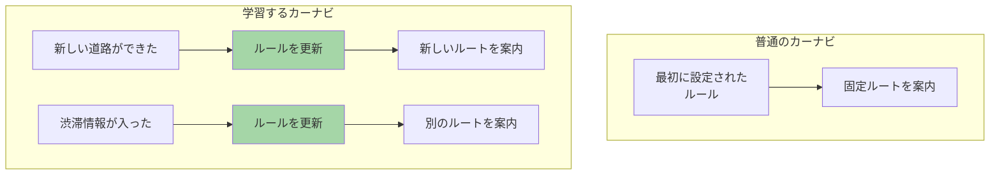
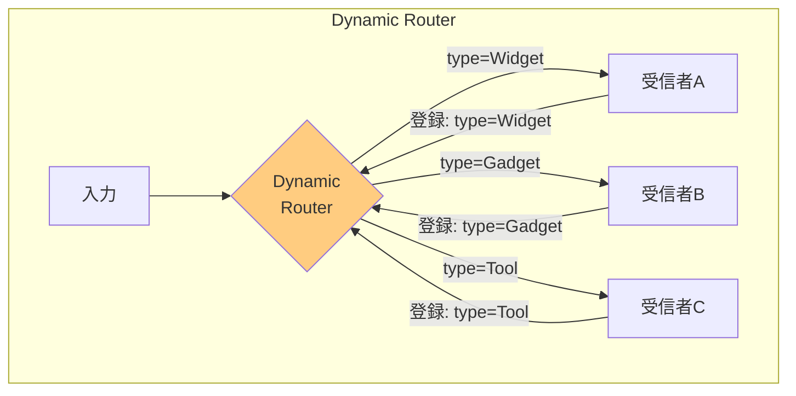
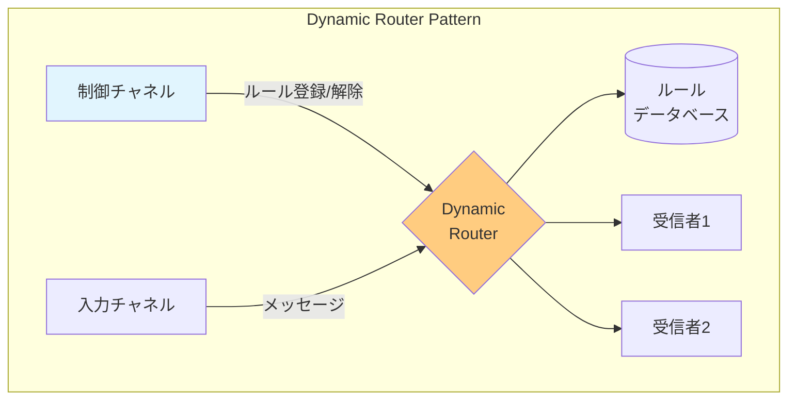
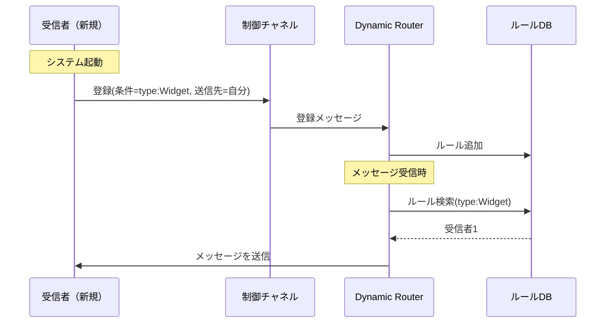

# Dynamic Router

## このパターンは何をするのか

Dynamic Routerは、**ルーティングルールを後から変更できる**パターンです。[[content_based_router|Content-Based Router]]ではルールが固定されていますが、Dynamic Routerでは実行中にルールを追加・変更・削除できます。

### 身近な例で考える

学習するカーナビを想像してください。

通常のカーナビは、地図データに基づいて決まったルートを案内します。しかし、学習するカーナビは、新しい道路ができたり、渋滞情報が更新されたりすると、その情報を取り込んでルートを変更します。



Dynamic Routerも同じです。受信者が「自分はこういうメッセージを処理できます」と登録したり、登録を解除したりすることで、ルーティングルールが動的に変わります。

## なぜDynamic Routerが必要なのか

### 問題の背景

[[content_based_router|Content-Based Router]]では、ルーティングルールがコードや設定ファイルに固定されています。新しい受信者を追加したい場合、以下の手順が必要です。

1. ルーターの設定を変更する
2. ルーターを再デプロイする
3. システム全体を再起動する（場合によっては）

これでは、受信者の追加・削除が頻繁に発生するシステムには対応できません。

### Dynamic Routerがない場合の問題

**問題1: ルーターが全ての受信者をハードコードで知っている必要がある**

新しいシステムを追加するたびに、ルーターのコードを修正しなければなりません。

**問題2: ルーターの変更が難しい**

本番環境でルーターを変更するには、再デプロイが必要で、ダウンタイムが発生する可能性があります。

**問題3: ルーターと受信者が密結合になる**

ルーターが受信者の詳細を知っているため、どちらかを変更すると他方にも影響が出ます。

### Dynamic Routerを使うと

Dynamic Routerを使うと、受信者が自分自身をルーターに登録できます。ルーターは受信者の詳細をハードコードで知る必要がなく、登録情報に基づいてルーティングします。



## Dynamic Routerの仕組み

### 基本的な動作

Dynamic Routerは2つのチャネルを持っています。

1. **入力チャネル**: 通常のメッセージを受け取る
2. **制御チャネル**: ルーティングルールの登録・解除を受け取る



### 登録の流れ

受信者がシステムに参加するとき、以下の流れで自分自身を登録します。



### Content-Based Routerとの違い

| 観点 | Content-Based Router | Dynamic Router |
|-----|---------------------|----------------|
| ルール管理 | コードや設定ファイルに固定 | 実行時に動的に変更可能 |
| 受信者の追加 | ルーターの再デプロイが必要 | 登録メッセージを送るだけ |
| 結合度 | ルーターが受信者を知っている | 受信者が自分をルーターに登録 |
| 複雑性 | シンプル | 制御チャネルとルールDBが必要 |

## Dynamic Routerのメリットとデメリット

### メリット

**受信者の追加・削除にルーターの変更が不要**

新しい受信者は、登録メッセージを送るだけでルーティング対象になります。ルーターのコードを変更する必要はありません。

**ルーターと受信者の疎結合を実現**

ルーターは受信者の詳細を知る必要がなく、登録された情報に基づいてルーティングするだけです。

**受信者が自分の処理条件を宣言できる**

受信者自身が「自分はこういうメッセージを処理できる」と宣言するので、責務が明確になります。

### デメリット

**制御チャネルとルールDBの管理が必要**

追加のインフラストラクチャが必要になり、システムが複雑になります。

**登録メッセージが失われるリスク**

制御チャネルの信頼性が低いと、登録メッセージが失われ、ルーティングが正しく行われなくなる可能性があります。

**起動順序に依存する場合がある**

受信者がルーターより先に起動して登録する必要がある場合、起動順序を管理する必要があります。

**古いルールが残る可能性**

受信者がクラッシュしても、ルールDBには登録が残っている可能性があります。

### やってはいけないこと

**制御チャネルの信頼性を考慮しない**

登録メッセージが失われると、ルーティングが正しく行われません。永続的なメッセージングや確認応答を検討しましょう。

**受信者のヘルスチェックをしない**

クラッシュした受信者へのルーティングが続くと、メッセージが失われます。定期的なヘルスチェックや、ルールの有効期限を設定しましょう。

**ルールDBのバックアップを取らない**

システム障害時にルールが失われると、全ての受信者が再登録する必要があります。

## 実装例

### Akka Typed Actor (Scala)

以下は、受信者が自己登録できるDynamic Routerの実装例です。

```scala
import akka.actor.typed.{ActorRef, Behavior}
import akka.actor.typed.scaladsl.Behaviors

// 処理対象のメッセージ
sealed trait OrderMessage
case class Order(id: String, orderType: String, amount: Double) extends OrderMessage

// 制御チャネル用のメッセージ
sealed trait ControlMessage
case class Register(
  recipientId: String,
  condition: OrderMessage => Boolean,
  destination: ActorRef[OrderMessage]
) extends ControlMessage
case class Unregister(recipientId: String) extends ControlMessage

// Dynamic Routerの実装
object DynamicRouter {
  // ルーターが受け取るコマンド
  sealed trait Command
  case class Route(message: OrderMessage) extends Command
  case class Control(controlMessage: ControlMessage) extends Command

  // ルーティングルールを表すデータ
  case class RoutingRule(
    recipientId: String,
    condition: OrderMessage => Boolean,
    destination: ActorRef[OrderMessage]
  )

  def apply(defaultRoute: ActorRef[OrderMessage]): Behavior[Command] =
    router(Map.empty, defaultRoute)

  private def router(
    rules: Map[String, RoutingRule],
    defaultRoute: ActorRef[OrderMessage]
  ): Behavior[Command] =
    Behaviors.receive { (context, command) =>
      command match {
        // 制御チャネルからの登録
        case Control(Register(recipientId, condition, destination)) =>
          context.log.info(s"受信者を登録: $recipientId")
          val newRule = RoutingRule(recipientId, condition, destination)
          router(rules + (recipientId -> newRule), defaultRoute)

        // 登録解除
        case Control(Unregister(recipientId)) =>
          context.log.info(s"受信者を登録解除: $recipientId")
          router(rules - recipientId, defaultRoute)

        // 通常のメッセージルーティング
        case Route(message) =>
          // 条件に一致する最初のルールを探す
          val destination = rules.values
            .find(_.condition(message))
            .map(_.destination)
            .getOrElse(defaultRoute)

          context.log.info(s"メッセージを ${destination.path.name} にルーティング")
          destination ! message
          Behaviors.same
      }
    }
}

// 受信者（起動時に自己登録）
object OrderProcessor {
  def apply(
    id: String,
    router: ActorRef[DynamicRouter.Command],
    condition: OrderMessage => Boolean
  ): Behavior[OrderMessage] =
    Behaviors.setup { context =>
      // 起動時にルーターへ自己登録
      context.log.info(s"$id がルーターに登録中...")
      router ! DynamicRouter.Control(
        Register(id, condition, context.self)
      )

      Behaviors.receiveMessage { message =>
        context.log.info(s"$id がメッセージを受信: $message")
        Behaviors.same
      }
    }
}

// 使用例
object DynamicRouterExample {
  def setup(): Behavior[Nothing] =
    Behaviors.setup[Nothing] { context =>
      // デフォルトの処理先
      val defaultHandler = context.spawn(
        Behaviors.receiveMessage[OrderMessage] { msg =>
          println(s"デフォルト処理: $msg")
          Behaviors.same
        },
        "defaultHandler"
      )

      // Dynamic Routerを作成
      val router = context.spawn(
        DynamicRouter(defaultHandler),
        "dynamicRouter"
      )

      // 受信者を作成（起動時に自己登録される）
      context.spawn(
        OrderProcessor("widgetHandler", router, {
          case Order(_, "Widget", _) => true
          case _ => false
        }),
        "widgetHandler"
      )

      context.spawn(
        OrderProcessor("gadgetHandler", router, {
          case Order(_, "Gadget", _) => true
          case _ => false
        }),
        "gadgetHandler"
      )

      // メッセージを送信
      router ! DynamicRouter.Route(Order("001", "Widget", 100))
      router ! DynamicRouter.Route(Order("002", "Gadget", 200))
      router ! DynamicRouter.Route(Order("003", "Unknown", 300))  // デフォルトへ

      Behaviors.empty
    }
}
```

### コードのポイント

**制御チャネルと入力チャネルの分離**

`Control` メッセージでルール登録、`Route` メッセージで通常のルーティングを行っています。

**受信者の自己登録**

`OrderProcessor` は起動時に `router ! DynamicRouter.Control(Register(...))` で自分自身を登録しています。ルーターは受信者の詳細を知る必要がありません。

**デフォルトルート**

どのルールにも一致しないメッセージのために、`defaultRoute` を用意しています。

## 関連するパターン

| パターン | 関係 |
|---------|------|
| [[content_based_router\|Content-Based Router]] | Dynamic Routerの静的バージョン。ルールが固定 |
| [[recipient_list\|Recipient List]] | 動的な受信者リストの構築に使用可能 |
| [[message_filter\|Message Filter]] | 動的なフィルタリング条件の更新に使用可能 |

## 次に読むべき内容

- [[recipient_list|Recipient List]] - 複数の宛先に動的に送信する場合
- [[routing_slip|Routing Slip]] - 動的なルーティング経路の指定

## 参考資料

- [Enterprise Integration Patterns - Dynamic Router](https://www.enterpriseintegrationpatterns.com/patterns/messaging/DynamicRouter.html)
