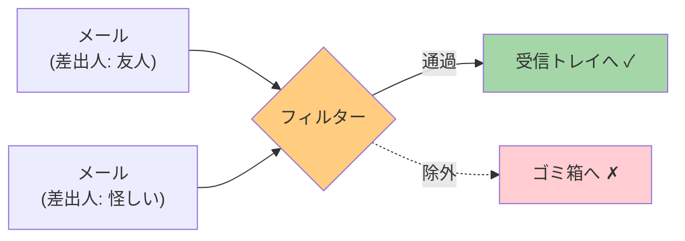
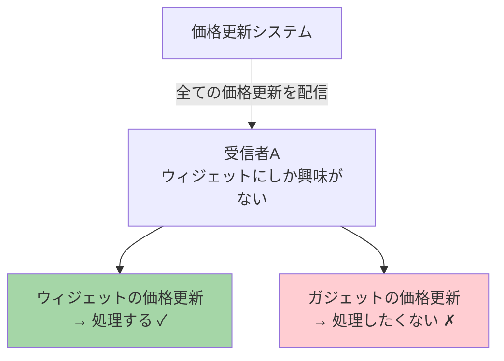
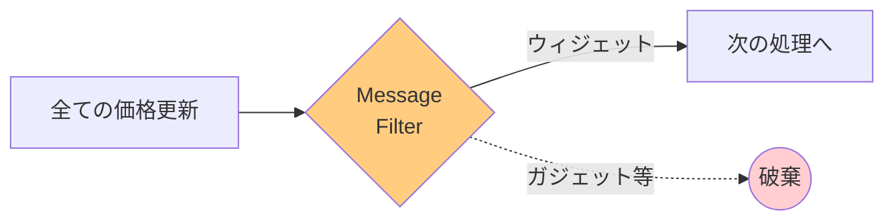
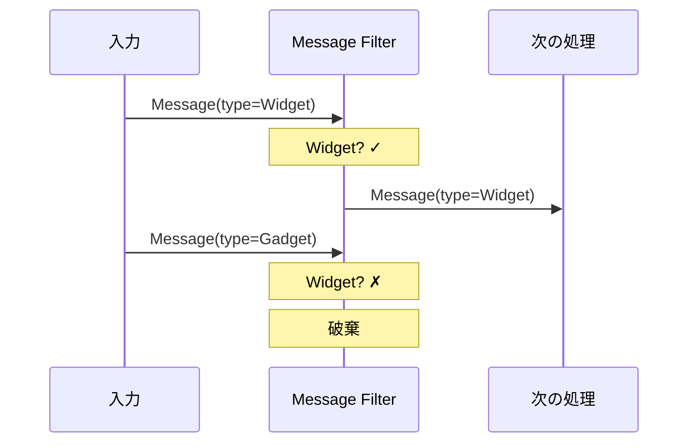

# Message Filter

## このパターンは何をするのか

Message Filterは、**条件に合うメッセージだけを通過させ、それ以外は捨てる**パターンです。[[content_based_router|Content-Based Router]]の特殊なケースで、「通過」か「破棄」の2択しかありません。

### 身近な例で考える

スパムメールのフィルターを想像してください。

メールソフトは、届いたメールを検査して、スパムの特徴（怪しい送信者、特定のキーワードなど）があるかどうかをチェックします。条件に合致しなければ受信トレイに入れ、合致すればゴミ箱に捨てます。



Message Filterも同じです。メッセージの中身を見て、条件に合えば次の処理に渡し、合わなければ捨てます。

## なぜMessage Filterが必要なのか

### 問題の背景

メッセージングシステムでは、**受信者が関心のないメッセージも受け取ってしまう**ことがあります。

例えば、商品価格の更新通知を受け取るシステムを考えてみましょう。Publish-Subscribe Channel（全員に配信するチャネル）を使っている場合、全ての商品の価格更新が届きます。



### Message Filterがない場合の問題

**問題1: 不要なメッセージの処理にリソースが浪費される**

関心のないメッセージも受け取って処理しようとするため、CPUやメモリが無駄に使われます。

**問題2: 下流のシステムに不要なメッセージが流れる**

フィルターがなければ、不要なメッセージが次のシステムに流れ、そこでも処理が発生します。

**問題3: ビジネスロジックが複雑になる**

「このメッセージは処理対象か？」という判断を、本来のビジネスロジックの中に埋め込む必要があります。

### Message Filterを使うと

Message Filterを使うと、不要なメッセージを早い段階で除去できます。



## Message Filterの仕組み

### 基本的な動作

Message Filterは以下のステップで動作します。

1. **メッセージを受け取る**
2. **設定された条件でメッセージを検査する**
3. **条件に合致すれば次の処理に渡す、合致しなければ破棄する**

### 処理の流れ



### Content-Based Routerとの違い

Message FilterとContent-Based Routerは似ていますが、出力の数が違います。

| パターン | 出力チャネル数 | 動作 |
|---------|--------------|------|
| Content-Based Router | 複数 | 条件に応じて異なる宛先にルーティング |
| Message Filter | 1つ | 条件に合えば通過、合わなければ破棄 |

Message Filterは、「必要なメッセージだけを通す」という単純な目的に特化しています。

## Message Filterのメリットとデメリット

### メリット

**シンプルで分かりやすい**

「通過」か「破棄」の2択なので、動作が明確です。

**リソースを節約できる**

不要なメッセージを早い段階で除去することで、下流のシステムの負荷を減らせます。

**下流のシステムを保護できる**

不要なメッセージが流れないので、下流のシステムは自分が処理すべきメッセージだけを受け取れます。

**Publish-Subscribeと組み合わせて選択的受信を実現できる**

「全員に配信」するチャネルから、関心のあるメッセージだけを受け取ることができます。

### デメリット

**破棄されたメッセージは復元できない**

一度破棄されたメッセージは、後から取り戻すことができません。

**破棄されたメッセージの追跡が難しい**

「なぜメッセージが届かなかったのか」をデバッグするのが難しくなります。

**設定ミスで必要なメッセージが破棄されるリスク**

フィルター条件を間違えると、本来必要なメッセージが捨てられてしまいます。

### やってはいけないこと

**破棄理由のログを残さない**

デバッグのために、なぜメッセージが破棄されたかをログに残すべきです。

**複雑なビジネスロジックをフィルターに入れる**

フィルターは「通過/破棄」の判断だけを行い、複雑な処理は後続のシステムで行うべきです。

**本来はContent-Based Routerを使うべき場面でMessage Filterを使う**

複数の宛先に振り分けたい場合は、Content-Based Routerを使いましょう。

## 実装例

### Akka Typed Actor (Scala)

以下は、ウィジェットの価格更新だけを通過させるMessage Filterの実装例です。

```scala
import akka.actor.typed.{ActorRef, Behavior}
import akka.actor.typed.scaladsl.Behaviors

// 価格更新メッセージ
sealed trait PriceUpdate
case class WidgetPriceUpdate(productId: String, price: Double) extends PriceUpdate
case class GadgetPriceUpdate(productId: String, price: Double) extends PriceUpdate

// 汎用的なMessage Filter
object MessageFilter {
  def apply[T](
    // 通過条件を判定する関数
    predicate: T => Boolean,
    // 条件に合致したメッセージの送信先
    output: ActorRef[T],
    // 破棄時のコールバック（ログ用など）
    onDiscard: Option[T => Unit] = None
  ): Behavior[T] =
    Behaviors.receive { (context, message) =>
      if (predicate(message)) {
        // 条件に合致 → 通過
        context.log.info(s"メッセージを通過させます: $message")
        output ! message
      } else {
        // 条件に合致しない → 破棄
        context.log.info(s"メッセージを破棄します: $message")
        onDiscard.foreach(_(message))  // 破棄をログに記録
      }
      Behaviors.same
    }
}

// ウィジェット専用フィルター
object WidgetFilter {
  def apply(output: ActorRef[PriceUpdate]): Behavior[PriceUpdate] =
    Behaviors.receive { (context, message) =>
      message match {
        case w: WidgetPriceUpdate =>
          context.log.info(s"ウィジェットの価格更新を通過: ${w.productId}")
          output ! w
        case other =>
          context.log.debug(s"ウィジェット以外のメッセージを破棄: $other")
          // 何もしない（破棄）
      }
      Behaviors.same
    }
}

// 使用例
object FilterExample {
  def setup(): Behavior[Nothing] =
    Behaviors.setup[Nothing] { context =>
      // ウィジェットの価格更新を処理するシステム
      val widgetProcessor = context.spawn(
        Behaviors.receiveMessage[PriceUpdate] { msg =>
          println(s"ウィジェットを処理: $msg")
          Behaviors.same
        },
        "widgetProcessor"
      )

      // フィルターを作成
      val filter = context.spawn(
        WidgetFilter(widgetProcessor),
        "widgetFilter"
      )

      // メッセージを送信
      filter ! WidgetPriceUpdate("W001", 29.99)  // 通過 ✓
      filter ! GadgetPriceUpdate("G001", 49.99)  // 破棄 ✗
      filter ! WidgetPriceUpdate("W002", 19.99)  // 通過 ✓

      Behaviors.empty
    }
}
```

### コードのポイント

**条件判定をシンプルに**

`predicate` 関数で「通過するかどうか」だけを判定しています。複雑なビジネスロジックは入れません。

**破棄時のコールバック**

`onDiscard` で、メッセージが破棄されたときにログを記録できます。デバッグに役立ちます。

**型による判定**

`WidgetFilter` では、Scalaのパターンマッチングを使って、メッセージの型（`WidgetPriceUpdate`）でフィルタリングしています。

## 関連するパターン

| パターン | 関係 |
|---------|------|
| [[content_based_router\|Content-Based Router]] | Message Filterの一般化。複数の出力を持つ |
| [[recipient_list\|Recipient List]] | 複数の宛先に送る点が異なる |

## 次に読むべき内容

- [[content_based_router|Content-Based Router]] - 破棄ではなく振り分けが必要な場合
- [[recipient_list|Recipient List]] - 複数の宛先に送りたい場合

## 参考資料

- [Enterprise Integration Patterns - Message Filter](https://www.enterpriseintegrationpatterns.com/patterns/messaging/Filter.html)
