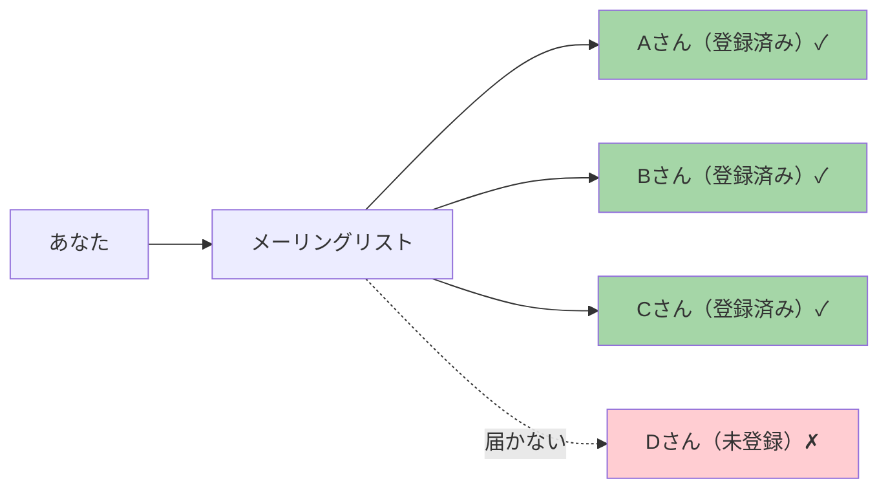
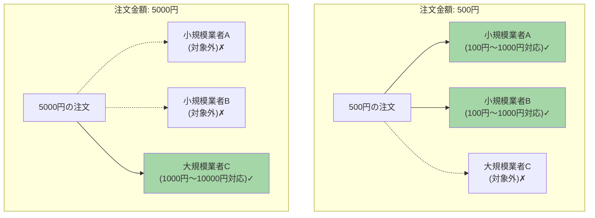
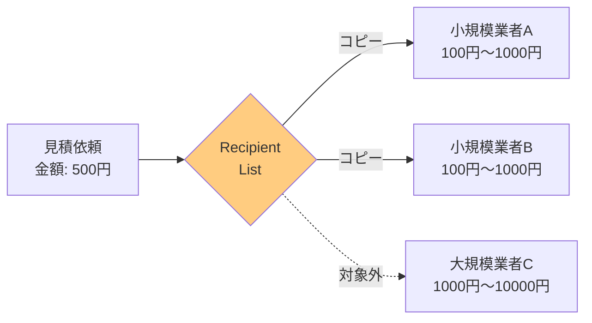
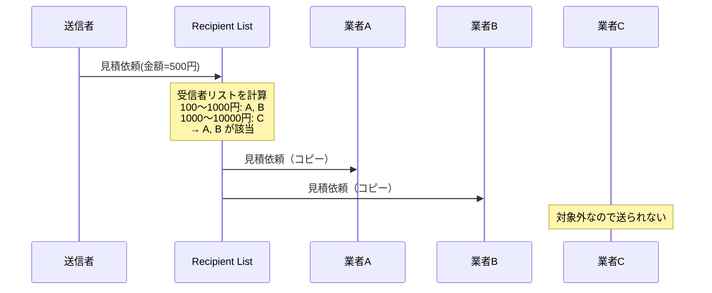

# Recipient List

## このパターンは何をするのか

Recipient Listは、**1つのメッセージを複数の宛先にコピーして送る**パターンです。送る宛先は、メッセージの内容に基づいて動的に決定されます。

### 身近な例で考える

メーリングリストを想像してください。

メーリングリストに1通のメールを送ると、リストに登録された全員にコピーが届きます。誰にメールが届くかは、リストの登録内容によって決まります。



Recipient Listも同じです。メッセージの内容を検査して、「このメッセージは誰に送るべきか」を判断し、該当する全ての受信者にメッセージのコピーを送ります。

## なぜRecipient Listが必要なのか

### 問題の背景

ビジネスでは、同じ情報を複数の関係者に送りたいことがよくあります。しかし、**全員に送るのではなく、関係者だけに送りたい**のです。

例えば、見積依頼を考えてみましょう。複数の業者に見積もりを依頼したいのですが、依頼する業者は注文の金額によって異なります。



### Recipient Listがない場合の問題

**問題1: 送信者が全ての受信者と条件を管理する必要がある**

「この金額の場合はA社とB社に送る」「この金額の場合はC社に送る」といったルールを、送信者が全て把握しなければなりません。

**問題2: Publish-Subscribeでは関係のない受信者にもメッセージが届く**

Publish-Subscribe Channel（全員に配信）を使うと、関係のない業者にも見積依頼が届いてしまいます。

**問題3: Content-Based Routerでは1つの宛先にしか送れない**

[[content_based_router|Content-Based Router]]は1つのメッセージを1つの宛先に送るパターンなので、複数の宛先に同時に送ることができません。

### Recipient Listを使うと

Recipient Listを使うと、メッセージの内容に基づいて受信者リストを計算し、該当する全員にメッセージを送れます。



## Recipient Listの仕組み

### 基本的な動作

Recipient Listは以下のステップで動作します。

1. **メッセージを受け取る**
2. **メッセージの内容を検査して、受信者リストを計算する**
3. **リストに含まれる全ての受信者に、メッセージのコピーを送る**

### 処理の流れ



### Publish-Subscribeとの違い

Recipient ListとPublish-Subscribe Channelは、どちらも複数の宛先にメッセージを送りますが、制御の方法が異なります。

| 観点 | Recipient List | Publish-Subscribe |
|-----|---------------|-------------------|
| 送信先の決定 | 送信側（またはルーター）が決定 | 受信側が購読して決定 |
| 選択の制御 | きめ細かい制御が可能 | 受信者が自分で選択 |
| メッセージの宛先 | メッセージ内容に基づいて計算 | トピックに購読した全員 |

## Recipient Listのメリットとデメリット

### メリット

**必要な受信者だけに送れる**

メッセージの内容に基づいて受信者を選択するので、関係のない受信者にはメッセージが届きません。

**送信者と受信者を分離できる**

送信者は受信者の詳細を知らなくて良いので、システム間の依存関係が減ります。

**受信者の追加・削除が容易**

新しい受信者を追加したい場合、Recipient Listの設定を変えるだけで済みます。

### デメリット

**メッセージ数が増える**

受信者の数だけメッセージがコピーされるので、システム全体のメッセージ量が増加します。

**結果の集約が必要**

複数の受信者からの応答を集める場合、[[aggregator|Aggregator]]が必要になります。これを組み合わせたのが[[scatter_gather|Scatter-Gather]]パターンです。

**配信の原子性が保証されない**

複数の受信者への送信は、個別に行われます。一部だけ成功して一部が失敗する可能性があります。

### やってはいけないこと

**受信者リストをハードコードする**

受信者リストを変更するたびに再デプロイが必要になります。設定ファイルや登録メカニズムを使いましょう。

**全ての受信者に無条件で送信する**

それなら Publish-Subscribe Channel を使うべきです。Recipient Listは「条件に応じて選択的に送信する」場合に使います。

**応答の集約を考慮しない**

受信者からの応答を統合する必要がある場合は、最初から[[scatter_gather|Scatter-Gather]]パターンを検討しましょう。

## 実装例

### Akka Typed Actor (Scala)

以下は、見積依頼を該当する業者に送信するRecipient Listの実装例です。

```scala
import akka.actor.typed.{ActorRef, Behavior}
import akka.actor.typed.scaladsl.Behaviors

// 見積依頼
case class RequestForQuotation(
  rfqId: String,
  items: Seq[Item]
) {
  val totalPrice: Double = items.map(_.price).sum
}

case class Item(itemId: String, price: Double)

// 業者への見積依頼メッセージ
case class QuoteRequest(
  rfqId: String,
  itemId: String,
  price: Double,
  totalOrderPrice: Double
)

// 業者の対応範囲を表すデータ
case class QuoterInterest(
  quoterId: String,
  processor: ActorRef[QuoteRequest],
  lowPrice: Double,   // 対応可能な最低金額
  highPrice: Double   // 対応可能な最高金額
)

// Recipient Listの実装
object QuotationRecipientList {
  sealed trait Command
  case class ProcessRfq(rfq: RequestForQuotation) extends Command
  case class RegisterInterest(interest: QuoterInterest) extends Command

  def apply(): Behavior[Command] = router(Vector.empty)

  private def router(
    interests: Vector[QuoterInterest]
  ): Behavior[Command] =
    Behaviors.receive { (context, command) =>
      command match {
        // 業者を登録
        case RegisterInterest(interest) =>
          context.log.info(
            s"業者を登録: ${interest.quoterId} (${interest.lowPrice}〜${interest.highPrice}円)"
          )
          router(interests :+ interest)

        // 見積依頼を処理
        case ProcessRfq(rfq) =>
          // 受信者リストを計算
          val recipients = calculateRecipientList(rfq, interests)
          context.log.info(
            s"見積依頼 ${rfq.rfqId} を ${recipients.size} 社に送信"
          )

          // 各受信者にメッセージのコピーを送信
          recipients.foreach { interest =>
            rfq.items.foreach { item =>
              val request = QuoteRequest(
                rfq.rfqId,
                item.itemId,
                item.price,
                rfq.totalPrice
              )
              context.log.info(s"${interest.quoterId} に見積依頼を送信")
              interest.processor ! request
            }
          }
          Behaviors.same
      }
    }

  // 受信者リストを計算する
  private def calculateRecipientList(
    rfq: RequestForQuotation,
    interests: Vector[QuoterInterest]
  ): Vector[QuoterInterest] = {
    val totalPrice = rfq.totalPrice
    interests.filter { interest =>
      // この業者の対応範囲内かどうかをチェック
      totalPrice >= interest.lowPrice && totalPrice <= interest.highPrice
    }
  }
}

// 見積業者
object QuoteProcessor {
  def apply(quoterId: String, discountRate: Double): Behavior[QuoteRequest] =
    Behaviors.receive { (context, request) =>
      val discountPrice = request.price * (1 - discountRate)
      context.log.info(
        s"$quoterId が見積を計算: ${request.itemId} → $discountPrice 円"
      )
      Behaviors.same
    }
}

// 使用例
object RecipientListExample {
  def setup(): Behavior[Nothing] =
    Behaviors.setup[Nothing] { context =>
      val recipientList = context.spawn(QuotationRecipientList(), "recipientList")

      // 業者を登録
      val smallQuoterA = context.spawn(
        QuoteProcessor("小規模業者A", 0.05),
        "smallQuoterA"
      )
      recipientList ! QuotationRecipientList.RegisterInterest(
        QuoterInterest("小規模業者A", smallQuoterA, 100, 1000)
      )

      val smallQuoterB = context.spawn(
        QuoteProcessor("小規模業者B", 0.03),
        "smallQuoterB"
      )
      recipientList ! QuotationRecipientList.RegisterInterest(
        QuoterInterest("小規模業者B", smallQuoterB, 100, 1000)
      )

      val largeQuoter = context.spawn(
        QuoteProcessor("大規模業者C", 0.10),
        "largeQuoter"
      )
      recipientList ! QuotationRecipientList.RegisterInterest(
        QuoterInterest("大規模業者C", largeQuoter, 1000, 10000)
      )

      // 見積依頼を送信
      recipientList ! QuotationRecipientList.ProcessRfq(
        RequestForQuotation("RFQ-001", Seq(
          Item("item1", 300),
          Item("item2", 200)
        ))  // 合計500円 → 小規模業者A, Bに送信
      )

      Behaviors.empty
    }
}
```

### コードのポイント

**受信者リストの動的計算**

`calculateRecipientList` メソッドで、メッセージの内容（合計金額）に基づいて送信先を計算しています。

**メッセージのコピーを各受信者に送信**

該当する全ての業者に、同じ見積依頼のコピーを送信しています。

**業者の登録機構**

`RegisterInterest` コマンドで、業者が自分の対応範囲を登録できます。これにより、業者の追加・削除が容易になります。

## 関連するパターン

| パターン | 関係 |
|---------|------|
| [[aggregator\|Aggregator]] | 複数の受信者からの応答を集約する |
| [[scatter_gather\|Scatter-Gather]] | Recipient List + Aggregatorの組み合わせ |
| [[content_based_router\|Content-Based Router]] | 1つの宛先に送る点が異なる |
| [[dynamic_router\|Dynamic Router]] | 動的なルール更新の仕組み |

## 次に読むべき内容

- [[aggregator|Aggregator]] - 応答の集約が必要な場合
- [[scatter_gather|Scatter-Gather]] - 問い合わせ→応答集約のパターン

## 参考資料

- [Enterprise Integration Patterns - Recipient List](https://www.enterpriseintegrationpatterns.com/patterns/messaging/RecipientList.html)
