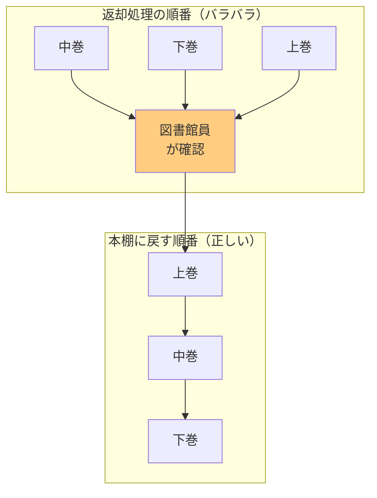
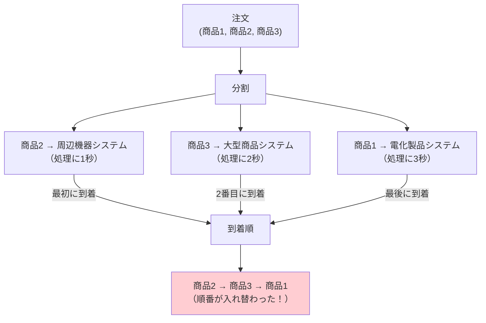
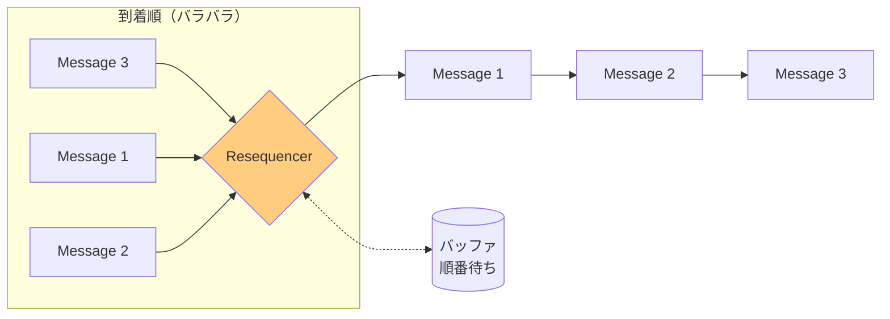
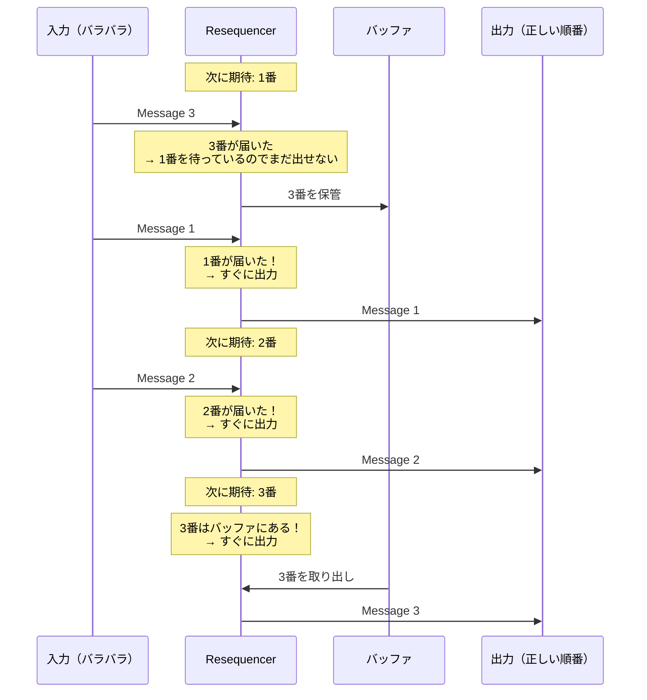

# Resequencer

## このパターンは何をするのか

Resequencerは、**バラバラの順番で届いたメッセージを、元の順番に並べ替えて出力する**パターンです。

### 身近な例で考える

図書館で本を借りる場面を想像してください。

あなたは「上巻→中巻→下巻」の順番で3冊の本を返却棚に戻そうとしています。ところが、返却処理のタイミングで、中巻が先に処理され、次に下巻、最後に上巻が処理されました。

このままでは本棚に「中巻→下巻→上巻」とバラバラに並んでしまいます。図書館員（Resequencer）は、本に書かれた巻数を見て、正しい順番（上巻→中巻→下巻）に並べ替えてから本棚に戻します。



Resequencerも同じです。到着した順番ではなく、メッセージに付けられた「順序番号」を見て、正しい順番に並べ替えてから次の処理に渡します。

## なぜResequencerが必要なのか

### 問題の背景

メッセージングシステムでは、**メッセージが送った順番通りに届くとは限りません**。

特に以下のような場合に、順番が乱れることがあります。

**[[splitter|Splitter]]で分割した場合**

1つの注文を3つの商品メッセージに分割し、それぞれを異なるシステムで処理すると、処理時間の違いによって到着順が変わります。



**[[content_based_router|Content-Based Router]]でルーティングした場合**

メッセージの内容によって異なる経路を通ると、経路ごとの処理時間の違いで順番が変わります。

### Resequencerがない場合の問題

**問題1: データの整合性が壊れる**

銀行の取引履歴を考えてみましょう。「入金→出金→入金」の順番が「出金→入金→入金」に変わると、残高計算が合わなくなる可能性があります。

**問題2: 下流のシステムが順番に依存している**

「ユーザー作成→プロフィール更新→アカウント有効化」という一連の処理は、この順番でないと正しく動きません。

**問題3: ログや監査記録が正しく残らない**

処理の順番が乱れると、後から「何が起きたか」を追跡することが難しくなります。

### Resequencerを使うと

Resequencerを使うと、バラバラに届いたメッセージを元の順番に戻せます。



## Resequencerの仕組み

### 基本的な動作

Resequencerは**ステートフル（状態を持つ）**なパターンです。内部にバッファ（一時保管場所）を持ち、以下のように動作します。

1. **メッセージを受け取る**
2. **順序番号を確認する**
3. **次に出力すべき番号なら、すぐに出力する**
4. **そうでなければ、バッファに保管して待つ**
5. **先行メッセージが届いたら、バッファ内のメッセージも順番に出力する**

### 処理の流れ

具体的な例で見てみましょう。メッセージ1, 2, 3を期待しているResequencerに、3→1→2の順番でメッセージが届いた場合です。



### 順序番号の重要性

Resequencerが正しく動作するためには、**各メッセージに順序番号が付いている必要があります**。

[[splitter|Splitter]]でメッセージを分割するとき、以下の情報を付与しておくことが重要です。

| フィールド | 説明 | 例 |
|-----------|------|-----|
| correlationId | どのグループに属するか | "order-12345" |
| sequenceNumber | そのグループの中で何番目か | 2 |
| totalCount | 全部でいくつあるか | 3 |

## Resequencerのメリットとデメリット

### メリット

**下流のシステムに順序を保証できる**

下流のシステムは「メッセージは必ず正しい順番で届く」と安心して処理できます。順序の心配をする必要がありません。

**上流と下流を変更せずに導入できる**

Resequencerを間に挟むだけで、上流のシステムも下流のシステムも変更する必要がありません。

**柔軟な順序定義が可能**

数字だけでなく、タイムスタンプや優先度など、様々な基準で順序を定義できます。

### デメリット

**メモリを消費する**

先行メッセージが届くまで後続メッセージをバッファに保持するため、メモリを使います。

**遅延が発生する**

先行メッセージが届くまで待つため、処理全体の遅延が発生する可能性があります。

**メッセージが欠落した場合の対処が必要**

もし1番のメッセージが永久に届かなかったら、2番以降のメッセージはずっとバッファに溜まり続けます。この問題に対処するため、タイムアウトの設定が必要です。

### やってはいけないこと

**タイムアウトを設定しない**

メッセージが欠落した場合、永久にバッファに溜まり続けます。必ずタイムアウトを設定し、「一定時間待っても届かなかったら諦める」という処理を入れましょう。

**順序番号を付けずにResequencerを使う**

順序番号がなければ、Resequencerは「何番目のメッセージか」を判断できません。[[splitter|Splitter]]でメッセージを分割するときに、必ず順序番号を付けましょう。

**不要な場面でResequencerを使う**

1つの送信元から1つの受信先への直接送信の場合、通常は順序が保証されます。この場合、Resequencerは不要です。

## 実装例

### Akka Typed Actor (Scala)

以下は、順不同で届いたメッセージを正しい順番に並べ替えるResequencerの実装例です。

```scala
import akka.actor.typed.{ActorRef, Behavior}
import akka.actor.typed.scaladsl.{Behaviors, TimerScheduler}
import scala.collection.immutable.TreeMap
import scala.concurrent.duration._

// 順序番号付きのメッセージ
case class SequencedMessage[T](
  correlationId: String,    // どのグループに属するか
  sequenceNumber: Int,      // 何番目のメッセージか
  totalCount: Option[Int],  // 全部でいくつあるか（わかる場合）
  payload: T                // 実際のデータ
)

// Resequencerの実装
object Resequencer {
  sealed trait Command[+T]
  case class Receive[T](message: SequencedMessage[T]) extends Command[T]
  private case class Timeout[T](correlationId: String) extends Command[T]

  // グループごとの状態を管理
  case class SequenceState[T](
    nextExpected: Int,                        // 次に期待する番号
    buffer: TreeMap[Int, SequencedMessage[T]], // 順番待ちのメッセージ
    totalCount: Option[Int]                   // 全部でいくつあるか
  )

  def apply[T](
    output: ActorRef[T],
    timeout: FiniteDuration = 5.seconds
  ): Behavior[Command[T]] =
    Behaviors.withTimers { timers =>
      resequencer(Map.empty, output, timers, timeout)
    }

  private def resequencer[T](
    sequences: Map[String, SequenceState[T]],
    output: ActorRef[T],
    timers: TimerScheduler[Command[T]],
    timeout: FiniteDuration
  ): Behavior[Command[T]] =
    Behaviors.receive { (context, command) =>
      command match {
        case Receive(message) =>
          val correlationId = message.correlationId

          // このグループの現在の状態を取得（なければ新規作成）
          val state = sequences.getOrElse(
            correlationId,
            SequenceState[T](1, TreeMap.empty, message.totalCount)
          )

          // タイムアウトタイマーを設定
          timers.startSingleTimer(
            correlationId,
            Timeout(correlationId),
            timeout
          )

          // バッファに追加
          val newBuffer = state.buffer + (message.sequenceNumber -> message)
          val newState = state.copy(
            buffer = newBuffer,
            totalCount = state.totalCount.orElse(message.totalCount)
          )

          // 順番通りに出力できるメッセージがあれば出力
          val (updatedState, count) = dispatchInOrder(newState, output, context)

          if (count > 0) {
            context.log.info(s"$correlationId: $count 件のメッセージを出力")
          }

          // 全てのメッセージを出力完了したかチェック
          val isComplete = updatedState.totalCount.exists { total =>
            updatedState.nextExpected > total
          }

          if (isComplete) {
            timers.cancel(correlationId)
            context.log.info(s"$correlationId: 全メッセージの並べ替え完了")
            resequencer(sequences - correlationId, output, timers, timeout)
          } else {
            resequencer(
              sequences + (correlationId -> updatedState),
              output, timers, timeout
            )
          }

        case Timeout(correlationId) =>
          // タイムアウト: 待ちきれないので、残りのメッセージを順番に出力
          sequences.get(correlationId).foreach { state =>
            context.log.warn(
              s"$correlationId: タイムアウト（バッファに${state.buffer.size}件残り）"
            )
            state.buffer.values.toSeq
              .sortBy(_.sequenceNumber)
              .foreach(msg => output ! msg.payload)
          }
          resequencer(sequences - correlationId, output, timers, timeout)
      }
    }

  // 順番通りに出力できるメッセージを連続して出力
  private def dispatchInOrder[T](
    state: SequenceState[T],
    output: ActorRef[T],
    context: akka.actor.typed.scaladsl.ActorContext[Command[T]]
  ): (SequenceState[T], Int) = {
    var current = state
    var dispatched = 0

    // 次に期待する番号がバッファにある限り、出力し続ける
    while (current.buffer.contains(current.nextExpected)) {
      val message = current.buffer(current.nextExpected)
      output ! message.payload
      context.log.debug(s"出力: ${message.sequenceNumber}番目")

      current = current.copy(
        nextExpected = current.nextExpected + 1,
        buffer = current.buffer - current.nextExpected
      )
      dispatched += 1
    }

    (current, dispatched)
  }
}

// 使用例
object ResequencerExample {
  case class OrderItem(id: String, name: String)

  def setup(): Behavior[Nothing] =
    Behaviors.setup[Nothing] { context =>
      // 出力先（順番通りに処理する）
      val processor = context.spawn(
        Behaviors.receiveMessage[OrderItem] { item =>
          println(s"処理中: ${item.id} - ${item.name}")
          Behaviors.same
        },
        "processor"
      )

      // Resequencerを作成
      val resequencer = context.spawn(
        Resequencer[OrderItem](processor),
        "resequencer"
      )

      // バラバラの順番でメッセージを送信
      resequencer ! Resequencer.Receive(
        SequencedMessage("order-1", 3, Some(3), OrderItem("item3", "モニター"))
      )
      resequencer ! Resequencer.Receive(
        SequencedMessage("order-1", 1, Some(3), OrderItem("item1", "パソコン"))
      )
      resequencer ! Resequencer.Receive(
        SequencedMessage("order-1", 2, Some(3), OrderItem("item2", "キーボード"))
      )

      // 出力は正しい順番になる:
      // 処理中: item1 - パソコン
      // 処理中: item2 - キーボード
      // 処理中: item3 - モニター

      Behaviors.empty
    }
}
```

### コードのポイント

**TreeMapによる順序管理**

`TreeMap` を使うことで、メッセージを順序番号でソートされた状態で保持できます。

**タイムアウト処理**

`TimerScheduler` を使って、一定時間経過後にタイムアウトを発火させています。タイムアウト時は、バッファに残っているメッセージを順番に出力して、そのグループの処理を終了します。

**連続出力の最適化**

`dispatchInOrder` メソッドで、出力可能なメッセージを連続して出力しています。例えば、1番と3番がバッファにある状態で2番が届いたら、2番と3番を連続して出力できます。

## 関連するパターン

| パターン | 関係 |
|---------|------|
| [[splitter\|Splitter]] | 分割によって順序が乱れる原因になる |
| [[aggregator\|Aggregator]] | Resequencerは「順序を戻す」、Aggregatorは「集約する」という違いがある |
| [[content_based_router\|Content-Based Router]] | ルーティングによって順序が乱れる原因になる |
| [[composed_message_processor\|Composed Message Processor]] | Splitter + Router + Resequencer + Aggregator の組み合わせ |

## 次に読むべき内容

- [[aggregator|Aggregator]] - 順序を戻した後、結果を集約したい場合
- [[composed_message_processor|Composed Message Processor]] - 分割→処理→並べ替え→集約の完全なパターン

## 参考資料

- [Enterprise Integration Patterns - Resequencer](https://www.enterpriseintegrationpatterns.com/patterns/messaging/Resequencer.html)
