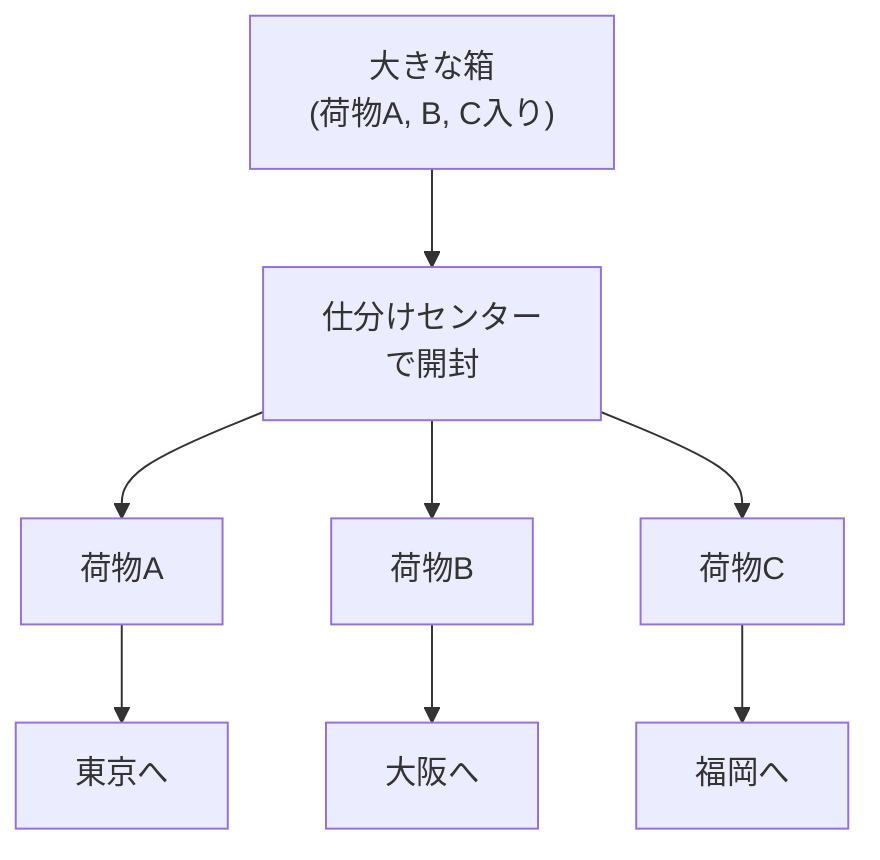
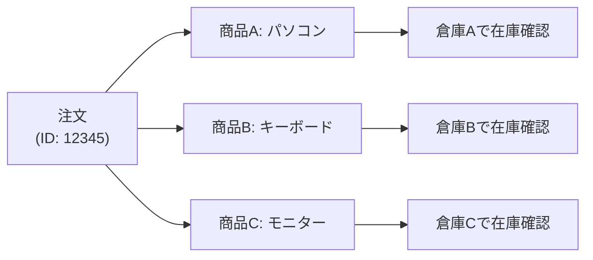
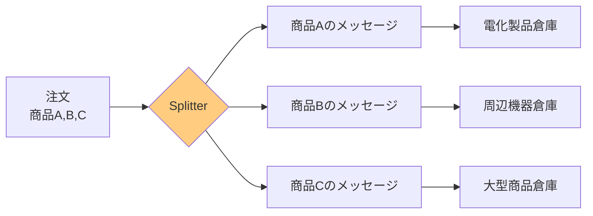
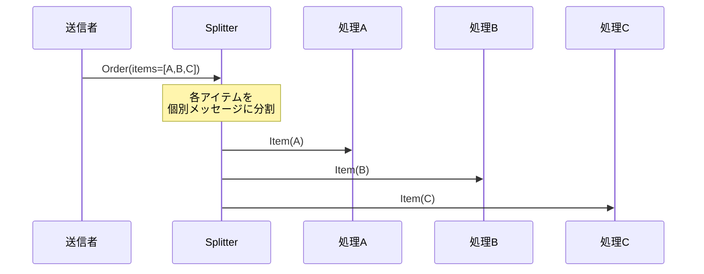
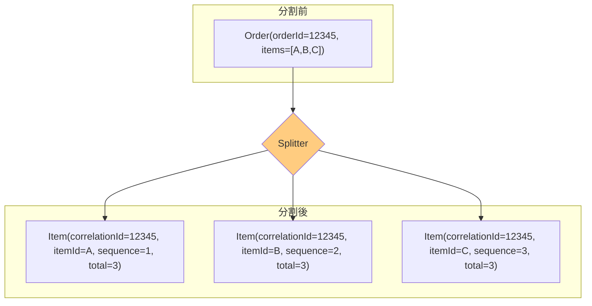
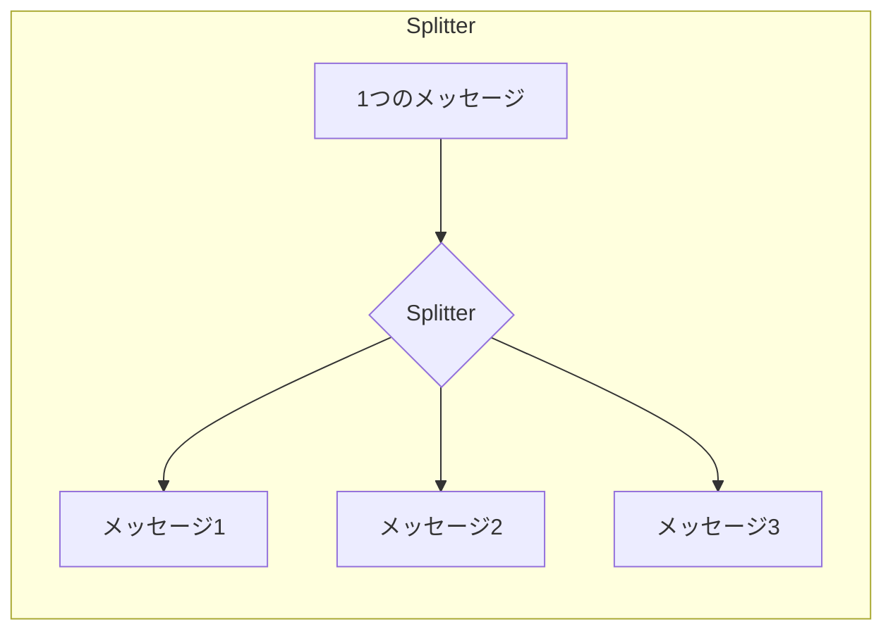
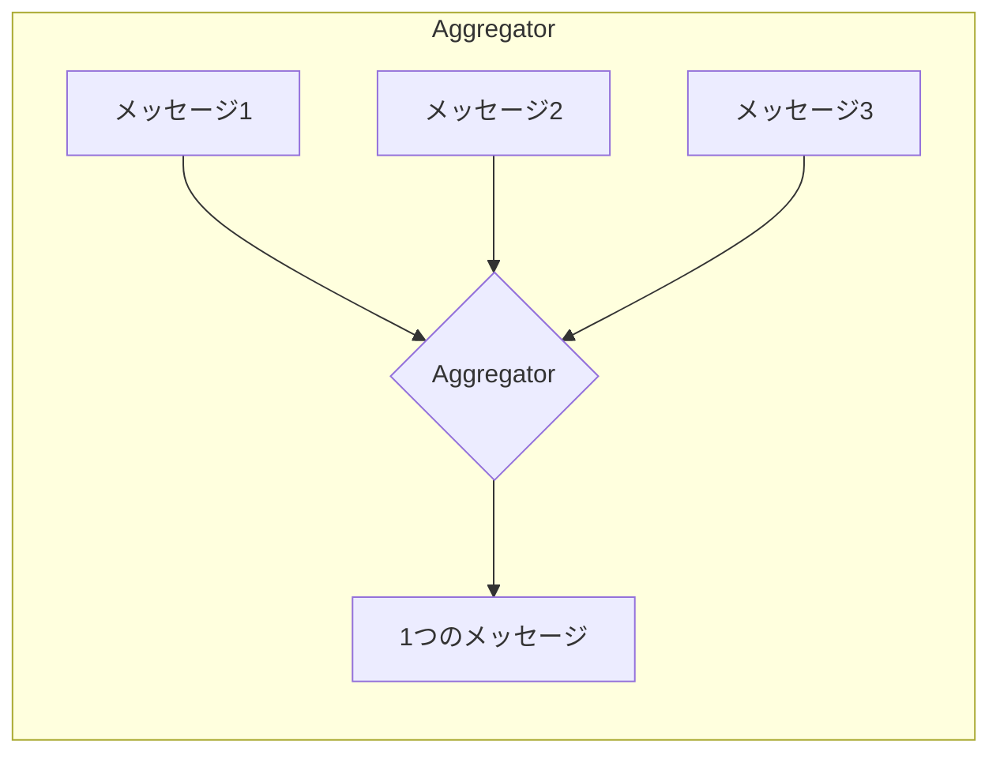

# Splitter

## このパターンは何をするのか

Splitterは、**1つのメッセージを複数のメッセージに分割する**パターンです。

### 身近な例で考える

宅配便の仕分けセンターを想像してください。

大きな箱の中に、3つの荷物が入って届きました。仕分けセンターでは、箱を開けて3つの荷物を取り出し、それぞれ別の配送先に振り分けます。



Splitterも同じです。複数の要素を含む1つのメッセージを受け取り、要素ごとに別々のメッセージに分割して、それぞれ適切な処理先に送ります。

## なぜSplitterが必要なのか

### 問題の背景

実際のビジネスでは、1つのメッセージに複数の関連する要素が含まれていることがよくあります。

例えば、ECサイトの注文を考えてみましょう。1つの注文に3つの商品が含まれているとします。



問題は、**各商品を別々のシステムで処理する必要がある**ことです。

- パソコン → 電化製品倉庫
- キーボード → 周辺機器倉庫
- モニター → 大型商品倉庫

### Splitterがない場合の問題

**問題1: 全ての商品を1つのシステムで処理できない**

各倉庫システムは自分が担当する商品だけを処理できます。注文全体をそのまま送っても、処理できません。

**問題2: 並列処理ができない**

商品ごとに分割しないと、在庫確認を並列で実行できず、全体の処理時間が長くなります。

**問題3: 各商品への適切なルーティングができない**

[[content_based_router|Content-Based Router]]で商品タイプごとに振り分けるには、まず個別の商品メッセージに分割する必要があります。

### Splitterを使うと

Splitterを使うと、1つの注文を商品ごとのメッセージに分割できます。



## Splitterの仕組み

### 基本的な動作

Splitterは以下のステップで動作します。

1. **複合メッセージを受け取る**（例：3商品を含む注文）
2. **各要素ごとに個別のメッセージを作成する**
3. **作成したメッセージを次の処理に送る**

### 処理の流れ



### Correlation IDの重要性

分割されたメッセージには、**元のメッセージとの関連付け情報（Correlation ID）**を付けることが重要です。

なぜなら、後で[[aggregator|Aggregator]]を使って結果を統合するときに、「どのメッセージが同じ注文に属するか」を判断する必要があるからです。



分割後のメッセージには以下の情報を含めると良いでしょう：

| フィールド | 説明 | 例 |
|-----------|------|---|
| correlationId | 元のメッセージを識別するID | 12345 |
| sequence | 何番目の要素か | 2 |
| total | 全部でいくつに分割されたか | 3 |

## Splitterのメリットとデメリット

### メリット

**並列処理が可能になる**

分割されたメッセージは独立して処理できるので、並列処理によって全体の処理時間を短縮できます。

**要素ごとに異なる処理を適用できる**

[[content_based_router|Content-Based Router]]と組み合わせて、各要素を適切な処理先にルーティングできます。

**各処理システムの責務が明確になる**

各処理システムは自分が担当する要素タイプだけを処理すれば良くなります。

### デメリット

**メッセージ数が増える**

1つのメッセージがN個のメッセージに増えるので、システム全体のメッセージ量が増加します。

**処理順序が保証されない**

分割後のメッセージは並列に処理される可能性があるため、元の順序が失われることがあります。順序が重要な場合は[[resequencer|Resequencer]]が必要です。

**結果の統合が必要**

分割した結果を最終的に1つにまとめる必要がある場合は、[[aggregator|Aggregator]]を使って統合する必要があります。

**トランザクションの管理が複雑になる**

元のメッセージは1つのトランザクションで処理できましたが、分割後は複数のトランザクションになる可能性があります。

### やってはいけないこと

**Correlation IDを付けない**

後で結果を統合するときに、どのメッセージが関連しているか判断できなくなります。

**単一要素のメッセージにSplitterを使う**

要素が1つしかないメッセージを分割する意味はありません。

**結果の統合を考慮しない**

分割した後の処理フローを設計せずにSplitterを使うと、後で困ることになります。

## 実装例

### Akka Typed Actor (Scala)

以下は、注文を商品ごとに分割するSplitterの実装例です。

```scala
import akka.actor.typed.{ActorRef, Behavior}
import akka.actor.typed.scaladsl.Behaviors

// 元のメッセージ（複数の商品を含む注文）
case class Order(orderId: String, items: Seq[OrderItem])
case class OrderItem(itemId: String, itemType: String, quantity: Int)

// 分割後のメッセージ（Correlation ID付き）
case class SplitOrderItem(
  correlationId: String,  // 元のorderIdを保持（後でAggregatorが使用）
  sequenceNumber: Int,    // 何番目の要素か
  totalItems: Int,        // 全部でいくつに分割されたか
  item: OrderItem
)

// Splitterの実装
object OrderSplitter {
  sealed trait Command
  case class Split(order: Order) extends Command

  def apply(
    itemProcessor: ActorRef[SplitOrderItem]
  ): Behavior[Command] =
    Behaviors.receive { (context, command) =>
      command match {
        case Split(order) =>
          context.log.info(
            s"注文 ${order.orderId} を ${order.items.size} 個のアイテムに分割"
          )

          // 各アイテムを個別のメッセージとして発行
          order.items.zipWithIndex.foreach { case (item, index) =>
            val splitItem = SplitOrderItem(
              correlationId = order.orderId,  // 元の注文IDを保持
              sequenceNumber = index + 1,
              totalItems = order.items.size,
              item = item
            )
            context.log.info(s"分割: ${item.itemId} (${index + 1}/${order.items.size})")
            itemProcessor ! splitItem
          }
          Behaviors.same
      }
    }
}

// Content-Based Routerと組み合わせたSplitter
object SplitterWithRouter {
  sealed trait Command
  case class Split(order: Order) extends Command

  def apply(
    electronicProcessor: ActorRef[SplitOrderItem],  // 電化製品用
    peripheralProcessor: ActorRef[SplitOrderItem],  // 周辺機器用
    defaultProcessor: ActorRef[SplitOrderItem]      // その他
  ): Behavior[Command] =
    Behaviors.receive { (context, command) =>
      command match {
        case Split(order) =>
          order.items.zipWithIndex.foreach { case (item, index) =>
            val splitItem = SplitOrderItem(
              correlationId = order.orderId,
              sequenceNumber = index + 1,
              totalItems = order.items.size,
              item = item
            )

            // 分割後にContent-Based Routerでルーティング
            val destination = item.itemType match {
              case "electronic"  => electronicProcessor
              case "peripheral"  => peripheralProcessor
              case _             => defaultProcessor
            }

            context.log.info(
              s"${item.itemId} (${item.itemType}) を ${destination.path.name} へ"
            )
            destination ! splitItem
          }
          Behaviors.same
      }
    }
}
```

### コードのポイント

**Correlation IDを付与**

`correlationId = order.orderId` で、元の注文IDを保持しています。これにより、後でAggregatorが「どのメッセージが同じ注文に属するか」を判断できます。

**シーケンス情報を付与**

`sequenceNumber` と `totalItems` で、分割後のメッセージの順序と総数を記録しています。これにより、Aggregatorが「全てのメッセージが揃ったか」を判断できます。

**Content-Based Routerとの組み合わせ**

`SplitterWithRouter` では、分割と同時にルーティングも行っています。これは[[composed_message_processor|Composed Message Processor]]パターンの一部です。

## SplitterとAggregatorの関係

SplitterとAggregatorは**逆の関係**にあります。





多くの場合、Splitterで分割した後、各要素を処理し、最後にAggregatorで結果を統合するという流れになります。これが[[composed_message_processor|Composed Message Processor]]パターンです。

## 関連するパターン

| パターン | 関係 |
|---------|------|
| [[aggregator\|Aggregator]] | Splitterの逆の役割。分割されたメッセージを再び統合する |
| [[content_based_router\|Content-Based Router]] | Splitterで分割した後、各メッセージをルーティングするのに使う |
| [[composed_message_processor\|Composed Message Processor]] | Splitter + Router + Aggregatorを組み合わせた複合パターン |
| [[resequencer\|Resequencer]] | 分割後に順序が乱れた場合に、元の順序に並べ直す |
| [[correlation_identifier\|Correlation Identifier]] | 分割されたメッセージを関連付けるために使用 |

## 次に読むべき内容

- [[aggregator|Aggregator]] - 分割した結果を統合する場合
- [[composed_message_processor|Composed Message Processor]] - 分割→処理→統合の完全なパターン
- [[resequencer|Resequencer]] - 分割後の順序を復元する場合

## 参考資料

- [Enterprise Integration Patterns - Splitter](https://www.enterpriseintegrationpatterns.com/patterns/messaging/Sequencer.html)
