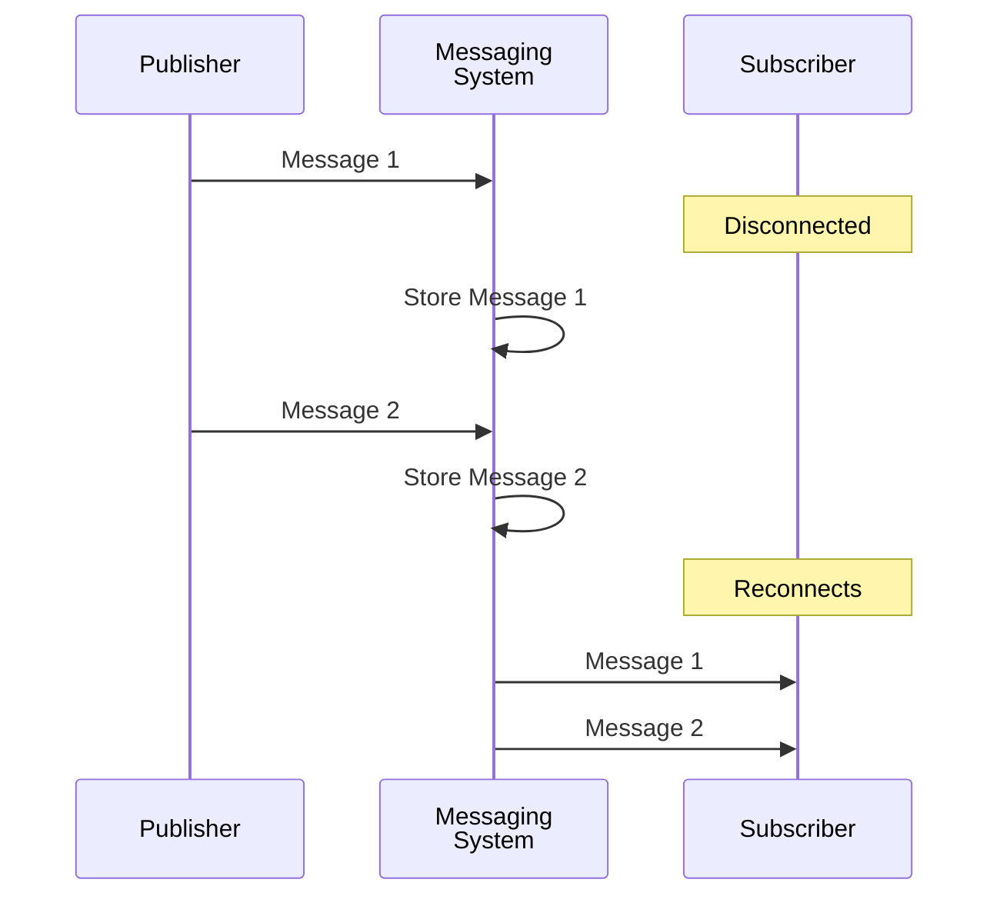

# Durable Subscriber

## パターンの概要

## EIPにおけるDurable Subscriber

Durable Subscriber（耐久的購読者）は、Publish-Subscribe Channel上でメッセージを受け取るアプリケーション向けの設計パターンである。

### 問題

購読者がメッセージをリッスンしていない間に、メッセージの喪失を避けるにはどうすればよいか。

### 解決策

メッセージングシステムに購読者がメッセージをリッスンしていない間に発行されたメッセージを保存させる。

### 特徴

- **非アクティブ期間の保存**: 購読者が切断されている間、システムがメッセージを保持し、再接続時に配信する
- **アクティブ時の透過性**: 接続中は、耐久的購読と非耐久的購読の動作に差異が生じない
- **メッセージ喪失の防止**: 購読者がオフラインでも、発行されたすべてのメッセージを受け取れる保証

## アクターモデルにおけるDurable Subscriber

受信アクターがアクティブに実行されていない間に送信されたメッセージを見逃さないようにする必要がある場合にDurable Subscriberを使用する。

Akkaツールキットは執筆時点でDurable Subscriberの明示的なサポートを提供していない。しかし、この種の機能が必要な場合は、想像力と創意工夫があれば手の届かないものではない。また、Enterprise Integration Patterns [EIP]はこのパターンをPublish-Subscribe Channelでの使用のために命名しているが、実際にはあらゆる種類のアクターMessage Channelで使用可能である。

### Akka PersistenceとPersistentView

Akka PersistenceはPersistentViewと呼ばれるものをサポートしている。PersistentViewはAkkaがCQRSパターン[CQRS]をサポートする1つの方法であり、PersistentActorがその状態をカスタマイズされたビューに投影できる。同じメカニズムを使用してDurable Subscriberを作成できる。

**注意**: 執筆時点で、PersistentViewはAkka Streamsソリューションに置き換えられる予定である。

### ソリューションの構成

#### 第1部: PublishedTopic（PersistentActor）

Messagesが発行/送信またはエンキューされる特別なMessage Channelを表すPersistentActorを作成する。このPersistentActorは、メッセージが発行/送信される名前付きトピック/キューと考えることができる。名前はアクターの`persistenceId`によって提供される。各Messageがこの名前付きトピック/キューPersistentActorによって受信されると、アクターが行うのはそれを自身のジャーナルに永続化することだけである。

この場合、`persist()`の特別な形式である`persistAsync()`を使用できる。次のメッセージを受け入れる前に永続化の成功を待つ必要がないため、PersistentActorで利用可能な最も最適な永続化操作を使用できる。

#### 第2部: TopicSubscriber（PersistentView）

各サブスクライバーに1つのPersistentViewインスタンスを作成する。これを名前付きキューとして扱いたい場合は、キューコンシューマーとして1つだけPersistentViewを持つことになる。いずれの場合も、トピック/キューからMessagesを受信するPersistentViewインスタンスは、その`persistenceId`をPersistentActorのものに設定する。そうすると、名前付きトピック/キューに永続化されるすべてのMessageを受信する。

TopicSubscriberには追加要件がある。すでに受信したMessagesを追跡する必要がある。メッセージを受信するたびに新しいスナップショットを作成することでこれを行うことができる。このようにして、TopicSubscriberが停止して再起動されると、以前に受信したMessagesを再処理せず、まだ受信していないものだけを処理する。

この設定により、TopicSubscriberはTopicSubscriberが一定期間実行されていない場合でも、PublishedTopicに送信されたMessageを見逃すことはない。TopicSubscriberが再起動すると、以前に受信していないすべてのMessagesを受信する。

### このアプローチの欠点

このアプローチの欠点として、現在PersistentActor（例：PublishedTopic）のジャーナルからメッセージを削除する方法がないことが挙げられる。必要であれば、安全であることがわかったら定期的にジャーナルからMessagesを削除できる。

メッセージの範囲を安全に削除する方法を見つけ出すのはユーザーの課題である。サブスクライバーの確認に基づいたアプローチを使用するかもしれないが、サブスクライバーの数がわからない場合があるため、これは実用的でない可能性がある。代わりに、各メッセージの最大耐久性を決定する安全な日時ベースのソリューションを行うかもしれない。リスナーが1つしかない場合やクリアなセット数がある場合は、これは簡単な問題である。結局のところ、メッセージのクリーンアップについてあまり心配する必要がない場合に、このアプローチは最もうまく機能する。

### Apache Kafkaという代替手段

まったく異なるオプションとして、Apache Kafka [Kafka]を中心にソリューションを作成することが挙げられる。Apache Kafkaは元々高スループットのPublish-Subscribeメカニズムとして開発された。最大メッセージ保持を含むすべてのPublish-Subscribe機能を組み込んだ、より精巧なソリューションである。

おそらくAkkaチームまたは他の貢献者がより明示的なDurable Subscriberソリューションを解決するかもしれないが、それまでの間、ここで提供されるソリューションは正しいセマンティクスを持ち、オーバーヘッドがない。プログラミングインターフェースをPublish-Subscribe Channelに近づけたい場合は、正しい用語を使用するトレイトでPersistentActorとPersistentViewをカプセル化できる。

## 関連パターン

| パターン | 関係 |
|---------|------|
| Guaranteed Delivery | メッセージの確実な配信を保証する |
| Message Expiration | 古いメッセージの有効期限を設定する |
| Point-to-Point Channel | 永続的なキューを使用した代替手段 |
| Publish-Subscribe Channel | Durable Subscriberが購読するチャネル |
| [[programming/reactive_messaging_pattern/chapter9/idempotent_receiver\|Idempotent Receiver]] | 再配信されたメッセージを安全に処理する |

## 参考資料

- [Enterprise Integration Patterns - Durable Subscriber](https://www.enterpriseintegrationpatterns.com/patterns/messaging/DurableSubscription.html)
