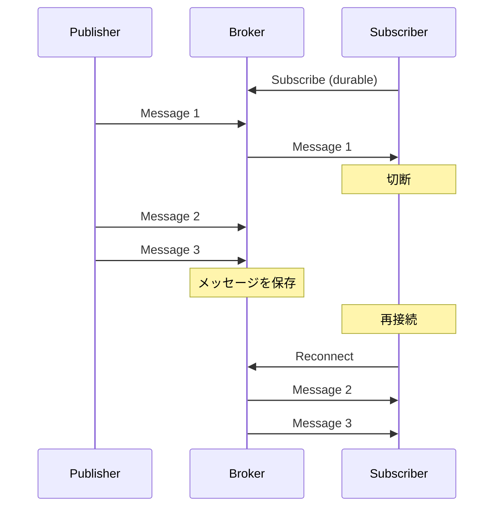

# Durable Subscriber

## パターンの概要

Durable Subscriber（耐久的購読者）は、コンシューマーがメッセージをリッスンしていない間に発行されたメッセージを見逃さないようにするパターンです。メッセージングシステムがコンシューマーの代わりにメッセージを保存し、コンシューマーが再接続したときに、見逃したメッセージを配信します。

## EIPにおけるDurable Subscriber

### 解決すべき問題

アプリケーションがPublish-Subscribeチャネル上でメッセージを受信していますが、**購読者がメッセージをリッスンしていない間に、メッセージを見逃してしまう**という問題があります。

例えば、以下のようなシナリオを考えてみましょう。

**計画的なメンテナンス**では、システムのメンテナンスのためにコンシューマーを一時的に停止する必要があります。その間に発行されたメッセージを、メンテナンス後に処理したい場合があります。

**ネットワーク障害**では、一時的なネットワーク障害によりコンシューマーがメッセージングシステムから切断される可能性があります。接続が回復した後、切断中のメッセージを受け取りたい場合があります。

**スケーリングイベント**では、オートスケーリングによりコンシューマーインスタンスが動的に追加・削除される環境で、新しいインスタンスが起動するまでの間のメッセージを見逃したくない場合があります。

**アプリケーションの再起動**では、アプリケーションの更新やクラッシュからの復旧のためにコンシューマーが再起動される可能性があります。再起動中のメッセージを処理したい場合があります。

### 解決策

**Durable Subscriber**を使用し、メッセージングシステムに購読者が切断されている間のメッセージを保存させます。

Durable Subscriberでは、メッセージングシステムが各購読者の「サブスクリプション状態」を追跡します。購読者が切断された場合、システムはその購読者宛てのメッセージをキューに保存します。購読者が再接続すると、保存されていたメッセージが配信されます。

### アクティブ時とオフライン時の動作の違い

Durable Subscriberの動作は、購読者の状態によって異なります。

**購読者がアクティブ（接続中）の場合**、Durable Subscriptionと通常のSubscriptionの間に動作上の違いはありません。メッセージは通常通りリアルタイムで配信されます。

**購読者がオフライン（切断中）の場合**、メッセージングシステムは購読者宛てのメッセージを保存します。通常のSubscriptionではメッセージは破棄されますが、Durable Subscriptionでは保持されます。

**購読者が再接続した場合**、保存されていたメッセージが購読者に配信されます。購読者は切断中に発行されたすべてのメッセージを受け取ることができます。

### Durable Subscriberの考慮事項

**ストレージ要件**として、購読者がオフラインの間、メッセージを保存するためのストレージが必要です。長期間のオフラインや大量のメッセージ発行は、ストレージを消費します。

**メッセージの有効期限**として、多くのシステムでは、保存されたメッセージに有効期限を設定できます。古すぎるメッセージは自動的に削除され、ストレージの圧迫を防ぎます。

**再接続時の処理順序**として、再接続時に大量のメッセージが一度に配信される可能性があります。コンシューマーは、このバーストを適切に処理できるように設計する必要があります。

## アクターモデルにおけるDurable Subscriber

### Akka Persistenceを使用した実装

Akkaは執筆時点でDurable Subscriberの明示的なサポートを提供していませんでしたが、Akka Persistenceを使用して同様の機能を実現できます。

この実装は二つの主要なコンポーネントで構成されます。

### PublishedTopic（PersistentActor）

最初のコンポーネントは、メッセージが発行される名前付きトピック/キューを表すPersistentActorです。

**役割**として、このアクターはメッセージを受信し、それを自身のジャーナルに永続化します。アクターの`persistenceId`がトピック/キューの名前として機能します。

**最適な永続化**として、`persistAsync()`を使用することで、次のメッセージを受け入れる前に永続化の成功を待つ必要がなくなり、高いスループットを実現できます。

**メッセージの保持**として、永続化されたメッセージは、購読者が読み取るまでジャーナルに保持されます。

### TopicSubscriber（PersistentView）

二番目のコンポーネントは、トピック/キューからメッセージを読み取るPersistentViewです。

**購読者との対応**として、各購読者に対して一つのPersistentViewインスタンスを作成します。キューとして使用する場合は、単一のPersistentViewのみを持ちます。

**persistenceIdの共有**として、PersistentViewの`persistenceId`をPublishedTopic（PersistentActor）のものと同じに設定します。これにより、トピックに永続化されたすべてのメッセージを受信できます。

**処理済みメッセージの追跡**として、TopicSubscriberは既に処理したメッセージを追跡する必要があります。スナップショットを使用して、最後に処理したメッセージの位置を保存することで、再起動時に同じメッセージを再処理することを防ぎます。

### この実装の利点

この設計により、TopicSubscriberは一定期間実行されていなくても、PublishedTopicに送信されたメッセージを見逃すことはありません。

TopicSubscriberが再起動すると、スナップショットから最後の処理位置を復元し、それ以降に永続化されたメッセージのみを処理します。これにより、Durable Subscriberパターンの本質的な要件が満たされます。

### この実装の欠点と代替手段

**メッセージの削除**として、現在のAkka Persistenceでは、PersistentActorのジャーナルからメッセージを容易に削除する方法がありません。ジャーナルは時間とともに成長し続ける可能性があります。

**安全な削除の実現**として、サブスクライバーの確認に基づいてメッセージを削除するアプローチや、日時ベースで古いメッセージを削除するアプローチを検討できます。ただし、サブスクライバーの数が不明な場合は、確認ベースのアプローチは実用的でない可能性があります。

**Apache Kafkaの活用**として、より完全なDurable Subscriber実装が必要な場合は、Apache Kafkaを検討できます。Kafkaは高スループットのPublish-Subscribeメカニズムとして設計されており、メッセージ保持、パーティショニング、コンシューマーグループなど、Durable Subscriberパターンに必要な機能を組み込みで提供しています。

## Durable Subscriberの設計ベストプラクティス

### メッセージ保持ポリシー

**時間ベースの保持**として、メッセージを一定期間（例：7日間）保持し、それ以降は自動的に削除します。購読者は、この期間内に再接続してメッセージを処理する必要があります。

**サイズベースの保持**として、保存するメッセージの総量に上限を設定します。上限に達した場合、古いメッセージから削除されます。

**確認ベースの保持**として、すべての購読者が処理を確認したメッセージを削除します。これは購読者の数が既知で固定されている場合に有効です。

### 再接続時の処理

**バッチ処理**として、再接続時に大量のメッセージが配信される可能性があるため、バッチ処理で効率的に処理することを検討します。

**順序の保証**として、保存されたメッセージが発行順序で配信されることを確認します。順序が重要な場合は、メッセージングシステムの保証を確認してください。

## 関連パターン

- **Guaranteed Delivery** - メッセージの確実な配信を保証するパターンです。Durable Subscriberは、購読者がオフラインの場合でも配信を保証する一つの方法です。

- **Message Expiration** - 古いメッセージの有効期限を設定するパターンです。Durable Subscriberで保存されたメッセージに有効期限を設定することで、ストレージの無限増加を防ぎます。

- **Point-to-Point Channel** - 永続的なキューを使用することで、Durable Subscriberと同様の効果を得られる場合があります。

- **Publish-Subscribe Channel** - Durable Subscriberが主に適用されるチャネルタイプです。

- **[[programming/reactive_messaging_pattern/chapter9/consumers/idempotent_receiver|Idempotent Receiver]]** - 再配信されたメッセージを安全に処理するために、Durable Subscriberと組み合わせて使用されます。

## 参考資料

- [Enterprise Integration Patterns - Durable Subscriber](https://www.enterpriseintegrationpatterns.com/patterns/messaging/DurableSubscription.html)
