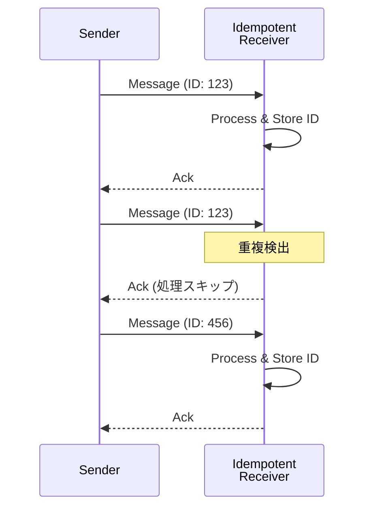

# Idempotent Receiver

## パターンの概要

Idempotent Receiver（冪等受信者）は、同じメッセージを複数回受信しても安全に処理できるように受信者を設計するパターンです。「冪等」という用語は数学に由来し、関数を繰り返し適用しても同じ結果が得られる性質を指します。メッセージングシステムにおいては、メッセージが1回受信されても複数回受信されても同じ効果をもたらし、メッセージを安全に再送信できることを意味します。

## EIPにおけるIdempotent Receiver

### 解決すべき問題

分散システムにおいて、**送信側アプリケーションがメッセージを1回だけ送信しても、受信側アプリケーションが同じメッセージを複数回受信してしまう**という問題があります。

この問題は、以下のような状況で発生します。

**ネットワークの不確実性**では、メッセージが送信されたが確認応答が失われた場合、送信者はメッセージが配信されたかどうかを知ることができません。安全のために再送信すると、受信者は同じメッセージを2回受け取ることになります。

**配信保証メカニズム**では、Guaranteed Deliveryパターンを使用してメッセージの配信を保証する場合、メッセージングシステムは配信を確実にするために再送信を行うことがあります。この再送信により、受信者が同じメッセージを複数回受け取る可能性があります。

**障害からの回復**では、受信者がメッセージを処理中にクラッシュし、再起動後に同じメッセージが再配信される場合があります。メッセージの処理は完了していたが、確認応答が送信される前にクラッシュした場合、重複処理が発生します。

**分散トランザクション**では、複数のシステム間でトランザクションを調整する際、一部のシステムでは処理が完了し、他のシステムでは完了していない状態で障害が発生すると、回復時に重複処理が発生する可能性があります。

### 解決策

受信者を**Idempotent Receiver**として設計し、同じメッセージを複数回安全に受信できるようにします。

冪等性を実現するには、主に二つのアプローチがあります。

**明示的な重複排除**として、メッセージを一意に識別するID（メッセージID、トランザクションIDなど）を使用して、既に処理済みのメッセージを検出し、重複を排除します。受信者は処理済みのメッセージIDを追跡し、同じIDを持つメッセージを再度受信した場合は処理をスキップします。

**メッセージセマンティクスの設計**として、メッセージ自体が本質的に冪等性を持つように設計します。操作の結果が、その操作を何回実行しても同じになるようにメッセージを定義します。

### 冪等な操作と非冪等な操作の違い

操作の冪等性を理解するために、具体的な例を考えてみましょう。

**非冪等な操作の例**として、「100円を入金する」という操作があります。この操作を3回実行すると、残高は300円増加します。各実行が累積的な効果を持つため、実行回数が結果に影響します。

**冪等な操作の例**として、「残高を500円に設定する」という操作があります。この操作を3回実行しても、残高は500円のままです。何回実行しても最終的な状態は同じになります。

この違いは重要です。非冪等な操作を含むメッセージが重複配信されると、意図しない副作用（この例では過剰な入金）が発生します。一方、冪等な操作であれば、重複配信されても問題ありません。

### 重複排除の実装における考慮事項

明示的な重複排除を実装する際には、いくつかの重要な考慮事項があります。

**メッセージIDの追跡範囲**として、処理済みのメッセージIDを永続的に追跡し続けることは、多くの場合現実的ではありません。メッセージIDのリストは時間とともに無限に成長する可能性があります。

**ウィンドウサイズアプローチ**として、追跡するメッセージIDの数に制限を設ける方法があります。例えば、最新の10,000件のメッセージIDのみを追跡し、それより古いIDは削除します。新しいメッセージを追跡リストに追加する際に、最も古いメッセージを削除します。

**ウィンドウサイズの適切な設定**として、ウィンドウサイズは、重複メッセージが到着するまでの最大時間間隔をカバーできる大きさに設定する必要があります。ウィンドウが小さすぎると、古い重複メッセージが新規メッセージとして誤って処理される可能性があります。

## アクターモデルにおけるIdempotent Receiver

### At-Least-Once配信との関係

アクターモデルの標準的なメッセージ配信契約は「at-most-once（最大1回）」です。これは、メッセージが配信されないか、1回だけ配信されることを意味します。メッセージが失われる可能性がありますが、重複配信は発生しません。

しかし、メッセージの喪失が許容されないシステムでは、「at-least-once（少なくとも1回）」配信が必要になります。Akka Persistenceは、この目的のための`AtLeastOnceDelivery`トレイトを提供しています。

**at-least-once配信の特性**として、メッセージは必ず1回以上配信されますが、複数回配信される可能性があります。これは、at-most-onceを「オーバーライド」するのではなく、「置き換える」ことを意味します。したがって、at-least-once配信を使用する場合、受信アクターはIdempotent Receiverである必要があります。

### 冪等性を実現する三つのアプローチ

アクターモデルで冪等性を実現するためのアプローチをいくつか紹介します。

#### メッセージの重複排除

最初のアプローチは、メッセージのアイデンティティを追跡することで重複配信を排除する方法です。

**基本的な仕組み**として、受信アクターは処理済みのメッセージIDを保持します。新しいメッセージを受信した際、そのIDが既に処理済みリストに含まれているかを確認します。含まれていれば重複として扱い、処理をスキップします。含まれていなければ、メッセージを処理し、IDを処理済みリストに追加します。

**永続化の考慮**として、処理済みメッセージIDのリストは、アクターの再起動後も保持される必要があります。これを実現するために、スナップショット機能を使用してIDリストを定期的に永続化することが考えられます。

#### 本質的に冪等なメッセージの設計

二番目のアプローチは、メッセージ自体が「自然に」冪等になるように設計する方法です。

**状態設定型のメッセージ**として、「変更を加える」のではなく「状態を設定する」形式のメッセージを使用します。例えば、「在庫を10個追加する」ではなく「在庫数を50個に設定する」というメッセージを使用します。

**注意点**として、このアプローチには限界があります。状態設定型のメッセージであっても、異なるコンテキストで同じ値を設定する場合（例：異なるトランザクションで同じ残高を設定する場合）には、追加の識別情報が必要になることがあります。

#### 状態遷移による重複の無害化

三番目のアプローチは、アクターの状態遷移を利用して重複メッセージを無害化する方法です。

**トランザクションIDによる追跡**として、各トランザクションに一意のIDを割り当て、完了したトランザクションをIDと結果のマッピングとして保存します。同じトランザクションIDを持つメッセージを再度受信した場合、実際の処理を再実行する代わりに、保存された結果を返します。

**状態遷移による制御**として、アクターの状態を変更することで、特定のメッセージを受け付けなくする方法があります。例えば、ドキュメントを「未処理」から「処理済み」状態に遷移させた場合、「処理済み」状態では同じ処理コマンドを無視するか、単に確認応答を返すように設計します。これにより、同じコマンドが複数回送信されても、最初の1回だけが実際に処理されます。

### Idempotent Receiverの設計ベストプラクティス

**重複検出の範囲を明確に定義する**として、どの期間またはどの範囲のメッセージに対して重複検出を行うかを明確に定義します。無制限の追跡は現実的ではないため、適切な境界を設定します。

**冪等性の単位を決定する**として、何をもって「同じメッセージ」とみなすかを明確にします。メッセージID、トランザクションID、またはメッセージ内容のハッシュなど、適切な識別子を選択します。

**応答の一貫性を確保する**として、重複メッセージを受信した場合でも、最初の処理時と同じ応答を返すようにします。呼び出し元から見て、重複かどうかを区別できない（または必要ない）ようにすることで、システム全体の一貫性を保ちます。

## 関連パターン

- **Guaranteed Delivery** - メッセージの確実な配信を保証するパターンです。配信保証のための再送信により重複が発生する可能性があるため、Idempotent Receiverと組み合わせて使用されます。

- **[[programming/reactive_messaging_pattern/chapter9/consumers/durable_subscription|Durable Subscriber]]** - 購読者がオフラインの間のメッセージを保存するパターンです。再配信されたメッセージを安全に処理するために、Idempotent Receiverと組み合わせます。

- **Command Message** - コマンドメッセージは状態を変更する可能性があるため、重複処理に特に注意が必要です。Idempotent Receiverパターンを適用して、コマンドの安全な再処理を可能にします。

- **[[programming/reactive_messaging_pattern/chapter7/simple-routers/resequencer|Resequencer]]** - メッセージの順序を復元するパターンです。順序復元の過程で重複メッセージを検出する機会があり、Idempotent Receiverと相補的に機能します。

## 参考資料

- [Enterprise Integration Patterns - Idempotent Receiver](https://www.enterpriseintegrationpatterns.com/patterns/messaging/IdempotentReceiver.html)
