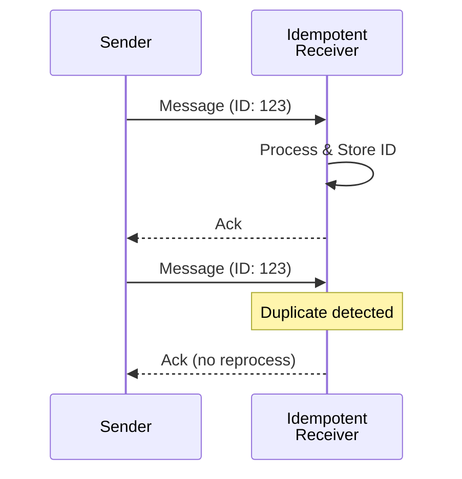

# Idempotent Receiver

## パターンの概要

## EIPにおけるIdempotent Receiver

Idempotent Receiver（冪等受信者）は、同じメッセージを複数回受信しても安全に処理できる受信者を設計するパターンである。

### 問題

送信側アプリケーションが1度だけメッセージを送信しても、受信側アプリケーションが複数回受け取る可能性がある。このような重複メッセージにどう対処するか。

### 解決策

受信者をIdempotent Receiverとして設計する。同じメッセージを複数回安全に受信できるようにする。

冪等性は2つの手段で実現できる：

1. **明示的な重複排除** - 重複メッセージの検出と削除
2. **メッセージセマンティクスの定義** - メッセージ自体が冪等性を支持する仕様設計

### 特徴

- メッセージが1回の受信でも複数回の受信でも同じ効果をもたらす
- 安全に再送信できる
- 重複処理による副作用を防ぐ

## アクターモデルにおけるIdempotent Receiver

同じメッセージを複数回受信し、その都度処理すると問題が発生する可能性がある場合、Idempotent Receiverとなるようにアクターを設計する。

### At-Most-OnceからAt-Least-Onceへ

アクターモデルの標準的なメッセージ配信契約は「at most once（最大1回）」である。つまり、メッセージは配信されないか、1回だけ配信される。メッセージの喪失が許容されない場合、何らかの形の「at least once（少なくとも1回）」配信が必要になる。

Akka PersistenceはPersistentActorにミックスインできる`AtLeastOnceDelivery`トレイトを提供している。これにより、少なくとも1回の配信が保証される。しかし、at least once配信はat most onceをオーバーライドするのではなく置き換える。つまり、メッセージは1回、2回、またはそれ以上配信される可能性がある。したがって、at least once配信を使用する場合、受信アクターはIdempotent Receiverである必要がある。

### 冪等性を実現する3つのアプローチ

冪等性を実現するためのさまざまなアプローチがある。

#### 1. メッセージの重複排除

メッセージのアイデンティティを追跡することで重複配信を排除する。一般的にメッセージIDを使用して行われるが、複雑なシナリオではより高度なメッセージ相関を必要とすることもある。

**問題点**: 既に処理したメッセージのIDを追跡し続ける必要があるが、多くの場合、無制限に追跡し続けることは現実的ではない。そこで「ウィンドウサイズ」アプローチを使用する。最も古いメッセージを削除しながら、最も新しいメッセージを保持する。

**注意点**: ウィンドウサイズを使用してメッセージのアイデンティティを追跡している場合、古いアイデンティティは最終的に削除されなければならない。適切なアイデンティティが追跡から削除される前に、すべての重複が識別されていると確信する十分なアイデンティティを追跡していることを確認する必要がある。

#### 2. 同一効果を持つメッセージの設計

2番目のアプローチは「自然に」冪等なメッセージを使用することである。操作を冪等になるよう設計する。

**非冪等な例**:
- `Deposit(amount)` - 100を預け入れるたびに残高が100増加する

**冪等な例**:
- `SetBalance(balance)` - 残高を500に設定すると、何回実行しても残高は500のまま

ただし、このアプローチには限界がある。`Deposit`は特定の量を預け入れる非冪等な操作であり、`SetBalance`に変更すると、`Deposit`と同じ時間の残高変更でないか確認するための追加ロジックが必要になる。

`SetBalance`を冪等にするには、コンシューマーがメッセージを受信し、まったく同じ残高設定を受け入れたことを確認する必要がある。同じ残高を設定するが、異なるトランザクションの一部としてである場合、コンシューマーはメッセージをもう一度処理する必要がある。

#### 3. 状態遷移による重複の無害化

3番目のアプローチは、状態遷移が重複を無害にするケースである。アクターの状態を変更して、重複メッセージを受信しても無視できるようにする。

**TransactionIdを使用したアプローチ**:

残高トランザクションIDを使用して、完了したすべてのトランザクションをトランザクションIDから残高へのMapに格納する。各トランザクションには一意のトランザクションIDが割り当てられる。同一のトランザクションIDで2回目のDepositを受信した場合、実際のトランザクション操作が再度実行される代わりに、前のトランザクションの完了結果が返される。

**becomeを使用したアプローチ**:

別のアプローチとして、アクターの`become`機能を使用する方法がある。状態の変更には、イベントが処理された後にアクターがどの種類のメッセージを受け入れるかを変更することが含まれる。

例えば、ドキュメントが「未記録（undocumented）」と「記録済み（documented）」の2つの状態を持つ場合を考える。未記録状態では`RecordDocument`コマンドを受け入れ、処理後に記録済み状態に遷移する。記録済み状態では同じ`RecordDocument`コマンドを無視するか、単に確認応答を返す。これにより、同じコマンドが複数回送信されても、最初の1回だけが実際に処理される。

## 関連パターン

| パターン | 関係 |
|---------|------|
| Guaranteed Delivery | 配信保証により重複が発生する可能性がある |
| [[programming/reactive_messaging_pattern/chapter9/durable_subscription\|Durable Subscriber]] | 再配信されたメッセージを安全に処理する |
| Command Message | コマンドメッセージの冪等な処理 |
| [[programming/reactive_messaging_pattern/chapter7/simple-routers/resequencer\|Resequencer]] | 順序を復元する際に重複を検出できる |

## 参考資料

- [Enterprise Integration Patterns - Idempotent Receiver](https://www.enterpriseintegrationpatterns.com/patterns/messaging/IdempotentReceiver.html)
