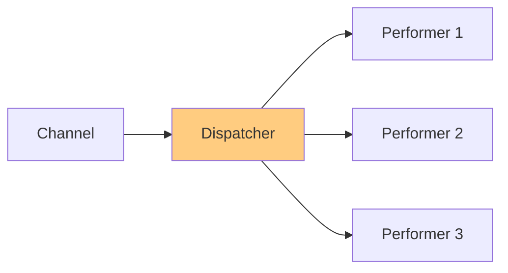

# Message Dispatcher

## パターンの概要

## EIPにおけるMessage Dispatcher

Message Dispatcherは、チャネルからメッセージを取得してパフォーマーに配信するパターンである。

### 問題

アプリケーションがメッセージングを使用しており、単一のメッセージチャネル上で複数のコンシューマーが協調して動作する必要がある。

### 解決策

チャネル上にMessage Dispatcherを作成し、チャネルからメッセージを取得してパフォーマーに配信する。

Message Dispatcherは2つの構成要素からなる：

1. **Dispatcher** - チャネルからメッセージを取得し、各メッセージをパフォーマーに配信するオブジェクト
2. **Performer** - ディスパッチャーから受け取ったメッセージを処理するオブジェクト

### 特徴

- パフォーマーは新たに生成されるか、利用可能なプールから選択される
- 各パフォーマーは独自のスレッドで実行され、並行処理が可能
- ディスパッチャーはメッセージのプロパティに基づいて、特定のパフォーマーとメッセージをマッチングできる

## アクターモデルにおけるMessage Dispatcher

Message DispatcherはContent-Based Routerに匹敵する。Message Dispatcherがメッセージの内容（メッセージタイプなど）を見て、各タイプのメッセージに対応するアクターにディスパッチすることは可能である。

### Content-Based Routerとの違い

両者の違いは以下の点にある：

| 特性 | Content-Based Router | Message Dispatcher |
|-----|---------------------|-------------------|
| ワークロードへの関心 | なし | 主な関心事 |
| 配信先 | プロセス境界を越えて分散する可能性が高い | 同一プロセス内のワークタスクをディスパッチすることを好む |
| ディスパッチ基準 | メッセージの内容のみ | 内容 + ワーカーの既存ワークロード |

Message Dispatcherがメッセージの内容（メッセージタイプなど）をチェックしてタイプ固有のワーカーにディスパッチする場合でも、プール内のワーカーの既存ワークロードを考慮し、最も作業量が少ないワーカーにディスパッチする。

### Akka標準ディスパッチャー

Akkaは様々なMessage Dispatchersをサポートしている。また、Message Dispatcherパターンの恩恵を受けるユースケースで使用できるルーターもある。標準ディスパッチャーと標準ルーターの両方が存在する理由は歴史的なものである。ルーターが存在する前は`BalancingDispatcher`があったが、`BalancingDispatcher`は少し扱いにくかったため、Akkaチームは代わりにルーターを提供することにした。

以下はAkka標準ディスパッチャーである：

- **Dispatcher**: デフォルトのディスパッチャー。アクターのセットをスレッドプールに関連付ける。任意のアクターに異なるディスパッチャーを選択可能
- **PinnedDispatcher**: 各アクターに一意のスレッドをピン留めするディスパッチャー。実際には、この種のディスパッチャーを使用するアクターは、1つのアクターのみが割り当てられたスレッドプールを持つ
- **BalancingDispatcher**: 最もタスクが少ないアクターにメッセージを分散しようとするディスパッチャー。アクターが完全にアイドル状態の場合にtrueとなる。このディスパッチャーによって管理されるすべてのアクターは同じメールボックスを共有し、すべて同じ型でなければならない（使用は現在非推奨）

### Akka標準ルーター

`BalancingDispatcher`を使用することは可能だが、非推奨である。代わりに、Akka標準ツールを使用する場合は、以下のルーターのいずれかを使用すべきである。名前上はルーターだが、優れたMessage Dispatchersになる：

- **RoundRobinRouter**: 設定された数またはリサイズする数のrouteesを持つことができ、ラウンドロビン順序で各routeesにメッセージを送信する。このルーターはrouteeのワークロードを判断する努力をしない
- **SmallestMailboxRouter**: 設定された数またはリサイズする数のrouteesを持つことができ、自身のメールボックスに最も少ないメッセージ数を持つ非サスペンドrouteesにメッセージを送信しようとする。これは`BalancingDispatcher`の最良の代替品かもしれない。`SmallestMailboxRouter`の使用例はCompeting Consumerを参照

### ボランティアリングスタイル

Akka標準ディスパッチャーやルーターを使用する代わりに、Polling Consumerで議論されたボランティアリングスタイルの作業プロバイダーも検討すべきである。ボランティアリングスタイルでは、各ワーカーアクターがさらに作業が必要なときに作業プロバイダーに通知できる。

このアプローチの特徴：
- ワーカーがディストリビューターについて知っている必要がある
- ワーカーがディストリビューターに「作業が必要」メッセージを送信する必要があるため、より多くのメッセージ送信が必要
- しかし、1つ以上のAkka標準ツールを使用するために必要なチェックのオーバーヘッドを取り除く
- Akka内部の知識を実装に必要としない

## 関連パターン

| パターン | 関係 |
|---------|------|
| [[programming/reactive_messaging_pattern/chapter7/simple-routers/content_based_router\|Content-Based Router]] | メッセージの内容のみに基づくルーティング。ワークロードに関心がない |
| [[programming/reactive_messaging_pattern/chapter9/competing_consumers\|Competing Consumers]] | Message Dispatcherによってメッセージを受け取る複数のコンシューマー |
| [[programming/reactive_messaging_pattern/chapter9/polling_consumer\|Polling Consumer]] | ボランティアリングスタイルのDispatcherと組み合わせて使用 |
| [[programming/reactive_messaging_pattern/chapter9/event_driven_consumer\|Event-Driven Consumer]] | ディスパッチされたメッセージを処理するコンシューマー |
| [[programming/reactive_messaging_pattern/chapter9/message_selector\|Selective Consumer]] | 特定のメッセージのみを選択して処理する |

## 参考資料

- [Enterprise Integration Patterns - Message Dispatcher](https://www.enterpriseintegrationpatterns.com/patterns/messaging/MessageDispatcher.html)
