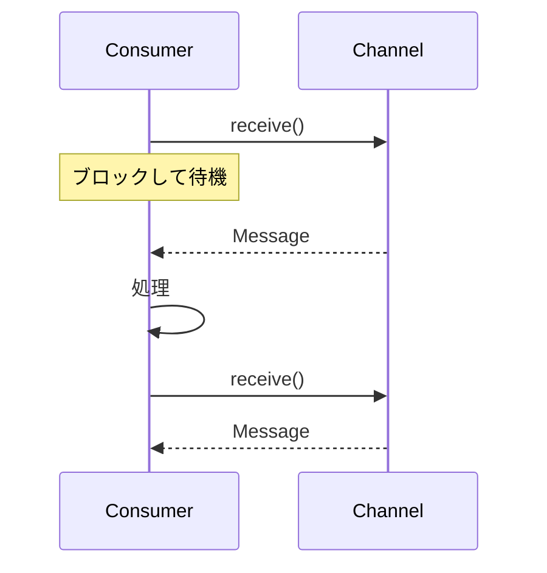

# Polling Consumer

## パターンの概要



## EIPにおけるPolling Consumer

Polling Consumerは、アプリケーションが明示的にメッセージ受信要求を行うメッセージ消費方式である。

### 問題

アプリケーションは準備ができた時点でメッセージを消費する必要がある。アプリケーションがメッセージ受信のタイミングをコントロールしたい場合、どのように実装するか。

### 解決策

Polling Consumerを使用し、受信スレッドが明示的にメッセージを要求する際にのみメッセージを取得する。

### 特徴

- 同期型受信者として機能する
- アプリケーションが受信準備完了時に呼び出しを実行する
- 多くのメッセージングAPIで`receive()`メソッドを提供する
- メッセージが利用不可能な場合、`receiveNoWait()`や`Receive(0)`で即座に制御を返す

## アクターモデルにおけるPolling Consumer

ポーリングは、リソースから情報を要求するコンシューマーがリソース情報が提供されるまでブロックすることを必要とする。アクターモデルではアクター間のコラボレーションがブロックしないため、あるアクターが別のアクターに情報をポーリングする方法は存在しない。アクターが他のアクターから情報を得る唯一の方法はRequest-Replyを使用することである。

### アクター間のPolling Consumer

典型的な手続き型ポーリング環境では、Work ConsumerがWork Items Providerに対してWork Itemsを要求する。Work ConsumerはWork Items Providerが要求されたWork Itemsを割り当てて返すまでブロックする。アクターモデルでは、Work ConsumerがWork Item ProviderにWork Itemsを割り当てるよう伝えると、Work Consumerは自身のスレッドで操作を継続し、Work Item Providerへのリクエストは（長くても短くても）一定期間後にしか受信されない。

Request-Replyを使用して同様の結果を達成できる。Work ConsumerがWork Items ProviderからWork Itemsを要求し、取得するように設計する。

### 実装例

以下はRequest-Replyを使ったPolling Consumer的な実装である。

```scala
package co.vaughnvernon.reactiveenterprise.pollingconsumer

import scala.collection.immutable.List
import akka.actor._
import co.vaughnvernon.reactiveenterprise._

object PollingConsumerDriver extends CompletableApp(1) {
  val workItemsProvider =
    system.actorOf(
      Props[WorkItemsProvider],
      "workItemsProvider")
  val workConsumer =
    system.actorOf(
      Props(classOf[WorkConsumer],
        workItemsProvider),
      "workConsumer")

  workConsumer ! WorkNeeded()

  awaitCompletion
}
```

`PollingConsumerDriver`は`WorkItemsProvider`と`WorkConsumer`アクターを作成する。その後、`WorkConsumer`に`WorkNeeded`メッセージを送信して、作業の消費と実行のプロセスを開始する。

`WorkConsumer`は2つのメッセージを定義する：`WorkNeeded`と`WorkOnItem`。`WorkNeeded`メッセージはクライアントから初期処理を開始するために送信でき、また`WorkConsumer`自身がさらなる作業が必要なときに送信する。`WorkOnItem`メッセージは`WorkConsumer`自身によってのみ送信され、処理すべき個別の`WorkItem`を示す。

```scala
case class WorkNeeded()
case class WorkOnItem(workItem: WorkItem)

class WorkConsumer(workItemsProvider: ActorRef)
  extends Actor {
  var totalItemsWorkedOn = 0

  def performWorkOn(workItem: WorkItem) = {
    totalItemsWorkedOn = totalItemsWorkedOn + 1
    if (totalItemsWorkedOn >= 15) {
      context.stop(self)
      PollingConsumerDriver.completeAll
    }
  }

  override def postStop() = {
    context.stop(workItemsProvider)
  }

  def receive = {
    case allocated: WorkItemsAllocated =>
      println("WorkItemsAllocated...")
      allocated.workItems map { workItem =>
        self ! WorkOnItem(workItem)
      }
      self ! WorkNeeded()
    case workNeeded: WorkNeeded =>
      println("WorkNeeded...")
      workItemsProvider ! AllocateWorkItems(5)
    case workOnItem: WorkOnItem =>
      println(s"Performed work on: ${workOnItem.workItem.name}")
      performWorkOn(workOnItem.workItem)
  }
}
```

`WorkConsumer`が`WorkNeeded`メッセージを受信すると、初期化時に受け取った`WorkItemsProvider`を使用して、割り当てるべき作業アイテムの数を要求する。このために`AllocateWorkItems`メッセージを送信する。`WorkItemsProvider`がこれを受信すると、要求された数の`WorkItem`インスタンスを割り当て、Event Messageである`WorkItemsAllocated`を通じて要求者に送信する。

```scala
case class AllocateWorkItems(numberOfItems: Int)
case class WorkItemsAllocated(workItems: List[WorkItem])
case class WorkItem(name: String)

class WorkItemsProvider extends Actor {
  var workItemsNamed: Int = 0

  def allocateWorkItems(
      numberOfItems: Int): List[WorkItem] = {
    var allocatedWorkItems = List[WorkItem]()
    for (itemCount <- 1 to numberOfItems) {
      val nameIndex = workItemsNamed + itemCount
      allocatedWorkItems =
        allocatedWorkItems :+
          WorkItem("WorkItem" + nameIndex)
    }
    workItemsNamed = workItemsNamed + numberOfItems
    allocatedWorkItems
  }

  def receive = {
    case request: AllocateWorkItems =>
      sender !
        WorkItemsAllocated(
          allocateWorkItems(
            request.numberOfItems))
  }
}
```

`WorkConsumer`が`WorkItemsAllocated`メッセージを受信すると、コンシューマーは作業を個々の`WorkOnItem`タスクに分割し、各`WorkItem`に対して自身にメッセージを送信する。そして`WorkItemsAllocated`への反応を完了するために、新たな`WorkNeeded`メッセージを自身に送信する。この`WorkNeeded`メッセージは、もう`WorkOnItem`タスクが残っていない時点で受信される。

出力例：

```
WorkNeeded...
WorkItemsAllocated...
Performed work on: WorkItem1
Performed work on: WorkItem2
Performed work on: WorkItem3
Performed work on: WorkItem4
Performed work on: WorkItem5
WorkNeeded...
WorkItemsAllocated...
Performed work on: WorkItem6
...
```

15個の`WorkItem`タスクが実行されると、`WorkConsumer`は停止する。`WorkConsumer`の`postStop()`関数で、`WorkItemsProvider`も停止される。

この例では`WorkConsumer`のインスタンスを1つだけ作成しているが、ホストコンピュータのコア数だけ`WorkConsumer`を作成することも可能である。これにより、すべての`WorkConsumer`アクターが同時に作業を処理できる。

このアプローチはMessage Dispatcherのボランティアリングスタイルを提供する。各`WorkConsumer`アクターは、さらなる作業が必要なときに`WorkItemsProvider`に通知する必要がある。Akka標準の`BalancingDispatcher`を使用する場合よりもメッセージ送信が多くなるが、このアプローチはMessage Dispatcherで議論されている1つ以上のAkka標準ツールを使用するために必要なチェックのオーバーヘッドを取り除く。このボランティアリングスタイルはAkka内部の知識を必要としない。

## リソースポーリング

アクター間のPolling Consumerを大まかに近似する方法を見てきたが、次に非アクターリソースをポーリングする必要があるアクターベースのPolling Consumerの設計を考える。アクセスが注意深く設計されていない限り、ポーリングアクターのスレッドが望ましいリソース上で長時間ブロックし、システムの無応答性を引き起こす可能性があるため、これは特に厄介な状況である。

### EvenNumberDevice の例

この例では、偶数を提供する特別な「デバイス」である`EvenNumberDevice`を監視する。

```scala
class EvenNumberDevice() {
  val random = new Random(99999)

  def nextEvenNumber(waitFor: Int): Option[Int] = {
    val timeout = new Timeout(waitFor)
    var nextEvenNumber: Option[Int] = None

    while (!timeout.isTimedOut && nextEvenNumber.isEmpty) {
      Thread.sleep(waitFor / 2)

      val number = random.nextInt(100000)

      if (number % 2 == 0) nextEvenNumber = Option(number)
    }

    nextEvenNumber
  }

  def nextEvenNumber(): Option[Int] = {
    nextEvenNumber(-1)
  }
}
```

このデバイスはランダムな数を生成し、偶数であれば最初に見つかったものを返す。2つのオーバーロードされたAPI関数がある。1つは決してタイムアウトしない関数で、もう1つは指定されたミリ秒数でタイムアウトする関数である。タイムアウト期間内に偶数を読み取れない場合、`None`の`Option`が返される。アクターは常に`nextEvenNumber(waitFor: Int)`バージョンの関数を呼び出すべきである。

### CappedBackOffScheduler

`EvenNumberMonitor`アクターは、構築時に`CappedBackOffScheduler`のインスタンスを作成する。このスケジューラーは、監視アクターに間隔を置いて`Monitor`メッセージを送信するために使用される。間隔は最小500ミリ秒から開始する。デバイスへの任意のプローブが偶数の読み取りに成功すると、次の間隔は500ミリ秒になる。それ以外の場合、連続した読み取り失敗ごとに次の間隔が2倍になる。

```scala
class CappedBackOffScheduler(
    minimumInterval: Int,
    maximumInterval: Int,
    system: ActorSystem,
    receiver: ActorRef,
    message: Any) {

  var interval = minimumInterval

  def backOff = {
    interval = interval * 2
    if (interval > maximumInterval)
      interval = maximumInterval
    schedule
  }

  def reset = {
    interval = minimumInterval
    schedule
  }

  private def schedule = {
    val duration =
      Duration.create(
        interval,
        TimeUnit.MILLISECONDS)

    system
      .scheduler
      .scheduleOnce(
        duration,
        receiver,
        message)
  }
}
```

スケジューラーが`backOff`を指示されるたびに、少なくとも15秒に達するまで新しい間隔を計算する。スケジューラーが`reset`を指示されると（偶数の読み取りが成功するたびに）、間隔は0.5秒に設定される。いずれの場合も、間隔を使用して新しい`Monitor`メッセージをスケジュールする。`Monitor`メッセージは間隔が経過すると`EvenNumberMonitor`に送信される。

出力例：

```
EVEN: 65290
EVEN: 67208
EVEN: 53130
MISS
MISS
EVEN: 63720
EVEN: 1810
EVEN: 25708
MISS
EVEN: 38840
EVEN: 92860
EVEN: 78328
EVEN: 87076
```

## 関連パターン

| パターン | 関係 |
|---------|------|
| Request-Reply | アクターモデルでPolling Consumerを模倣するために使用する |
| Event-Driven Consumer | Polling Consumerの対となるパターン。メッセージ到着時に自動的に呼び出される |
| Competing Consumers | 複数のPolling Consumerが同一チャネルから消費する場合に形成される |
| Message Dispatcher | ワークロードに関心を持ち、応答可能なアクターにメッセージをディスパッチする |

## 参考資料

- [Enterprise Integration Patterns - Polling Consumer](https://www.enterpriseintegrationpatterns.com/patterns/messaging/PollingConsumer.html)
