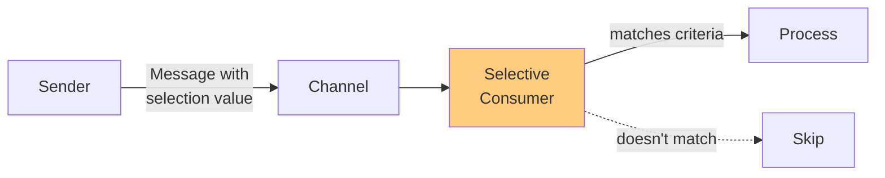

# Selective Consumer (Message Selector)

## パターンの概要

## EIPにおけるSelective Consumer

Selective Consumer（選別的コンシューマー）は、メッセージチャネルから特定の条件に一致するメッセージのみを受け取るパターンである。

### 問題

アプリケーションがメッセージングを使用しており、メッセージチャネルからメッセージを消費しているが、すべてのメッセージではなく、特定の条件に合致したメッセージのみを受け取りたい。

### 解決策

メッセージコンシューマーを選別的にする。チャネルから配信されたメッセージをフィルタリングし、特定の基準に一致するものだけを受け取る。

このフィルタリングプロセスは3つの要素で構成される：

1. **送信元による指定** - メッセージの選別値を送信前に設定
2. **選別値** - メッセージに含まれる、コンシューマーが選別判定に用いる値
3. **選別的コンシューマー** - 選別基準に合致するメッセージのみを受信

### 特徴

- **Point-to-Pointチャネルでの動作**: 複数のSelective ConsumerはCompeting Consumersとして機能し、基準が重複する場合、いずれかが該当メッセージを消費できる
- **Publish-Subscribeチャネルでの動作**: 各サブスクライバーはメッセージのコピーを受け取るが、基準に合致しないものは無視する
- **複数チャネルの効率化**: 単一チャネルを複数のDatatype Channelのように機能させることができる

## アクターモデルにおけるSelective Consumer

アクターが様々な種類のメッセージを受信できるが、一部のメッセージタイプしか処理できない場合にSelective Consumerを使用する。この場合、Selective ConsumerはMessage Filterの一種であり、サポートされているメッセージのみがシステムによって消費されるようにする。Message Filterの議論でSelective Consumerの例を見ることができる。

### Datatype Channelとしての使用

また、Selective Consumerをデータ型コンシューマーの代わりに様々な種類のメッセージを受け入れるように設計することも可能である。この場合、Selective Consumerアクターは様々な種類のメッセージをDatatype Channelsにルーティングする。このアプローチはDynamic Routerで示されている。

### 実装アプローチ

Selective Consumerは、特定のメッセージタイプごとに専用のコンシューマーアクターを作成し、SelectiveConsumerアクターがメッセージを受信してそれぞれのタイプ別コンシューマーに転送する形で実装できる。

3つのメッセージタイプコンシューマーが作成され、それぞれが特定のメッセージタイプの内部Datatype Channelsとなる。SelectiveConsumerが作成されると、3つのメッセージ（MessageTypeA、MessageTypeB、MessageTypeC）が送信される。これらはSelectiveConsumerによって受信され、Datatype Channelsにディスパッチされる。

## 関連パターン

| パターン | 関係 |
|---------|------|
| [[programming/reactive_messaging_pattern/chapter7/simple-routers/message_filter\|Message Filter]] | Selective Consumerと似ているが、パイプライン内のフィルターとして機能する |
| [[programming/reactive_messaging_pattern/chapter9/competing_consumers\|Competing Consumers]] | 複数のSelective ConsumerがPoint-to-Pointチャネルで競合する |
| [[programming/reactive_messaging_pattern/chapter9/event_driven_consumer\|Event-Driven Consumer]] | Selective Consumerはイベント駆動で動作できる |
| [[programming/reactive_messaging_pattern/chapter7/simple-routers/dynamic_router\|Dynamic Router]] | 動的なルーティングルールを持つSelective Consumer |
| [[programming/reactive_messaging_pattern/chapter9/durable_subscription\|Durable Subscriber]] | 選別条件を満たすメッセージの永続的なサブスクリプション |

## 参考資料

- [Enterprise Integration Patterns - Selective Consumer](https://www.enterpriseintegrationpatterns.com/patterns/messaging/MessageSelector.html)
