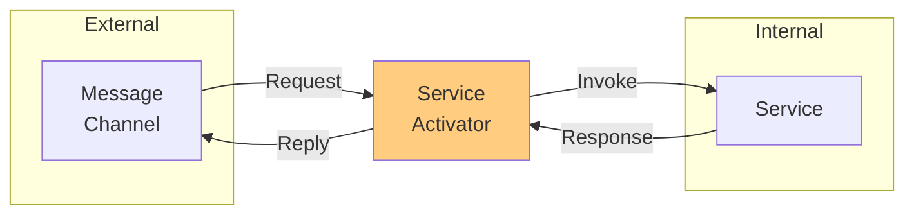

# Service Activator (Messaging Adapter)

## パターンの概要

## EIPにおけるService Activator

Service Activatorは、メッセージングチャネル上のメッセージをサービス呼び出しに接続するパターンである。

### 問題

アプリケーションが保有するサービスを、メッセージング技術と非メッセージング技術の両方を通じて利用可能にするには、どのように設計すればよいか。

### 解決策

メッセージチャネルからのメッセージをサービス呼び出しに変換するService Activatorを設計する。

### 特徴

- **動作モード**: 一方向（リクエストのみ）または双方向（Request-Replyパターン対応）
- **実装方式**: シンプルなメソッド呼び出しから、リフレクションを用いた動的呼び出しまで対応
- **サービス独立性**: Activatorがすべてのメッセージング詳細を処理し、サービスがメッセージング経由の呼び出しを認識しないよう設計

## アクターモデルにおけるService Activator

1つ以上の外部アクセス可能なリソースを使用してリクエストされる可能性のある内部サービスがある場合、Service Activatorを使用する。例えば、クライアントはアクター、ミドルウェアメッセージングシステム、RESTfulリソース、またはリモートプロシージャコール（RPC）経由でリクエストを行う可能性がある。リクエストがどのように行われても、リクエスト受信者は内部のApplication Serviceに委譲する。

### Hexagonal（Ports and Adapters）アーキテクチャとの関係

Service ActivatorはImplementing Domain-Driven Design [IDDD]で定義されているHexagonal（またはPorts and Adapters）アーキテクチャに従う。

このアーキテクチャでは：
- **Domain Model**: 中心に位置するビジネスロジック
- **Application Service**: Domain Modelを取り囲み、ユースケースを実装する層
- **Adapter**: 外部との接続を担当し、外部リソース（Web、データベース、ファイル、クラウド、メッセージングなど）と内部を橋渡しする

クライアントアプリケーションは受信側アプリケーションの外部アダプターとのみやり取りし、外部アダプターは内部アプリケーションコンポーネント（Application Services）に委譲する。

### Service Activatorの役割

このアーキテクチャにより、外部には任意の数のService Activatorタイプを提供しながら、内部には共通の再利用可能なApplication Service層をサポートできる。すべての受信Adapterタイプ（外部左側）はService Activatorsである。

各タイプのセットは入力パラメータ（Messageプロパティ）を、内部のApplication Servicesが実装するAPIに渡せるパラメータに適応させる。もちろん、アプリケーションがリアクティブスタイルを全体で使用する場合、Application Servicesはアクターとして実装できる。

### 一方向と双方向

- **一方向（Fire-and-Forget）**: 外部メッセージを内部形式に変換し、サービスに送信するが応答を待たない
- **双方向（Request-Reply）**: サービスにリクエストを送信し、レスポンスを外部形式に変換して返す

### 複数プロトコルへの対応

Service Activatorを使用すると、同じ内部サービスを複数のプロトコル（HTTP、メッセージキュー、WebSocketなど）から利用可能にできる。各プロトコル用のActivatorが、プロトコル固有の変換ロジックを担当する。

## 関連パターン

| パターン | 関係 |
|---------|------|
| [[programming/reactive_messaging_pattern/chapter9/messaging_gateway\|Messaging Gateway]] | メッセージングへのアクセスを簡素化する |
| [[programming/reactive_messaging_pattern/chapter9/messaging_mapper\|Messaging Mapper]] | メッセージとドメインオブジェクト間のマッピングを行う |
| [[programming/reactive_messaging_pattern/chapter9/event_driven_consumer\|Event-Driven Consumer]] | Service Activatorはイベント駆動で動作できる |
| [[programming/reactive_messaging_pattern/chapter9/polling_consumer\|Polling Consumer]] | Service Activatorはポーリングで動作できる |
| [[programming/reactive_messaging_pattern/chapter9/competing_consumers\|Competing Consumers]] | 複数のService Activatorで負荷分散できる |
| [[programming/reactive_messaging_pattern/chapter9/message_dispatcher\|Message Dispatcher]] | メッセージをService Activatorにディスパッチする |

## 参考資料

- [Enterprise Integration Patterns - Service Activator](https://www.enterpriseintegrationpatterns.com/patterns/messaging/MessagingAdapter.html)
