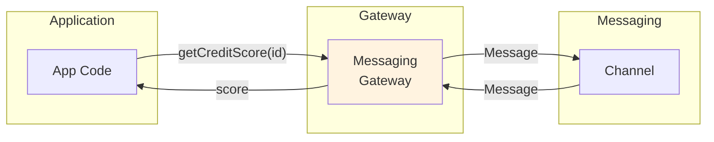

# Messaging Gateway

## パターンの概要

Messaging Gatewayは、アプリケーションコードからメッセージング固有のコードをカプセル化し、ドメイン固有のメソッドを公開するパターンです。このパターンを適用することで、アプリケーションはメッセージングシステムの存在を意識することなく、ビジネス操作に集中できるようになります。

## EIPにおけるMessaging Gateway

### 解決すべき問題

エンタープライズアプリケーションがメッセージングシステムを通じて他のシステムにアクセスする場合、メッセージング固有のコードをアプリケーション全体に散在させるべきでしょうか。

この問いに対する答えは明確に「いいえ」です。メッセージの作成、プロパティの設定、チャネルへの送信、応答の待機、受信メッセージの解析といった処理がアプリケーションコード全体に広がると、以下のような深刻な問題が発生します。

**保守性の問題**として、メッセージング基盤や通信プロトコルを変更する際に、アプリケーション全体のコードを修正する必要が生じます。この変更作業は時間がかかるだけでなく、予期せぬバグを生む温床となります。

**テスタビリティの問題**として、ビジネスロジックをテストするためにメッセージングシステムをモック化する必要があり、テストの複雑さが増大します。単純なビジネスルールをテストするだけでも、メッセージングの仕組みを理解している必要があります。

**可読性の問題**として、ビジネスの意図を表現すべきコードに技術的な詳細が混入し、「このコードは何をしているのか」という本質的な理解が困難になります。

### 解決策

**Messaging Gateway**を使用します。これは、メッセージング固有のメソッド呼び出しをラップし、ドメイン固有のメソッドをアプリケーションに公開するクラスです。

Messaging Gatewayは、Martin Fowlerが定義したGatewayパターンをメッセージングコンテキストに特化させたものと考えることができます。Gatewayパターンは「外部システムへのアクセスをカプセル化するオブジェクト」を定義していますが、Messaging Gatewayはこれをメッセージングシステムに適用しています。

### カプセル化の本質

Messaging Gatewayの本質は、低レベルのメッセージング操作を高レベルのビジネス操作に変換することにあります。

例えば、顧客のクレジットスコアを照会する機能を考えてみましょう。メッセージング基盤を直接使用する場合、アプリケーションコードは以下のような処理を行う必要があります。

1. メッセージオブジェクトを作成する
2. 顧客IDをメッセージのプロパティとして設定する
3. 相関IDを生成して設定し、応答を追跡できるようにする
4. 返信先アドレスを設定する
5. クレジットスコア照会チャネルにメッセージを送信する
6. 応答チャネルで、対応する相関IDを持つ応答を待機する
7. 受信したメッセージからスコア値を抽出する
8. 抽出した値をアプリケーションに返す

Messaging Gatewayを使用すると、これらの処理はすべてゲートウェイ内部に隠蔽されます。アプリケーションは単に「GetCreditScore(customerId)」のようなビジネスに適したメソッドを呼び出すだけで済みます。メッセージの構造、チャネルの名前、通信プロトコルといった詳細は、アプリケーションコードから完全に切り離されます。

### Messaging Gatewayがもたらす利点

**関心の分離**として、ビジネスロジックは「何をしたいか」に集中し、メッセージングの「どのように」はゲートウェイが担当します。これにより、各層が自身の責務に専念できます。

**変更の局所化**として、メッセージング基盤が変更された場合でも、影響を受けるのはゲートウェイの実装だけです。アプリケーションコードは変更不要のままです。

**強い型付け**として、メッセージングシステムの汎用的なインターフェースではなく、ドメイン固有の型を使用したインターフェースを提供できます。これにより、コンパイル時の型チェックによる安全性が向上します。

**テスタビリティの向上**として、ゲートウェイインターフェースをモック化することで、メッセージングシステムなしでビジネスロジックをテストできます。

## アクターモデルにおける自然なMessaging Gateway

Akkaアクターシステムとそのアクターは、自然なMessaging Gatewayを形成します。これは、アクターモデルの設計思想とMessaging Gatewayパターンの目的が本質的に一致しているためです。

### 位置透過性（Location Transparency）

Akkaの重要な特徴の一つに「位置透過性」があります。これは、メッセージの送信者が受信者の物理的な位置（同じJVM内か、リモートサーバー上か）を意識する必要がないという概念です。

この位置透過性こそが、Akkaを自然なMessaging Gatewayたらしめている核心的な要素です。アプリケーションコードは、相手のアクターがローカルにいるのかリモートにいるのかを知る必要がありません。

Akkaは、ローカルとリモートのアクター間でメッセージを送信するための抽象化として、ActorRefとRemoteActorRefを提供しています。しかし、アプリケーションコードはこれらの違いを意識する必要がありません。Akkaフレームワーク自体が、この複雑さを内部でカプセル化しているからです。

### 追加のMessaging Gateway抽象化が必要な場合

多くの場合、Akkaが提供する自然なMessaging Gatewayで十分ですが、Akkaが標準では提供しない機能を実装したい場合には、追加のMessaging Gateway抽象化を構築することを検討できます。

典型的な例として、**トランジェント（一時的）なAggregateアクター**の管理があります。Domain-Driven Designの観点から、EntityやAggregateの特性を持つアクターを設計する場合、以下のような要件が生じることがあります。

**動的なライフサイクル管理**として、使用パターンに基づいてアクターを動的にロードおよびアンロードしたい場合があります。頻繁にアクセスされるアクターはメモリにキャッシュし、長時間アクセスされないアクターはディスクに永続化してメモリを解放するといった最適化が求められます。

**透過的な状態復元**として、メモリ上にないアクターにメッセージが送信された場合、システムが自動的にそのアクターをディスクから復元し、メッセージを届けられるようにしたい場合があります。クライアントは、アクターが現在メモリ上にあるのか、ディスクから復元が必要なのかを意識する必要がありません。

### DomainModelによるAggregate型の管理

このような要件を満たすために、DomainModelという抽象化を導入できます。DomainModelは、Aggregate型ごとのキャッシュを管理するための基盤となります。

DomainModelの役割は以下の通りです。

**Aggregate型の登録**として、システムがどのようなAggregateを扱うかを定義します。例えば、注文（Order）、顧客（Customer）、商品（Product）といったAggregate型を登録します。

**Aggregateインスタンスの提供**として、アプリケーションがAggregateアクターへの参照を要求したとき、DomainModelは適切なアクター参照を返します。アクターが既にメモリ上にあればそれを返し、なければ新規作成または復元を行います。

**アイデンティティ管理**として、各Aggregateインスタンスにグローバルユニークなアイデンティティを割り当て、追跡します。

### AggregateRef：Messaging Gatewayの要

DomainModelが返すアクター参照は、通常のActorRefではなく、AggregateRefという特別な型です。このAggregateRefこそが、トランジェントAggregateアクターを実装するためのMessaging Gatewayとして機能する核心的なコンポーネントです。

AggregateRefは、以下のような動作を行います。

**メッセージのラッピング**として、アプリケーションから送信されたメッセージをCacheMessageでラップします。このラッピングにより、キャッシュ管理に必要な追加情報（対象Aggregateのアイデンティティなど）をメッセージに付加できます。

**キャッシュへの委譲**として、ラップされたメッセージをAggregateCacheに送信します。直接Aggregateアクターに送信するのではなく、キャッシュを経由することで、アクターの存在確認や復元処理を行う機会を得ます。

**透過性の維持**として、クライアントから見ると、通常のActorRefと同じように使用できます。メッセージ送信の構文も同じであり、クライアントは内部でキャッシュ管理が行われていることを意識する必要がありません。

### AggregateCacheによるアクター管理

AggregateCacheは、特定のAggregate型に属するすべてのAggregateアクターを管理する責務を持ちます。

**アイデンティティの追跡**として、AggregateCacheは登録されたAggregateのアイデンティティをSetで管理します。これにより、特定のアイデンティティを持つAggregateが存在するかどうかを迅速に判定できます。

**アクターの検索と復元**として、CacheMessageを受信したとき、AggregateCacheは以下のプロセスを実行します。

1. 対象のAggregateアクターが現在メモリ上にキャッシュされているか確認する
2. キャッシュされていれば、そのアクターにメッセージを転送する
3. キャッシュされていなければ、ディスクからアクターの状態を復元してキャッシュにロードする
4. 復元が完了したら、元のメッセージをアクターに配信する

**送信者の透過性**として、最終的にAggregateアクターにメッセージが配信されるとき、送信者情報は元のクライアントのものが使用されます。AggregateアクターからはAggregateRef経由のAggregateCache からではなく、元の送信者から直接メッセージを受信したように見えます。

### Messaging Gatewayの目的

このMessaging Gateway実装の目的は、Akkaのシンプルなメッセージ送信セマンティクスをさらに簡素化することではありません。むしろ、Akkaのコア機能では直接サポートされていない「トランジェントアクターキャッシュ」という高度な機能を、透過的に実現するためのものです。

クライアントは、Aggregateアクターがメモリ上にあるのかディスク上にあるのかを意識することなく、通常のメッセージ送信と同じ感覚でAggregateと対話できます。この透過性こそが、Messaging Gatewayパターンの本質的な価値です。

## 関連パターン

- **[[programming/reactive_messaging_pattern/chapter9/gateways/messaging_mapper|Messaging Mapper]]** - Messaging Gatewayがメッセージングの「操作」をカプセル化するのに対し、Messaging Mapperはメッセージと ドメインオブジェクト間の「データ変換」を担当します。両者を組み合わせることで、アプリケーションはメッセージングの詳細から完全に分離されます。

- **[[programming/reactive_messaging_pattern/chapter9/consumers/service_activator|Service Activator]]** - Service Activatorは、メッセージを受信して内部サービスを呼び出す役割を担います。Messaging Gatewayが送信側の抽象化を提供するのに対し、Service Activatorは受信側でメッセージとサービス呼び出しを接続します。

- **Guaranteed Delivery** - 送信されたメッセージが確実に受信されることを保証するパターンです。Messaging Gatewayと組み合わせることで、信頼性の高い非同期通信を実現できます。

- **Scatter-Gather** - 複数の受信者にリクエストを送信し、応答を集約するパターンです。Messaging Gatewayは、このような複雑なメッセージングパターンの背後にある詳細をカプセル化するのに適しています。

- **Correlation Identifier** - リクエストと応答を関連付けるために使用されるパターンです。Messaging Gatewayは、相関IDの生成と管理をカプセル化し、アプリケーションコードから隠蔽できます。

## 参考資料

- [Enterprise Integration Patterns - Messaging Gateway](https://www.enterpriseintegrationpatterns.com/patterns/messaging/MessagingGateway.html)
