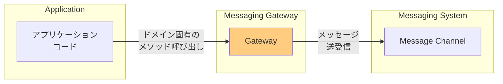
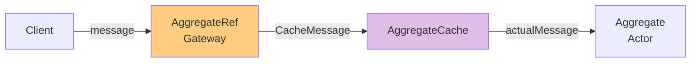

# Messaging Gateway

## パターンの概要

Messaging Gatewayは、アプリケーションコードからメッセージング固有のコードをカプセル化し、ドメイン固有のメソッドを公開するパターンである。



## EIPにおけるMessaging Gateway

### 問題

アプリケーションの残りの部分からメッセージングシステムへのアクセスをどのようにカプセル化するか。

### 解決策

Messaging Gatewayを使用する。これはメッセージング固有のメソッド呼び出しをラップし、ドメイン固有のメソッドをアプリケーションに公開するクラスである。

### 特徴

- メッセージング基盤の複雑さをビジネスロジックから分離する
- アプリケーションが低レベルのメッセージング詳細を処理する必要がなくなる
- ビジネスに適したメソッド（例：`GetCreditScore`）を通じてクリーンなインターフェースを提供する

## Akkaにおける自然なMessaging Gateway

Akkaアクターシステムとそのアクターは、自然なMessaging Gatewayを形成する。Akkaはアクター間のメッセージ送信をシンプルにする。ほとんどの場合、Akkaやそのアクターの上に別の抽象化レイヤーを作成してメッセージングへのアクセスを簡素化する必要はない。同じJVM内の他のアクターにメッセージを送信する場合も、別のJVM内のリモートアクターに送信する場合も、インターフェースは同様にシンプルである。

```
riskAssessment ! AttachDocument("This is a HIGH risk...")
```

`riskAssessment`が参照するアクターはローカルなのかリモートなのか？Akkaが提供する自然なMessage Gatewayの一部として、ローカルとリモートのアクター間でMessagesを送信するための抽象化には`ActorRef`と`RemoteActorRef`がある。あるJVM内のアクターは、Messageを送信する相手のアクターがローカルかリモートかを知る必要がない。ある程度、`riskAssessment`がローカルかリモートかは分からないし、通常の状況では知る必要も気にする必要もない。

## 追加のMessaging Gateway抽象化が必要な場合

Akkaが標準では「そのまま」提供しない機能を実装したい場合に、追加のMessaging Gateway抽象化を使用することを選択できる。そのような状況の1つは、EntityまたはAggregateの特性を持つアクター[IDDD]に、使用パターンなどの基準に基づいてアクターを動的にロードおよびアンロードできるトランジェント（一時的）な振る舞いを持たせたい場合である。この場合、アクターは一意のアイデンティティを持ち、可変状態の可能性があり、現在メモリにキャッシュされているか、状態がディスクに永続化されている可能性がある。クライアントがこのアクターにメッセージを送り、すでにメモリにキャッシュされている場合は、ほぼ直接的な方法でメッセージを受信する。クライアントが現在キャッシュされていないそのようなアクターにメッセージを送信する場合、システムはアクターをディスクから再構成してキャッシュにロードしてから、メッセージを受信できるようにする必要がある。

以下は、そのようなトランジェントアクターシステムの簡単な例である。基本的な考え方は、Aggregateとして実装されたアクターを持つドメインモデルを実装することである[IDDD]。

## DomainModelによるAggregate型の管理

`DomainModel`は、Aggregate型のキャッシュを管理するための基本的な抽象化である。実際、この例では各Aggregate型が1つのキャッシュを構成する。

`DomainModel`インスタンスを作成した後、`Order`型が`DomainModel`にAggregate型として登録される。次に、`DomainModel`にAggregateアクターインスタンスの提供を依頼できる。`DomainModel`は新しい`Order`アクター参照インスタンスを生成し、Entityのグローバル一意のアイデンティティ"123"が割り当てられる。これはシンプルな`Order` Aggregateアクターであり、最終的にメッセージを受信するアクターを提供する以外、特に重要なことはしない。

## AggregateRef：Messaging Gatewayの要



`DomainModel`の`aggregateOf()`関数が返す`Order`アクター参照は、馴染みのある`ActorRef`ではないことに注意が必要である。代わりに、特別な型`AggregateRef`である。この`AggregateRef`は`ActorRef`のように使用されるが、トランジェントAggregateアクターを実装するためのMessaging Gateway抽象化の要（linchpin）として機能する。

`DomainModelDriver`アプリケーションを再度見ると、`DomainModel`が`Order`を提供すると、`AggregateRef`を通じて`Order`にメッセージを送信できる。

しかし、メッセージは`ActorRef`を使用する場合のように`Order`に直接送信されない。まずMessaging Gateway（`AggregateRef`によって抽象化されている）を通過する必要がある。

`AggregateRef`は`tell`と`!`メソッドを持ち、メッセージを`CacheMessage`でラップしてキャッシュに送信する。

## AggregateCacheによるアクター管理

すべてのAggregateアクターは、特別なキャッシュアクター（`AggregateCache`のインスタンス）によって管理される。`DomainModel`が新しいAggregateアクターを作成すると、適切な型ベースの`AggregateCache`によって管理されることを保証する。したがって、`Order`などのAggregateアクターに送信されるすべてのメッセージは、まず管理キャッシュに送信される。

`AggregateCache`は2つのメッセージを処理する責任がある：`CacheMessage`と`RegisterAggregateId`である。`RegisterAggregateId`は、新しいAggregateアクターが`DomainModel`によって作成されたときに最初に処理される。

`AggregateCache`が`RegisterAggregateId`を受信すると、新しく割り当てられた一意のアイデンティティを、`AggregateCache`が管理するインメモリ`Set`に保存する。この単純な実装は、すべてまたは一部のアイデンティティをディスクに保存することで改善できる。おそらく、最近使用されたアイデンティティの`Set`のみをメモリに保持することになるだろう。最終的には、`AggregateCache`アクターのいずれかがクラッシュした場合に、Aggregateアクターを見失ったり、`AggregateCache`が存在しないと思って誤って重複を作成したりしないように、そのようなアイデンティティをすべてディスクに保存することが望ましい。

## CacheMessageの処理

より興味深い`AggregateCache`の動作は、`CacheMessage`を受信したときに発生する。`CacheMessage`は`AggregateRef`によって`AggregateCache`に送信される。`InitializeOrder`や`ProcessMessage`などのAggregateアクターに送信される元のメッセージは、`CacheMessage`によってラップされる。`AggregateCache`がキャッシュされたAggregateアクターを正常に検索するか、初めて作成するか、ディスクから再構成してキャッシュすると、元のメッセージが最終的にAggregateアクターにディスパッチされる。

```
aggregate.tell(message.actualMessage, message.sender)
```

このようにして、受信側のAggregateアクターは、`AggregateRef`経由の`AggregateCache`からではなく、元の送信者からメッセージを受信したように見える形でメッセージを受信する。したがって、このMessaging Gatewayは、すでにシンプルなAkkaのメッセージ送信セマンティクスを簡素化するためのものではない。むしろ、Akkaのコア機能では直接サポートされていないトランジェントアクターキャッシュを実装するために使用される。

## 関連パターン

| パターン | 関係 |
|---------|------|
| [[programming/reactive_messaging_pattern/chapter9/messaging_mapper\|Messaging Mapper]] | メッセージとドメインオブジェクト間のマッピングを行う |
| [[programming/reactive_messaging_pattern/chapter9/messaging_adapter\|Service Activator]] | メッセージをサービス呼び出しに接続する |
| Guaranteed Delivery | 送信されたメッセージが必ず受信されることを保証する |

## 参考資料

- [Enterprise Integration Patterns - Messaging Gateway](https://www.enterpriseintegrationpatterns.com/patterns/messaging/MessagingGateway.html)
