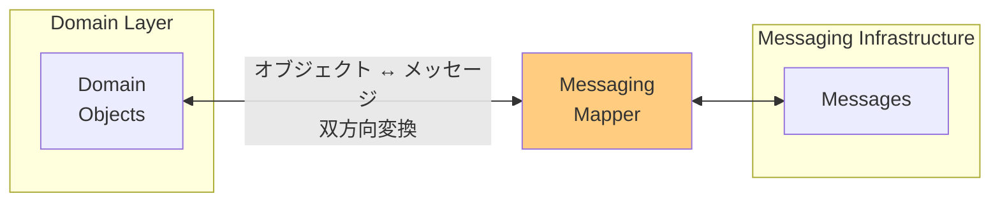

# Messaging Mapper

## パターンの概要

Messaging Mapperは、ドメインオブジェクトとメッセージング基盤の間でデータの変換を行う。両者は互いに独立した状態を保つ。



## EIPにおけるMessaging Mapper

### 問題

メッセージングを介してアプリケーションを統合する場合、ドメインオブジェクトとメッセージング基盤の間でデータを移動する必要がある。これら2つの世界は根本的に異なるパラダイムを使用している。どのようにしてこれらのレイヤーを独立させたままデータを転送するか。

### 解決策

メッセージング基盤とドメインオブジェクト間のマッピングロジックを含む別個のMessaging Mapperを作成する。このコンポーネントはドメインオブジェクトをメッセージに変換して送信し、受信メッセージをドメインオブジェクトに変換するか、既存のオブジェクトを更新する。重要なのは、どちらのレイヤーもマッパーの存在を知らないこと。

## ドメインオブジェクトからメッセージへのマッピング

Messaging Mapperを使用して、1つ以上のドメインオブジェクト（Aggregateなど）[IDDD]の一部をメッセージにマッピングする。Akkaの使い方によっては、Aggregate自体がアクターであり、自身の状態のサブセットをEvent Message、Command Message、またはDocument Messageにマッピングする可能性がある。以下の例は、Event MessageがAggregateアクターの状態からマッピングされ、`TradingBus`に送信される様子を示している。

```
val event =
    SellOrderExecuted(
        portfolioId,
        symbol,
        quantity,
        price)

tradingBus ! TradingNotification(
        "SellOrderExecuted", event)
```

これは`Order` Aggregateアクター自体をMessaging Mapperとして構成している。`Order`アクターの状態のサブセットが`SellOrderExecuted`にマッピングされ、これはEvent Messageである。これはシンプルで直接的なマッピングであり、実際にはほとんどの場合このように行われるべきである。Event Messagesは多くのフィールド/属性を持つべきではなく、`Order`に何が起こったかを伝えるために絶対に必要な値だけを持つべきである。Command Messagesについても同様であり、モデルに何が起こるべきかを伝えるのに十分なデータのみを持つべきである。

## 複雑なマッピングを避ける

マッパーというと、複雑なマッピング作業を考えがちである。例えば、複数のAggregateの一部を取得して、大きなDocument Messageにマッピングすることを想像するかもしれない。これがそうである場合もあるかもしれないが、可能な限り避けるべきである。

## CQRSクエリへの対応

しかし、Command Query Responsibility Segregation（CQRS）[IDDD]クエリに応答してDocument Messageがマッピングされる場合、かなり大きなペイロードを構築する必要があるかもしれない。その場合、より洗練されたマッパーユーティリティを使用する必要があるかもしれない。残念ながら、JVM上で動作するほとんどのマッパーユーティリティはJavaBeans仕様をサポートしている。これは、Scalaベースのメッセージオブジェクトがpublicなgetterとsetterを提供する必要があるか、マッパーユーティリティがフィールドレベルのリフレクションをサポートする必要があることを意味する（特にメッセージがcase classとして宣言されている場合）。

## 単一のStringベースフィールドによる設計

この問題を回避する1つの方法は、Document Messagesを`messageBody`のような単一の`String`ベースのフィールドで設計することである。この単一フィールドをJSON（JavaScript Object Notation）や、場合によってはXML（Extensible Markup Language）ペイロードに設定できる。これは消費者側で適切なパーサーによって読み取られる。

*Implementing Domain-Driven Design* [IDDD]の「Integrating Bounded Contexts」の章では、Google GSONパーサーを使用して、あらゆる種類のシステムプラットフォームと互換性のあるメッセージを生成する方法を詳細に説明している。GSONパーサーはフィールドレベルのイントロスペクションとリフレクションを使用する。フィールドレベルのアクセスは、JavaBean仕様をサポートしていないものも含め、あらゆる種類のJava/Scalaオブジェクトをサポートする。実際、メッセージングマッパーはシリアライザーとも考えることができる。

## AbstractSerializerとMessageSerializer

ソースコードには、JavaベースのAbstractSerializerと、Scalaのcase classやあらゆる種類のScalaオブジェクトをJSONにマッピングする方法として機能する具体的なMessageSerializerが含まれている。これらはGoogle GSONパーサーを使用する。

`MessageSerializer`は、`java.util.Date`や`AggregateRef`値を含むメッセージ、または一般的なScalaオブジェクトをシリアライズおよびデシリアライズする機能を持つ。`AggregateRef`の使用については、Messaging Gatewayで読むことができる。

このシリアライザーは、`String`ベースの`messageBody`フィールドに設定されるJSONペイロードを構築することで、大きなDocument Messageを組み立てることも可能にする。

## 大きなDocument Messageの消費

`QueryMonthlyOrdersFor`の元の送信者は、`ReallyBigQueryResult` Document MessageのJSONベースの`messageBody`をどのように消費するかを理解するだけでよい。これは、メッセージ発信チームがPublished Language [IDDD]を作成する問題であり、Format Indicatorに関して説明されているとおりである。また、受信者がAnti-Corruption Layer [IDDD]を設計する問題でもあり、Message Translatorに関して説明されているとおりである。これにより、`ReallyBigQueryResult`やその他の類似の結果メッセージの消費者がペイロードを読み取れるようになる。

## 関連パターン

| パターン | 関係 |
|---------|------|
| [[programming/reactive_messaging_pattern/chapter9/messaging_gateway\|Messaging Gateway]] | メッセージングへのアクセスを簡素化する |
| Message Translator | メッセージ形式の変換を行う |
| Canonical Data Model | 共通のデータモデルを使用してマッピングを簡素化 |

## 参考資料

- [Enterprise Integration Patterns - Messaging Mapper](https://www.enterpriseintegrationpatterns.com/patterns/messaging/MessagingMapper.html)
