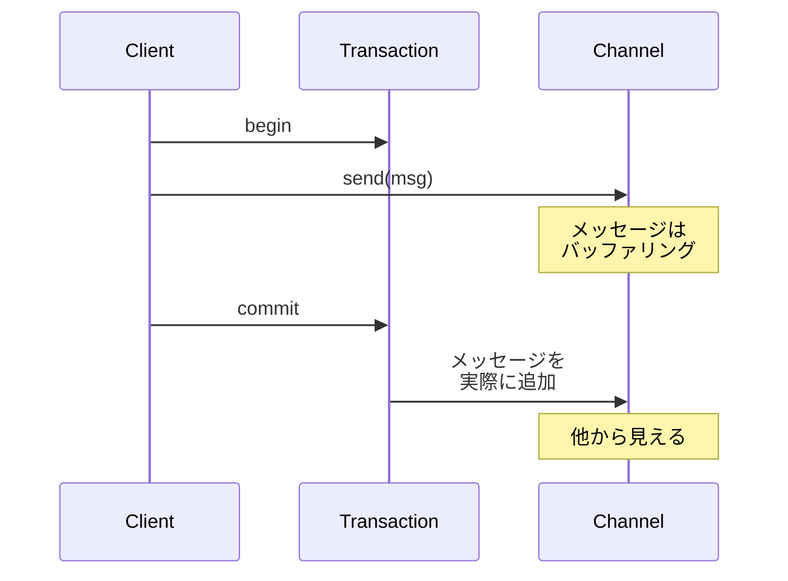

# Transactional Client/Actor

## パターンの概要

Transactional Client/Actorは、メッセージの送受信にトランザクション境界を設定することで、データの整合性を保証するパターンです。アクターモデルのコンテキストでは、このパターンは送信側クライアントだけでなく、受信側アクターのトランザクション管理も含むため、Transactional Client/Actorと呼ばれます。

## EIPにおけるTransactional Client

### 解決すべき問題

メッセージングシステムを使用するアプリケーションでは、メッセージの送受信とビジネス処理の間で整合性を保つ必要があります。以下のようなシナリオで問題が発生する可能性があります。

**送信側の問題**として、アプリケーションがメッセージを送信した後、ローカルのデータベース更新が失敗してロールバックされた場合を考えます。メッセージは既に送信されてしまっているため、受信側は不整合な状態のデータに基づいて処理を進めてしまいます。

**受信側の問題**として、アプリケーションがメッセージを受信して処理を開始した後、処理中にエラーが発生した場合を考えます。メッセージは既にキューから削除されているため、処理は完了していないにもかかわらず、メッセージは失われてしまいます。

これらの問題に対処するため、クライアントがメッセージングシステムとの対話においてトランザクション境界を制御できる仕組みが必要です。

### 解決策

**Transactional Client**を実装します。クライアントのメッセージングシステムとのセッションをトランザクショナルにし、クライアントがトランザクション境界を指定できるようにします。

### 送信側と受信側のトランザクション動作

Transactional Clientは、送信側と受信側で異なる動作を提供します。

**送信側のトランザクション動作**では、メッセージはトランザクションがコミットされるまで、実際にはチャネルに追加されません。アプリケーションはメッセージを「送信」しますが、この時点ではメッセージはバッファリングされるだけです。トランザクションが正常にコミットされて初めて、メッセージは実際にチャネルに追加され、他のアプリケーションから見えるようになります。トランザクションがロールバックされた場合、メッセージは破棄され、送信されなかったことになります。

**受信側のトランザクション動作**では、メッセージはトランザクションがコミットされるまで、実際にはチャネルから削除されません。アプリケーションはメッセージを「受信」しますが、この時点ではメッセージは論理的にロックされるだけです。トランザクションが正常にコミットされて初めて、メッセージは実際にチャネルから削除されます。トランザクションがロールバックされた場合、メッセージはロックが解除され、再び他のコンシューマーから利用可能になります。

### 送信者と受信者の独立性

重要な点として、送信側と受信側のトランザクション設定は独立しています。送信者が明示的なトランザクションを使用していても、受信者は暗黙的なトランザクション（自動コミット）を使用することができ、その逆も可能です。

この柔軟性により、システムの各部分で最適なトランザクション戦略を選択できます。例えば、クリティカルなメッセージの送信には明示的なトランザクションを使用し、一時的な通知メッセージには自動コミットを使用するといった使い分けが可能です。

### 分散システムにおける考慮事項

分散システムでは、このパターンはパフォーマンスに影響を与える可能性があります。トランザクションの管理には、コーディネーション処理やログ記録などのオーバーヘッドが伴います。

クラウドベースのメッセージングサービス（Amazon SQSなど）では、従来のトランザクションとは異なるアプローチが採用されることがあります。例えば、「Visibility Timeout」というメカニズムを使用し、メッセージを受信してから一定時間内に明示的に削除しなければ、メッセージが再び利用可能になるという方式です。これにより、分散トランザクションのオーバーヘッドを避けながら、同等の保護を実現しています。

## アクターモデルにおける4つの典型的な適用パターン

Enterprise Integration Patternsでは、Transactional Clientの4つの典型的な適用パターンが説明されています。これらのパターンを理解することで、どのような状況でトランザクションが必要になるかを把握できます。

### パターン1: Send-Receive Message Pairs（送受信メッセージペア）

このパターンは、メッセージの受信と、それに対する応答メッセージの送信を一つのトランザクションで扱います。

処理の流れは以下のようになります。まずトランザクションを開始し、次にリクエストメッセージを受信して処理します。そしてレスポンスメッセージを作成して送信し、最後にトランザクションをコミットします。

このパターンにより、リクエストの処理とレスポンスの送信が原子的に行われます。処理中にエラーが発生した場合、リクエストは未処理のまま残り、再度処理される機会が得られます。

### パターン2: Message Groups（メッセージグループ）

このパターンは、複数の関連するメッセージを一つのトランザクションで扱います。

処理の流れは以下のようになります。まずトランザクションを開始し、次にグループ内のすべてのメッセージを送信（または受信）します。最後にトランザクションをコミットします。

このパターンにより、グループ内のメッセージがすべて送信されるか、すべて送信されないかのどちらかになります。一部のメッセージだけが送信される中間状態は発生しません。

### パターン3: Message/Database Coordination（メッセージとデータベースの協調）

このパターンは、メッセージングとデータベース操作を一つのトランザクションで扱います。これは最も一般的に必要とされるパターンの一つです。

**受信シナリオ**では、トランザクションを開始し、メッセージを受信してデータベースを更新し、トランザクションをコミットします。これにより、メッセージの処理とデータベースの更新が原子的に行われます。

**送信シナリオ**では、トランザクションを開始し、データベースを更新してメッセージを送信し、トランザクションをコミットします。これにより、データベースの変更と、その変更を通知するメッセージの送信が原子的に行われます。

### パターン4: Message/Flow Coordination（メッセージとフローの協調）

このパターンは、Request-Replyパターンを使用した作業フローをトランザクションで管理します。

処理は通常、二つのトランザクションに分割されます。最初のトランザクションでは、作業項目を取得してリクエストメッセージを送信します。二番目のトランザクションでは、リプライメッセージを受信して作業項目を完了（またはアボート）します。

この分割により、長時間かかる可能性のある外部処理の待機中にトランザクションを保持し続ける必要がなくなります。

## セマンティックなトランザクション

アクターモデルにおいて、メッセージ送信、メッセージ受信、およびアクター状態遷移の永続化にトランザクションを適用する場合、それは**セマンティック（意味論的）**に行われます。

「セマンティック」という表現が使われる理由は、アクターモデルではデータベースの分散トランザクションのような技術的なトランザクション制御ではなく、アプリケーションのロジックとして一貫性を保証するからです。アクター自身が、メッセージの受信と状態変更の永続化を原子的な操作として扱う責務を持ちます。

## 必要なトランザクションステップの理解

アクターモデルでTransactional Client/Actorを実装する際には、以下の三つのトランザクションステップを考慮する必要があります。

**ステップA: メッセージ送信の保証**として、送信側アクターが別のアクターにメッセージを送信し、そのメッセージが確実に受信されることを保証するために、トランザクション的な配慮が必要です。これは「少なくとも1回の配信（at-least-once delivery）」を実現するための基盤となります。

**ステップB: メッセージ受信の確認**として、受信側アクターがメッセージを受信し、その受信を確認することを保証するために、トランザクション的な配慮が必要です。これにより、メッセージが確実に処理されたことを送信側に伝えることができます。

**ステップC: 状態永続化の保証**として、メッセージによって引き起こされた状態遷移を永続化することを保証するために、トランザクション的な配慮が必要です。これにより、システム障害後も状態を復元できます。

これらのステップは通常、二つのトランザクション境界に分割されます。ステップAは独自のトランザクション内で行われ、ステップBとCは別の単一のトランザクション内でまとめて行われます。この分割により、送信と受信という本質的に非同期な操作を適切に扱うことができます。

## 二つのアプローチの比較

アクターモデルでTransactional Client/Actorを実装する際には、**Transactional Clientアプローチ**と**Transactional Actorアプローチ**という二つの異なるアプローチがあります。どちらも同じ目標（データの整合性保証）を達成しますが、アーキテクチャ上の違いがあります。

### Transactional Clientアプローチ

このアプローチでは、トランザクション境界がサービス層全体に及びます。

処理の流れとしては、Controllerがリクエストを受け取り、Order Serviceを呼び出します。Order ServiceはOrderエンティティを操作し、その完全な状態をデータベースに永続化します。トランザクションは、Order Serviceからデータベースまでの範囲を包含します。

このアプローチの特徴として、**複数のオブジェクトにまたがる変更の一貫性**を保証できます。例えば、注文と在庫の両方を同時に更新するようなケースで、どちらか一方だけが更新される状態を防げます。

### Transactional Actorアプローチ

このアプローチでは、トランザクション境界が個々のアクター内に閉じられます。

処理の流れとしては、Order ProcessorがOrderアクターにコマンドを送信します。Orderアクターは自身の状態変更をEvent Sourcingを使用して永続化します。トランザクションは、Orderアクター内に閉じられます。

このアプローチの特徴として、**高い並行性とスケーラビリティ**を実現できます。各アクターが独立してトランザクションを管理するため、他のアクターの処理を待つ必要がありません。

## 状態永続化とイベント通知の連携

状態の永続化プロセスでは、しばしば一つ以上のEvent Messagesが生成されて他のアクターに通知されます。例えば、注文が確定されたときに「OrderPlaced」イベントが発行され、在庫管理システムや配送システムに通知されるというケースです。

このようなシナリオでは、状態の永続化とイベントの発行の両方が確実に行われることが重要です。片方だけが成功し、もう片方が失敗すると、システム全体の整合性が損なわれます。

## 関連パターン

Transactional Client/Actorパターンは、以下のパターンと密接に関連しています。これらのパターンを組み合わせることで、より堅牢なシステムを構築できます。

**Guaranteed Delivery**は、メッセージが確実に配信されることを保証するパターンです。Transactional Clientと組み合わせることで、メッセージの送信と配信の両方で信頼性を確保できます。

**Durable Subscriber**は、コンシューマーがオフラインの間に発行されたメッセージを見逃さないようにするパターンです。トランザクショナルな受信と組み合わせることで、メッセージ処理の信頼性が向上します。

**Message Journal/Store**は、メッセージを永続的に保存するパターンです。トランザクションと組み合わせることで、システム障害時にもメッセージを復元できます。

**Idempotent Receiver**は、「少なくとも1回の配信（at-least-once delivery）」を使用する場合に重要です。同じメッセージが複数回配信される可能性があるため、Idempotent Receiverパターンにより重複配信による副作用を防ぐことができます。

---

## Transactional Clientアプローチの詳細

Service Layerアプローチ（Martin Fowlerが定義した企業アプリケーションアーキテクチャパターン）を使用する場合、at-least-once deliveryを実装するよりも、Akkaのデフォルトであるat-most-once delivery（メッセージのステップAとBについて）を使用し、トランザクションによってシステム状態遷移の永続化（ステップC）を管理する方が有利な場合があります。

### Application Serviceとしてのアクター

このアプローチでは、Application Service（Domain-Driven Designにおけるアプリケーション層のサービス）をアクターとして実装します。このアクターは、特定のメッセージを受信すると、データベーストランザクションを開始します。

Application Serviceアクターは、非アクターとして実装されたドメインモデルと直接対話します。ドメインモデルの操作が完了したら、Application Serviceはトランザクションをコミットまたはロールバックします。

### トランザクション管理の仕組み

TransactionalActorというベースクラスを定義し、典型的なトランザクション動作を提供します。このベースクラスは、トランザクションの開始、コミット、ロールバックといった基本操作をカプセル化します。

重要な点として、トランザクションIDを使用することで、単一のアクターが複数の同時トランザクションを管理できます。例えば、注文のIDをトランザクションIDとして使用することで、複数の注文を並行して処理しながら、各注文のトランザクションを独立して管理できます。

### 同時変更と並行性競合

このアプローチを使用する場合、単一のトランザクション内で変更されるドメインオブジェクトが多いほど、並行性競合の可能性が高くなることに注意が必要です。

複数のアクターが同じドメインオブジェクトを同時に変更しようとすると、楽観的ロックの失敗や悲観的ロックによる待機が発生します。これは、システムのスループットを低下させる原因となります。

この問題を軽減するために、Domain-Driven DesignのAggregateパターンを参照することが推奨されます。Aggregateは、一貫性の境界を明確にし、トランザクションのスコープを適切に制限するのに役立ちます。

### Eventual Consistencyの活用

大規模なトランザクションを避けるために、**Eventual Consistency（結果整合性）**を活用することができます。

Eventual Consistencyでは、すべての変更を単一のトランザクションで原子的に行うのではなく、複数のステップに分割して非同期に処理します。各ステップが完了すると、Event Message（例えば「OrderProcessed」）が発行され、次のステップを担当するサービスに何をすべきかを伝えます。

この方式により、各トランザクションのスコープを小さく保ちながら、システム全体としての整合性を「最終的に」達成できます。

### Transactional Clientアプローチの限界

Transactional Clientアプローチには、アクターモデルの精神と相容れない側面があります。

アクターモデルは、「すべてはアクターである」という思想に基づき、高度な並行性を実現することを目指しています。しかし、Transactional Clientアプローチでは、アクターがデータベースリソースを共有して競合することになります。これは、アクターモデルの利点である独立性と並行性を損なう可能性があります。

より好ましいアプローチは、ドメインモデルの各要素をアクターとして設計し、各アクターが独自にトランザクションを管理するようにすることです。これがTransactional Actorアプローチです。

---

## Transactional Actorアプローチの詳細

### アクターモデルとトランザクションの親和性

オブジェクト指向の先駆者であり、Smalltalkの共同設計者であるAlan Kayは、「アクターモデルは、オブジェクトのアイデアの良い特徴だと私が思っていたものをより多く保持していた」と述べています。

彼が言及していたのは、アクター内での状態管理の完全な分離と、アクター間のコラボレーションがメッセージングを通じてのみ行われるという特性です。この特性は、各アクターの周りに自然なトランザクション境界が存在することを示唆しています。

### アクターにおけるトランザクションの本質

すべてのアクターが常にトランザクショナルである必要はありません。つまり、受信したメッセージごとに永続化トランザクションが実行されるわけではありません。

しかし、アクターが受信するすべてのメッセージは、そのメッセージに対する**孤立した原子的な反応**として見ることができます。なぜなら、アクターは一度に一つのメッセージしか処理せず、内部状態は外部から直接アクセスできないからです。

この孤立した原子的な反応の周りで永続化トランザクションを管理すれば、アクター自体が真にトランザクショナルになります。このようなアクターは、Domain-Driven DesignにおけるAggregateの概念と自然に対応します。Aggregateは一貫性の境界を定義し、その内部の状態変更は常に原子的に行われるべきだからです。

### Akka Persistenceによる実現

AkkaはPersistenceアドオンを提供しており、これによりTransactional Actorパターンを容易に実現できます。Akka Persistenceは、LevelDBをデフォルトのジャーナルストアとして使用しますが、他のデータストア（Cassandra、PostgreSQLなど）をサポートするサードパーティの実装も利用可能です。

---

## Persistent Actorsの理解

### PersistentActorの概念

永続化をサポートするアクターは、PersistentActorトレイト（特性）を拡張して実装します。これにより、アクターはDomain Eventsのストリームとして内部状態を永続化できるようになります。

この方式は**Event Sourcing**と呼ばれるアプローチです。Event Sourcingでは、アクターの現在の状態全体を保存するのではなく、状態変更を引き起こした各イベントを記録します。これにより、何らかの理由で停止されたアクター（スーパーバイザーによる停止や、クラスターリバランシングなど）が、保存されたイベントストリームから完全に再構成できるようになります。

### PersistentActorの識別

各PersistentActorは、persistenceIdによって一意に識別される必要があります。このIDは、アクターのイベントストリームを特定するために使用されます。例えば、注文アクターであれば「order-12345」のように、エンティティの種類とユニークな識別子を組み合わせた形式がよく使われます。

### コマンドとイベントの処理

PersistentActorは、二種類のハンドラーを持ちます。

**receiveCommandハンドラー**は、外部からのCommand Messages（コマンドメッセージ）を処理します。コマンドを受信すると、アクターはビジネスルールを検証し、成功した場合はEvent Message（イベントメッセージ）を永続化します。永続化が成功すると、イベントを使用してアクターの内部状態を更新します。

**receiveRecoverハンドラー**は、アクターの再起動時に呼び出されます。保存されたイベントストリームから各Event Messageを受信し、それを使用してアクターの状態を再構成します。

### 注文アクターの例

注文（Order）アクターを例に考えてみましょう。

1. StartOrderコマンドを受信すると、OrderStartedイベントが永続化され、注文が「開始」状態になります
2. AddOrderLineItemコマンドを受信すると、OrderLineItemAddedイベントが永続化され、明細が追加されます
3. PlaceOrderコマンドを受信すると、OrderPlacedイベントが永続化され、注文が「確定」状態になります

### リカバリプロセス

アクターが再起動されると、PersistentActorトレイトは自動的にリカバリプロセスを開始します。

保存されたイベントが順番にreceiveRecoverハンドラーに配信され、アクターの状態が段階的に再構成されます。最後のイベントが適用されると、RecoveryCompletedという標準イベントが配信され、リカバリが完了したことを示します。

この仕組みにより、システム障害やプロセスの再起動が発生しても、アクターは以前の状態を完全に復元できます。

---

## Event Sourcingの詳細

### Event Sourcingパターンとは

Event Sourcingは、オブジェクトの状態を「現在の値」として保存するのではなく、「過去に発生したイベントの履歴」として保存するパターンです。

従来のアプローチでは、データベースに現在の状態（例：注文の合計金額、ステータス、明細リスト）を保存します。Event Sourcingでは、状態に至った経緯（例：注文が作成された、商品Aが追加された、商品Bが追加された、注文が確定された）を保存します。

現在の状態は、これらのイベントを順番に再生することで導出されます。

### Event Sourcingの利点

**完全な監査証跡**として、すべての状態変更がイベントとして記録されるため、「いつ、何が起こったか」を完全に追跡できます。

**デバッグの容易さ**として、問題が発生した場合、イベントストリームを分析することで、どの時点で何が起こったかを正確に把握できます。

**時間旅行**として、過去の任意の時点の状態を、その時点までのイベントを再生することで復元できます。

### コマンドとイベントの関係

Event Sourcingでは、コマンドとイベントの区別が重要です。

**コマンド**は「これをしてほしい」という要求を表します。コマンドは受け入れられることも、拒否されることもあります。例えば、「注文に商品を追加してほしい」というコマンドは、在庫がない場合に拒否されるかもしれません。

**イベント**は「これが起こった」という事実を表します。イベントは過去形で命名され（OrderCreated、ItemAdded）、一度発生したら変更できません。イベントは「不変の事実」です。

### 状態とイベントの分離

アクター内の状態管理を、別のStateオブジェクトに委譲することが推奨されます。

これにより、状態の詳細をコマンド処理やイベント処理のロジックから分離でき、コードの可読性と保守性が向上します。また、後述するスナップショット機能を実装する際にも、Stateオブジェクトをそのまま保存できるため便利です。

---

## スナップショットの活用

### スナップショットの必要性

Event Sourcingを使用する場合、アクターの状態を再構成するには、最初のイベントから最後のイベントまですべてを再生する必要があります。イベントの数が多い場合、この再生処理は時間がかかる可能性があります。

例えば、数千件の明細を持つ注文アクターを考えてみましょう。再起動のたびに数千件のイベントを再生するのは効率的ではありません。

### スナップショットによる最適化

スナップショットは、特定の時点でのアクターの状態を保存したものです。リカバリ時には、最新のスナップショットをロードし、その後のイベントのみを再生すれば良くなります。

例えば、1000件のイベントがあり、500件目でスナップショットが保存されている場合、リカバリ時には500件目のスナップショットをロードし、501件目から1000件目までの500件のイベントのみを再生します。

### スナップショットの頻度

スナップショットをいつ保存するかは、アクターの特性に応じて決定します。

**イベントが少ない場合**（例：典型的な注文で数十件程度のイベント）は、スナップショットは不要かもしれません。リカバリ時間が許容範囲内であれば、追加の複雑さを導入する必要はありません。

**イベントが多い場合**（例：数百〜数千件のイベント）は、スナップショットの導入を検討すべきです。例えば、「250イベントごとにスナップショットを保存する」といったルールを設定できます。

万能のガイダンスはありません。各アクタータイプの特性を分析し、適切なスナップショット戦略を決定する必要があります。

---

## Eventual Consistencyの実現

### アクター間の整合性の課題

Transactional Actorパターンでは、各アクターが独自のトランザクションを管理します。これは、あるアクターの状態変更に依存する他のアクターが、同時に自分の状態を更新することが「不可能」であることを意味します。

しかし、これは実際には良いことです。分散トランザクションの複雑さを避けながら、より良いスケーラビリティとパフォーマンスを実現できるからです。

### Eventual Consistencyの仕組み

依存関係のあるアクター間の整合性を保つために、**Eventual Consistency（結果整合性）**を使用します。

Eventual Consistencyでは、すべてのアクターの状態が「即座に」一貫性を持つことは保証されません。代わりに、「最終的に」一貫性が達成されることが保証されます。

仕組みは以下のようになります。

1. アクターAがコマンドを処理し、状態を変更する
2. アクターAは、何が起こったかを示すEvent Message（例：OrderPlaced）を生成する
3. このイベントが、依存するアクターB、C、Dに送信される
4. 各アクターは、受信したイベントに応じて自分の状態を更新する

この方式により、各アクターは独立してトランザクションを管理しながら、システム全体としての整合性を「最終的に」達成できます。

### 複雑なプロセスの管理

依存関係と必要な反応が複雑になる場合、**Process Manager**パターンの使用を検討します。

Process Managerは、長時間実行されるビジネスプロセスを明示的にモデル化し、複数のアクター間の協調を管理します。Domain-Driven Designのコンテキストでは、Sagaとも呼ばれることがあります。

---

## Persistent Viewsによる読み取り最適化

### CQRS（コマンドクエリ責務分離）との関連

Persistent Actorは、コマンドの処理と状態の永続化に最適化されています。しかし、読み取り（クエリ）のユースケースでは、異なる形式のデータが必要になることがあります。

例えば、注文の一覧を表示する画面では、各注文の概要情報（注文番号、合計金額、ステータス）が必要です。しかし、Event Sourcingで永続化されたデータは、このような形式で直接クエリすることが困難です。

### Persistent Viewの役割

Persistent View（永続ビュー）は、PersistentActorの状態を、読み取りに最適化された形式で非正規化して保持します。

Persistent Viewは、対応するPersistentActorと同じpersistenceIdを共有し、そのイベントストリームを購読します。新しいイベントが発生すると、Persistent Viewはそれを受信し、自身の非正規化されたデータ構造を更新します。

### 読み取りと書き込みの分離

この構成により、Command Query Responsibility Segregation（CQRS）パターンを実現できます。

**書き込み側**（Persistent Actor）は、ビジネスルールの適用とイベントの永続化に集中します。

**読み取り側**（Persistent View）は、クエリに最適化されたデータ形式の維持に集中します。

この分離により、書き込みと読み取りを独立してスケーリングでき、それぞれの要件に最適化したデータ構造を使用できます。

## 参考資料

- [Enterprise Integration Patterns - Transactional Client](https://www.enterpriseintegrationpatterns.com/patterns/messaging/TransactionalClient.html)
