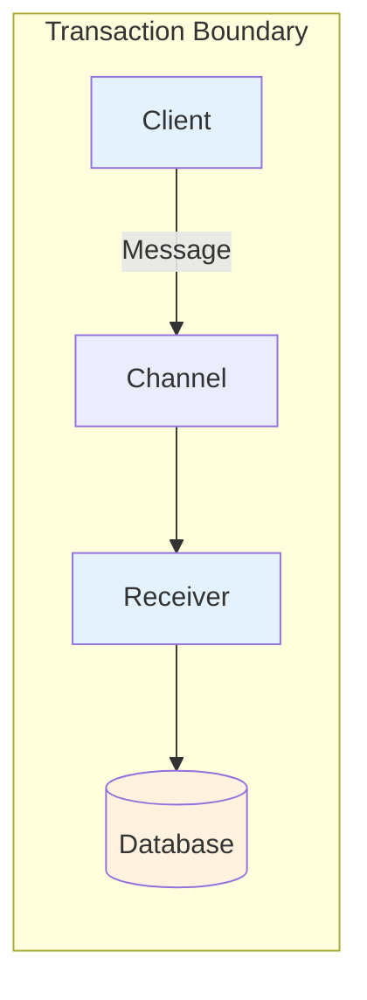

# Transactional Client/Actor

## パターンの概要



## EIPにおけるTransactional Client

### 問題

クライアントがメッセージングシステムとのトランザクションを制御するにはどうすればよいか。

### 解決策

Transactional Clientを実装する。クライアントのメッセージングシステムとのセッションをトランザクショナルにし、クライアントがトランザクション境界を指定できるようにする。

### 特徴

- 送信者も受信者もトランザクショナルに動作できる
- 送信者はトランザクションがコミットされるまでメッセージをチャネルに追加することを遅延する
- 受信者はトランザクションがコミットされるまでメッセージをチャネルから削除することを遅延する

## クライアントと受信側両方でのトランザクション

Transactional Clientパターンは、Akkaアクターで使用される場合、クライアントアクターと受信側アクターの両方でのトランザクションに関するものである。アクターモデルでの使用目的のため、このパターンはTransactional Client/Actorと名付けられている。

## EIPにおける4つの特徴的な適用方法

Enterprise Integration Patterns [EIP]では、典型的なメッセージングミドルウェアツールを使用する場合のTransactional Clientの4つの特徴的な適用方法について説明している。

### Send-Receive Message Pairs
トランザクションを開始し、最初の（受信した）メッセージを受信して処理し、2番目のメッセージを作成して送信し、その後コミットする。

### Message Groups
トランザクションを開始し、グループ内のすべてのメッセージを送信または受信し、その後コミットする。

### Message/Database Coordination
トランザクションを開始し、メッセージを受信し、データベースを更新し、その後コミットする。または、データベースを更新し、更新を他に報告するためにメッセージを送信し、その後コミットする。

### Message/Flow Coordination
Request-Replyメッセージのペアを使用して作業項目を実行する。トランザクションを開始し、作業項目を取得し、リクエストメッセージを送信し、その後コミットする。または、別のトランザクションを開始し、リプライメッセージを受信し、作業項目を完了またはアボートし、その後コミットする。

## セマンティックなトランザクション

トランザクションを使用してAkkaのメッセージ送信、メッセージ受信、およびアクター状態遷移の永続化を保証することは、これらすべてのユースケースで*セマンティックに*行われる。

## 必要なトランザクションステップ

以下の必要なトランザクションステップを考慮する：

- **(A)** 任意のアクターが別のアクターにメッセージを送信でき、それが受信されることを保証するには、トランザクションを使用する必要がある
- **(B)** メッセージ受信アクターがメッセージを受信し、その受信を確認することを保証するには、トランザクションを使用する必要がある
- **(C)** メッセージ受信アクターが状態遷移を引き起こすメッセージを受信し、新しい状態を永続化することを保証するには、トランザクションを使用する必要がある

一般的に、トランザクションステップAはそれ自体のトランザクション内にあり、ステップBとCは別の単一のトランザクション内にある（Figure 9.1参照）。

## 2つのアプローチ：Transactional ClientとTransactional Actor

Figure 9.1は、Transactional ClientとTransactional Actorの2つのアプローチを示している。同じことを達成しているが、Transactional Actorがアクターモデルには最適なアプローチである。

### Transactional Client（左側）
- Controller → Order Service → Order → Full State → Database
- トランザクションの範囲がOrder ServiceからDatabaseまで

### Transactional Actor（右側）
- Order Processor → Order（Event Sourced）
- トランザクションの範囲がOrder内

## 状態トランザクションの永続化

ステップCで永続化された状態トランザクション（Figure 9.1の点線で示されている）は、1つ以上の送信Event Messagesを生成することで達成される場合がある。その場合、アクターが生成したEvent Messagesは他のアクターにも送信される可能性があり、ユースケース3と4になる。

## 関連パターン

メッセージ送信と受信、および状態遷移をトランザクショナルにするためのいくつかの異なるアプローチがある。これらは、Guaranteed Delivery、Durable Subscriber、およびMessage Journal/Storeをカバーする際に説明される。また、ステップA、B、Cはすべてat-least-once deliveryを使用するため、Idempotent Receiverの設計方法も理解する必要がある。

---

## Transactional Client

Service Layer [Fowler EAA]アプローチを使用する場合、at-least-once deliveryアプローチを実装するよりも、Akkaのデフォルトat-most-once deliveryを使用し（ステップAとB）、同時にトランザクションによってシステム状態遷移の永続化を管理する方が有利な場合がある（ステップC）。そのような場合、トランザクション境界がどこで始まりどこで終わるかを決定する必要がある。

Service Layer [Fowler EAA]アプローチを使用して、Application Service [IDDD]を実装するアクター内でトランザクションを管理する。このアクターは、特定のメッセージを受信すると、データベーストランザクションを開始する。アクターベースのApplication Serviceは、非アクターのドメインモデルと直接対話する。この後、Application Serviceはトランザクションをコミットまたはロールバックする。

### TransactionalActorベースクラス

ベースクラス`TransactionalActor`は、典型的なトランザクション動作`startTransactionFor()`、`commitFor()`、および`rollbackFor()`を提供する。これらの関数には、何らかの一意のトランザクションIDを提供する必要があり、これには`Order`の一意のアイデンティティを使用できる。`ProcessOrder`を受信すると、トランザクションが開始される。`Order`が`processOrder()`を正常に実行すると、トランザクションはコミットされる。そうでなければ、トランザクションはロールバックされる。`orderId`をトランザクションIDとして使用することで、各`TransactionalActor`が潜在的に多数の同時トランザクションを管理できる。

### 同時変更の注意点

この`OrderService`が意図したとおりに動作する場合、このTransactional Clientは非アクターのドメインモデルで任意の数の状態遷移を引き起こす可能性がある。ただし、単一のトランザクション内で変更されるドメインオブジェクトが多いほど、同じドメインオブジェクトの複数の同時変更による並行性競合の可能性が高くなることに注意。最適なトランザクション設計へのアプローチについては、Aggregates [IDDD]を参照。

### Eventual Consistency

このような状況に役立つ1つのプラクティスは、*eventual consistency*を使用することである（詳細は「Eventual Consistency」セクションを参照）。これは、アクターモデルの直接非同期メッセージングによってサポートできる。このような*long-running transaction*に参加する各Application Serviceは、以前に何が起こったかを示すEvent Message（`OrderProcessed`など）を受信し、eventual consistencyプロセスをサポートするために何をする必要があるかを受信者に伝える。

### Transactional Clientアプローチの問題点

このTransactional Clientアプローチは、高度に並行で「すべて」をアクターとして扱うアクターモデルの精神に実際には従っていない。アクターを最大限に活用すれば、おそらくそれほどうまく機能しない。データベースリソースを競合するアクターが存在する可能性がある。ドメインモデルの各アクターを、アクターモデルの行儀の良い市民として設計する方がはるかに良い。これは2番目のアプローチにつながる：ドメインモデルの各アクターが独自にトランザクションを管理するように設計すること。

---

## Transactional Actor

### Alan Kayの言葉

オブジェクト指向の先駆者であり、Smalltalkの共同設計者であるAlan Kayは、「アクターモデルは、オブジェクトのアイデアの良い特徴だと私が思っていたものをより多く保持していた」と述べた。彼が言及していたのは、少なくとも部分的には、アクター内で状態管理を完全に分離し、アクター間のコラボレーションはメッセージング契約を通じてのみ可能にする能力である。これは、各アクターの周りの自然なトランザクション境界を示唆している。

### アクターとトランザクション

これは、すべてのアクターが常にトランザクショナルであり、受信したメッセージごとに永続化トランザクションが実行されているという意味ではない。しかし、受信したすべてのメッセージは、与えられたメッセージの刺激に対する孤立した原子的な反応として見ることができる。その孤立した原子的な反応の周りで永続化トランザクションを管理することになれば、アクター自体が真にトランザクショナルになる。後者の場合、アクターは自然なAggregate [IDDD]となり、これが今議論しているトピックである。

### Akka Persistence

これを促進するために、AkkaはPersistenceアドオンを提供している：Akka Persistence。プロジェクトでAkka Persistenceを動作させるには、akka/libディレクトリから以下のJARファイルを参照する：

- *akka-persistence_x.y.z.jar*: Akka Persistenceアドオン。執筆時点では、JARファイルはakka-persistence-experimental_2.10-2.3.2.jarという名前で、まだ実験段階だった
- *leveldb-x.y.jar*: LevelDB機能
- *leveldb-api-x.y.jar*: LevelDBアプリケーションプログラミングインターフェース（API）
- *leveldbjni-all-x.y.jar*: LevelDB Java Native Interface（JNI）リンク
- *protobuf-java-x.y.z.jar*: GoogleのProtoBufライブラリ（Java用）

これらのファイル名には*x.y.z*表記があり、これはリリースバージョンのプレースホルダーである。LevelDBはデフォルトのジャーナルだが、本番のMessage Storeとして使用する必要はない。他のデータストアをサポートするさまざまなサードパーティの代替品もある。

---

## Persistent Actors

### PersistentActorトレイト

永続化にAkkaを使用するアクターは、`PersistentActor`トレイトを拡張する。これにより、アクターはDomain Eventsのストリームとして内部状態を永続化できる。これはEvent Sourcing [IDDD]と呼ばれるアプローチである。Event Sourcingは、保存される各イベントを、アクター状態全体ではなく、変更されたもののみの記録として定義することを強調する。Event Sourcingを使用すると、何らかの理由で停止されたアクター（スーパーバイザーによる停止や、新しいクラスターシャードの場所にリバランスされるときなど）が、最後に保存されたイベントストリームから完全に再構成できるようになる。

### PersistentActorの動作

各`PersistentActor`は、その`persistenceId`によって一意に識別される必要がある。

`Order`は、`receiveCommand`ハンドラーブロックを通じてCommand Messagesを受信する`PersistentActor`である。`StartOrder`コマンドを受信すると、`OrderStarted` Event Messageを永続化する。`persist()`が成功すると、`OrderStarted`イベントを使用してアクターの状態が更新される。この時点で、`Order`は`open`としてマークされる。後続のコマンドは`AddOrderLineItem`または`PlaceOrder`のいずれかである。各`AddOrderLineItem`が受信されると、`Order`がまだ`open`とマークされていると仮定して、アクターの状態は永続化された`OrderLineItemAdded`イベントに含まれる新しい`LineItem`を保持するように更新される。最後に、`PlaceOrder`コマンドを受信すると、`OrderPlaced`イベントが永続化され、`Order`をクローズするために使用される。

### リカバリ

`Order`アクターが停止され、その後何らかの理由で再起動された場合、`PersistentActor`トレイトは`Order`をそのイベントストリームから再構成させる。各Event Messageは`receiveRecover`ハンドラーブロックによって受信され、3つの`updateWith()`メソッドの1つに委譲して、イベントを`Order`の状態に適用する。`Order`がイベントストリームの最後のEvent Messageの状態に完全に回復すると、`receiveRecover`は標準の`RecoveryCompleted`イベントを受信する。この標準イベントにより、完全なリカバリに従う必要がある追加の特別な初期化を実行できるが、新しいCommand Messagesの受信に先行する必要がある。

`PersistentActor`を実装するのは本当に簡単である。それでも、スナップショットの使用方法を含め、Event Sourcingについてもう少し説明があると役立つかもしれない。

---

## Using Event Sourcing

### Event Sourcingパターン

Event Sourcingは、オブジェクトやレコードの状態が、そのオブジェクトやレコードに発生した過去のイベントで構成されるパターンである。Figure 9.2の図に示されているように、`Order`アクターには4つのイベントが発生し、その状態はそれらのイベントがアクターにとって何を意味するかの解釈に基づいている。

### Figure 9.2: Transactional Actorの動作

Transactional ActorはCommand Messagesを受信し、新しい状態を永続化する（ステップ1と2）。状態リカバリモード中、以前に永続化されたDomain Eventsが読み取られ、状態を回復する（ステップ3と4）。

`Order`によって永続化された各Event Messageは、対応するCommand Messageによって引き起こされている：

1. アクターが作成されて開始された後、`StartOrder`コマンドを受信し、`OrderStarted`イベントを引き起こす
2. ユーザーが`Order`を通じて購入するアイテムを選択し、`AddOrderLineItem`コマンドが送信されて`OrderLineItemAdded`イベントを引き起こす
3. ユーザーが別の購入アイテムを選択し、別の`AddOrderLineItem`コマンドが別の`OrderLineItemAdded`イベントを引き起こす
4. 最後に、ユーザーが注文を完了して発注し、`PlaceOrder`コマンドが`Order`アクターに送信される。このコマンドは`OrderPlaced`を引き起こす

### イベントへの反応

Event Messagesを永続化するだけでは十分ではない。`Order`アクターは、それらのイベントそれぞれに反応して、イベントごとに状態を遷移させる方法を知る必要もある。各Event Messageは、1から4などの発生した順序で受信される必要がある。このような方法でイベントを受信することは、継続的な状態遷移だけでなく、アクターが停止されて再起動された場合に永続化されたイベントからアクターの状態を完全に再構成することも可能にする。

### NOTE: OrderStateオブジェクト

`Order`アクターが保持する別の`OrderState`オブジェクトを持つ必要はないが、そのようなものを使用すると、アクター状態の詳細をCommand MessageとEvent Messageの処理から分離するのに役立つ可能性がある。そのような`OrderState`オブジェクトを使用しないことを選択した場合、それが保持する`val`と`var`参照インスタンスは`Order`アクターで直接管理する必要がある。さらに、別の`OrderState`を使用すると、現在のアクター状態のスナップショットを保存することも容易になる。

---

## Snapshots

### スナップショットの必要性

あるアクターに対して多数のEvent Messagesが永続化されている場合、その状態を再構成すること（これまでに発生した最初のイベントから最後のイベントまで）は遅い操作になる可能性がある。アクター状態スナップショットを使用すると、Message Storeからアクターの状態を回復するために必要な時間を大幅に削減できる。

### NOTE: スナップショットの必要性判断

Event Sourcingを使用するアクターがスナップショットをサポートする必要があるとは限らない。例えば、`Order`が比較的少数の`OrderLines`を持つ傾向があり、`Order`によって永続化されるEvent Messagesの総数がおよそ200以下の範囲にある場合、`OrderState`のスナップショットを保存する必要はないかもしれない。一方、`Order`インスタンスが数百、さらには数千の`OrderLines`を持つ傾向がある場合、`OrderState`のスナップショットを生成することで、間違いなく`Order`のロード時間が大幅に短縮される。

万能のガイダンスはない。各Event Sourcingアクタータイプを分析して、スナップショットを使用すべきかどうか、使用する場合はスナップショットを永続化する頻度を決定する必要がある。

### スナップショットの実装

`PersistentActor`がスナップショットを使用する場合、各スナップショットがいつ永続化されるかを示す必要がある。Command Messageの処理中に行うか、スナップショットを保存する時間であることを示すMessageを自分自身に送信できる。

例えば、`Order`は250番目の`LineItem`ごと（つまり、250、500、750、...）にスナップショットを保存させることを決定する。`Order`は自分自身に`SaveOrderSnapshot`メッセージを送信してスナップショットを要求する。`SaveOrderSnapshot` Command Messageを受信すると、`Order`は以前に保存されたスナップショット（もしあれば）を削除し、新しいものを保存する。

### リカバリ時のスナップショット

`Order`リカバリ中、保存されたスナップショットがある場合、`PersistentActor`はそれを`Order`の状態をその時点まで回復する手段として提供する。次に、スナップショットより新しいEvent Messagesのみが`receiveRecover`に配信され、`orderState`に適用される。

---

## Eventual Consistency

### 依存するアクターの更新

アクターベースのドメインモデルに対処すべきもう1つの重要な側面がある。1つのアクターベースのAggregate [IDDD]に状態変更を加えると、その変更に依存する他のアクターベースのAggregateがある可能性がある。各`PersistentActor`が独自のトランザクションを管理するため、依存するアクターが反応として同時に自分の状態を更新することは実際には不可能である。それは実際には良いことである。なぜなら、より良いトランザクションの結果でドメインモデルが成功するのを助けるからである。

### Eventual Consistencyの使用

それでも、ある特定のアクターへの変更に依存するアクターは、特定の時間内に更新される必要がある。このためにEventual Consistencyを使用する。どのように？変更されたアクターがCommand Messageの処理を完了するとき、それに何が起こったかを定義するEvent Message（例えば`OrderPlaced`）を生成すべきである。そのEvent Messageは1つ以上の依存するアクターに送信でき、それらはそれに応じて自分の状態を変更することで反応する。

依存関係と必要な反応の範囲が最小限であれば、いくつかの主要なEvent Messagesを送信するだけで十分かもしれない。しかし、このような*long-running process*の管理がより複雑になる場合、おそらくProcess Managerを使用したくなるだろう。実際、アクターモデルでDomain-Driven Design [IDDD]を使用する場合、ビジネスプロセスを細かい制御で明示的にモデル化するために、おそらくProcess Managersを自由に使用するだろう。

---

## Persistent Views

### PersistentView

執筆時点では、Akka Persistenceは`PersistentView`をサポートしている。これは、アプリケーションのビューロジックで使用しやすくするために、`PersistentActor`の状態を非正規化する手段である。しかし、`PersistentView`は長期間存続するものではなく、Akka Streamsを使用するソリューションに置き換えられる予定である。

ここでは、`PersistentView`について概略的に説明し、Durable Subscriberを説明するときにその追加的な使用法を見つけることができる。

### PersistentViewの仕組み

`PersistentView`は、対応する`PersistentActor`と同じ`persistenceId`を持つ必要がある。これは、そのジャーナルからイベントストリームを読み取るために使用される。`viewId`は`persistenceId`とは異なる必要があり、例えばテキスト"-view"を`persistenceId`の末尾に連結することで形成できる。

`receive`ハンドラーブロックでは、対応する`PersistentActor`によって保存された各Event Messageに反応する。非正規化されたデータ構造を維持したいと思うだろう。`Order`の場合と同様に、`OrderView`は250行目アイテムごとに状態のスナップショットを保存する。さらに、`OrderView`は`QueryOrderViewState`メッセージを送信することでビュー状態を照会できる。応答として、不変の`OrderViewState`インスタンスで送信者に返信する。

リカバリについては、再び`PersistentView`で`receiveRecover`を見ることになる。ここでは、`SnapshotOffer`と、3つの可能なイベント`OrderStarted`、`OrderLineItemAdded`、および`OrderPlaced`それぞれに反応する必要がある。

### 更新間隔

`PersistentView`が新しく永続化されたイベントでどれくらいの頻度で更新されるかは、以下の標準設定に従って5秒ごとに発生する：

```
akka.persistence.view.auto-update-interval = 5s
```

この設定は、個々の`PersistentView`が`autoUpdateInterval()`メソッドをオーバーライドし、カスタム間隔を返すことで変更できる。

## 参考資料

- [Enterprise Integration Patterns - Transactional Client](https://www.enterpriseintegrationpatterns.com/patterns/messaging/TransactionalClient.html)
