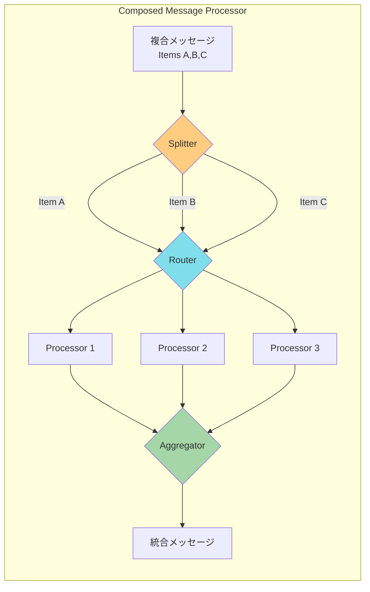
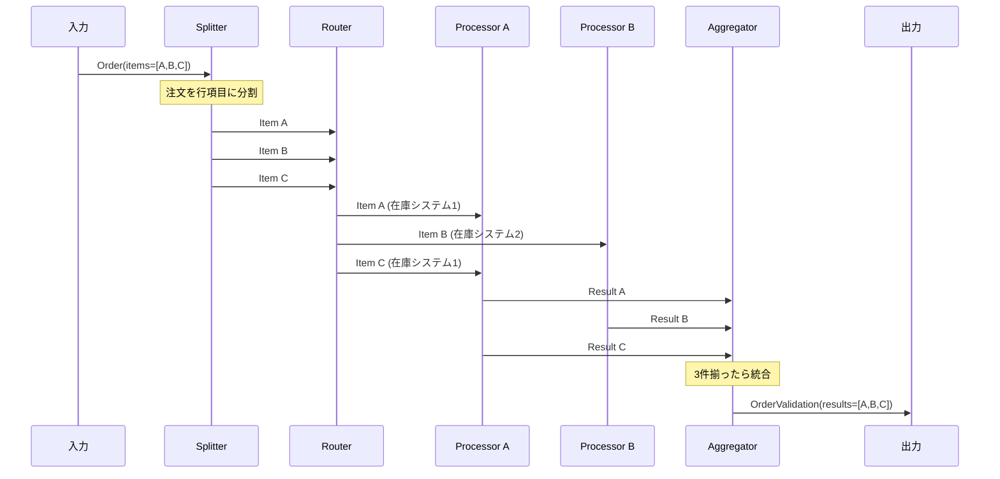

# Composed Message Processor

## 1. 3行要約 (Feynman Technique)
> **目的:** 専門用語を避け、直感的なメタファーを用いて「何をするものか」を定義する。
- 「工場の組立ライン」のような役割。部品を分解し、各部門で検査・加工し、最後に組み立て直す
- 複合メッセージを分割→個別処理→再統合という一連の流れを1つのパターンとして扱う
- 核心的価値：**複合メッセージの要素ごとの処理と結果の統合**

## 2. 解決する課題 (Context & Problem)
> **目的:** 「なぜこれが必要なのか？」という文脈（Pain Point）を明確にする。

- **Before:**
  - 複数の要素を含むメッセージ（例：複数の行項目を持つ注文）を処理する必要がある
  - 各要素は異なるシステムで検証や処理が必要（例：在庫確認）
  - 処理後の結果を1つのメッセージとして統合する必要がある

- **Trigger:**
  - 複合メッセージを要素ごとに分割して処理したい
  - 各要素を適切な処理先にルーティングしたい
  - 処理結果を再度1つのメッセージに統合したい

## 3. ソリューションと構造 (Structure & Visual)
> **目的:** Dual Coding（文字と図）により記憶定着を図る。

### 仕組み
Splitter、Router、Aggregatorを組み合わせて、複合メッセージの分割→ルーティング→処理→統合を実現する。

### 構成要素

| 要素 | 役割 |
|-----|------|
| **Splitter** | 複合メッセージを個別メッセージに分割 |
| **Router** | 各メッセージを適切な処理先にルーティング |
| **Processor** | 各要素を処理 |
| **Aggregator** | 処理結果を1つのメッセージに統合 |

### 構造図



### 処理フロー



## 4. トレードオフと制約 (Critical Thinking)

### Pros (利点):
- **抽象化**: 複雑な処理フローを1つのフィルタとして扱える
- **再利用性**: Pipes and Filtersスタイルで他のフィルタと組み合わせ可能
- **柔軟性**: 各処理ステップを独立して変更可能
- **並列処理**: 各要素を並列に処理可能

### Cons (欠点・副作用):
- **複雑性**: 複数のパターンを組み合わせるため実装が複雑
- **状態管理**: Aggregatorで状態を保持する必要がある
- **障害処理**: 一部の要素が失敗した場合の処理が複雑
- **タイムアウト**: 全要素の処理完了を待つ必要がある

### Anti-Pattern:
- Aggregatorの完了条件を適切に設定しない
- 各要素の処理エラーを考慮しない
- 単純な処理に対してComposed Message Processorを使用（過剰設計）

## 5. 実装イメージ (Implementation)

### Akka Typed Actor (Scala)

```scala
import akka.actor.typed.{ActorRef, Behavior}
import akka.actor.typed.scaladsl.{Behaviors, TimerScheduler}
import scala.concurrent.duration._

// ドメインモデル
case class Order(orderId: String, items: Seq[OrderItem])
case class OrderItem(itemId: String, itemType: String, quantity: Int)
case class ItemValidationResult(itemId: String, isValid: Boolean, message: String)
case class OrderValidationResult(orderId: String, results: Seq[ItemValidationResult])

// Composed Message Processor（Splitter + Router + Aggregator の統合）
object ComposedMessageProcessor {
  sealed trait Command
  case class ProcessOrder(order: Order, replyTo: ActorRef[OrderValidationResult]) extends Command
  private case class ItemProcessed(
    orderId: String,
    result: ItemValidationResult,
    replyTo: ActorRef[OrderValidationResult]
  ) extends Command
  private case class AggregationTimeout(orderId: String) extends Command

  case class AggregationState(
    expectedCount: Int,
    results: Vector[ItemValidationResult],
    replyTo: ActorRef[OrderValidationResult]
  )

  def apply(
    typeAProcessor: ActorRef[ProcessItem],
    typeBProcessor: ActorRef[ProcessItem],
    defaultProcessor: ActorRef[ProcessItem]
  ): Behavior[Command] =
    Behaviors.withTimers { timers =>
      processor(Map.empty, typeAProcessor, typeBProcessor, defaultProcessor, timers)
    }

  private def processor(
    aggregations: Map[String, AggregationState],
    typeAProcessor: ActorRef[ProcessItem],
    typeBProcessor: ActorRef[ProcessItem],
    defaultProcessor: ActorRef[ProcessItem],
    timers: TimerScheduler[Command]
  ): Behavior[Command] =
    Behaviors.receive { (context, command) =>
      command match {
        // 1. Splitter: 注文を行項目に分割し、Routerへ送信
        case ProcessOrder(order, replyTo) =>
          context.log.info(s"Processing order ${order.orderId} with ${order.items.size} items")

          // タイムアウト設定
          timers.startSingleTimer(
            order.orderId,
            AggregationTimeout(order.orderId),
            5.seconds
          )

          // 集約状態を初期化
          val state = AggregationState(order.items.size, Vector.empty, replyTo)

          // 2. Router: 各アイテムを適切なプロセッサにルーティング
          order.items.foreach { item =>
            val responseAdapter = context.messageAdapter[ItemValidationResult] { result =>
              ItemProcessed(order.orderId, result, replyTo)
            }

            val processor = item.itemType match {
              case "TypeA" => typeAProcessor
              case "TypeB" => typeBProcessor
              case _       => defaultProcessor
            }

            context.log.info(s"Routing ${item.itemId} (${item.itemType}) to processor")
            processor ! ProcessItem(item, responseAdapter)
          }

          processor(
            aggregations + (order.orderId -> state),
            typeAProcessor, typeBProcessor, defaultProcessor, timers
          )

        // 3. Aggregator: 処理結果を収集
        case ItemProcessed(orderId, result, replyTo) =>
          aggregations.get(orderId) match {
            case Some(state) =>
              val newResults = state.results :+ result
              context.log.info(
                s"Aggregated ${newResults.size}/${state.expectedCount} for $orderId"
              )

              // 全て揃ったら結果を返す
              if (newResults.size >= state.expectedCount) {
                timers.cancel(orderId)
                replyTo ! OrderValidationResult(orderId, newResults)
                processor(
                  aggregations - orderId,
                  typeAProcessor, typeBProcessor, defaultProcessor, timers
                )
              } else {
                val newState = state.copy(results = newResults)
                processor(
                  aggregations + (orderId -> newState),
                  typeAProcessor, typeBProcessor, defaultProcessor, timers
                )
              }

            case None =>
              context.log.warn(s"No aggregation found for $orderId")
              Behaviors.same
          }

        case AggregationTimeout(orderId) =>
          aggregations.get(orderId).foreach { state =>
            context.log.warn(s"Timeout for $orderId with ${state.results.size}/${state.expectedCount}")
            state.replyTo ! OrderValidationResult(orderId, state.results)
          }
          processor(
            aggregations - orderId,
            typeAProcessor, typeBProcessor, defaultProcessor, timers
          )
      }
    }
}

// アイテムプロセッサ用のメッセージ
case class ProcessItem(item: OrderItem, replyTo: ActorRef[ItemValidationResult])

// 在庫システム A
object InventorySystemA {
  def apply(): Behavior[ProcessItem] =
    Behaviors.receive { (context, msg) =>
      context.log.info(s"InventoryA validating: ${msg.item.itemId}")
      // 在庫チェックロジック
      val result = ItemValidationResult(
        msg.item.itemId,
        isValid = true,
        message = "In stock at Warehouse A"
      )
      msg.replyTo ! result
      Behaviors.same
    }
}

// 在庫システム B
object InventorySystemB {
  def apply(): Behavior[ProcessItem] =
    Behaviors.receive { (context, msg) =>
      context.log.info(s"InventoryB validating: ${msg.item.itemId}")
      val result = ItemValidationResult(
        msg.item.itemId,
        isValid = true,
        message = "In stock at Warehouse B"
      )
      msg.replyTo ! result
      Behaviors.same
    }
}
```

## 6. リンクと関係性 (Network Knowledge)

### 構成パターン:
- [[splitter|Splitter]] - メッセージの分割
- [[content_based_router|Content-Based Router]] - 要素のルーティング
- [[aggregator|Aggregator]] - 結果の統合

### 関連パターン:
- [[pipes_and_filters|Pipes and Filters]] - 単一フィルタとしての抽象化
- [[scatter_gather|Scatter-Gather]] (類似: Recipient List + Aggregator)
- [[correlation_identifier|Correlation Identifier]] - メッセージの関連付け

### 次のステップ:
- [[scatter_gather|Scatter-Gather]] - 複数宛先への問い合わせと応答集約
- [[process_manager|Process Manager]] - より複雑なフロー制御が必要な場合
