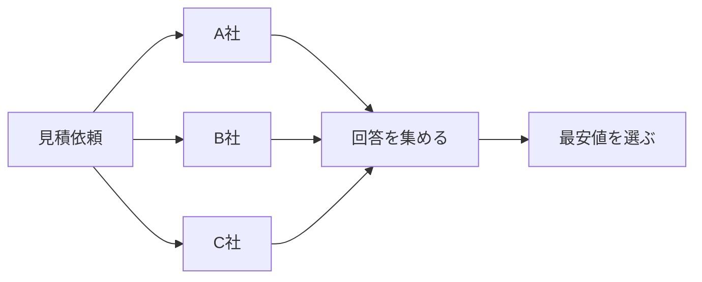
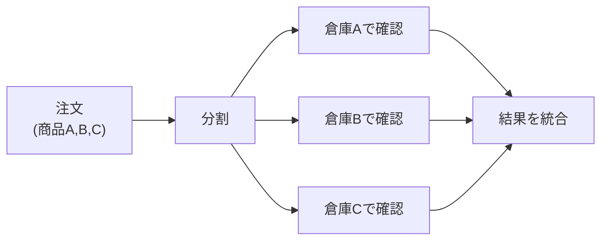
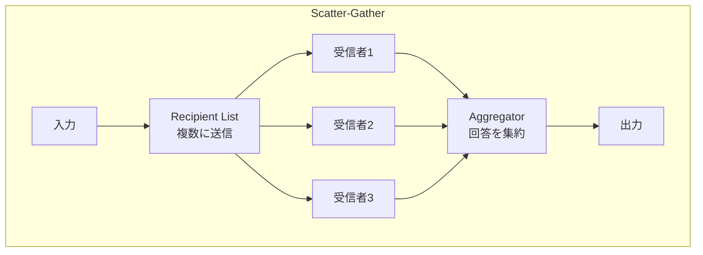
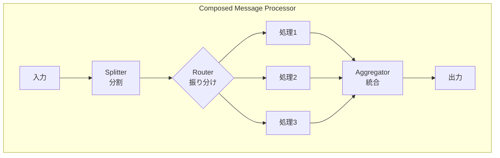
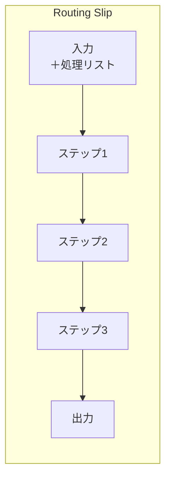
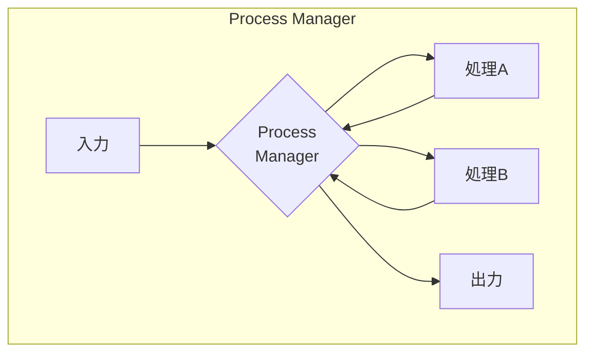
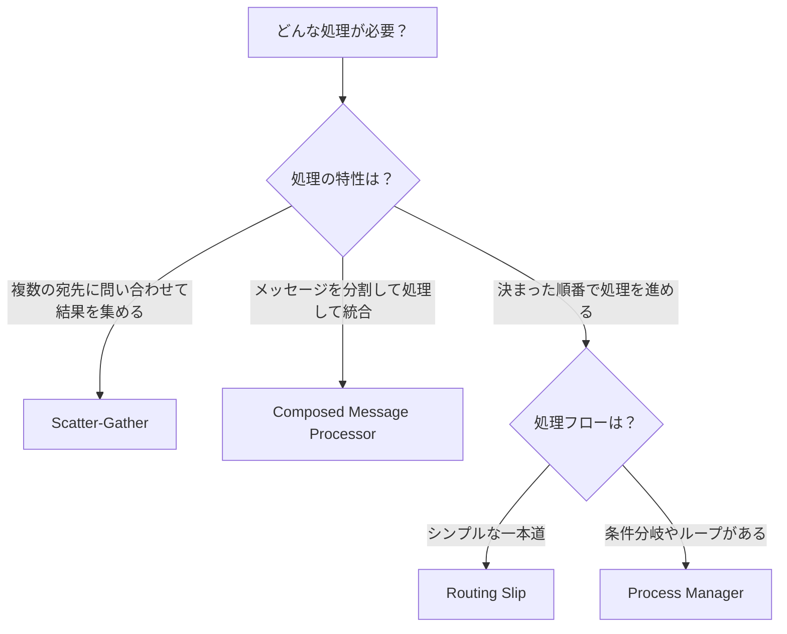
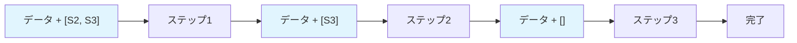
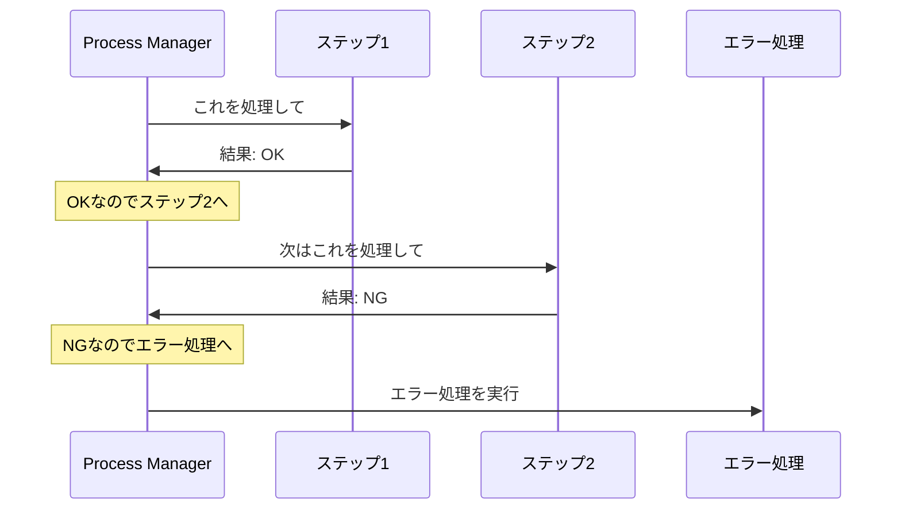

# Composed Routers

## このカテゴリについて

Composed Routersは、[[programming/reactive_messaging_pattern/simple-routers/index|Simple Routers]]を組み合わせて、より複雑なメッセージフローを実現するパターン群です。

Simple Routersが「1つのメッセージをどう扱うか」という単純な問題を解決するのに対し、Composed Routersは「複数のステップにまたがる処理をどう組み立てるか」という、より大きな問題を解決します。

## なぜComposed Routersが必要なのか

実際のビジネスでは、単純なルーティングだけでは解決できない複雑な処理が必要になります。

### 例1: 複数業者への見積依頼

旅行会社が複数の航空会社に同時に見積もりを依頼し、回答が揃ったら最安値を選びたい場合：

これには「複数に送る」（Recipient List）と「結果を集める」（Aggregator）を組み合わせる必要があります。これが[[scatter_gather|Scatter-Gather]]パターンです。

### 例2: 注文の分割処理

1つの注文に複数の商品が含まれていて、商品ごとに別々の倉庫で在庫確認が必要な場合：

これには「分割」（Splitter）、「振り分け」（Router）、「集約」（Aggregator）を組み合わせる必要があります。これが[[composed_message_processor|Composed Message Processor]]パターンです。

## パターン一覧

| パターン | 何をするか | 使う場面 |
|---------|-----------|---------|
| [[scatter_gather\|Scatter-Gather]] | 複数のシステムに問い合わせて、回答を集める | 複数業者への見積依頼、複数データソースの検索 |
| [[composed_message_processor\|Composed Message Processor]] | メッセージを分割し、それぞれ処理して、結果を統合 | 複数商品の注文処理、複合データの検証 |
| [[routing_slip\|Routing Slip]] | メッセージに「処理ステップのリスト」を添付して順番に処理 | 承認フロー、段階的なデータ検証 |
| [[process_manager\|Process Manager]] | 中央のマネージャーが複雑なワークフローを制御 | 条件分岐のあるビジネスプロセス、長期間のワークフロー |

## パターンの構造

それぞれのパターンがどのようにSimple Routersを組み合わせているかを図で示します。

## パターンの選び方

どのパターンを使うか迷ったときは、以下のフローチャートを参考にしてください。

### 選択のポイント

**Scatter-Gather を選ぶ場合**
- 同じリクエストを複数のシステムに送って、回答を比較・統合したい
- 例：最安値の検索、複数DBの検索結果の統合

**Composed Message Processor を選ぶ場合**
- 1つのメッセージに含まれる複数の要素を、それぞれ別の方法で処理したい
- 例：複数商品の注文を商品ごとに処理、複合データの項目別検証

**Routing Slip を選ぶ場合**
- 処理ステップが決まっていて、順番に実行すればよい
- 条件分岐やループは不要
- 例：承認フロー（課長→部長→経理）、データの段階的変換

**Process Manager を選ぶ場合**
- 処理の途中で条件分岐が必要
- 処理を並列に実行したい
- ループや再試行が必要
- 例：複雑な業務プロセス、長期間にわたるワークフロー

## Routing Slip と Process Manager の違い

この2つは「ワークフローを制御する」という点で似ていますが、制御の方法が大きく異なります。

### Routing Slip（分散制御）

メッセージ自身に「次に行くべき場所のリスト」が添付されています。各処理ステップは、処理が終わったらリストの次の場所にメッセージを送ります。

**特徴：**
- シンプルで実装しやすい
- 中央のコントローラーがいないので障害点が分散する
- ただし、条件分岐やループができない

### Process Manager（集中制御）

中央にProcess Managerがいて、全ての処理を監督します。各処理ステップは、処理が終わったらProcess Managerに結果を返し、Process Managerが次に何をするか決めます。

**特徴：**
- 複雑なフローを表現できる（条件分岐、ループ、並列処理）
- 中央で状態を管理するので、フロー全体の把握がしやすい
- ただし、実装が複雑になり、Process Managerが障害点になる

| 観点 | Routing Slip | Process Manager |
|-----|-------------|-----------------|
| 制御方式 | 分散（メッセージに添付） | 集中（中央のマネージャー） |
| 条件分岐 | できない | できる |
| ループ | できない | できる |
| 並列処理 | できない | できる |
| 複雑性 | 低い | 高い |
| 適用場面 | シンプルな一本道のフロー | 複雑なビジネスプロセス |

## 次に読むべき内容

1. [[scatter_gather|Scatter-Gather]] - 複数への問い合わせと結果集約
2. [[composed_message_processor|Composed Message Processor]] - 分割・処理・統合
3. [[routing_slip|Routing Slip]] - シンプルなワークフロー
4. [[process_manager|Process Manager]] - 複雑なワークフロー

## 関連するカテゴリ

- [[programming/reactive_messaging_pattern/index|Message Routing]] - 親カテゴリ
- [[programming/reactive_messaging_pattern/simple-routers/index|Simple Routers]] - Composed Routersの構成要素
- [[programming/reactive_messaging_pattern/architectural-routers/index|Architectural Routers]] - システム全体の設計パターン
