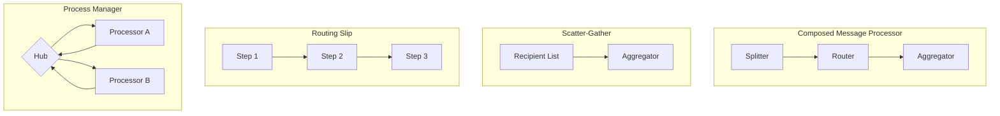
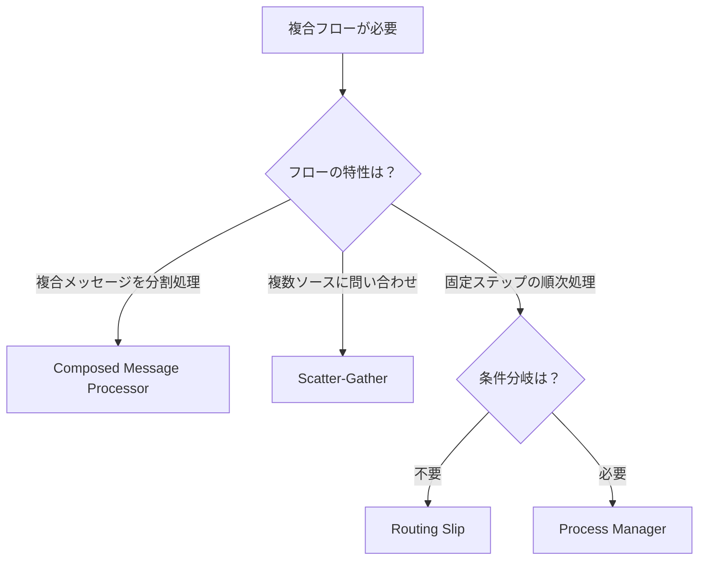

# Composed Routers

## 概要
複数のSimple Routersを組み合わせて、より複雑なメッセージフローを実現するパターン群。

## パターン比較表

| パターン | 制御 | 条件分岐 | 並列処理 | 複雑性 | 用途 |
|---------|-----|---------|---------|-------|------|
| [[composed_message_processor\|Composed Message Processor]] | 分散 | 不可 | 可能 | 中 | 複合メッセージの分割処理 |
| [[scatter_gather\|Scatter-Gather]] | 分散 | 不可 | 可能 | 中 | 複数ソースへの問い合わせ |
| [[routing_slip\|Routing Slip]] | 分散 | 不可 | 不可 | 低 | 線形ワークフロー |
| [[process_manager\|Process Manager]] | **集中** | **可能** | **可能** | 高 | 複雑なビジネスプロセス |

## 構成パターン

## パターン選択ガイド

## Routing Slip vs Process Manager

| 観点 | Routing Slip | Process Manager |
|-----|-------------|-----------------|
| 処理ステップ | 固定、線形 | 動的、非線形可能 |
| 条件分岐 | 不可 | 可能 |
| ループ | 不可 | 可能 |
| 並列処理 | 不可 | 可能 |
| 制御 | 分散（メッセージに添付） | 集中（中央ハブ） |
| 複雑性 | 低い | 高い |
| 適用場面 | シンプルな線形フロー | 複雑なビジネスプロセス |

## 関連パターン

- [[index|Message Routing]] - 親カテゴリ
- [[simple-routers/index|Simple Routers]] - 構成要素
- [[architectural-routers/index|Architectural Routers]] - アーキテクチャパターン
