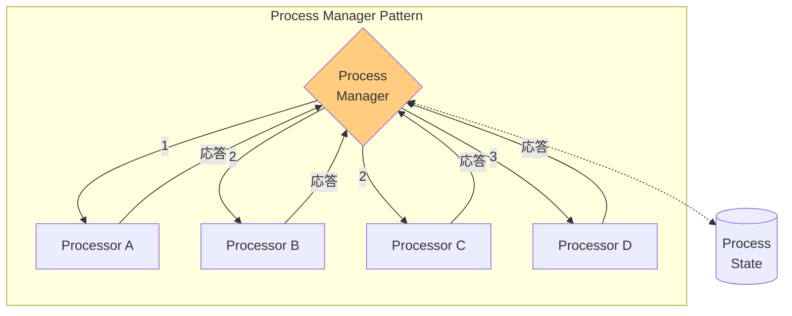
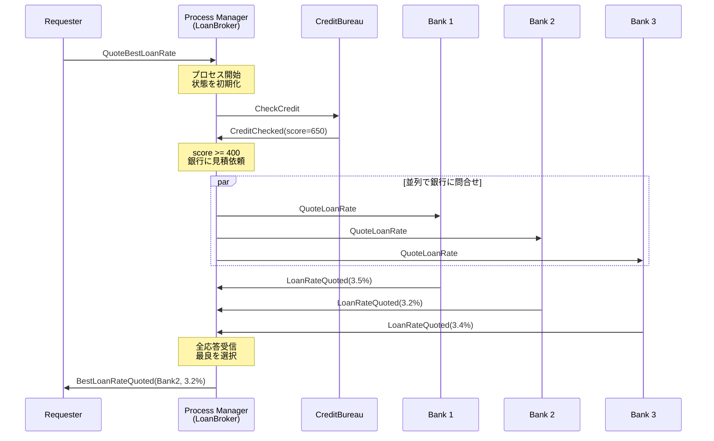

# Process Manager

## 1. 3行要約 (Feynman Technique)
> **目的:** 専門用語を避け、直感的なメタファーを用いて「何をするものか」を定義する。
- 「プロジェクトマネージャー」のような役割。全体の進捗を把握し、次のタスクを指示する
- 中央の制御ユニットが処理状態を保持し、中間結果に基づいて次のステップを決定
- 核心的価値：**複雑なメッセージフローの動的な制御と状態管理**

## 2. 解決する課題 (Context & Problem)
> **目的:** 「なぜこれが必要なのか？」という文脈（Pain Point）を明確にする。

- **Before:**
  - 処理ステップが設計時に不明、または順序が非線形
  - 中間結果に基づいて次のステップを決定する必要がある
  - 条件分岐、ループ、並列処理が必要

- **Trigger:**
  - 実行時に動的にフローを制御したい
  - 条件に応じて異なるパスを選択したい
  - 並列処理と順次処理を組み合わせたい
  - 処理状態を追跡・管理したい

## 3. ソリューションと構造 (Structure & Visual)
> **目的:** Dual Coding（文字と図）により記憶定着を図る。

### 仕組み
中央の処理ユニットであるProcess Managerを使用して：
1. プロセスの状態を保持
2. 中間結果を評価
3. 次の処理ステップを決定
4. メッセージをルーティング

### ハブ・アンド・スポーク構造



### 処理フロー（銀行ローン見積りの例）



## 4. トレードオフと制約 (Critical Thinking)

### Pros (利点):
- **柔軟性**: 条件分岐、ループ、並列処理に対応
- **可視性**: 処理状態を一元管理
- **制御**: フローを完全に制御可能
- **エラー処理**: 中央で例外処理を統一的に管理

### Cons (欠点・副作用):
- **ボトルネック**: 全メッセージが中央を通過
- **複雑性**: 実装が複雑になりがち
- **スケーラビリティ**: 状態管理がスケールの障壁に
- **過剰設計**: シンプルなフローには不向き

### Routing Slipとの比較

| 観点 | Routing Slip | Process Manager |
|-----|-------------|-----------------|
| 制御 | 分散 | 集中 |
| 条件分岐 | 不可 | 可能 |
| ループ | 不可 | 可能 |
| 並列処理 | 不可 | 可能 |
| 状態管理 | なし | あり |
| 適用場面 | 線形フロー | 複雑なフロー |

### Anti-Pattern:
- 全てのフローにProcess Managerを使用（過剰設計）
- 状態の永続化を考慮しない（障害時にデータ損失）
- タイムアウト処理を実装しない

## 5. 実装イメージ (Implementation)

### Akka Typed Actor (Scala)

```scala
import akka.actor.typed.{ActorRef, Behavior}
import akka.actor.typed.scaladsl.{Behaviors, TimerScheduler}
import scala.concurrent.duration._

// ドメインモデル
case class LoanQuoteRequest(
  loanId: String,
  amount: Double,
  termMonths: Int,
  ssn: String
)

case class CreditScore(ssn: String, score: Int)

case class LoanRateQuote(
  bankId: String,
  loanId: String,
  rate: Double
)

case class BestLoanRateQuote(
  loanId: String,
  bankId: String,
  rate: Double
)

case class LoanDenied(loanId: String, reason: String)

// プロセス状態
sealed trait ProcessState
case object WaitingForCredit extends ProcessState
case class WaitingForBankQuotes(
  creditScore: Int,
  expectedQuotes: Int,
  receivedQuotes: Vector[LoanRateQuote]
) extends ProcessState

// Process Manager（Loan Broker）
object LoanBrokerProcessManager {
  sealed trait Command
  case class QuoteBestLoanRate(
    request: LoanQuoteRequest,
    replyTo: ActorRef[Either[LoanDenied, BestLoanRateQuote]]
  ) extends Command
  private case class CreditChecked(
    loanId: String,
    score: CreditScore,
    replyTo: ActorRef[Either[LoanDenied, BestLoanRateQuote]]
  ) extends Command
  private case class BankQuoteReceived(
    quote: LoanRateQuote,
    replyTo: ActorRef[Either[LoanDenied, BestLoanRateQuote]]
  ) extends Command
  private case class QuoteTimeout(loanId: String) extends Command

  case class ProcessContext(
    request: LoanQuoteRequest,
    state: ProcessState,
    replyTo: ActorRef[Either[LoanDenied, BestLoanRateQuote]]
  )

  def apply(
    creditBureau: ActorRef[CreditBureau.CheckCredit],
    banks: Seq[ActorRef[Bank.QuoteLoanRate]]
  ): Behavior[Command] =
    Behaviors.withTimers { timers =>
      processManager(Map.empty, creditBureau, banks, timers)
    }

  private def processManager(
    processes: Map[String, ProcessContext],
    creditBureau: ActorRef[CreditBureau.CheckCredit],
    banks: Seq[ActorRef[Bank.QuoteLoanRate]],
    timers: TimerScheduler[Command]
  ): Behavior[Command] =
    Behaviors.receive { (context, command) =>
      command match {
        // Step 1: プロセス開始 → 与信チェック依頼
        case QuoteBestLoanRate(request, replyTo) =>
          context.log.info(s"Starting loan process for ${request.loanId}")

          // タイムアウト設定
          timers.startSingleTimer(
            request.loanId,
            QuoteTimeout(request.loanId),
            10.seconds
          )

          // 与信チェック依頼
          val creditAdapter = context.messageAdapter[CreditScore] { score =>
            CreditChecked(request.loanId, score, replyTo)
          }
          creditBureau ! CreditBureau.CheckCredit(request.ssn, creditAdapter)

          // プロセス状態を保存
          val processContext = ProcessContext(request, WaitingForCredit, replyTo)
          processManager(
            processes + (request.loanId -> processContext),
            creditBureau, banks, timers
          )

        // Step 2: 与信チェック結果 → 条件分岐
        case CreditChecked(loanId, score, replyTo) =>
          processes.get(loanId) match {
            case Some(processContext) =>
              context.log.info(s"Credit score for $loanId: ${score.score}")

              // 条件分岐：スコアが400以上なら銀行に見積依頼
              if (score.score >= 400) {
                context.log.info(s"Credit approved, requesting bank quotes")

                val quoteAdapter = context.messageAdapter[LoanRateQuote] { quote =>
                  BankQuoteReceived(quote, replyTo)
                }

                // 並列で銀行に見積依頼（Scatter）
                banks.foreach { bank =>
                  bank ! Bank.QuoteLoanRate(
                    loanId,
                    processContext.request.amount,
                    processContext.request.termMonths,
                    score.score,
                    quoteAdapter
                  )
                }

                // 状態更新
                val newState = WaitingForBankQuotes(score.score, banks.size, Vector.empty)
                val newContext = processContext.copy(state = newState)
                processManager(
                  processes + (loanId -> newContext),
                  creditBureau, banks, timers
                )
              } else {
                // 与信不足：ローン拒否
                context.log.warn(s"Credit denied for $loanId: score ${score.score} < 400")
                timers.cancel(loanId)
                replyTo ! Left(LoanDenied(loanId, s"Credit score ${score.score} is below minimum"))
                processManager(processes - loanId, creditBureau, banks, timers)
              }

            case None =>
              context.log.warn(s"No process found for $loanId")
              Behaviors.same
          }

        // Step 3: 銀行見積を収集（Gather）
        case BankQuoteReceived(quote, replyTo) =>
          processes.get(quote.loanId) match {
            case Some(processContext) =>
              processContext.state match {
                case WaitingForBankQuotes(creditScore, expected, received) =>
                  val newQuotes = received :+ quote
                  context.log.info(
                    s"Received quote from ${quote.bankId}: ${quote.rate}% " +
                    s"(${newQuotes.size}/$expected)"
                  )

                  // 全ての見積が揃ったら最良を選択
                  if (newQuotes.size >= expected) {
                    timers.cancel(quote.loanId)
                    val bestQuote = newQuotes.minBy(_.rate)
                    context.log.info(
                      s"Best quote for ${quote.loanId}: ${bestQuote.bankId} at ${bestQuote.rate}%"
                    )
                    replyTo ! Right(BestLoanRateQuote(
                      quote.loanId, bestQuote.bankId, bestQuote.rate
                    ))
                    processManager(processes - quote.loanId, creditBureau, banks, timers)
                  } else {
                    val newState = WaitingForBankQuotes(creditScore, expected, newQuotes)
                    val newContext = processContext.copy(state = newState)
                    processManager(
                      processes + (quote.loanId -> newContext),
                      creditBureau, banks, timers
                    )
                  }

                case _ =>
                  context.log.warn(s"Unexpected state for ${quote.loanId}")
                  Behaviors.same
              }

            case None =>
              context.log.warn(s"No process found for ${quote.loanId}")
              Behaviors.same
          }

        // タイムアウト処理
        case QuoteTimeout(loanId) =>
          processes.get(loanId).foreach { processContext =>
            context.log.warn(s"Timeout for loan process $loanId")
            processContext.state match {
              case WaitingForBankQuotes(_, _, received) if received.nonEmpty =>
                // 受信済みの見積から最良を選択
                val bestQuote = received.minBy(_.rate)
                processContext.replyTo ! Right(BestLoanRateQuote(
                  loanId, bestQuote.bankId, bestQuote.rate
                ))
              case _ =>
                processContext.replyTo ! Left(LoanDenied(loanId, "Process timeout"))
            }
          }
          processManager(processes - loanId, creditBureau, banks, timers)
      }
    }
}

// 与信調査機関
object CreditBureau {
  case class CheckCredit(ssn: String, replyTo: ActorRef[CreditScore])

  def apply(): Behavior[CheckCredit] =
    Behaviors.receive { (context, msg) =>
      context.log.info(s"Checking credit for ${msg.ssn}")
      // 与信スコアを返す（実際はDBや外部API呼び出し）
      val score = 650 // シミュレート
      msg.replyTo ! CreditScore(msg.ssn, score)
      Behaviors.same
    }
}

// 銀行
object Bank {
  case class QuoteLoanRate(
    loanId: String,
    amount: Double,
    termMonths: Int,
    creditScore: Int,
    replyTo: ActorRef[LoanRateQuote]
  )

  def apply(bankId: String, baseRate: Double): Behavior[QuoteLoanRate] =
    Behaviors.receive { (context, msg) =>
      // 与信スコアに基づいてレートを計算
      val rate = baseRate + (800 - msg.creditScore) * 0.01
      context.log.info(s"$bankId quoting ${msg.loanId}: $rate%")
      msg.replyTo ! LoanRateQuote(bankId, msg.loanId, rate)
      Behaviors.same
    }
}

// 使用例
object ProcessManagerExample {
  def apply(): Behavior[Nothing] =
    Behaviors.setup[Nothing] { context =>
      val creditBureau = context.spawn(CreditBureau(), "creditBureau")

      val banks = Seq(
        context.spawn(Bank("Bank1", 3.0), "bank1"),
        context.spawn(Bank("Bank2", 2.8), "bank2"),
        context.spawn(Bank("Bank3", 3.2), "bank3")
      )

      val loanBroker = context.spawn(
        LoanBrokerProcessManager(creditBureau, banks),
        "loanBroker"
      )

      val resultCollector = context.spawn(
        Behaviors.receiveMessage[Either[LoanDenied, BestLoanRateQuote]] {
          case Right(quote) =>
            println(s"Best loan rate: ${quote.bankId} at ${quote.rate}%")
            Behaviors.same
          case Left(denied) =>
            println(s"Loan denied: ${denied.reason}")
            Behaviors.same
        },
        "resultCollector"
      )

      loanBroker ! LoanBrokerProcessManager.QuoteBestLoanRate(
        LoanQuoteRequest("LOAN-001", 100000.0, 360, "123-45-6789"),
        resultCollector
      )

      Behaviors.empty
    }
}
```

## 6. リンクと関係性 (Network Knowledge)

### 関連パターン:
- [[routing_slip|Routing Slip]] (比較: 線形フローにはRouting Slipを選択)
- [[aggregator|Aggregator]] (組み合わせ: 並列処理の結果を集約)
- [[scatter_gather|Scatter-Gather]] (組み合わせ: 複数宛先への問合せ)
- [[message_broker|Message Broker]] (類似: 集中制御のアーキテクチャ)

### 構成要素:
- [[message_channel|Message Channel]] - コンポーネント間の通信
- [[correlation_identifier|Correlation Identifier]] - メッセージの関連付け
- [[message_store|Message Store]] - 状態の永続化

### 次のステップ:
- [[message_broker|Message Broker]] - アーキテクチャレベルの集中制御
- [[routing_slip|Routing Slip]] - シンプルな線形フローの場合
