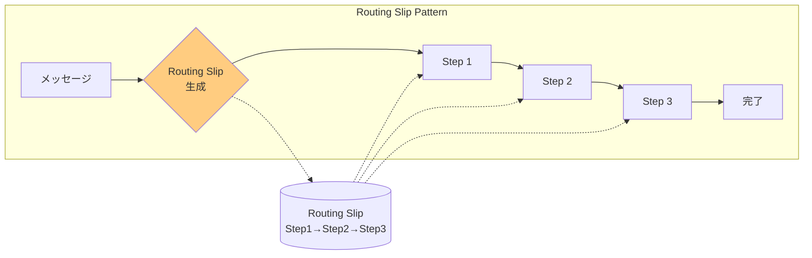
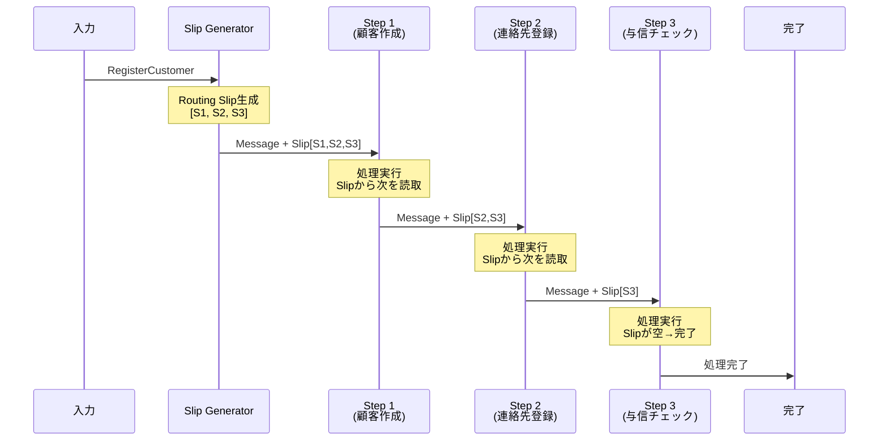

# Routing Slip

## 1. 3行要約 (Feynman Technique)
> **目的:** 専門用語を避け、直感的なメタファーを用いて「何をするものか」を定義する。
- 「回覧板」のような役割。次の回覧先リストを添付し、各部署を順番に回っていく
- メッセージに処理ステップのリストを添付し、各ステップが次のステップへ転送
- 核心的価値：**動的に決定される処理ステップの順次実行**

## 2. 解決する課題 (Context & Problem)
> **目的:** 「なぜこれが必要なのか？」という文脈（Pain Point）を明確にする。

- **Before:**
  - メッセージの処理ステップが設計時に不明、またはメッセージごとに異なる
  - 例：注文の検証ステップが注文金額や顧客属性によって変わる
  - 固定的なルーティングでは柔軟性に欠ける

- **Trigger:**
  - 実行時に処理ステップの順序を決定したい
  - メッセージごとに異なるルーティングパスを実現したい
  - 処理ステップの追加・削除を柔軟に行いたい

## 3. ソリューションと構造 (Structure & Visual)
> **目的:** Dual Coding（文字と図）により記憶定着を図る。

### 仕組み
各メッセージに処理ステップのリスト（Routing Slip）を添付する。各処理コンポーネントは：
1. 自身の処理を実行
2. Routing Slipから次のステップを読み取り
3. メッセージを次のステップに転送

### 構造図



### 処理フロー



## 4. トレードオフと制約 (Critical Thinking)

### Pros (利点):
- **動的ルーティング**: 実行時にルートを決定可能
- **分散制御**: 中央のルーターが不要
- **柔軟性**: ステップの追加・削除・順序変更が容易
- **シンプル**: 各コンポーネントは次のステップを知るだけで良い

### Cons (欠点・副作用):
- **線形処理のみ**: 条件分岐やループには対応困難
- **エラー回復**: 途中のステップで失敗した場合の回復が複雑
- **可視性**: 処理フロー全体の把握が難しい
- **結合度**: メッセージにルーティング情報を持たせる必要がある

### Process Manager との比較

| 観点 | Routing Slip | Process Manager |
|-----|-------------|-----------------|
| 処理ステップ | 固定、線形 | 動的、非線形可能 |
| 条件分岐 | 不可 | 可能 |
| ループ | 不可 | 可能 |
| 並列処理 | 不可 | 可能 |
| 制御 | 分散 | 集中 |
| 複雑性 | 低い | 高い |

### Anti-Pattern:
- 条件分岐が必要な処理にRouting Slipを使用（Process Managerを使うべき）
- Routing Slipの生成ロジックが複雑すぎる
- エラー処理を考慮しない

## 5. 実装イメージ (Implementation)

### Akka Typed Actor (Scala)

```scala
import akka.actor.typed.{ActorRef, Behavior}
import akka.actor.typed.scaladsl.Behaviors

// ドメインモデル
case class CustomerRegistration(
  customerId: String,
  name: String,
  contact: String,
  taxId: String
)

case class ProcessingState(
  registration: CustomerRegistration,
  customerCreated: Boolean = false,
  contactSetup: Boolean = false,
  creditChecked: Boolean = false
)

// Routing Slip付きメッセージ
case class RoutingSlipMessage[T](
  payload: T,
  routingSlip: List[ActorRef[RoutingSlipMessage[T]]],
  completionHandler: ActorRef[T]
)

// Routing Slip生成器
object RoutingSlipGenerator {
  sealed trait Command
  case class RegisterCustomer(
    registration: CustomerRegistration,
    replyTo: ActorRef[ProcessingState]
  ) extends Command

  def apply(
    createCustomerStep: ActorRef[RoutingSlipMessage[ProcessingState]],
    setupContactStep: ActorRef[RoutingSlipMessage[ProcessingState]],
    checkCreditStep: ActorRef[RoutingSlipMessage[ProcessingState]]
  ): Behavior[Command] =
    Behaviors.receive { (context, command) =>
      command match {
        case RegisterCustomer(registration, replyTo) =>
          context.log.info(s"Generating routing slip for ${registration.customerId}")

          // Routing Slipを生成（処理順序を定義）
          val routingSlip = List(
            createCustomerStep,
            setupContactStep,
            checkCreditStep
          )

          val initialState = ProcessingState(registration)
          val message = RoutingSlipMessage(
            payload = initialState,
            routingSlip = routingSlip,
            completionHandler = replyTo
          )

          // 最初のステップに送信
          routingSlip.head ! message.copy(
            routingSlip = routingSlip.tail
          )

          Behaviors.same
      }
    }
}

// 処理ステップの基底トレイト
object ProcessStep {
  def apply[T](
    name: String,
    process: T => T
  ): Behavior[RoutingSlipMessage[T]] =
    Behaviors.receive { (context, message) =>
      context.log.info(s"$name processing...")

      // 1. 自身の処理を実行
      val processedPayload = process(message.payload)

      // 2. 次のステップを確認
      message.routingSlip match {
        case nextStep :: remainingSlip =>
          // 次のステップへ転送
          context.log.info(s"$name forwarding to next step")
          nextStep ! RoutingSlipMessage(
            payload = processedPayload,
            routingSlip = remainingSlip,
            completionHandler = message.completionHandler
          )

        case Nil =>
          // 全ステップ完了
          context.log.info(s"$name is final step, sending completion")
          message.completionHandler ! processedPayload
      }

      Behaviors.same
    }
}

// 具体的な処理ステップ
object CreateCustomerStep {
  def apply(): Behavior[RoutingSlipMessage[ProcessingState]] =
    ProcessStep("CreateCustomer", state => {
      // 顧客作成ロジック
      println(s"Creating customer: ${state.registration.name}")
      state.copy(customerCreated = true)
    })
}

object SetupContactStep {
  def apply(): Behavior[RoutingSlipMessage[ProcessingState]] =
    ProcessStep("SetupContact", state => {
      // 連絡先設定ロジック
      println(s"Setting up contact: ${state.registration.contact}")
      state.copy(contactSetup = true)
    })
}

object CheckCreditStep {
  def apply(): Behavior[RoutingSlipMessage[ProcessingState]] =
    ProcessStep("CheckCredit", state => {
      // 与信チェックロジック
      println(s"Checking credit for: ${state.registration.taxId}")
      state.copy(creditChecked = true)
    })
}

// 使用例
object RoutingSlipExample {
  def apply(): Behavior[Nothing] =
    Behaviors.setup[Nothing] { context =>
      // 処理ステップを作成
      val createCustomer = context.spawn(CreateCustomerStep(), "createCustomer")
      val setupContact = context.spawn(SetupContactStep(), "setupContact")
      val checkCredit = context.spawn(CheckCreditStep(), "checkCredit")

      // Routing Slip生成器を作成
      val generator = context.spawn(
        RoutingSlipGenerator(createCustomer, setupContact, checkCredit),
        "generator"
      )

      // 完了ハンドラ
      val completionHandler = context.spawn(
        Behaviors.receiveMessage[ProcessingState] { state =>
          println(s"Registration complete for ${state.registration.customerId}")
          println(s"  customerCreated: ${state.customerCreated}")
          println(s"  contactSetup: ${state.contactSetup}")
          println(s"  creditChecked: ${state.creditChecked}")
          Behaviors.same
        },
        "completionHandler"
      )

      // 顧客登録を開始
      generator ! RoutingSlipGenerator.RegisterCustomer(
        CustomerRegistration("CUST-001", "John Doe", "john@example.com", "123-45-6789"),
        completionHandler
      )

      Behaviors.empty
    }
}
```

## 6. リンクと関係性 (Network Knowledge)

### 関連パターン:
- [[process_manager|Process Manager]] (拡張: 条件分岐・ループが必要な場合)
- [[pipes_and_filters|Pipes and Filters]] (基盤: フィルタチェーンの概念)
- [[content_based_router|Content-Based Router]] (比較: 静的 vs 動的ルーティング)
- [[message_router|Message Router]] (汎化: ルーティングの基本概念)

### 構成要素:
- [[message_channel|Message Channel]] - ステップ間の通信
- [[return_address|Return Address]] - 処理完了の通知先

### 次のステップ:
- [[process_manager|Process Manager]] - 条件分岐やループが必要な場合
- [[composed_message_processor|Composed Message Processor]] - 分割→処理→統合のパターン
