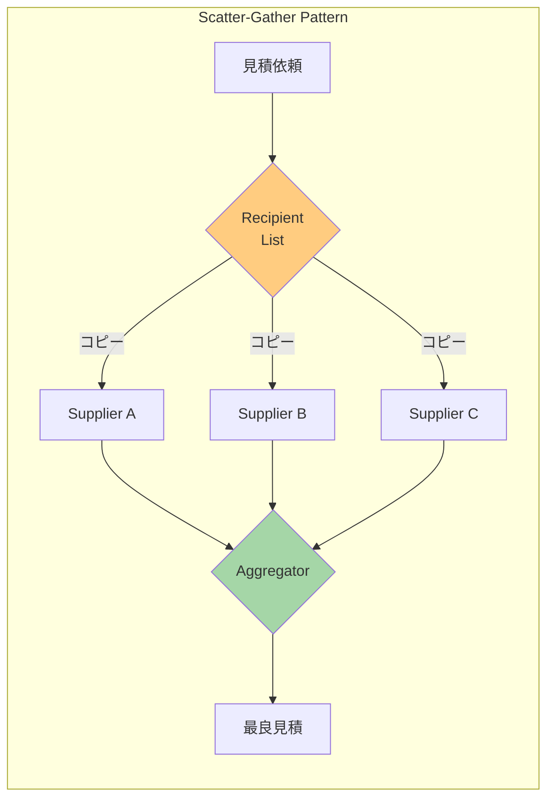
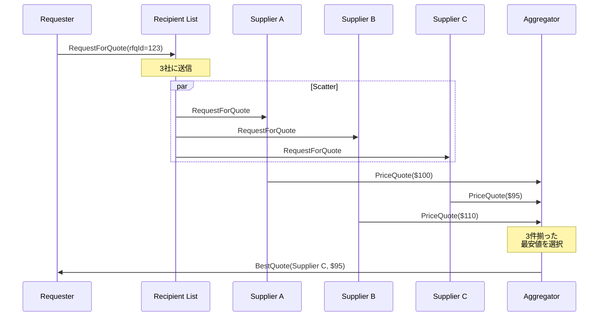

# Scatter-Gather

## 1. 3行要約 (Feynman Technique)
> **目的:** 専門用語を避け、直感的なメタファーを用いて「何をするものか」を定義する。
- 「相見積もり」のような役割。複数の業者に見積依頼を送り、回答を集めて最良を選ぶ
- メッセージを複数の受信者に配信し、応答を収集して1つの結果に統合
- 核心的価値：**複数ソースからの応答収集と最適解の選択**

## 2. 解決する課題 (Context & Problem)
> **目的:** 「なぜこれが必要なのか？」という文脈（Pain Point）を明確にする。

- **Before:**
  - 複数のサプライヤーから見積もりを取得し、最良の条件を選びたい
  - 各サプライヤーに個別にリクエストを送り、応答を手動で比較している
  - 応答が全て揃ったかの判定が難しい

- **Trigger:**
  - 同じリクエストを複数の受信者に送信し、応答を収集したい
  - 収集した応答から最適な結果を選択したい
  - 全体的なメッセージフローを維持したい

## 3. ソリューションと構造 (Structure & Visual)
> **目的:** Dual Coding（文字と図）により記憶定着を図る。

### 仕組み
Scatter-Gatherは2つのフェーズで動作する：
1. **Scatter（分散）**: リクエストを複数の受信者にルーティング
2. **Gather（収集）**: 応答を収集し、単一の応答メッセージに統合

### 2つのバリアント

| バリアント | 実装方法 | 特徴 |
|-----------|---------|------|
| **Distribution** | Recipient List + Aggregator | 送信側が受信者を制御 |
| **Auction** | Publish-Subscribe + Aggregator | 受信者が参加を選択 |

### 構造図（Distribution方式）



### 処理フロー



## 4. トレードオフと制約 (Critical Thinking)

### Pros (利点):
- **最適解の選択**: 複数ソースから最良の結果を選べる
- **並列処理**: 複数の受信者に同時にリクエスト可能
- **柔軟性**: タイムアウトや部分応答での完了が可能
- **疎結合**: リクエスタは個々のサプライヤーを知らなくて良い

### Cons (欠点・副作用):
- **レイテンシ**: 全ての応答を待つ場合、最も遅い応答に依存
- **タイムアウト管理**: 応答しない受信者への対処が必要
- **リソース消費**: 複数のリクエストと応答を処理
- **一貫性**: 受信者ごとに異なる処理時間

### 完了戦略

| 戦略 | 説明 |
|-----|------|
| **Wait for All** | 全ての応答を待つ |
| **First Best** | 条件を満たす最初の応答で完了 |
| **Timeout** | 指定時間経過後に受信済み応答で完了 |
| **Minimum** | 最低N件の応答を受信したら完了 |

### Anti-Pattern:
- タイムアウトを設定しない（永久に待機する可能性）
- 応答が来ない受信者を考慮しない
- 全受信者への無条件送信（Recipient Listでのフィルタリング不足）

## 5. 実装イメージ (Implementation)

### Akka Typed Actor (Scala)

```scala
import akka.actor.typed.{ActorRef, Behavior}
import akka.actor.typed.scaladsl.{Behaviors, TimerScheduler}
import scala.concurrent.duration._

// ドメインモデル
case class RequestForQuotation(
  rfqId: String,
  retailItems: Seq[RetailItem]
) {
  val totalRetailPrice: Double = retailItems.map(_.retailPrice).sum
}

case class RetailItem(itemId: String, retailPrice: Double)

case class PriceQuote(
  quoterId: String,
  rfqId: String,
  itemId: String,
  retailPrice: Double,
  discountPrice: Double
)

case class BestPriceQuotation(
  rfqId: String,
  bestQuotes: Seq[PriceQuote]
)

// Scatter-Gather 実装
object ScatterGather {
  sealed trait Command
  case class RequestQuotes(
    rfq: RequestForQuotation,
    replyTo: ActorRef[BestPriceQuotation]
  ) extends Command
  private case class QuoteReceived(quote: PriceQuote) extends Command
  private case class GatherTimeout(rfqId: String) extends Command

  case class GatherState(
    rfq: RequestForQuotation,
    expectedQuotes: Int,
    receivedQuotes: Vector[PriceQuote],
    replyTo: ActorRef[BestPriceQuotation]
  )

  def apply(
    priceQuoteEngines: Seq[ActorRef[RequestPriceQuote]]
  ): Behavior[Command] =
    Behaviors.withTimers { timers =>
      scatterGather(Map.empty, priceQuoteEngines, timers)
    }

  private def scatterGather(
    activeGathers: Map[String, GatherState],
    engines: Seq[ActorRef[RequestPriceQuote]],
    timers: TimerScheduler[Command]
  ): Behavior[Command] =
    Behaviors.receive { (context, command) =>
      command match {
        // Scatter: 複数の見積エンジンにリクエストを配信
        case RequestQuotes(rfq, replyTo) =>
          context.log.info(s"Scattering RFQ ${rfq.rfqId} to ${engines.size} engines")

          // タイムアウト設定
          timers.startSingleTimer(
            rfq.rfqId,
            GatherTimeout(rfq.rfqId),
            5.seconds
          )

          // 応答アダプター
          val quoteAdapter = context.messageAdapter[PriceQuote](QuoteReceived)

          // 期待する見積数 = エンジン数 × アイテム数
          val expectedQuotes = engines.size * rfq.retailItems.size
          val state = GatherState(rfq, expectedQuotes, Vector.empty, replyTo)

          // 全エンジンに配信
          engines.foreach { engine =>
            rfq.retailItems.foreach { item =>
              engine ! RequestPriceQuote(
                rfq.rfqId,
                item.itemId,
                item.retailPrice,
                rfq.totalRetailPrice,
                quoteAdapter
              )
            }
          }

          scatterGather(
            activeGathers + (rfq.rfqId -> state),
            engines, timers
          )

        // Gather: 応答を収集
        case QuoteReceived(quote) =>
          activeGathers.get(quote.rfqId) match {
            case Some(state) =>
              val newQuotes = state.receivedQuotes :+ quote
              context.log.info(
                s"Gathered ${newQuotes.size}/${state.expectedQuotes} for ${quote.rfqId}"
              )

              // 全て揃ったら最良価格を選択して返す
              if (newQuotes.size >= state.expectedQuotes) {
                timers.cancel(quote.rfqId)
                val bestQuotes = selectBestQuotes(newQuotes)
                state.replyTo ! BestPriceQuotation(quote.rfqId, bestQuotes)
                scatterGather(activeGathers - quote.rfqId, engines, timers)
              } else {
                val newState = state.copy(receivedQuotes = newQuotes)
                scatterGather(
                  activeGathers + (quote.rfqId -> newState),
                  engines, timers
                )
              }

            case None =>
              context.log.warn(s"No active gather for ${quote.rfqId}")
              Behaviors.same
          }

        // タイムアウト: 受信済みの見積で最良を選択
        case GatherTimeout(rfqId) =>
          activeGathers.get(rfqId).foreach { state =>
            context.log.warn(
              s"Timeout for $rfqId with ${state.receivedQuotes.size}/${state.expectedQuotes}"
            )
            val bestQuotes = selectBestQuotes(state.receivedQuotes)
            state.replyTo ! BestPriceQuotation(rfqId, bestQuotes)
          }
          scatterGather(activeGathers - rfqId, engines, timers)
      }
    }

  // 各アイテムについて最安値を選択
  private def selectBestQuotes(quotes: Seq[PriceQuote]): Seq[PriceQuote] = {
    quotes.groupBy(_.itemId).map { case (_, itemQuotes) =>
      itemQuotes.minBy(_.discountPrice)
    }.toSeq
  }
}

// 見積リクエスト
case class RequestPriceQuote(
  rfqId: String,
  itemId: String,
  retailPrice: Double,
  orderTotalRetailPrice: Double,
  replyTo: ActorRef[PriceQuote]
)

// 見積エンジン
object PriceQuoteEngine {
  def apply(quoterId: String, discountRate: Double): Behavior[RequestPriceQuote] =
    Behaviors.receive { (context, request) =>
      val discountPrice = request.retailPrice * (1 - discountRate)
      context.log.info(
        s"$quoterId quoting ${request.itemId}: $discountPrice"
      )
      request.replyTo ! PriceQuote(
        quoterId,
        request.rfqId,
        request.itemId,
        request.retailPrice,
        discountPrice
      )
      Behaviors.same
    }
}

// 使用例
object ScatterGatherExample {
  def apply(): Behavior[Nothing] =
    Behaviors.setup[Nothing] { context =>
      // 見積エンジンを作成
      val engines = Seq(
        context.spawn(PriceQuoteEngine("BudgetHikers", 0.05), "budgetHikers"),
        context.spawn(PriceQuoteEngine("HighSierra", 0.03), "highSierra"),
        context.spawn(PriceQuoteEngine("PinnacleGear", 0.04), "pinnacleGear")
      )

      val scatterGather = context.spawn(ScatterGather(engines), "scatterGather")

      val resultCollector = context.spawn(
        Behaviors.receiveMessage[BestPriceQuotation] { result =>
          println(s"Best quotes for ${result.rfqId}:")
          result.bestQuotes.foreach { q =>
            println(s"  ${q.itemId}: ${q.discountPrice} from ${q.quoterId}")
          }
          Behaviors.same
        },
        "resultCollector"
      )

      scatterGather ! ScatterGather.RequestQuotes(
        RequestForQuotation("RFQ-001", Seq(
          RetailItem("item1", 100.0),
          RetailItem("item2", 200.0)
        )),
        resultCollector
      )

      Behaviors.empty
    }
}
```

## 6. リンクと関係性 (Network Knowledge)

### 構成パターン:
- [[recipient_list|Recipient List]] - Distribution方式での配信
- [[publish_subscribe_channel|Publish-Subscribe Channel]] - Auction方式での配信
- [[aggregator|Aggregator]] - 応答の収集と統合

### 関連パターン:
- [[composed_message_processor|Composed Message Processor]] (類似: Splitter + Router + Aggregator)
- [[return_address|Return Address]] - 応答の返送先指定
- [[correlation_identifier|Correlation Identifier]] - 応答の関連付け

### 次のステップ:
- [[aggregator|Aggregator]] - 集約戦略の詳細
- [[process_manager|Process Manager]] - より複雑なフロー制御が必要な場合
