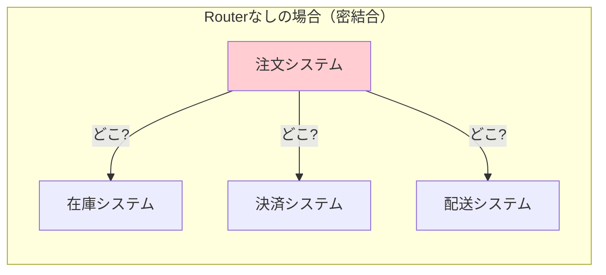
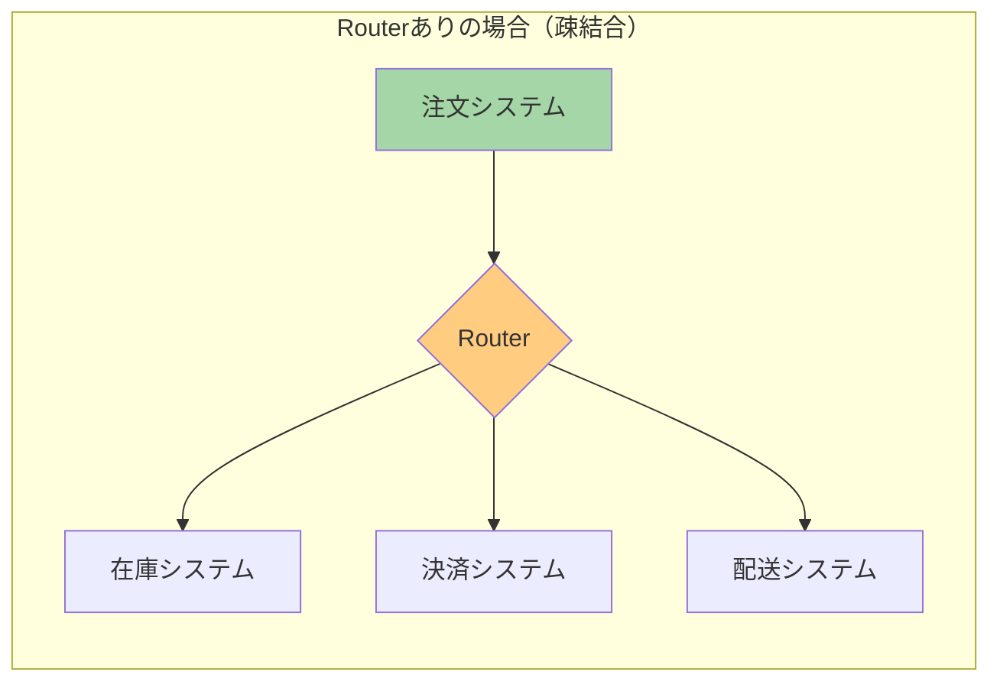
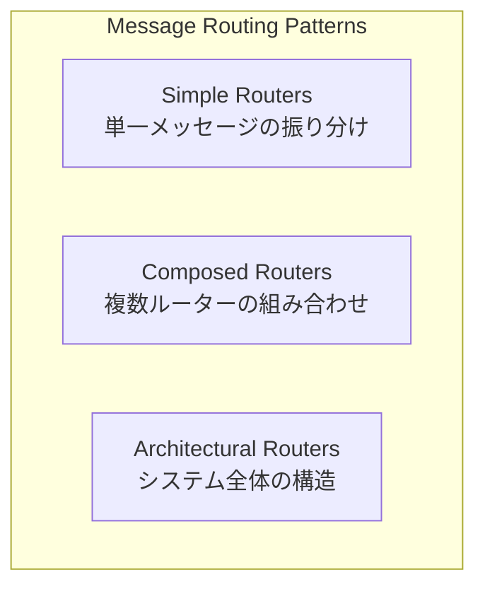

# Message Routing (メッセージルーティング)

## このドキュメントについて

このドキュメントは、Enterprise Integration Patterns（EIP）のMessage Routingパターンを初学者向けに解説したものです。メッセージングシステムを構築する際に「メッセージをどこに届けるか」を決める仕組みを学びます。

## Message Routingとは何か

### 身近な例で考える

Message Routingは「郵便局の仕分け係」のような役割を果たします。

郵便局では、届いた手紙の宛先を見て、「この手紙は東京行き」「この手紙は大阪行き」と適切な場所に振り分けます。手紙を書いた人（送信者）は、郵便局の内部でどのように仕分けられるかを知る必要はありません。ただポストに投函するだけで、郵便局が責任を持って届けてくれます。

ソフトウェアの世界でも同じことが起きます。あるシステムが別のシステムにメッセージを送りたいとき、**Message Router**が間に入って、メッセージを適切な宛先に届けてくれるのです。

### なぜMessage Routingが必要なのか

Message Routingがない場合、以下のような問題が発生します。

**問題1: 送信者が全ての受信者を知っている必要がある**

例えば、ECサイトで注文が入ったとき、在庫システム、決済システム、配送システムなど複数のシステムに情報を送る必要があります。Message Routingがなければ、注文システムはこれら全てのシステムの場所（アドレス）を知っていなければなりません。

**問題2: 新しいシステムを追加するたびに、送信者を変更する必要がある**

例えば、新しく「ポイント付与システム」を追加したいとき、注文システムのコードを修正して、ポイント付与システムへの送信処理を追加しなければなりません。

**問題3: ルーティングのルールがあちこちに散らばる**

「この種類の注文はこのシステムに送る」というルールが、複数のシステムに散らばってしまい、全体を把握するのが難しくなります。

### Message Routerを使うとどうなるか

Message Routerを使うと、送信者は「メッセージをRouterに渡す」だけで済みます。

Routerが「このメッセージはどのシステムに送るべきか」を判断してくれるので、注文システムは個々のシステムの存在を知らなくても良くなります。これを**疎結合**と呼びます。

## 3つのカテゴリー

Message Routingのパターンは、役割に応じて3つのカテゴリーに分類されます。

### 1. Simple Routers（シンプルルーター）

最も基本的なルーティングパターンです。1つのメッセージを受け取り、条件に基づいて振り分けたり、分割したり、集約したりします。これらは単独で使うこともできますし、組み合わせてより複雑な処理フローを構築することもできます。

**含まれるパターン：**

#### 振り分け系（1つのメッセージを1つの宛先に送る）

| パターン | 何をするか | 具体例 |
|---------|-----------|-------|
| [[programming/reactive_messaging_pattern/simple-routers/message_router\|Message Router]] | 条件に基づいてメッセージを1つの宛先に振り分ける、最も基本的なパターン。他のルーティングパターンの土台となる概念 | 注文の種類（通常/返品/法人）に応じて異なる処理システムに振り分ける |
| [[programming/reactive_messaging_pattern/simple-routers/content_based_router\|Content-Based Router]] | メッセージの中身（フィールドの値など）を見て宛先を決める。最も一般的に使われるルーター | 注文の商品カテゴリを見て、適切な倉庫システムに振り分ける |
| [[programming/reactive_messaging_pattern/simple-routers/message_filter\|Message Filter]] | 条件に合わないメッセージを破棄して、条件に合うメッセージだけを通過させる | テスト用メッセージを本番環境から除去する |
| [[programming/reactive_messaging_pattern/simple-routers/dynamic_router\|Dynamic Router]] | ルーティングルールを実行時に動的に変更できる。外部からルールを設定・更新可能 | A/Bテストで一部のトラフィックだけを新システムに流す |

#### 分散系（1つのメッセージを複数の宛先に送る）

| パターン | 何をするか | 具体例 |
|---------|-----------|-------|
| [[programming/reactive_messaging_pattern/simple-routers/recipient_list\|Recipient List]] | 1つのメッセージを複数の宛先にコピーして同時に送る。全ての宛先が同じメッセージを受け取る | 注文完了を在庫・配送・請求システムに同報する |
| [[programming/reactive_messaging_pattern/simple-routers/splitter\|Splitter]] | 1つの大きなメッセージを複数の小さなメッセージに分割する | 3つの商品を含む注文を、商品ごとの3つのメッセージに分割する |

#### 集約系（複数のメッセージを1つにまとめる）

| パターン | 何をするか | 具体例 |
|---------|-----------|-------|
| [[programming/reactive_messaging_pattern/simple-routers/aggregator\|Aggregator]] | バラバラのタイミングで届く関連するメッセージを収集して、1つのメッセージにまとめる | 複数の見積もり回答を1つの比較表にまとめる |
| [[programming/reactive_messaging_pattern/simple-routers/resequencer\|Resequencer]] | 順番がバラバラになって届いたメッセージを、正しい順番に並べ直す | ネットワーク遅延で順序が入れ替わったメッセージを復元する |

詳細は [[programming/reactive_messaging_pattern/simple-routers/index|Simple Routers]] を参照してください。

### 2. Composed Routers（複合ルーター）

Simple Routersを組み合わせて、より複雑な処理フローを実現するパターンです。実際のビジネスでは、単純なルーティングだけでは解決できない複雑な処理が必要になることが多く、そのような場面で活用されます。

**含まれるパターン：**

| パターン | 何をするか | 構成要素 | 具体例 |
|---------|-----------|---------|-------|
| [[programming/reactive_messaging_pattern/composed-routers/scatter_gather\|Scatter-Gather]] | 同じリクエストを複数のシステムに同時に送り、返ってきた回答を収集して1つにまとめる | Recipient List + Aggregator | 複数の航空会社に見積もりを依頼し、最安値を選ぶ |
| [[programming/reactive_messaging_pattern/composed-routers/composed_message_processor\|Composed Message Processor]] | メッセージを複数の部分に分割し、各部分を適切なシステムで処理してから、結果を再び1つに統合する | Splitter + Router + Aggregator | 複数商品の注文を商品ごとに在庫確認し、結果を統合する |
| [[programming/reactive_messaging_pattern/composed-routers/routing_slip\|Routing Slip]] | メッセージに「処理ステップのリスト」を添付し、各ステップで処理後に次のステップに自動転送する。分散制御で中央管理者がいない | メッセージ添付のルート情報 | 稟議書の回覧（課長→部長→役員） |
| [[programming/reactive_messaging_pattern/composed-routers/process_manager\|Process Manager]] | 中央にProcess Managerを配置して複雑なワークフロー全体を統括する。条件分岐やループ、並列処理が可能 | 中央コントローラー + 各ステップ | ローン審査プロセス（信用チェック→承認/差し戻し→契約） |

詳細は [[programming/reactive_messaging_pattern/composed-routers/index|Composed Routers]] を参照してください。

### 3. Architectural Routers（アーキテクチャルーター）

システム全体のメッセージングアーキテクチャを定義するパターンです。Simple RoutersやComposed Routersが「個々のメッセージをどう処理するか」を扱うのに対し、Architectural Routersは「システム全体をどのような構造で設計するか」という、より大きな視点での設計方針を示します。

**含まれるパターン：**

| パターン | 何をするか | 構造のイメージ | 主な用途 |
|---------|-----------|--------------|---------|
| [[programming/reactive_messaging_pattern/architectural-routers/pipes_and_filters\|Pipes and Filters]] | 処理を独立した小さなステップ（フィルター）に分けて、それらをパイプ（チャネル）で接続する。工場の組み立てラインのように、メッセージが各処理ステップを順番に通過していく | 線形のチェーン構造（A→B→C→D） | データ処理パイプライン、段階的なメッセージ処理、ETL処理 |
| [[programming/reactive_messaging_pattern/architectural-routers/message_broker\|Message Broker]] | 中央に「ブローカー」を置き、全てのメッセージがブローカーを経由して送受信される。郵便局の中央仕分けセンターのように、全ての通信を仲介する | ハブ・アンド・スポーク構造（各システムが中央に接続） | 異種システム間の統合、エンタープライズ統合、マイクロサービス間通信 |

**どちらを選ぶか：**
- **データを段階的に処理・変換したい** → Pipes and Filters
- **異なるシステム間でメッセージをやり取りしたい** → Message Broker
- 実際のシステムでは、両方を組み合わせることも多い（Message Brokerの内部でPipes and Filtersを使うなど）

詳細は [[programming/reactive_messaging_pattern/architectural-routers/index|Architectural Routers]] を参照してください。

## Message Routingのメリットとデメリット

### メリット

**送信者と受信者を分離できる**

送信者は受信者のことを知らなくて良いので、システム間の依存関係が減ります。新しいシステムを追加するときも、Routerの設定を変えるだけで済みます。

**ルーティングルールを一箇所で管理できる**

「どのメッセージをどこに送るか」というルールがRouterに集約されるので、変更や確認がしやすくなります。

**システムを拡張しやすくなる**

新しい受信者を追加したり、既存の受信者を入れ替えたりするのが簡単になります。

**メッセージの流れが見えやすくなる**

Routerを見れば、メッセージがどこに流れるか把握できます。

### デメリット

**Routerが止まると全体が止まる**

Routerが単一障害点（Single Point of Failure）になる可能性があります。Routerがダウンすると、メッセージが届かなくなります。

**Routerがボトルネックになる可能性がある**

全てのメッセージがRouterを通るので、メッセージ量が多いとRouterの処理が追いつかなくなることがあります。

**複雑になりすぎることがある**

単純な1対1の通信に対してRouterを導入すると、かえって複雑になってしまいます。

### 避けるべきパターン

**単純な通信にRouterを使いすぎない**

1つの送信者から1つの受信者にしか送らない場合は、Routerを使う必要はありません。

**全てを1つのRouterに任せない**

全てのメッセージを1つの巨大なRouterで処理しようとすると、ボトルネックになったり、ルールが複雑になりすぎたりします。

## 次に読むべき内容

Message Routingを学ぶには、以下の順序がおすすめです。

1. **[[programming/reactive_messaging_pattern/architectural-routers/pipes_and_filters|Pipes and Filters]]** - Message Routerが動作する基本的なアーキテクチャを理解する
2. **[[programming/reactive_messaging_pattern/simple-routers/index|Simple Routers]]** - 基本的なルーティングパターンを学ぶ
3. **[[programming/reactive_messaging_pattern/composed-routers/index|Composed Routers]]** - パターンの組み合わせ方を学ぶ

## 参考資料

- [Enterprise Integration Patterns - Message Routing](https://www.enterpriseintegrationpatterns.com/patterns/messaging/MessageRoutingIntro.html)
