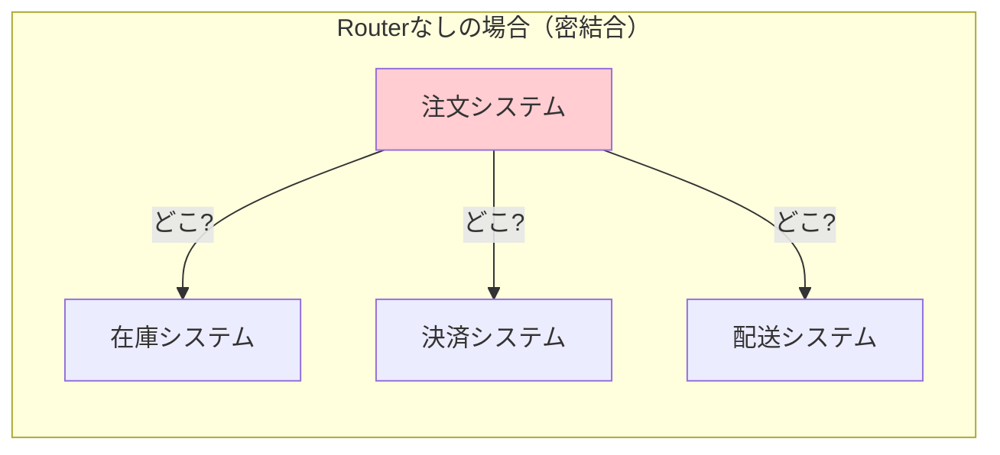
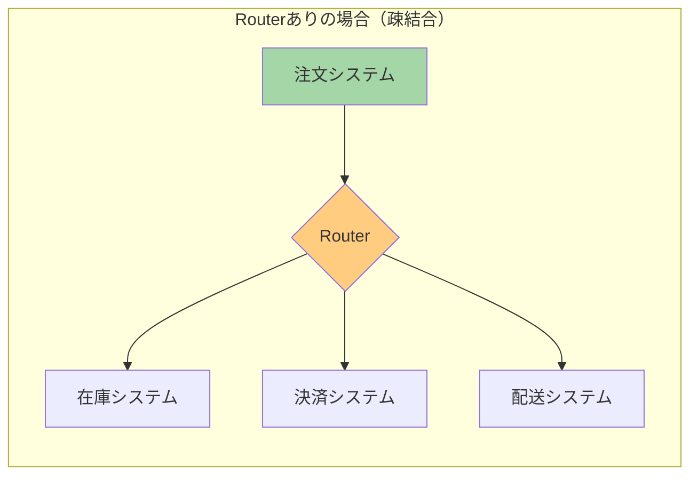
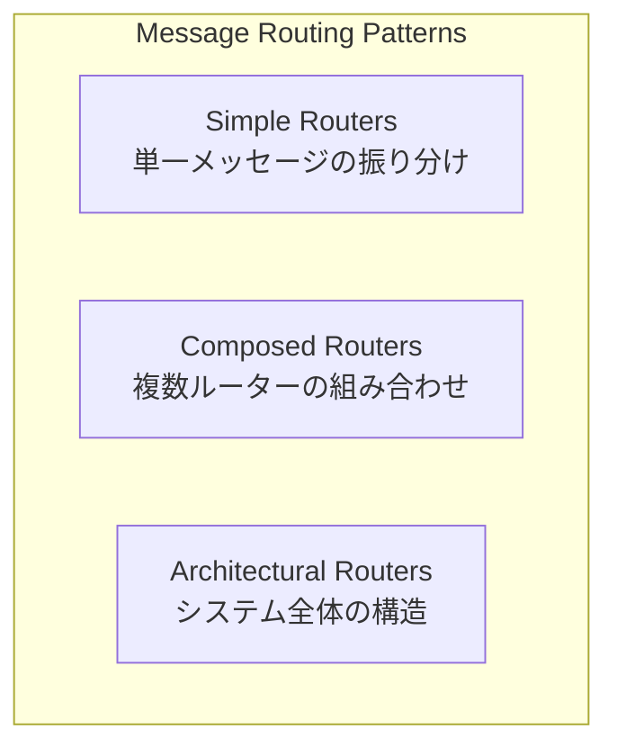

# Message Routing (メッセージルーティング)

## このドキュメントについて

このドキュメントは、Enterprise Integration Patterns（EIP）のMessage Routingパターンを初学者向けに解説したものです。メッセージングシステムを構築する際に「メッセージをどこに届けるか」を決める仕組みを学びます。

## Message Routingとは何か

### 身近な例で考える

Message Routingは「郵便局の仕分け係」のような役割を果たします。

郵便局では、届いた手紙の宛先を見て、「この手紙は東京行き」「この手紙は大阪行き」と適切な場所に振り分けます。手紙を書いた人（送信者）は、郵便局の内部でどのように仕分けられるかを知る必要はありません。ただポストに投函するだけで、郵便局が責任を持って届けてくれます。

ソフトウェアの世界でも同じことが起きます。あるシステムが別のシステムにメッセージを送りたいとき、**Message Router**が間に入って、メッセージを適切な宛先に届けてくれるのです。

### なぜMessage Routingが必要なのか

Message Routingがない場合、以下のような問題が発生します。

**問題1: 送信者が全ての受信者を知っている必要がある**

例えば、ECサイトで注文が入ったとき、在庫システム、決済システム、配送システムなど複数のシステムに情報を送る必要があります。Message Routingがなければ、注文システムはこれら全てのシステムの場所（アドレス）を知っていなければなりません。

**問題2: 新しいシステムを追加するたびに、送信者を変更する必要がある**

例えば、新しく「ポイント付与システム」を追加したいとき、注文システムのコードを修正して、ポイント付与システムへの送信処理を追加しなければなりません。

**問題3: ルーティングのルールがあちこちに散らばる**

「この種類の注文はこのシステムに送る」というルールが、複数のシステムに散らばってしまい、全体を把握するのが難しくなります。

### Message Routerを使うとどうなるか

Message Routerを使うと、送信者は「メッセージをRouterに渡す」だけで済みます。

Routerが「このメッセージはどのシステムに送るべきか」を判断してくれるので、注文システムは個々のシステムの存在を知らなくても良くなります。これを**疎結合**と呼びます。

## 3つのカテゴリー

Message Routingのパターンは、役割に応じて3つのカテゴリーに分類されます。

### 1. Simple Routers（シンプルルーター）

最も基本的なルーティングパターンです。1つのメッセージを受け取り、条件に基づいて振り分けたり、分割したり、集約したりします。

**含まれるパターン：**

| パターン | 何をするか |
|---------|-----------|
| [[programming/reactive_messaging_pattern/simple-routers/message_router\|Message Router]] | 条件に基づいてメッセージを1つの宛先に振り分ける（基本概念） |
| [[programming/reactive_messaging_pattern/simple-routers/content_based_router\|Content-Based Router]] | メッセージの中身を見て、宛先を決める |
| [[programming/reactive_messaging_pattern/simple-routers/message_filter\|Message Filter]] | 条件に合わないメッセージを捨てる |
| [[programming/reactive_messaging_pattern/simple-routers/dynamic_router\|Dynamic Router]] | ルーティングルールを後から変更できる |
| [[programming/reactive_messaging_pattern/simple-routers/recipient_list\|Recipient List]] | 1つのメッセージを複数の宛先にコピーして送る |
| [[programming/reactive_messaging_pattern/simple-routers/splitter\|Splitter]] | 1つのメッセージを複数のメッセージに分割する |
| [[programming/reactive_messaging_pattern/simple-routers/aggregator\|Aggregator]] | 複数のメッセージを1つにまとめる |
| [[programming/reactive_messaging_pattern/simple-routers/resequencer\|Resequencer]] | バラバラに届いたメッセージを正しい順番に並べ直す |

詳細は [[programming/reactive_messaging_pattern/simple-routers/index|Simple Routers]] を参照してください。

### 2. Composed Routers（複合ルーター）

Simple Routersを組み合わせて、より複雑な処理フローを実現するパターンです。

**含まれるパターン：**

| パターン | 何をするか |
|---------|-----------|
| [[programming/reactive_messaging_pattern/composed-routers/scatter_gather\|Scatter-Gather]] | 複数のシステムに問い合わせて、回答を集める（例：複数業者への見積依頼） |
| [[programming/reactive_messaging_pattern/composed-routers/composed_message_processor\|Composed Message Processor]] | メッセージを分割→各部分を処理→結果を統合 |
| [[programming/reactive_messaging_pattern/composed-routers/routing_slip\|Routing Slip]] | メッセージに「処理ステップのリスト」を添付して、順番に処理させる |
| [[programming/reactive_messaging_pattern/composed-routers/process_manager\|Process Manager]] | 複雑なワークフローを中央で管理する |

詳細は [[programming/reactive_messaging_pattern/composed-routers/index|Composed Routers]] を参照してください。

### 3. Architectural Routers（アーキテクチャルーター）

システム全体の設計に関わるパターンです。

**含まれるパターン：**

| パターン | 何をするか |
|---------|-----------|
| [[programming/reactive_messaging_pattern/architectural-routers/pipes_and_filters\|Pipes and Filters]] | 処理をパイプ（チャネル）とフィルター（処理ステップ）に分けて、柔軟に組み合わせる |
| [[programming/reactive_messaging_pattern/architectural-routers/message_broker\|Message Broker]] | 中央にブローカーを置いて、全てのメッセージを仲介する |

詳細は [[programming/reactive_messaging_pattern/architectural-routers/index|Architectural Routers]] を参照してください。

## Message Routingのメリットとデメリット

### メリット

**送信者と受信者を分離できる**

送信者は受信者のことを知らなくて良いので、システム間の依存関係が減ります。新しいシステムを追加するときも、Routerの設定を変えるだけで済みます。

**ルーティングルールを一箇所で管理できる**

「どのメッセージをどこに送るか」というルールがRouterに集約されるので、変更や確認がしやすくなります。

**システムを拡張しやすくなる**

新しい受信者を追加したり、既存の受信者を入れ替えたりするのが簡単になります。

**メッセージの流れが見えやすくなる**

Routerを見れば、メッセージがどこに流れるか把握できます。

### デメリット

**Routerが止まると全体が止まる**

Routerが単一障害点（Single Point of Failure）になる可能性があります。Routerがダウンすると、メッセージが届かなくなります。

**Routerがボトルネックになる可能性がある**

全てのメッセージがRouterを通るので、メッセージ量が多いとRouterの処理が追いつかなくなることがあります。

**複雑になりすぎることがある**

単純な1対1の通信に対してRouterを導入すると、かえって複雑になってしまいます。

### 避けるべきパターン

**単純な通信にRouterを使いすぎない**

1つの送信者から1つの受信者にしか送らない場合は、Routerを使う必要はありません。

**全てを1つのRouterに任せない**

全てのメッセージを1つの巨大なRouterで処理しようとすると、ボトルネックになったり、ルールが複雑になりすぎたりします。

## 次に読むべき内容

Message Routingを学ぶには、以下の順序がおすすめです。

1. **[[programming/reactive_messaging_pattern/architectural-routers/pipes_and_filters|Pipes and Filters]]** - Message Routerが動作する基本的なアーキテクチャを理解する
2. **[[programming/reactive_messaging_pattern/simple-routers/index|Simple Routers]]** - 基本的なルーティングパターンを学ぶ
3. **[[programming/reactive_messaging_pattern/composed-routers/index|Composed Routers]]** - パターンの組み合わせ方を学ぶ

## 参考資料

- [Enterprise Integration Patterns - Message Routing](https://www.enterpriseintegrationpatterns.com/patterns/messaging/MessageRoutingIntro.html)
