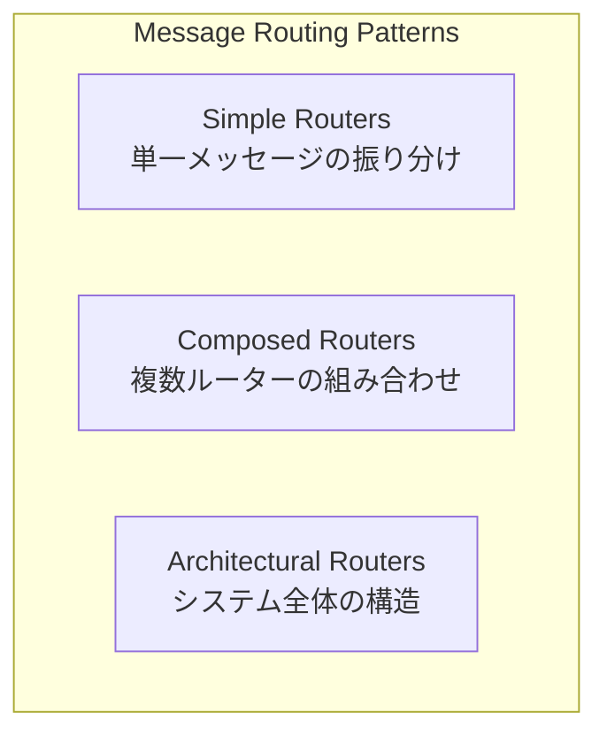

# Message Routing (メッセージルーティング)

## 1. 3行要約 (Feynman Technique)
> **目的:** 専門用語を避け、直感的なメタファーを用いて「何をするものか」を定義する。
- メッセージルーティングは「郵便局の仕分け係」のような役割。届いた手紙の宛先や内容を見て、適切な配達先に振り分ける
- 送信者は最終的な届け先を知らなくても良い。ルーターが責任を持って正しい場所に届ける
- 核心的価値：**送信者と受信者の疎結合化**と**メッセージフローの一元管理**

## 2. 解決する課題 (Context & Problem)
> **目的:** 「なぜこれが必要なのか？」という文脈（Pain Point）を明確にする。

- **Before:**
  - 送信者が全ての受信者を知っている必要がある（密結合）
  - 新しい受信者の追加時に送信者の変更が必要
  - ルーティングロジックが各所に散在し、変更・保守が困難

- **Trigger:**
  - 複数のシステム間でメッセージを振り分ける必要がある
  - メッセージの内容や条件に応じて動的に宛先を決定したい
  - 送信者と受信者を疎結合に保ちたい

## 3. ソリューションと構造 (Structure & Visual)
> **目的:** Dual Coding（文字と図）により記憶定着を図る。

### ルーターの3つのカテゴリー

| カテゴリ | パターン数 | 概要 |
|---------|-----------|------|
| [[simple-routers/index\|Simple Routers]] | 8 | 単一メッセージの振り分け・分割・集約 |
| [[composed-routers/index\|Composed Routers]] | 4 | 複数ルーターを組み合わせた複合フロー |
| [[architectural-routers/index\|Architectural Routers]] | 2 | システム全体のアーキテクチャスタイル |

## 4. トレードオフと制約 (Critical Thinking)

### Pros (利点):
- 送信者と受信者の疎結合化
- ルーティングロジックの一元管理
- システムの拡張性向上
- メッセージフローの可視化

### Cons (欠点・副作用):
- ルーターがボトルネックになる可能性
- ステートフルなルーター（Aggregator, Resequencer）は複雑性とメモリ使用量が増加
- メッセージの順序保証が難しくなる場合がある
- デバッグ・トレースが困難になる可能性

### Anti-Pattern:
- 単純な1対1通信にルーターを導入（過剰設計）
- 全てのメッセージを単一ルーター経由にする（ボトルネック化）

## 5. カテゴリ別ガイド

各カテゴリの詳細な比較表とパターン選択ガイドは以下を参照：

- [[simple-routers/index|Simple Routers]] - 基本的なルーティングパターンの比較と選択
- [[composed-routers/index|Composed Routers]] - 複合パターンの比較と選択
- [[architectural-routers/index|Architectural Routers]] - アーキテクチャスタイルの比較

## 6. リンクと関係性 (Network Knowledge)

### カテゴリ:
- [[simple-routers/index|Simple Routers]] - 単一メッセージの振り分け
- [[composed-routers/index|Composed Routers]] - 複合フロー
- [[architectural-routers/index|Architectural Routers]] - アーキテクチャスタイル

### 関連概念:
- [[message_channel|Message Channel]] - ルーターを接続するパイプ
- [[message|Message]] - ルーティング対象のデータ
- [[message_endpoint|Message Endpoint]] - メッセージの送受信点

### 次のステップ:
- [[simple-routers/index|Simple Routers]] - 基本パターンから学ぶ
- [[architectural-routers/pipes_and_filters|Pipes and Filters]] - 全体アーキテクチャの理解
