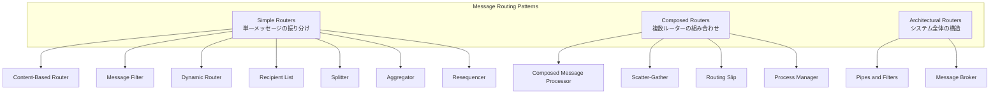
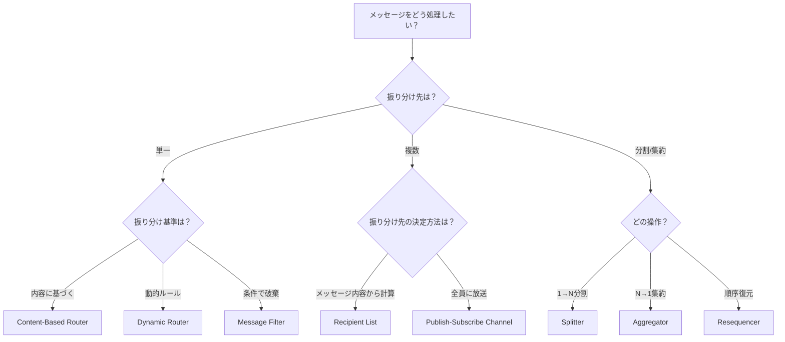

# Message Routing (メッセージルーティング)

## 1. 3行要約 (Feynman Technique)
> **目的:** 専門用語を避け、直感的なメタファーを用いて「何をするものか」を定義する。
- メッセージルーティングは「郵便局の仕分け係」のような役割。届いた手紙の宛先や内容を見て、適切な配達先に振り分ける
- 送信者は最終的な届け先を知らなくても良い。ルーターが責任を持って正しい場所に届ける
- 核心的価値：**送信者と受信者の疎結合化**と**メッセージフローの一元管理**

## 2. 解決する課題 (Context & Problem)
> **目的:** 「なぜこれが必要なのか？」という文脈（Pain Point）を明確にする。

- **Before:**
  - 送信者が全ての受信者を知っている必要がある（密結合）
  - 新しい受信者の追加時に送信者の変更が必要
  - ルーティングロジックが各所に散在し、変更・保守が困難

- **Trigger:**
  - 複数のシステム間でメッセージを振り分ける必要がある
  - メッセージの内容や条件に応じて動的に宛先を決定したい
  - 送信者と受信者を疎結合に保ちたい

## 3. ソリューションと構造 (Structure & Visual)
> **目的:** Dual Coding（文字と図）により記憶定着を図る。

### ルーターの3つのカテゴリー

### Simple Routers 比較表

| パターン | 消費 | 発行 | ステートフル | 特徴 |
|---------|------|------|------------|------|
| [[content_based_router\|Content-Based Router]] | 1 | 1 | No | 内容に基づき単一宛先へ |
| [[message_filter\|Message Filter]] | 1 | 0-1 | No | 条件に合わないものを破棄 |
| [[dynamic_router\|Dynamic Router]] | 1 | 1 | No | 制御メッセージでルール更新 |
| [[recipient_list\|Recipient List]] | 1 | N | No | 複数宛先へコピー送信 |
| [[splitter\|Splitter]] | 1 | N | No | メッセージを分割 |
| [[aggregator\|Aggregator]] | N | 1 | **Yes** | 関連メッセージを集約 |
| [[resequencer\|Resequencer]] | N | N | **Yes** | 順序を復元 |

## 4. トレードオフと制約 (Critical Thinking)

### Pros (利点):
- 送信者と受信者の疎結合化
- ルーティングロジックの一元管理
- システムの拡張性向上
- メッセージフローの可視化

### Cons (欠点・副作用):
- ルーターがボトルネックになる可能性
- ステートフルなルーター（Aggregator, Resequencer）は複雑性とメモリ使用量が増加
- メッセージの順序保証が難しくなる場合がある
- デバッグ・トレースが困難になる可能性

### Anti-Pattern:
- 単純な1対1通信にルーターを導入（過剰設計）
- 全てのメッセージを単一ルーター経由にする（ボトルネック化）

## 5. パターン選択ガイド

### 複合パターンの組み合わせ

| 組み合わせ | 名称 | 用途 |
|-----------|------|------|
| Recipient List + Aggregator | Scatter-Gather | 複数に問い合わせ→結果集約 |
| Splitter + Router + Aggregator | Composed Message Processor | 複合メッセージの並列処理 |
| 固定ステップの連鎖 | Routing Slip | 線形ワークフロー |
| 動的ステップの制御 | Process Manager | 複雑なビジネスプロセス |

## 6. リンクと関係性 (Network Knowledge)

### 関連パターン:
- [[pipes_and_filters|Pipes and Filters]] - ルーターを接続するアーキテクチャスタイル
- [[message_channel|Message Channel]] - ルーターを接続するパイプ
- [[message_broker|Message Broker]] - ルーターを統合するハブ

### 構成要素:
- [[message|Message]] - ルーティング対象のデータ
- [[message_endpoint|Message Endpoint]] - メッセージの送受信点

### 次のステップ:
- [[content_based_router|Content-Based Router]] - 最も基本的なルーティングパターン
- [[pipes_and_filters|Pipes and Filters]] - 全体アーキテクチャの理解
