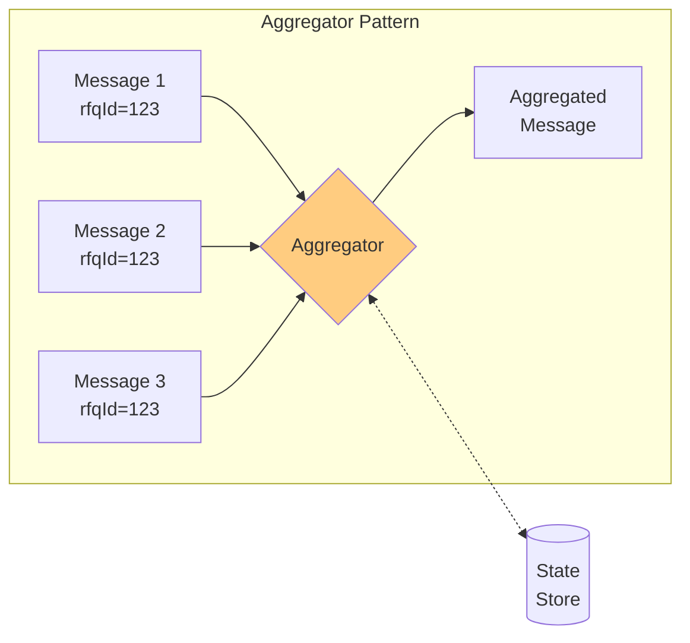
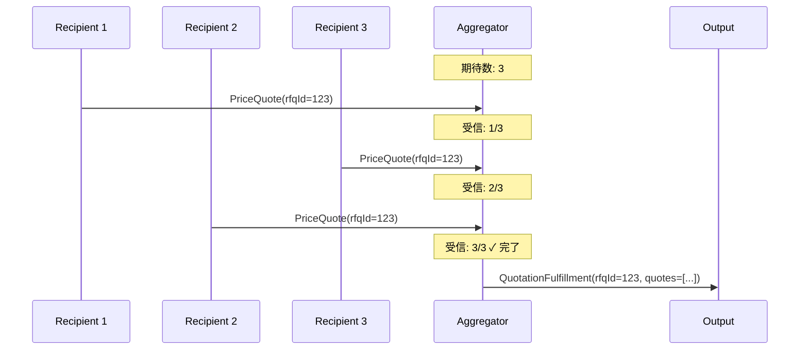

# Aggregator

## 1. 3行要約 (Feynman Technique)
> **目的:** 専門用語を避け、直感的なメタファーを用いて「何をするものか」を定義する。
- 「パズルを組み立てる人」のような役割。バラバラに届くピースを集めて、1つの完成した絵にする
- 関連する複数のメッセージを収集し、完全なセットが揃ったら1つの統合メッセージを発行
- 核心的価値：**分散した結果の統合と完了判定**

## 2. 解決する課題 (Context & Problem)
> **目的:** 「なぜこれが必要なのか？」という文脈（Pain Point）を明確にする。

- **Before:**
  - 複数の見積エンジンに価格見積を依頼したが、応答がバラバラに届く
  - 各応答をどの依頼に紐づけるか、全ての応答が揃ったかの判定が必要
  - 例：最良価格を選択するには、全ての見積を比較する必要がある

- **Trigger:**
  - 個別だが関連する複数のメッセージの結果を1つに結合したい
  - 全ての関連メッセージが揃ったことを検知したい
  - Splitter/Recipient Listで分散した処理の結果を統合したい

## 3. ソリューションと構造 (Structure & Visual)
> **目的:** Dual Coding（文字と図）により記憶定着を図る。

### 仕組み
ステートフルなフィルターであるAggregatorを使用して、関連する個別メッセージを収集・保存し、完全なセットが揃ったら単一の集約メッセージを発行する。

### 設計の3要素

| 要素 | 説明 |
|-----|------|
| **相関性 (Correlation)** | どのメッセージが関連しているか（Correlation Identifier） |
| **完全性条件 (Completeness)** | いつ結果を発行するか（終了条件） |
| **集約アルゴリズム** | メッセージをどう結合するか |

### 構造図



### 処理フロー



## 4. トレードオフと制約 (Critical Thinking)

### Pros (利点):
- **結果統合**: 分散処理の結果を1つにまとめる
- **完了検知**: 全ての応答が揃ったことを検知
- **柔軟な終了条件**: 様々な完了条件に対応可能
- **状態管理**: 未完了の集約を追跡

### Cons (欠点・副作用):
- **ステートフル**: 状態を保持するためメモリ使用量が増加
- **タイムアウト管理**: 応答が来ない場合の処理が必要
- **スケーラビリティ**: 状態の分散管理が複雑
- **障害復旧**: 状態の永続化・復旧が必要

### 完全性条件（Termination Criteria）

| 条件 | 説明 |
|-----|------|
| **Wait for All** | 期待する全ての応答を待つ |
| **Timeout** | 指定時間経過後に終了 |
| **First Best** | 最初の最適な応答で終了 |
| **Timeout with Override** | タイムアウトだが、より良い応答があれば上書き |
| **External Event** | 外部イベントにより終了 |

### Anti-Pattern:
- タイムアウトを設定しない（永久に待機する可能性）
- 状態の永続化を考慮しない（障害時にデータ損失）
- Correlation IDを使用しない（メッセージの関連付けができない）

## 5. 実装イメージ (Implementation)

### Akka Typed Actor (Scala)

```scala
import akka.actor.typed.{ActorRef, Behavior}
import akka.actor.typed.scaladsl.{Behaviors, TimerScheduler}
import scala.concurrent.duration._

// ドメインモデル
case class PriceQuote(
  quoterId: String,
  rfqId: String,
  itemId: String,
  retailPrice: Double,
  discountPrice: Double
)

case class QuotationFulfillment(
  rfqId: String,
  priceQuotes: Seq[PriceQuote]
)

// Aggregator
object PriceQuoteAggregator {
  sealed trait Command
  case class AddQuote(quote: PriceQuote) extends Command
  case class ExpectQuotes(rfqId: String, expectedCount: Int, replyTo: ActorRef[QuotationFulfillment]) extends Command
  private case class Timeout(rfqId: String) extends Command

  case class AggregationState(
    expectedCount: Int,
    quotes: Vector[PriceQuote],
    replyTo: ActorRef[QuotationFulfillment]
  )

  def apply(): Behavior[Command] =
    Behaviors.withTimers { timers =>
      aggregator(Map.empty, timers)
    }

  private def aggregator(
    aggregations: Map[String, AggregationState],
    timers: TimerScheduler[Command]
  ): Behavior[Command] =
    Behaviors.receive { (context, command) =>
      command match {
        // 新しい集約を開始
        case ExpectQuotes(rfqId, expectedCount, replyTo) =>
          context.log.info(s"Expecting $expectedCount quotes for $rfqId")

          // タイムアウトを設定
          timers.startSingleTimer(rfqId, Timeout(rfqId), 5.seconds)

          val state = AggregationState(expectedCount, Vector.empty, replyTo)
          aggregator(aggregations + (rfqId -> state), timers)

        // 見積を追加
        case AddQuote(quote) =>
          aggregations.get(quote.rfqId) match {
            case Some(state) =>
              val newQuotes = state.quotes :+ quote
              context.log.info(
                s"Added quote for ${quote.rfqId}: ${newQuotes.size}/${state.expectedCount}"
              )

              // 全て揃ったら発行
              if (newQuotes.size >= state.expectedCount) {
                timers.cancel(quote.rfqId)
                val fulfillment = QuotationFulfillment(quote.rfqId, newQuotes)
                state.replyTo ! fulfillment
                context.log.info(s"Aggregation complete for ${quote.rfqId}")
                aggregator(aggregations - quote.rfqId, timers)
              } else {
                val newState = state.copy(quotes = newQuotes)
                aggregator(aggregations + (quote.rfqId -> newState), timers)
              }

            case None =>
              context.log.warn(s"No aggregation found for ${quote.rfqId}")
              Behaviors.same
          }

        // タイムアウト処理
        case Timeout(rfqId) =>
          aggregations.get(rfqId) match {
            case Some(state) =>
              context.log.warn(
                s"Timeout for $rfqId with ${state.quotes.size}/${state.expectedCount} quotes"
              )
              // 受信済みの見積で発行
              val fulfillment = QuotationFulfillment(rfqId, state.quotes)
              state.replyTo ! fulfillment
              aggregator(aggregations - rfqId, timers)

            case None =>
              Behaviors.same
          }
      }
    }
}

// 最良価格を選択する拡張版Aggregator
object BestPriceAggregator {
  case class BestPriceQuotation(
    rfqId: String,
    bestQuotes: Map[String, PriceQuote]  // itemId -> 最安値
  )

  def selectBestPrices(quotes: Seq[PriceQuote]): Map[String, PriceQuote] = {
    quotes.groupBy(_.itemId).map { case (itemId, itemQuotes) =>
      itemId -> itemQuotes.minBy(_.discountPrice)
    }
  }
}

// 使用例
object AggregatorExample {
  def apply(): Behavior[Nothing] =
    Behaviors.setup[Nothing] { context =>
      val resultCollector = context.spawn(
        Behaviors.receiveMessage[QuotationFulfillment] { fulfillment =>
          println(s"Received ${fulfillment.priceQuotes.size} quotes for ${fulfillment.rfqId}")
          Behaviors.same
        },
        "resultCollector"
      )

      val aggregator = context.spawn(PriceQuoteAggregator(), "aggregator")

      // 3つの見積を期待
      aggregator ! PriceQuoteAggregator.ExpectQuotes("RFQ-001", 3, resultCollector)

      // 見積を追加
      aggregator ! PriceQuoteAggregator.AddQuote(
        PriceQuote("SupplierA", "RFQ-001", "item1", 100.0, 90.0)
      )
      aggregator ! PriceQuoteAggregator.AddQuote(
        PriceQuote("SupplierB", "RFQ-001", "item1", 100.0, 85.0)
      )
      aggregator ! PriceQuoteAggregator.AddQuote(
        PriceQuote("SupplierC", "RFQ-001", "item1", 100.0, 88.0)
      )

      Behaviors.empty
    }
}
```

## 6. リンクと関係性 (Network Knowledge)

### 関連パターン:
- [[splitter|Splitter]] (補完: 分割されたメッセージを集約)
- [[recipient_list|Recipient List]] (補完: 複数宛先への応答を集約)
- [[scatter_gather|Scatter-Gather]] (組み合わせ: Recipient List/Pub-Sub + Aggregator)
- [[composed_message_processor|Composed Message Processor]] (組み合わせ: Splitter + Router + Aggregator)
- [[correlation_identifier|Correlation Identifier]] - メッセージの関連付け

### 構成要素:
- [[message_channel|Message Channel]] - 入出力チャネル
- [[message_store|Message Store]] - 状態の永続化

### 次のステップ:
- [[scatter_gather|Scatter-Gather]] - 問い合わせ→応答集約の完全なパターン
- [[resequencer|Resequencer]] - 順序復元が必要な場合
