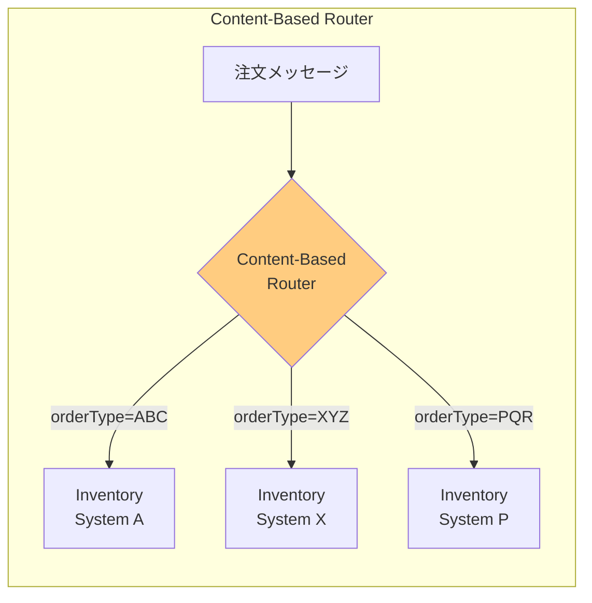
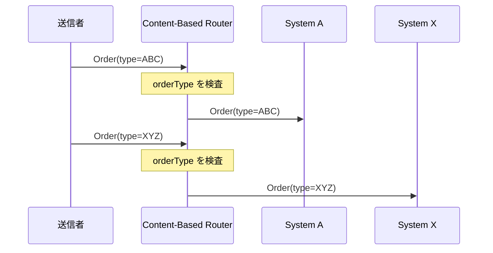

# Content-Based Router

## 1. 3行要約 (Feynman Technique)
> **目的:** 専門用語を避け、直感的なメタファーを用いて「何をするものか」を定義する。
- 「空港の手荷物仕分けシステム」のような役割。荷物のタグ（メッセージ内容）を読み取り、正しいターンテーブルに振り分ける
- メッセージの内容（フィールドの値、存在有無など）を検査し、適切な宛先を決定
- 核心的価値：**メッセージ内容に基づく動的な振り分け**

## 2. 解決する課題 (Context & Problem)
> **目的:** 「なぜこれが必要なのか？」という文脈（Pain Point）を明確にする。

- **Before:**
  - 注文処理システムで、複数の在庫システムが存在し各システムは特定の商品のみ処理可能
  - 単一の論理的機能の実装が複数の物理システムに分散している
  - 送信者が全ての在庫システムを知り、適切に振り分ける必要がある

- **Trigger:**
  - メッセージの内容に基づいて受信者を決定したい
  - 振り分けロジックを送信者から分離したい
  - 新しい受信者の追加時に送信者を変更したくない

## 3. ソリューションと構造 (Structure & Visual)
> **目的:** Dual Coding（文字と図）により記憶定着を図る。

### 仕組み
Content-Based Routerがメッセージの内容を検査し、フィールドの存在や特定の値など複数の基準に基づいて適切な受信者にルーティングする。

- ルーターはメッセージのコンテンツを読み取る
- 設定されたルール（条件）に基づいて宛先を決定
- 複雑なシナリオではルールエンジンの採用を検討

### 構造図



### 処理フロー



## 4. トレードオフと制約 (Critical Thinking)

### Pros (利点):
- **疎結合**: 送信者は受信者を知らなくて良い
- **柔軟性**: ルーティングルールを中央で管理・変更可能
- **拡張性**: 新しい受信者の追加が容易
- **透明性**: メッセージ内容に基づく明確なルーティング

### Cons (欠点・副作用):
- **メッセージ依存**: ルーターがメッセージ構造を知っている必要がある
- **ルール複雑化**: 条件が増えるとルーターが複雑化
- **パフォーマンス**: 複雑な条件評価のオーバーヘッド
- **結合度**: メッセージフォーマット変更時にルーターの修正が必要

### Anti-Pattern:
- ルーターにビジネスロジックを埋め込む
- 全てのメッセージ属性を検査する（必要最小限に）
- 過度に複雑な条件分岐（ルールエンジン導入を検討）

## 5. 実装イメージ (Implementation)

### Akka Typed Actor (Scala)

```scala
import akka.actor.typed.{ActorRef, Behavior}
import akka.actor.typed.scaladsl.Behaviors

// ドメインモデル
case class Order(id: String, orderType: String, items: List[String])

// メッセージ定義
sealed trait InventoryCommand
case class ProcessOrder(order: Order) extends InventoryCommand
case class OrderProcessed(orderId: String) extends InventoryCommand

// 在庫システムA（TypeABC用）
object InventorySystemA {
  def apply(): Behavior[InventoryCommand] =
    Behaviors.receive { (context, message) =>
      message match {
        case ProcessOrder(order) =>
          context.log.info(s"InventorySystemA processing: ${order.id}")
          // 在庫処理ロジック
          Behaviors.same
        case _ => Behaviors.same
      }
    }
}

// 在庫システムX（TypeXYZ用）
object InventorySystemX {
  def apply(): Behavior[InventoryCommand] =
    Behaviors.receive { (context, message) =>
      message match {
        case ProcessOrder(order) =>
          context.log.info(s"InventorySystemX processing: ${order.id}")
          // 在庫処理ロジック
          Behaviors.same
        case _ => Behaviors.same
      }
    }
}

// Content-Based Router
object OrderRouter {
  sealed trait Command
  case class RouteOrder(order: Order) extends Command

  def apply(
    inventoryA: ActorRef[InventoryCommand],
    inventoryX: ActorRef[InventoryCommand],
    invalidChannel: ActorRef[InventoryCommand]
  ): Behavior[Command] =
    Behaviors.receive { (context, command) =>
      command match {
        case RouteOrder(order) =>
          // メッセージ内容（orderType）に基づいてルーティング
          order.orderType match {
            case "TypeABC" =>
              context.log.info(s"Routing ${order.id} to InventorySystemA")
              inventoryA ! ProcessOrder(order)

            case "TypeXYZ" =>
              context.log.info(s"Routing ${order.id} to InventorySystemX")
              inventoryX ! ProcessOrder(order)

            case _ =>
              context.log.warn(s"Invalid order type: ${order.orderType}")
              invalidChannel ! ProcessOrder(order)
          }
          Behaviors.same
      }
    }
}

// パターンマッチを使った柔軟なルーティング
object FlexibleOrderRouter {
  def apply(
    routes: PartialFunction[String, ActorRef[InventoryCommand]],
    defaultRoute: ActorRef[InventoryCommand]
  ): Behavior[OrderRouter.Command] =
    Behaviors.receive { (context, command) =>
      command match {
        case OrderRouter.RouteOrder(order) =>
          val destination = routes.applyOrElse(
            order.orderType,
            (_: String) => defaultRoute
          )
          destination ! ProcessOrder(order)
          Behaviors.same
      }
    }
}
```

## 6. リンクと関係性 (Network Knowledge)

### 関連パターン:
- [[message_router|Message Router]] (汎化: Content-Based Routerの親パターン)
- [[message_filter|Message Filter]] (比較: 条件に合わないものを破棄する点が異なる)
- [[dynamic_router|Dynamic Router]] (比較: ルールを実行時に変更可能)
- [[splitter|Splitter]] (比較: メッセージを分割する点が異なる)
- [[recipient_list|Recipient List]] (比較: 複数宛先に同時送信する点が異なる)

### 構成要素:
- [[message_channel|Message Channel]] - 入出力チャネル
- [[invalid_message_channel|Invalid Message Channel]] - 条件に一致しないメッセージ用

### 次のステップ:
- [[message_filter|Message Filter]] - 不要メッセージの除去
- [[dynamic_router|Dynamic Router]] - 動的ルール変更が必要な場合
