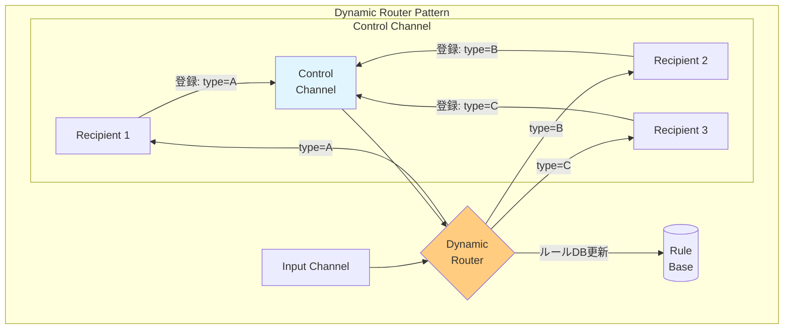
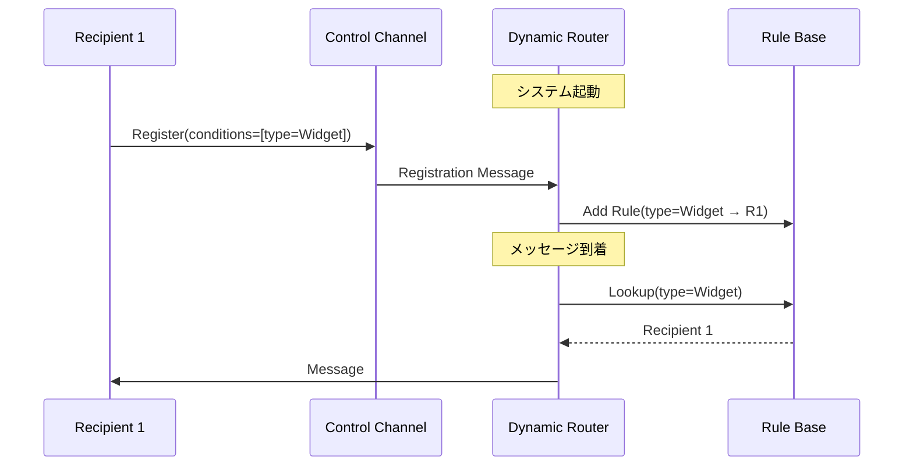

# Dynamic Router

## 1. 3行要約 (Feynman Technique)
> **目的:** 専門用語を避け、直感的なメタファーを用いて「何をするものか」を定義する。
- 「学習するカーナビ」のような役割。受信者からのフィードバックを受けて、ルーティングルールを動的に更新する
- 制御チャネル経由で受信者が自身の処理条件を登録し、ルーターがそれに基づいてルーティング
- 核心的価値：**ルーターが全受信者に依存せずに済む自己構成機能**

## 2. 解決する課題 (Context & Problem)
> **目的:** 「なぜこれが必要なのか？」という文脈（Pain Point）を明確にする。

- **Before:**
  - ルーターが全ての潜在的な宛先をハードコードで知っている必要がある
  - 新しい受信者を追加するたびにルーターの再設定・再デプロイが必要
  - ルーターと受信者が密結合になり、保守負担が増大

- **Trigger:**
  - ルーターが全ての潜在的な宛先に依存することを避けたい
  - 受信者の追加・削除を動的に行いたい
  - 効率的で予測可能なルーティングを維持しながら柔軟性を確保したい

## 3. ソリューションと構造 (Structure & Visual)
> **目的:** Dual Coding（文字と図）により記憶定着を図る。

### 仕組み
ルーターが特別な設定メッセージに基づいて自己構成できる Dynamic Router を使用する。

- 追加の制御チャネルを利用
- 起動時に各受信者が制御チャネル経由で自身の存在と処理条件を通知
- ルーターがこれらの「優先設定（preferences）」をルールベースに保存
- メッセージ到着時にすべてのルールを評価して最適な受信者にルーティング

### 構造図



### 登録フロー



## 4. トレードオフと制約 (Critical Thinking)

### Pros (利点):
- **疎結合**: ルーターが受信者をハードコードで知らなくて良い
- **動的構成**: 受信者の追加・削除にルーターの再デプロイ不要
- **自己登録**: 受信者が自身の処理条件を宣言
- **保守性向上**: ルーターの変更頻度が減少

### Cons (欠点・副作用):
- **複雑性増加**: 制御チャネルとルールベースの管理が必要
- **一貫性リスク**: 登録メッセージの損失でルーティング不整合が発生
- **起動順序依存**: 受信者がルーターより先に起動する必要がある場合がある
- **状態管理**: ルールベースの永続化・復旧の考慮が必要

### Anti-Pattern:
- 制御チャネルの信頼性を考慮しない
- ルールベースのバックアップ・復旧を考慮しない
- 受信者のヘルスチェックなしで古いルールを保持し続ける

## 5. 実装イメージ (Implementation)

### Akka Typed Actor (Scala)

```scala
import akka.actor.typed.{ActorRef, Behavior}
import akka.actor.typed.scaladsl.Behaviors

// メッセージ定義
sealed trait Message
case class OrderMessage(id: String, orderType: String, content: String) extends Message

// 制御チャネル用メッセージ
sealed trait ControlMessage
case class Register(
  recipientId: String,
  condition: Message => Boolean,
  destination: ActorRef[Message]
) extends ControlMessage
case class Unregister(recipientId: String) extends ControlMessage

// Dynamic Router
object DynamicRouter {
  sealed trait Command
  case class Route(message: Message) extends Command
  case class Control(controlMessage: ControlMessage) extends Command

  case class RoutingRule(
    recipientId: String,
    condition: Message => Boolean,
    destination: ActorRef[Message]
  )

  def apply(defaultRoute: ActorRef[Message]): Behavior[Command] =
    router(Map.empty, defaultRoute)

  private def router(
    rules: Map[String, RoutingRule],
    defaultRoute: ActorRef[Message]
  ): Behavior[Command] =
    Behaviors.receive { (context, command) =>
      command match {
        // 制御チャネルからの登録
        case Control(Register(recipientId, condition, destination)) =>
          context.log.info(s"Registered recipient: $recipientId")
          val newRule = RoutingRule(recipientId, condition, destination)
          router(rules + (recipientId -> newRule), defaultRoute)

        // 登録解除
        case Control(Unregister(recipientId)) =>
          context.log.info(s"Unregistered recipient: $recipientId")
          router(rules - recipientId, defaultRoute)

        // メッセージルーティング
        case Route(message) =>
          val destination = rules.values
            .find(_.condition(message))
            .map(_.destination)
            .getOrElse(defaultRoute)

          context.log.info(s"Routing to: ${destination.path.name}")
          destination ! message
          Behaviors.same
      }
    }
}

// 受信者（起動時に自己登録）
object Recipient {
  def apply(
    id: String,
    router: ActorRef[DynamicRouter.Command],
    condition: Message => Boolean
  ): Behavior[Message] =
    Behaviors.setup { context =>
      // 起動時にルーターへ自己登録
      router ! DynamicRouter.Control(
        Register(id, condition, context.self)
      )

      Behaviors.receiveMessage { message =>
        context.log.info(s"$id received: $message")
        Behaviors.same
      }
    }
}

// 使用例
object DynamicRouterExample {
  def apply(): Behavior[Nothing] =
    Behaviors.setup[Nothing] { context =>
      val defaultHandler = context.spawn(
        Behaviors.receiveMessage[Message] { msg =>
          println(s"Default handler: $msg")
          Behaviors.same
        },
        "defaultHandler"
      )

      val router = context.spawn(
        DynamicRouter(defaultHandler),
        "dynamicRouter"
      )

      // 受信者が自己登録（条件付き）
      context.spawn(
        Recipient("widgetHandler", router, {
          case OrderMessage(_, "Widget", _) => true
          case _ => false
        }),
        "widgetHandler"
      )

      context.spawn(
        Recipient("gadgetHandler", router, {
          case OrderMessage(_, "Gadget", _) => true
          case _ => false
        }),
        "gadgetHandler"
      )

      Behaviors.empty
    }
}
```

## 6. リンクと関係性 (Network Knowledge)

### 関連パターン:
- [[content_based_router|Content-Based Router]] (比較: 静的ルール vs 動的ルール)
- [[message_filter|Message Filter]] (比較: 動的フィルタリング条件の更新に使用可能)
- [[recipient_list|Recipient List]] (比較: 動的な受信者リストの構築)
- [[publish_subscribe_channel|Publish-Subscribe Channel]] (比較: 受信者主導 vs 送信者主導)

### 構成要素:
- [[message_channel|Message Channel]] - 入出力チャネル
- [[control_bus|Control Bus]] - 制御メッセージの配信

### 次のステップ:
- [[recipient_list|Recipient List]] - 複数宛先への動的送信
- [[routing_slip|Routing Slip]] - 動的なルーティング経路の指定
