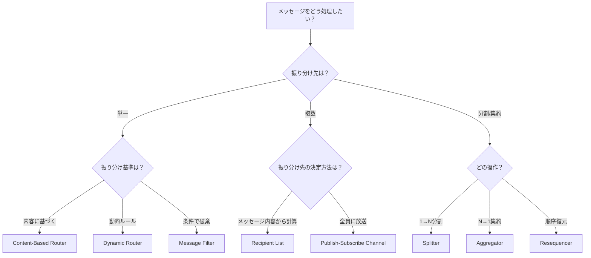

# Simple Routers

## 概要
単一メッセージの振り分けを行う基本的なルーティングパターン群。

## パターン比較表

| パターン | 消費 | 発行 | ステートフル | 特徴 |
|---------|------|------|------------|------|
| [[message_router\|Message Router]] | 1 | 1 | No | ルーティングの基本概念 |
| [[content_based_router\|Content-Based Router]] | 1 | 1 | No | 内容に基づき単一宛先へ |
| [[message_filter\|Message Filter]] | 1 | 0-1 | No | 条件に合わないものを破棄 |
| [[dynamic_router\|Dynamic Router]] | 1 | 1 | No | 制御メッセージでルール更新 |
| [[recipient_list\|Recipient List]] | 1 | N | No | 複数宛先へコピー送信 |
| [[splitter\|Splitter]] | 1 | N | No | メッセージを分割 |
| [[aggregator\|Aggregator]] | N | 1 | **Yes** | 関連メッセージを集約 |
| [[resequencer\|Resequencer]] | N | N | **Yes** | 順序を復元 |

## パターン選択ガイド

## トレードオフ

### ステートレス vs ステートフル

| 特性 | ステートレス | ステートフル |
|-----|------------|------------|
| パターン | Router, Filter, Splitter, Recipient List | Aggregator, Resequencer |
| スケーラビリティ | 容易 | 状態共有が課題 |
| 障害復旧 | シンプル | 状態永続化が必要 |
| メモリ使用量 | 低 | 高（バッファ保持） |

## 関連パターン

- [[index|Message Routing]] - 親カテゴリ
- [[composed-routers/index|Composed Routers]] - 複合パターン
- [[architectural-routers/index|Architectural Routers]] - アーキテクチャパターン
