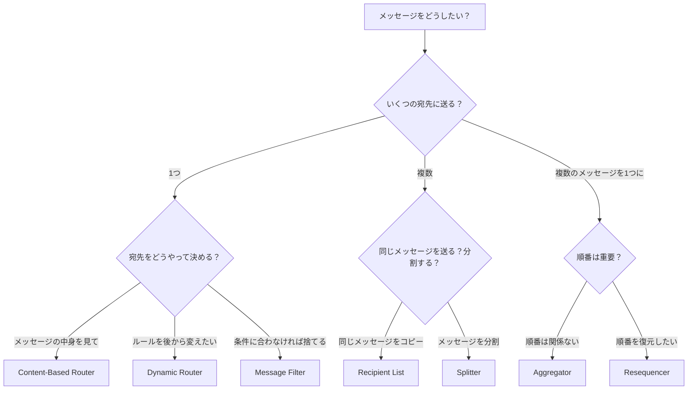
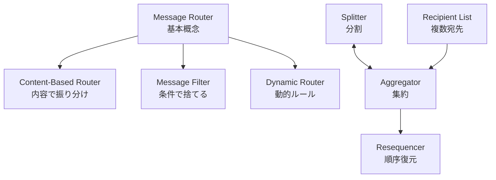

# Simple Routers

## このカテゴリについて

Simple Routersは、Message Routingの中で最も基本的なパターン群です。1つのメッセージを受け取り、条件に基づいて振り分けたり、分割したり、複数のメッセージを1つに集約したりします。

これらのパターンは単独で使うこともできますし、組み合わせてより複雑な処理フローを構築することもできます（→ [[programming/reactive_messaging_pattern/composed-routers/index|Composed Routers]]）。

## パターン一覧

### 振り分け系（1つのメッセージを1つの宛先に送る）

| パターン | 何をするか | 使う場面 |
|---------|-----------|---------|
| [[message_router\|Message Router]] | 条件に基づいてメッセージを1つの宛先に振り分ける | ルーティングの基本概念を理解したいとき |
| [[content_based_router\|Content-Based Router]] | メッセージの中身（内容）を見て、宛先を決める | 注文の種類によって処理するシステムを変えたいとき |
| [[message_filter\|Message Filter]] | 条件に合わないメッセージを捨てる | 特定の条件のメッセージだけを処理したいとき |
| [[dynamic_router\|Dynamic Router]] | ルーティングルールを後から変更できる | システムの追加・削除が頻繁に起こる環境 |

### 分散系（1つのメッセージを複数の宛先に送る）

| パターン | 何をするか | 使う場面 |
|---------|-----------|---------|
| [[recipient_list\|Recipient List]] | 1つのメッセージを複数の宛先にコピーして送る | 複数のシステムに同じ情報を通知したいとき |
| [[splitter\|Splitter]] | 1つのメッセージを複数のメッセージに分割する | 複数の商品を含む注文を、商品ごとに処理したいとき |

### 集約系（複数のメッセージを1つにまとめる）

| パターン | 何をするか | 使う場面 |
|---------|-----------|---------|
| [[aggregator\|Aggregator]] | バラバラに届く複数のメッセージを1つにまとめる | 分散処理の結果を統合したいとき |
| [[resequencer\|Resequencer]] | バラバラに届いたメッセージを正しい順番に並べ直す | メッセージの処理順序が重要なとき |

## パターンの選び方

どのパターンを使うか迷ったときは、以下のフローチャートを参考にしてください。

## ステートレスとステートフルの違い

Simple Routersは、状態を持つかどうかで2種類に分けられます。

### ステートレスなパターン

Message Router、Content-Based Router、Message Filter、Dynamic Router、Recipient List、Splitter

これらのパターンは、**メッセージを受け取ったらすぐに次に渡す**動作をします。「前に何を処理したか」を覚えておく必要がありません。

**特徴：**
- 実装がシンプル
- 複数のインスタンスを並べて処理能力を上げやすい（スケールアウトしやすい）
- 障害が起きても、再起動すればすぐに復旧できる

### ステートフルなパターン

Aggregator、Resequencer

これらのパターンは、**メッセージを一時的に保存して、条件が揃ったら次に渡す**動作をします。「今、何を待っているか」「何が届いているか」という状態を覚えておく必要があります。

**特徴：**
- 実装が複雑になる
- メモリを多く使う（待機中のメッセージを保存するため）
- 障害が起きたときの復旧が大変（状態を復元する必要がある）
- 複数のインスタンスを並べるのが難しい（状態の整合性を保つ必要がある）

| 特性 | ステートレス | ステートフル |
|-----|------------|------------|
| 対象パターン | Router, Filter, Splitter, Recipient List | Aggregator, Resequencer |
| 処理能力の向上 | 簡単（インスタンスを増やすだけ） | 難しい（状態の共有が必要） |
| 障害からの復旧 | 簡単（再起動するだけ） | 状態の永続化・復元が必要 |
| メモリ使用量 | 少ない | 多い（メッセージをバッファに保持） |

## パターン間の関係

Simple Routersのパターンは、互いに関連しています。

- **Message Router** は、他の振り分け系パターンの基本概念です
- **Splitter** と **Aggregator** は逆の関係にあります（分割↔集約）
- **Recipient List** で複数に送った結果を、**Aggregator** で集約することが多いです

## 次に読むべき内容

1. まずは [[message_router|Message Router]] でルーティングの基本概念を理解する
2. 次に [[content_based_router|Content-Based Router]] で実用的なルーティングを学ぶ
3. 分散処理に興味があれば [[splitter|Splitter]] と [[aggregator|Aggregator]] を学ぶ
4. パターンの組み合わせ方は [[programming/reactive_messaging_pattern/composed-routers/index|Composed Routers]] で学ぶ

## 関連するカテゴリ

- [[programming/reactive_messaging_pattern/index|Message Routing]] - 親カテゴリ
- [[programming/reactive_messaging_pattern/composed-routers/index|Composed Routers]] - Simple Routersを組み合わせた複合パターン
- [[programming/reactive_messaging_pattern/architectural-routers/index|Architectural Routers]] - システム全体の設計に関わるパターン
