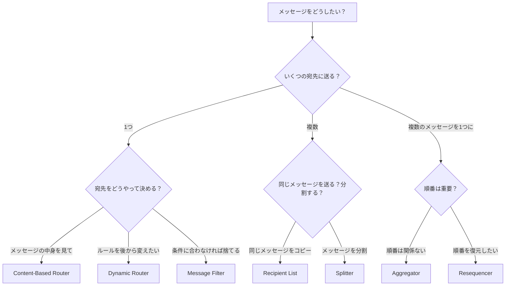
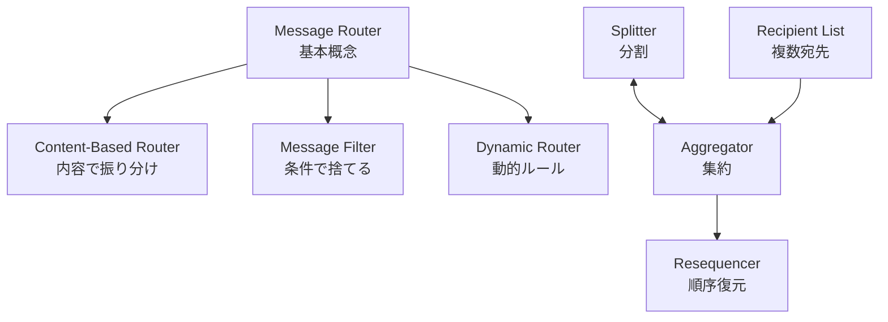

# Simple Routers

## このカテゴリについて

Simple Routersは、Message Routingの中で最も基本的なパターン群です。1つのメッセージを受け取り、条件に基づいて振り分けたり、分割したり、複数のメッセージを1つに集約したりします。

これらのパターンは単独で使うこともできますし、組み合わせてより複雑な処理フローを構築することもできます（→ [[programming/reactive_messaging_pattern/composed-routers/index|Composed Routers]]）。

## パターン一覧

以下では、Simple Routersの各パターンを「振り分け系」「分散系」「集約系」の3つに分類して説明します。

### 振り分け系（1つのメッセージを1つの宛先に送る）

これらのパターンは、受け取った1つのメッセージを、条件に基づいて1つの宛先に振り分けます。

#### Message Router（メッセージルーター）

**何をするか：** 条件に基づいてメッセージを1つの宛先に振り分ける、最も基本的なルーティングパターンです。他の全てのルーティングパターン（Content-Based Router、Message Filter、Dynamic Routerなど）の土台となる概念です。

**身近な例：** 交差点の交通整理員が、車の行き先を見て「左へ」「右へ」と振り分けるイメージ。

**使う場面：**
- 注文の種類（通常注文/返品/法人注文など）に応じて、異なる処理システムに振り分けたいとき
- メッセージの優先度に応じて、通常キューと優先キューに振り分けたいとき
- シンプルな条件（例：フラグがON/OFF）でメッセージを2つの処理に分岐させたいとき

**補足：** Message Routerは概念的なパターンであり、実際のシステムでは「何を見てルーティングするか」を具体化したContent-Based Router（メッセージの中身を見る）やDynamic Router（外部設定を見る）として実装されることが多いです。

**詳細：** [[message_router|Message Router]]

---

#### Content-Based Router（コンテンツベースルーター）

**何をするか：** メッセージの中身（フィールドの値など）を見て、宛先を決定します。Message Routerの中で最も一般的な実装方法であり、実際のシステムで広く使われています。

**身近な例：** 空港の手荷物仕分けシステムが、荷物タグに書かれた行き先を読み取って、正しいターンテーブルに振り分けるイメージ。

**使う場面：**
- 注文の種類（通常/返品/法人）によって処理するシステムを変えたいとき
- 商品カテゴリによって異なる在庫システムに振り分けたいとき
- メッセージの優先度によって処理キューを分けたいとき

**詳細：** [[content_based_router|Content-Based Router]]

---

#### Message Filter（メッセージフィルター）

**何をするか：** 条件に合わないメッセージを捨てて（破棄して）、条件に合うメッセージだけを通過させます。Content-Based Routerの特殊なケースで、「通過」か「破棄」の2択になります。

**身近な例：** 会議室の入口にいる受付係が、招待状を持っている人だけを通して、持っていない人を断るイメージ。

**使う場面：**
- テスト用のメッセージを本番環境に流さないようにしたいとき
- 特定の顧客からの注文だけを処理したいとき
- 不正なフォーマットのメッセージを早い段階で除去したいとき
- 重複したメッセージを検出して破棄したいとき

**詳細：** [[message_filter|Message Filter]]

---

#### Dynamic Router（ダイナミックルーター）

**何をするか：** ルーティングルールを実行時に動的に変更できるルーターです。通常のルーターはルールが固定されていますが、Dynamic Routerは外部からルールを変更できます。

**身近な例：** カーナビが、渋滞情報をリアルタイムで受け取って、案内ルートを動的に変更するイメージ。

**使う場面：**
- 処理システムの追加・削除が頻繁に起こる環境
- ビジネスルールが頻繁に変わる場面
- A/Bテストで一部のトラフィックだけを新システムに流したいとき
- 障害発生時に特定のシステムを迂回させたいとき

**詳細：** [[dynamic_router|Dynamic Router]]

---

### 分散系（1つのメッセージを複数の宛先に送る）

これらのパターンは、受け取った1つのメッセージを複数の宛先に送ります。「同じメッセージをコピーして送る」か「メッセージを分割して送る」かで使い分けます。

#### Recipient List（レシピエントリスト）

**何をするか：** 1つのメッセージを複数の宛先にコピーして、同時に送信します。全ての宛先が同じメッセージを受け取ります。

**身近な例：** 会社のメーリングリストで、1通のメールを複数の社員に同時に送信するイメージ。

**使う場面：**
- 注文が入ったことを、在庫システム・配送システム・請求システムに同時に通知したいとき
- イベントが発生したことを、複数の監視システムに同報したいとき
- 同じデータを複数のデータベースにレプリケーションしたいとき

**Content-Based Routerとの違い：** Content-Based Routerは「どれか1つ」に送るのに対し、Recipient Listは「複数に同時に」送ります。

**詳細：** [[recipient_list|Recipient List]]

---

#### Splitter（スプリッター）

**何をするか：** 1つの大きなメッセージを、複数の小さなメッセージに分割します。例えば、3つの商品を含む注文メッセージを、商品ごとの3つのメッセージに分割します。

**身近な例：** 複数の商品が入った段ボール箱を開梱して、商品ごとに仕分けするイメージ。

**使う場面：**
- 複数の商品を含む注文を、商品ごとに別々の倉庫で在庫確認したいとき
- バッチで届いたデータを、1件ずつ処理したいとき
- XMLやJSONの配列を、個々の要素に分解して処理したいとき

**Recipient Listとの違い：** Recipient Listは「同じメッセージをコピー」するのに対し、Splitterは「メッセージを分割」します。

**詳細：** [[splitter|Splitter]]

---

### 集約系（複数のメッセージを1つにまとめる）

これらのパターンは、バラバラに届く複数のメッセージを、1つのメッセージにまとめます。分散処理の結果を統合したり、順序を復元したりする場面で使います。

#### Aggregator（アグリゲーター）

**何をするか：** バラバラのタイミングで届く複数のメッセージを、関連するもの同士でグループ化して、1つのメッセージにまとめます。Splitterで分割したメッセージを再び1つにまとめる場面でよく使われます。

**身近な例：** 旅行代理店が、複数の航空会社から届いた見積もり回答を1つの比較表にまとめるイメージ。

**使う場面：**
- Splitterで分割した注文の処理結果を、1つの結果にまとめたいとき
- 複数のデータソースから取得した情報を統合したいとき
- 複数のサービスへの問い合わせ結果を1つの応答にまとめたいとき（Scatter-Gatherパターンの一部）

**重要な設計判断：**
- **完了条件（Completion Condition）**：何をもって「全てのメッセージが揃った」と判断するか（例：予定数に達した、タイムアウトした）
- **相関ID（Correlation ID）**：どのメッセージ同士が関連しているかを識別する方法

**詳細：** [[aggregator|Aggregator]]

---

#### Resequencer（リシーケンサー）

**何をするか：** 順番がバラバラになって届いたメッセージを、正しい順番に並べ直します。ネットワークの遅延などで順序が入れ替わったメッセージを、元の順序に復元します。

**身近な例：** 郵便で届いた連載小説の各回が順番通りに届かなかったとき、全て届いてから正しい順番に並べ直して読むイメージ。

**使う場面：**
- 複数の処理ステップを並列実行した後、元の順序で結果を出力したいとき
- ネットワークの遅延で順序が入れ替わったメッセージを、元の順序に戻したいとき
- 金融取引で、取引の順序が重要な場合

**Aggregatorとの違い：** Aggregatorは「複数を1つにまとめる」のに対し、Resequencerは「順番を並べ直す」だけで、メッセージの数は変わりません。

**詳細：** [[resequencer|Resequencer]]

## パターンの選び方

どのパターンを使うか迷ったときは、以下のフローチャートを参考にしてください。

## ステートレスとステートフルの違い

Simple Routersは、状態を持つかどうかで2種類に分けられます。

### ステートレスなパターン

Message Router、Content-Based Router、Message Filter、Dynamic Router、Recipient List、Splitter

これらのパターンは、**メッセージを受け取ったらすぐに次に渡す**動作をします。「前に何を処理したか」を覚えておく必要がありません。

**特徴：**
- 実装がシンプル
- 複数のインスタンスを並べて処理能力を上げやすい（スケールアウトしやすい）
- 障害が起きても、再起動すればすぐに復旧できる

### ステートフルなパターン

Aggregator、Resequencer

これらのパターンは、**メッセージを一時的に保存して、条件が揃ったら次に渡す**動作をします。「今、何を待っているか」「何が届いているか」という状態を覚えておく必要があります。

**特徴：**
- 実装が複雑になる
- メモリを多く使う（待機中のメッセージを保存するため）
- 障害が起きたときの復旧が大変（状態を復元する必要がある）
- 複数のインスタンスを並べるのが難しい（状態の整合性を保つ必要がある）

| 特性 | ステートレス | ステートフル |
|-----|------------|------------|
| 対象パターン | Router, Filter, Splitter, Recipient List | Aggregator, Resequencer |
| 処理能力の向上 | 簡単（インスタンスを増やすだけ） | 難しい（状態の共有が必要） |
| 障害からの復旧 | 簡単（再起動するだけ） | 状態の永続化・復元が必要 |
| メモリ使用量 | 少ない | 多い（メッセージをバッファに保持） |

## パターン間の関係

Simple Routersのパターンは、互いに関連しています。

- **Message Router** は、他の振り分け系パターンの基本概念です
- **Splitter** と **Aggregator** は逆の関係にあります（分割↔集約）
- **Recipient List** で複数に送った結果を、**Aggregator** で集約することが多いです

## 次に読むべき内容

1. まずは [[message_router|Message Router]] でルーティングの基本概念を理解する
2. 次に [[content_based_router|Content-Based Router]] で実用的なルーティングを学ぶ
3. 分散処理に興味があれば [[splitter|Splitter]] と [[aggregator|Aggregator]] を学ぶ
4. パターンの組み合わせ方は [[programming/reactive_messaging_pattern/composed-routers/index|Composed Routers]] で学ぶ

## 関連するカテゴリ

- [[programming/reactive_messaging_pattern/index|Message Routing]] - 親カテゴリ
- [[programming/reactive_messaging_pattern/composed-routers/index|Composed Routers]] - Simple Routersを組み合わせた複合パターン
- [[programming/reactive_messaging_pattern/architectural-routers/index|Architectural Routers]] - システム全体の設計に関わるパターン
