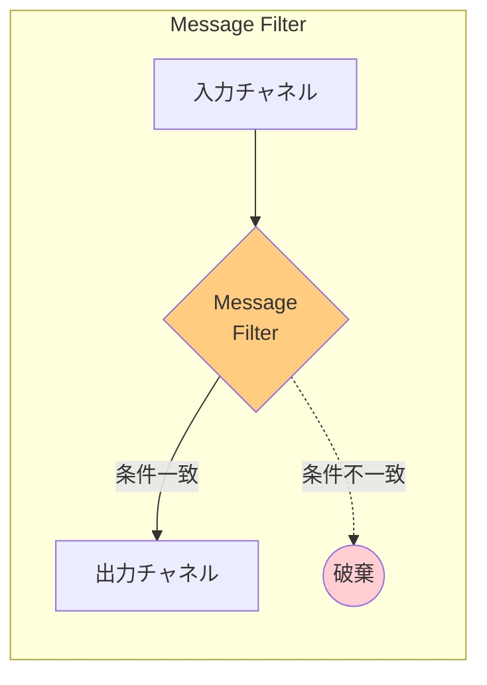
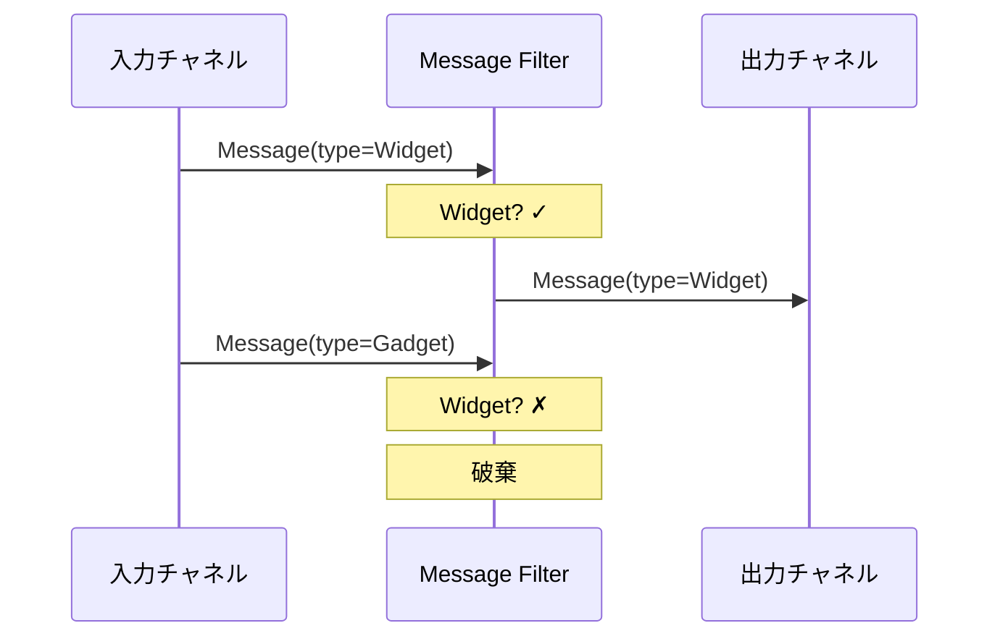

# Message Filter

## 1. 3行要約 (Feynman Technique)
> **目的:** 専門用語を避け、直感的なメタファーを用いて「何をするものか」を定義する。
- 「選別するザル」のような役割。条件に合うメッセージだけを通過させ、それ以外は捨てる
- Content-Based Routerの特殊形で、出力チャネルが1つしかない（通過 or 破棄）
- 核心的価値：**不要なメッセージの除外**

## 2. 解決する課題 (Context & Problem)
> **目的:** 「なぜこれが必要なのか？」という文脈（Pain Point）を明確にする。

- **Before:**
  - Publish-Subscribe Channelで全メッセージを受信するが、関心があるのは一部のみ
  - 例：ウィジェットにのみ関心のある顧客が、ガジェットの価格変更通知も受け取ってしまう
  - 不要なメッセージの処理にリソースが浪費される

- **Trigger:**
  - 顧客が受け取りたくないメッセージを避けたい
  - 特定の条件に合致するメッセージのみを処理したい
  - 下流のシステムに不要なメッセージを流したくない

## 3. ソリューションと構造 (Structure & Visual)
> **目的:** Dual Coding（文字と図）により記憶定着を図る。

### 仕組み
特殊なMessage Routerである Message Filter を使用して、条件セットに基づいてチャネルから不要なメッセージを除去する。

- 単一の出力チャネルを持つ
- メッセージ内容が基準と一致すれば出力チャネルにルーティング
- 一致しなければメッセージは破棄される

### 構造図



### 処理フロー



## 4. トレードオフと制約 (Critical Thinking)

### Pros (利点):
- **シンプル**: 単一条件で通過/破棄を決定
- **リソース節約**: 不要なメッセージの処理を回避
- **下流保護**: 下流システムに不要なメッセージが流れない
- **選択的購読**: Pub/Subパターンと組み合わせて選択的受信を実現

### Cons (欠点・副作用):
- **メッセージ損失**: 破棄されたメッセージは復元不可
- **監査困難**: 破棄されたメッセージの追跡が難しい
- **設定ミスのリスク**: 誤った条件設定で必要なメッセージが破棄される
- **デバッグ困難**: 「なぜメッセージが届かないか」の原因特定が難しい

### Anti-Pattern:
- 破棄理由のログを残さない
- 複雑なビジネスロジックをフィルターに入れる
- 本来はContent-Based Routerを使うべき場面でMessage Filterを使う

## 5. 実装イメージ (Implementation)

### Akka Typed Actor (Scala)

```scala
import akka.actor.typed.{ActorRef, Behavior}
import akka.actor.typed.scaladsl.Behaviors

// メッセージ定義
sealed trait PriceUpdate
case class WidgetPriceUpdate(productId: String, price: Double) extends PriceUpdate
case class GadgetPriceUpdate(productId: String, price: Double) extends PriceUpdate

// Message Filter
object MessageFilter {
  def apply[T](
    predicate: T => Boolean,
    output: ActorRef[T],
    onDiscard: Option[T => Unit] = None
  ): Behavior[T] =
    Behaviors.receive { (context, message) =>
      if (predicate(message)) {
        context.log.info(s"Message passed filter: $message")
        output ! message
      } else {
        context.log.info(s"Message discarded: $message")
        onDiscard.foreach(_(message))
      }
      Behaviors.same
    }
}

// Widget専用フィルター
object WidgetFilter {
  def apply(output: ActorRef[PriceUpdate]): Behavior[PriceUpdate] =
    Behaviors.receive { (context, message) =>
      message match {
        case w: WidgetPriceUpdate =>
          context.log.info(s"Widget price update passed: ${w.productId}")
          output ! w
        case _ =>
          context.log.debug(s"Non-widget message discarded")
      }
      Behaviors.same
    }
}

// 型安全な汎用フィルター
object TypedMessageFilter {
  sealed trait Command[+T]
  case class Filter[T](message: T) extends Command[T]

  def apply[T, U <: T](
    output: ActorRef[U]
  )(implicit ev: scala.reflect.ClassTag[U]): Behavior[Command[T]] =
    Behaviors.receive { (context, command) =>
      command match {
        case Filter(message) =>
          message match {
            case u: U =>
              context.log.info(s"Message matched type filter")
              output ! u
            case _ =>
              context.log.debug(s"Message did not match type filter")
          }
          Behaviors.same
      }
    }
}

// 使用例
object FilterExample {
  def apply(): Behavior[Nothing] =
    Behaviors.setup[Nothing] { context =>
      val widgetProcessor = context.spawn(
        Behaviors.receiveMessage[PriceUpdate] { msg =>
          println(s"Processing widget: $msg")
          Behaviors.same
        },
        "widgetProcessor"
      )

      val filter = context.spawn(
        WidgetFilter(widgetProcessor),
        "widgetFilter"
      )

      // WidgetのみがwidgetProcessorに届く
      filter ! WidgetPriceUpdate("W001", 29.99)  // 通過
      filter ! GadgetPriceUpdate("G001", 49.99)  // 破棄

      Behaviors.empty
    }
}
```

## 6. リンクと関係性 (Network Knowledge)

### 関連パターン:
- [[content_based_router|Content-Based Router]] (汎化: Message Filterは出力が1つの特殊ケース)
- [[message_router|Message Router]] (汎化: 親パターン)
- [[selective_consumer|Selective Consumer]] (比較: 消費者側でフィルタリング)
- [[recipient_list|Recipient List]] (比較: 複数宛先への送信)

### 構成要素:
- [[message_channel|Message Channel]] - 入出力チャネル
- [[publish_subscribe_channel|Publish-Subscribe Channel]] - 組み合わせて選択的購読を実現

### 次のステップ:
- [[content_based_router|Content-Based Router]] - 破棄ではなく振り分けが必要な場合
- [[recipient_list|Recipient List]] - 複数宛先への送信が必要な場合
