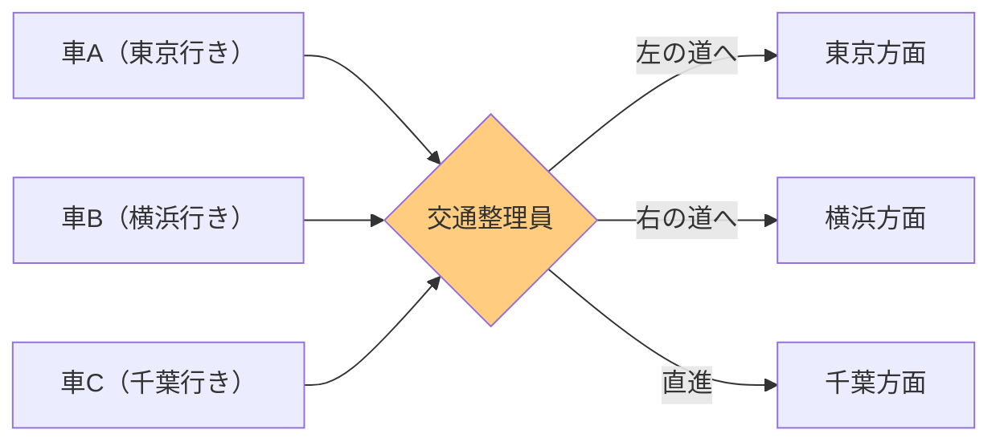
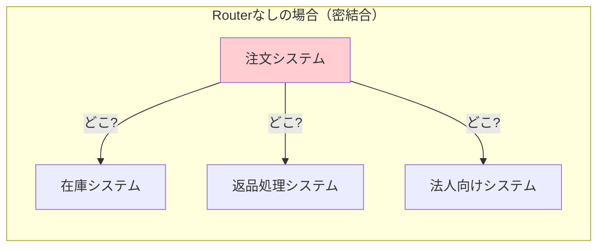
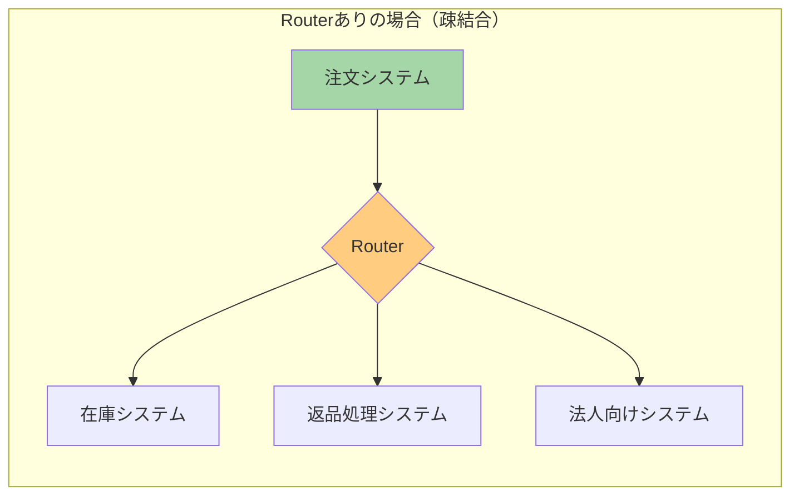
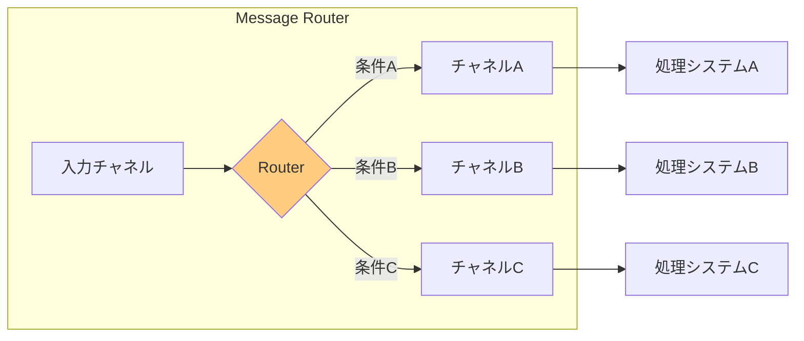

# Message Router

## このパターンは何をするのか

Message Routerは、**メッセージを受け取り、条件に基づいて適切な宛先に振り分ける**パターンです。これはMessage Routingの最も基本的な概念であり、他の多くのルーティングパターンの土台となっています。

### 身近な例で考える

交差点に立つ交通整理員を想像してください。

交通整理員は、やってくる車を見て「この車は左」「この車は右」と指示を出します。車の運転手は、交差点の先にどんな道があるかを知らなくても、交通整理員の指示に従えば目的地に向かえます。



Message Routerも同じです。メッセージを受け取り、設定された条件に基づいて「このメッセージはChannel Aへ」「このメッセージはChannel Bへ」と振り分けます。

重要なのは、**Message Routerはメッセージの中身を変更しない**ということです。交通整理員が車の中身を書き換えないように、Routerは単に「どこに送るか」を決めるだけで、メッセージそのものには手を加えません。

## なぜMessage Routerが必要なのか

### 問題の背景

[[pipes_and_filters|Pipes and Filters]]アーキテクチャでは、処理ステップ（フィルター）がチャネル（パイプ）で接続されています。基本的には、メッセージは一直線に流れていきます。


しかし現実のシステムでは、「条件によって処理を分岐させたい」という場面がよくあります。

例えば、ECサイトの注文処理を考えてみましょう。

- 通常の注文 → 在庫システムへ
- 返品の注文 → 返品処理システムへ
- 法人の注文 → 法人向け処理システムへ

このような分岐を実現するのがMessage Routerです。

### Message Routerがない場合の問題

**問題1: 送信者が全ての宛先を知っている必要がある**

Message Routerがなければ、注文を送るシステムは「在庫システムはここにある」「返品処理システムはここにある」と、全ての宛先を知っていなければなりません。これを**密結合**と呼びます。



**問題2: 新しいシステムを追加するたびに送信者を変更する必要がある**

新しい処理システムを追加したいとき、注文システムのコードを修正して、新しいシステムへの送信処理を追加しなければなりません。

**問題3: ルーティングルールがあちこちに散らばる**

「この条件のときはこのシステムに送る」というルールが、複数のシステムに散らばってしまい、全体を把握するのが難しくなります。

### Message Routerを使うと

Message Routerを使うと、送信者は「メッセージをRouterに渡す」だけで済みます。



Routerが「このメッセージはどのシステムに送るべきか」を判断してくれるので、注文システムは個々のシステムの存在を知らなくても良くなります。これを**疎結合**と呼びます。

## Message Routerの仕組み

### 基本的な動作

Message Routerは以下の3つのステップで動作します。

1. **入力チャネルからメッセージを受け取る**
2. **設定された条件に基づいて宛先を決定する**
3. **適切な出力チャネルにメッセージを送る**



### Message Routerの特徴

**メッセージを変更しない**

Message Routerはメッセージの内容を変更しません。宛先を決めて、そのまま次に渡すだけです。

**1つの宛先に送る**

基本的なMessage Routerは、1つのメッセージを1つの宛先にだけ送ります。複数の宛先に送りたい場合は[[recipient_list|Recipient List]]パターンを使います。

**条件評価の方法はさまざま**

どのような条件でルーティングするかは、実装によって異なります。メッセージの内容を見る方法（[[content_based_router|Content-Based Router]]）、外部から設定を変更できる方法（[[dynamic_router|Dynamic Router]]）などがあります。

## Message Routerのメリットとデメリット

### メリット

**送信者と受信者を分離できる（疎結合）**

送信者は受信者のことを知らなくて良いので、システム間の依存関係が減ります。新しいシステムを追加するときも、Routerの設定を変えるだけで済みます。

**ルーティングルールを一箇所で管理できる（一元管理）**

「どのメッセージをどこに送るか」というルールがRouterに集約されるので、変更や確認がしやすくなります。

**メッセージの順序が保証される**

全てのメッセージが単一のRouterを通過するので、処理順序が保証されます。

**メッセージの流れが見えやすい**

Routerを見れば、メッセージがどこに流れるか把握できます。

### デメリット

**Routerが止まると全体が止まる（単一障害点）**

Routerがダウンすると、メッセージが届かなくなります。これを**単一障害点（Single Point of Failure）**と呼びます。

**Routerがボトルネックになる可能性がある**

全てのメッセージがRouterを通るので、メッセージ量が多いとRouterの処理が追いつかなくなることがあります。

**ルールが増えるとRouterが複雑になる**

ルーティング条件が増えると、Router自体が複雑になり、保守が難しくなります。

### やってはいけないこと

**Routerの中でビジネスロジックを実行しない**

Routerは「どこに送るか」を決めるだけの役割です。「注文を処理する」「在庫を減らす」といったビジネスロジックをRouterの中で実行してはいけません。

**ルーティング条件を複雑にしすぎない**

条件があまりに複雑になる場合は、ルールエンジンの導入を検討しましょう。

**全てを1つのRouterで処理しようとしない**

全てのメッセージを1つの巨大なRouterで処理しようとすると、ボトルネックになったり、ルールが複雑になりすぎたりします。

## 実装例

### Akka Typed Actor (Scala)

以下は、シンプルなMessage Routerの実装例です。

```scala
import akka.actor.typed.{ActorRef, Behavior}
import akka.actor.typed.scaladsl.Behaviors

// ルーティング対象のメッセージ
sealed trait OrderMessage
case class Order(id: String, orderType: String, amount: Double) extends OrderMessage

// Message Routerの実装
object OrderRouter {
  // Routerが受け取るコマンド
  sealed trait Command
  case class RouteOrder(order: Order) extends Command

  def apply(
    // ルーティング先のマップ：条件を判定する関数 → 送信先
    routes: Map[Order => Boolean, ActorRef[OrderMessage]],
    // どの条件にも当てはまらない場合の送信先
    defaultRoute: ActorRef[OrderMessage]
  ): Behavior[Command] =
    Behaviors.receive { (context, command) =>
      command match {
        case RouteOrder(order) =>
          // 条件に一致する最初のルートを探す
          val destination = routes.collectFirst {
            case (condition, dest) if condition(order) => dest
          }.getOrElse(defaultRoute)

          context.log.info(s"注文 ${order.id} を ${destination.path.name} にルーティング")

          // メッセージを変更せずにそのまま送信
          destination ! order
          Behaviors.same
      }
    }
}

// 使用例
object RouterExample {
  def setup(): Behavior[Nothing] =
    Behaviors.setup[Nothing] { context =>
      // 処理システムを作成
      val normalProcessor = context.spawn(NormalOrderProcessor(), "normal")
      val returnProcessor = context.spawn(ReturnOrderProcessor(), "return")
      val corporateProcessor = context.spawn(CorporateOrderProcessor(), "corporate")
      val defaultProcessor = context.spawn(DefaultOrderProcessor(), "default")

      // ルーティング条件を定義
      val routes: Map[Order => Boolean, ActorRef[OrderMessage]] = Map(
        (order => order.orderType == "NORMAL") -> normalProcessor,
        (order => order.orderType == "RETURN") -> returnProcessor,
        (order => order.orderType == "CORPORATE") -> corporateProcessor
      )

      // Routerを作成
      val router = context.spawn(OrderRouter(routes, defaultProcessor), "router")

      // メッセージをRouterに送信
      router ! OrderRouter.RouteOrder(Order("001", "NORMAL", 1000))
      router ! OrderRouter.RouteOrder(Order("002", "RETURN", 500))
      router ! OrderRouter.RouteOrder(Order("003", "CORPORATE", 50000))

      Behaviors.empty
    }
}
```

### コードのポイント

**条件を外部から設定できる**

ルーティング条件を `Map[Order => Boolean, ActorRef[OrderMessage]]` として外部から渡しています。これにより、Routerのコードを変更せずに、ルーティングルールを変更できます。

**メッセージを変更せずに渡す**

`destination ! order` で、受け取ったメッセージをそのまま次のシステムに渡しています。Routerはメッセージの内容を変更しません。

**デフォルトルートを用意**

どの条件にも当てはまらないメッセージのために、`defaultRoute` を用意しています。これにより、想定外のメッセージが来ても処理が止まりません。

## 関連するパターン

| パターン | 関係 |
|---------|------|
| [[content_based_router\|Content-Based Router]] | Message Routerの特化版。メッセージの内容（フィールドの値など）を見てルーティング先を決める |
| [[message_filter\|Message Filter]] | Message Routerの特化版。条件に合わないメッセージを捨てる |
| [[dynamic_router\|Dynamic Router]] | Message Routerの特化版。ルーティングルールを実行時に変更できる |
| [[recipient_list\|Recipient List]] | 1つのメッセージを複数の宛先に送る。Message Routerとは異なり、複数の出力を持つ |
| [[pipes_and_filters\|Pipes and Filters]] | Message Routerが動作するアーキテクチャの基盤 |

## 次に読むべき内容

- [[content_based_router|Content-Based Router]] - 最も一般的なルーター実装
- [[message_filter|Message Filter]] - 不要なメッセージを除去したい場合
- [[dynamic_router|Dynamic Router]] - ルールを動的に変更したい場合

## 参考資料

- [Enterprise Integration Patterns - Message Router](https://www.enterpriseintegrationpatterns.com/patterns/messaging/MessageRouter.html)
